# 题目

## 8月5日

6、某公鸟语林共饲养180只鸟。为养护方便，园方将鸟语林分为A、B、C三个区。某日，A区的一部分鸟飞至B、C两区，清点时B、C两区鸟的数量都增加一倍。次日，一些鸟又从B区飞至A、C两区，清点时A、C两区鸟的数量也都增加一倍。第三日，一部分鸟又从C区飞至A、B两区，清点时A、B两区鸟的数量同样增加一倍，而此时C区剩余鸟的数量恰好是A区的$\frac{7}{26}$。那么，最初A区有多少只鸟？（ ）

A.103 

B.104 

C.105 

D.106

14、要使$4^{77}+4^{2017}+4^x$​成为完全平方数的最大整数x为多少？（ ）

A.2188

B.2576

C.3956

D.4041

E.5545

F.5982

G.6578

H.7056

19、100个骨牌整齐地排成一列，一次编号为1、2、3、4、……99、100。如果第一次拿走所有偶数位置上的牌，第二次再从剩余牌中拿走所有偶数位置上的牌，第三次再从剩余牌中拿走所有奇数位置上的牌，第四次再从剩余牌中拿走所有奇数位置上的牌，第五次再从剩余牌中拿走所有偶数位置上的牌，以此类推。问最后剩下的一张骨牌的编号是多少？（ ）

A.77 　

B.53 

C.39 

D.27

## 8月6日

1、某企业在“十二五”期间第一年的营业额比上一年增长了1.5亿元，且往后每年的营业额增量都保持1.5亿元不变。已知该企业在“十四五”期间的营业额将是“十二五”和“十三五”期间营业额之和的80%。问该企业在“十二五”到“十四五”期间的总营业额在以下哪个范围内？（ ）

A. 不到300亿元 

B.300～330亿元 

C.330～360亿元 

D.超过360亿元

3、某工厂在做好防疫工作的前提下全面复工复产，复工后第1天的产能即恢复到停工前日产能的60%，复工后每生产4天，日产能都会比前4天的水平提高1000件/日。已知复工80天后，总产量相当于停工前88天的产量。问复工后的总产量达到100万件是在复工后的第几天？（ ）

A.54 

B.56 

C.58 

D.60

4、Z国女排参加世界锦标赛，本次锦标赛共12支国家队，并采用单循环赛制，每场比赛为五局三胜制。每赢得一场比赛可获得3个积分，但各场次比赛中每输一局则要扣0.5分。最终Z国女排以全胜的战绩获得冠军，问Z国女排夺冠的可能积分中，最低积分与第五高积分的差是（ ）分。

A.5 

B.7.5 

C.9 

D.11.5

9、商店本周从周一到周日出售A、B两种季节性商品，其中A商品每天销量相同，而B商品每天的销量都是前一天的一半。已知周五和周六，A、B两种商品的销量之和分别为220件和210件，问从周一到周日A商品总计比B商品多卖出多少件？（ ）

A.570 

B.635 

C.690 

D.765

10、假设三颗小行星绕着一颗恒星运动，它们的运行轨道都是圆形，每条轨道的圆心都是该恒星。且三条轨道都在同一平面内。若这三颗小行星同向旋转，且绕轨道运行一周的时间分别是60年、84年、140年。现在三颗小行星和恒星在同一直线上且三颗小行星都在恒星的同侧，那么至少（ ）年后他们再次在同一直线上且三颗小行星都在恒星的同侧。

A.210 

B.315 

C.420 

D.630

## 8月9日

1、某工厂的工号为5位数字。甲乙两个工人工号五位数字连乘之积都等于1764，但是甲的工号五位连加之和比乙的大4。问乙的工号为？（ ）

A.13677 

B.22779 

C.23677 

D.33477

8、某省选派若干名本科生和研究生去乡村支教，其中男生和女生的比例是7:3，研究生和本科生的比例是1:4。若男本科生的人数恰好为女研究生人数的4倍，则女本科生至少比男研究生多（ ）。

A.3人 

B.6人 

C.9人 

D.12人

9、为实现精准扶贫，某县政府工作人员对辖区内所有贫困户进行走访。已知第一周走访的户数为贫困户总户数的46%，第二周走访的户数是两周后剩余未走访户数的1.2倍。问两周后最少还有多少户贫困户未走访？（ ）

A.45 

B.90 

C.135 

D.180

20、已知3个质数的倒数和为$\frac{671}{1022}$，则这三个质数的和为（ ）。

A.80 

B.82 

C.84

D.86

## 8月10日

4、由于采用了新的种植技术，某种农产品的产量和品质都得到了提升。在平均每亩增产25%的同时，每千克售价也增加了20%。尽管每亩生产成本增加了35%，但每亩利润也增加了100%。问采用新种植技术后，每亩利润占每亩销售收入的比例在以下哪个范围内？（ ）

A. 不到25% 

B.25%～35% 

C.35%～45% 

D.超过45%

12、奶茶，乍一想应该既有奶又有茶，是一种营养丰富的健康饮品。事实果真如此吗?有专家指出，市面上的奶茶大多由茶粉勾兑而成，咖啡因超标。因此专家提醒：对青少年而言，为了保持身体健康，奶茶好喝可别“贪杯”。
要使上述推论成立，可以补充的前提为（ ）。

A.过量摄入咖啡因会影响人们的身体健康

B.相比其他人群，奶茶对青少年的吸引力更高

C.奶茶中的咖啡因可能使人兴奋不已，甚至失眠

D.青少年正处于生长发育的关键期，对咖啡因更敏感

14、胼胝体是人类大脑的重要部分，是连接大脑左右半球的主要通道。研究表明，专业打击乐演奏者的大脑中，胼胝体中的纤维比一般人少且更粗壮。因此，练习打击乐能够有效刺激甚至改变大脑结构。
补充以下选项作为前提，最有助于使上述结论成立的是（ ）。

A.专业打击乐演奏者的大脑左右半球与一般人相比也存在差异

B.其他类型乐手的胼胝体纤维也存在与专业打击乐演奏者相似的特征

C.专业打击乐演奏者在练习打击乐之前的胼胝体纤维与一般人并无区别

D.打击乐业余爱好者胼胝体纤维粗细程度介于专业演奏者和普通人之间

15、野生动物之间因病毒入侵会暴发传染病。最新研究发现，热带、亚热带或低海拔地区的动物，因生活环境炎热，一直面临着罹患传染病的风险。生活在高纬度或高海拔等低温环境的动物，过去因长久寒冬可免于病毒入侵，但现在冬季正变得越来越温暖，持续时间也越来越短。因此，气温升高将加剧野生动物传染病的暴发。
以下哪项如果为真，最能支持上述观点？（ ）

A.无论气候如何变化，生活在炎热地带的动物始终面临着患传染病风险

B.适应寒带和高海拔栖息地的动物物种遭遇传染病暴发的风险正在升高

C.气温高低与野生动物患传染病风险之间存在正相关性，即气温越高患病风险越高

D.寒冷气候可能让野生动物免受病毒入侵，炎热气候却更易导致野生动物感染病毒

16、专家发现，传播疟疾的蚊子被人的气味分子吸引，抗击疟疾的设备负责消除空气中的人体气味，在人体周围制造一个范围为2平方米的电场，让气味分子掉落在地上。这样，传播疟疾的蚊子就找不到它们的猎物了，因为它们在没有气味的空间中会迷失方向。
以下哪项如果为真，最能支持上述观点？（ ）

A.科学家已成功研发出吸引疟疾蚊子的芳香物质，可直接引诱和杀死这些蚊子

B.现有实验已证实，传播疟疾的蚊子对疟疾患者散发出的人体气味特别感兴趣

C.传播疟疾的蚊子必须长时间大量吸食血液才能获得繁殖的能量

D.带疟疾病毒的蚊子无法嗅到人体气味，就会拒绝进食直至死亡

17、名词的体是指人们对名词指示的人或事物在空间维度所表现出来的诸如数量、大小、形状和结构等特征的一种认知方式或结果。
根据上述定义，下列表现名词的体的是（ ）。

A.激战上甘岭 

B.原始人的独木舟 

C.弯弯的月亮 

D.未来的希望

18、相反相成修辞手法是指把通常相互对立、排斥的两个概念或判断巧妙地联系在一起，这样不仅能够揭示出存在于客观事物深层的矛盾辩证关系，还可以增加语言的意蕴。
根据上述定义，下列不属于相反相成修辞手法的是（ ）。

A.横眉冷对千夫指，俯首甘为孺子牛

B.有的人活着，他已经死了；有的人死了，他还活着

C.墙上芦苇，头重脚轻根底浅；山中竹笋，嘴尖皮厚腹中空

D.这一天，死去的伟人在诗的国度里永生；这一天，活着的小丑在人们心上被埋葬

19、随着移动支付的普及和知识内容消费观念的逐渐养成，知识付费逐渐成为人们普遍接受的学习方式。自2015年以来，各种知识付费平台纷纷上线，用户数量快速增长。相关报告显示，2017年我国知识内容付费用户规模达1.88亿人，知识付费正在成为人们从海量信息中突围的利器。
以下哪项如果为真，最能解释上述现象（ ）。

A.知识付费可以随时满足广大网友广泛的兴趣爱好

B.当代青年人对于新知识和新技能的渴求日趋提高

C.知识付费能满足人们低门槛、高效率的学习需要

D.粉丝可以通过知识付费方式随时向知识偶像请教

20、某高校生命科学学院共有教师50人。其中：

①有的教师具有博士学位；

②有的教师不具有博士学位；

③张老师不具有博士学位。

上述三个条件中有一个条件为真，两个条件为假，则该学院中具有博士学位的老师有（ ）。

A.50人 

B.25人 

C.0人 

D.不确定

## 8月11日

1、桂∶广西

A. 皖∶江西 

B.杜鹃花∶映山红 

C.河流∶湖泊 

D.西红柿∶圣女果

2、近海∶靠近陆地的海域

A.充足∶多到能满足需要 

B.三包∶包修包换和包退

C.四季∶春夏秋冬的合称 

D.忙月∶农事繁忙的月份

3、冰∶水

A. 木∶炭 

B.桑田∶沧海 

C.犬∶獒 

D.火∶灰

4、桂林∶北海

A. 墨汁∶颜料 

B.开水∶自来水 

C.氧气∶空气 

D.红茶∶黑茶

6、人文科学∶物理

A. 工业∶重工业 

B.薄荷糖∶牛奶糖 

C.茶叶∶红茶 

D.北方人∶湖北人

13、电动汽车充电站白天（7～21点）充电1.8元/度，停车费5元/小时；夜间（21～7点）充电1.2元/度，停车费1元/小时，停车不满1小时按1小时计算。某电动汽车电池容量为60度，快充1.5小时充满，慢充6小时充满。假设同一种充电下充电速率一直不变。现在是20时，如果要从0度开始充满该电动汽车，选择哪种模式充电最省钱？（ ）

A. 全程快充 

B.全程慢充 

C.前1小时快充，之后慢充 

D.前1小时慢充，之后快充

18、甲、乙两个工程队共同完成某项工程需要12天，其中甲单独完成需要20天。现8月15日开始施工，由甲工程队先单独做5天，然后甲、乙两个工程队合作3天，剩下的由乙工程队单独完成，问工程完成的日期是（ ）。

A.9月5日 

B.9月6日 

C.9月7日 

D.9月8日

19、有一块圆形花圃，花匠计划在圆形花圃中用花盆摆设图案进行装饰。现在花匠在圆形上设七个等分点，构思以这些点中的三个顶点连成一个等腰三角形，并在三角形内摆放花盆。问共有多少种不同的构图方案？（ ）

A.21 

B.28 

C.35 

D.42

20、某乡镇对集贸市场36种食品进行检查，发现超过保质期的7种，防腐添加剂不合格的9种，产品外包装标识不规范的6种。其中，两项同时不合格的5种，三项同时不合格的2种。问三项全部合格的食品有多少种？（ ）

A.14 

B.21 

C.23 

D.32

## 8月12日

1、晕轮效应 对于 （ ） 相当于 （ ） 对于 变本加厉

A.扬长避短 墨菲定理 

B.以偏概全 破窗效应

C.欲扬先抑 增减效应 

D.举一反三 蝴蝶效应

2、高屋建瓴 对于 （ ） 相当于 （ ） 对于 技艺

A.格局 左支右绌 

B.形势 目无全牛

C.气势 天造地设 

D.地势 逆水行舟

3、握瑜︰怀瑾︰美玉

A.南辕︰北辙︰马车　

B.金戈︰铁马︰战争　

C.敲金︰击石︰乐器　

D.锦衣︰玉食︰珍馐

9、某文化用品市场正在推进市场的信息化和电子化，市场主管部门建议市场里的商家可以使用电子付款系统或者使用自动贩卖机。
如果市场里的每家商户都落实了这一建议，那么以下哪项一定为真？（ ）

Ⅰ.市场里的一些商户使用了自动贩卖机

Ⅱ.如果一家商店既没有使用自动贩卖机，也没有使用电子付款系统，那么这家商店一定不在该市场里

Ⅲ.如果一家文具店既使用了自动贩卖机，也使用了电子付款系统，这家商店一定在该市场里

A. 只有Ⅰ 

B.只有Ⅱ 

C.只有Ⅰ和Ⅱ 

D.只有Ⅱ和Ⅲ

19、2018年父亲年龄是女儿年龄的6倍，是母亲年龄的1.2倍。已知女儿出生当年（按0岁计算）母亲24岁，则哪一年父母年龄之和是女儿的4倍？（ ）

A.2036 

B.2039 

C.2042 

D.2045

## 8月13日

7、某种产品每箱48个，小李制作这种产品，第1天制作了1个，以后每天都比前一天多制作1个。X天后总共制作了整数箱产品。问X的最小值在以下哪个范围内？（ ）

A. 不到20 

B.在20～40之间 

C.在41～60之间 

D.超过60

8、某种糖果的进价为12元/千克，现购进这种糖果若干千克，每天销售10千克，且从第二天起每天都比前一天降价2元/千克。已知以6元/千克的价格销售的那天正好卖完最后10千克，且总销售额是总进货成本的2倍。问总共进了多少千克这种糖果？（ ）

A.160 

B.170 

C.180 

D.190

9、如下图所示，长度均为六分之五千米的三个圆形跑道汇聚于点O，若甲、乙、丙三人分别以5千米/小时、8千米/小时、12千米/小时的速度同时从O点出发分别绕三个圈奔跑，则三人再次相聚于O点需经过多少分钟？（ ）。

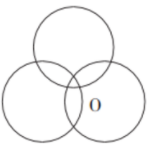

A.40 

B.50 

C.52 

D.60

11、从所给的四个选项中，选择最合适的一个填入问号处，使之呈现一定的规律性。

12、把下面的六个图形分为两类，使每一类图形都有各自的共同特征或规律，分类正确的一项是（ ）。

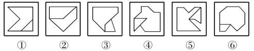

A.①②④，③⑤⑥ 

B.①③⑤，②④⑥

C.①③⑥，②④⑤ 

D.①⑤⑥，②③④

13、从所给的四个选项中，选择最合适的一个填入问号处，使下列正方形图形呈现一定的规律性。

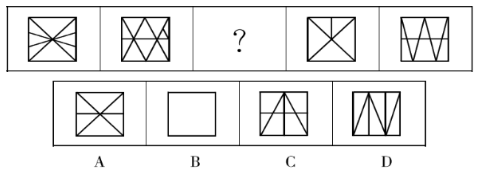

14、把下面的六个图形分为两类，使每一类图形都有各自的共同特征或规律，分类正确的一项是（ ）。

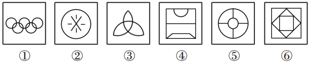

A.①②④，③⑤⑥ 

B.①③⑥，②④⑤ 

C.①②⑤，③④⑥ 

D.①⑤⑥，②③④

## 8月14日

1、

2、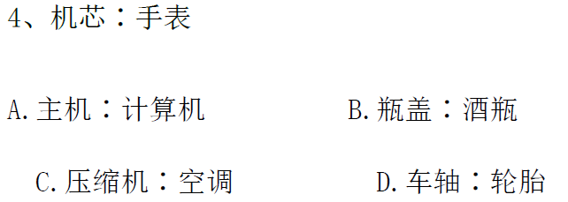

3、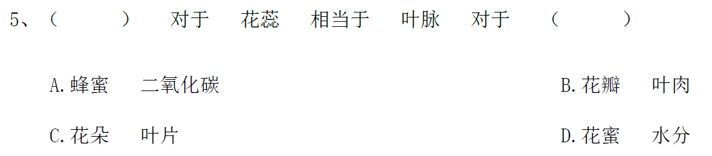

4、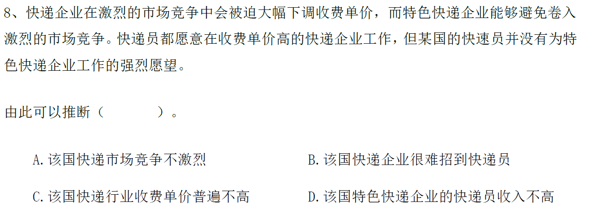

5、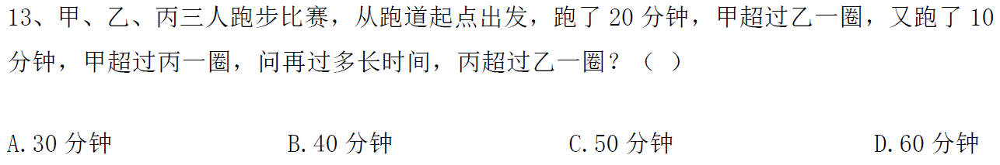

6、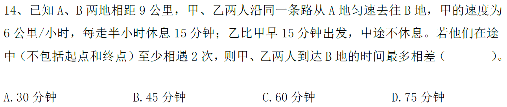弱项

## 8月16日

1、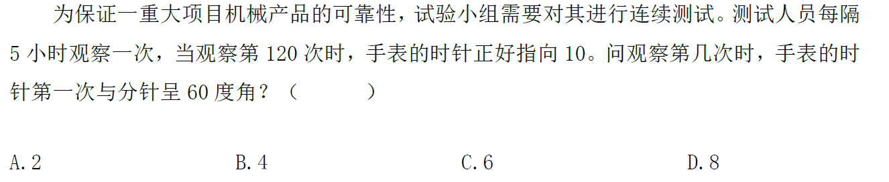

2、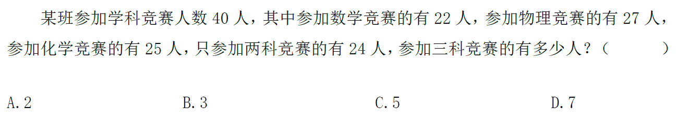

3、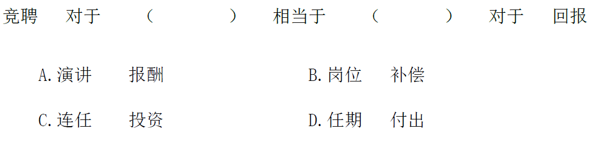

4、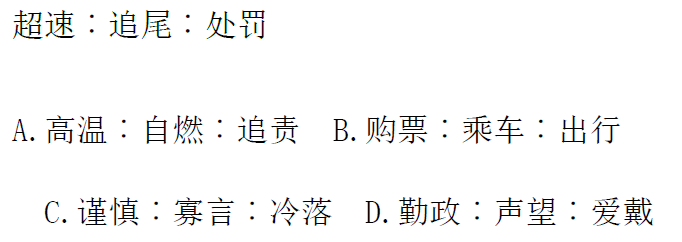

5、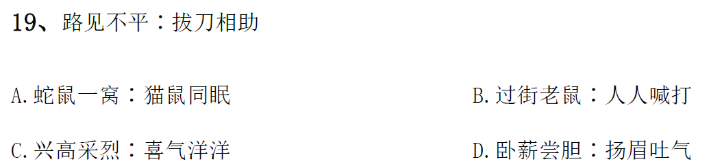

## 8月17日

1、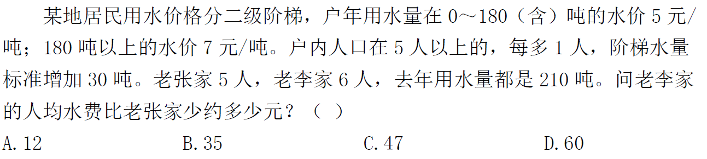

2、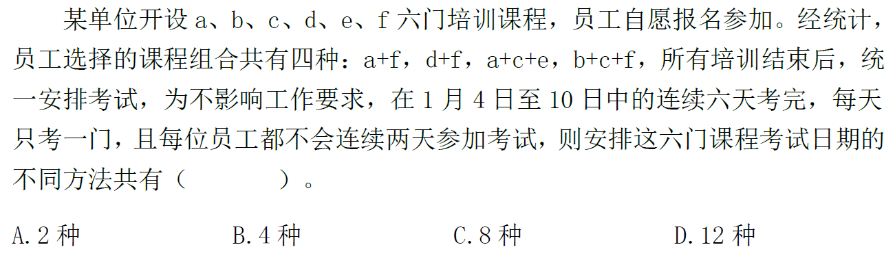

3、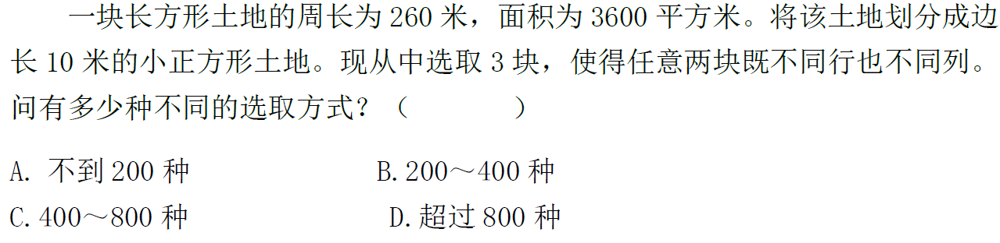

4、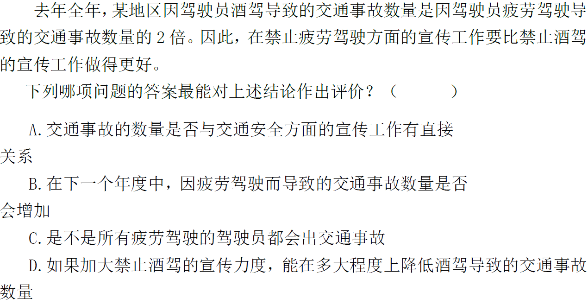

5、

6、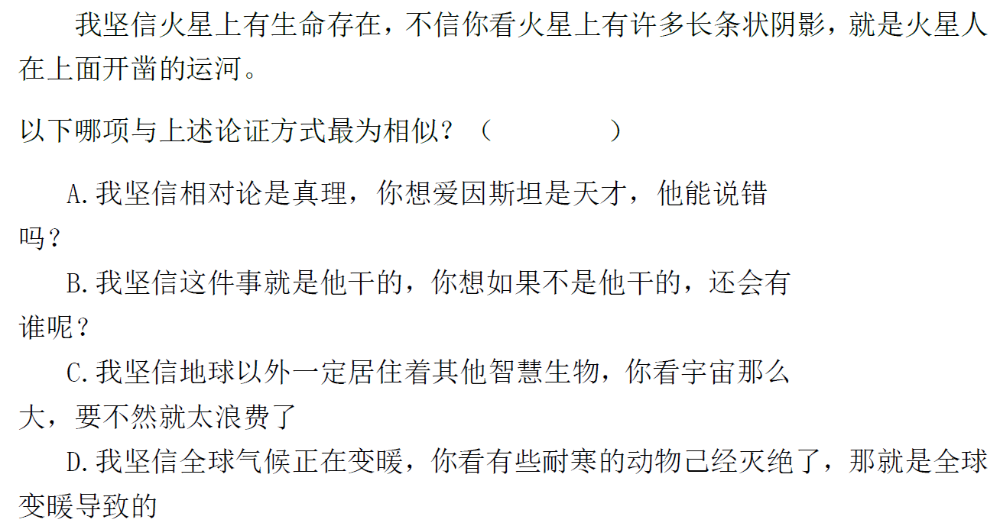

7、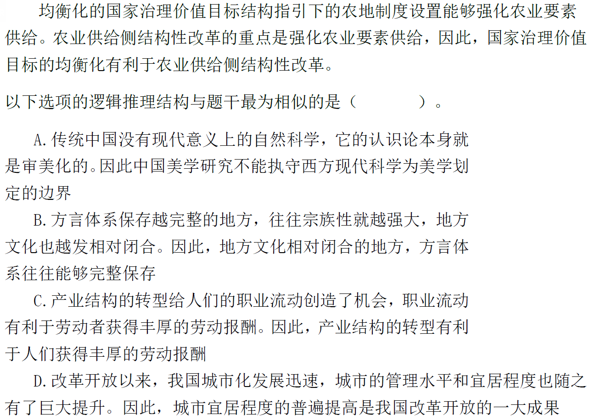

8、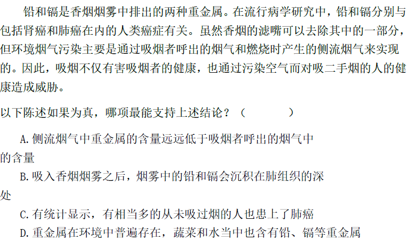

## 8月18日

1、

2、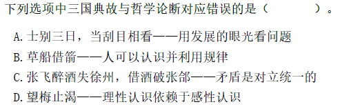

3、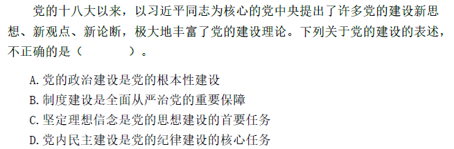

4、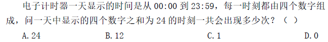

5、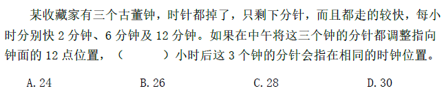

6、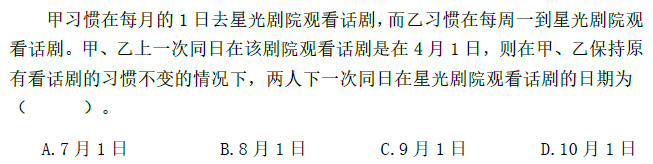

7、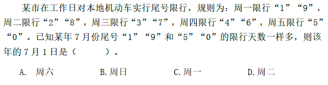

8、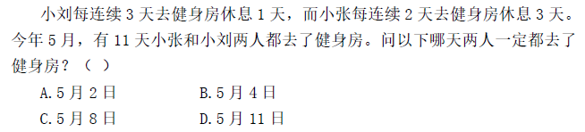

9、

10、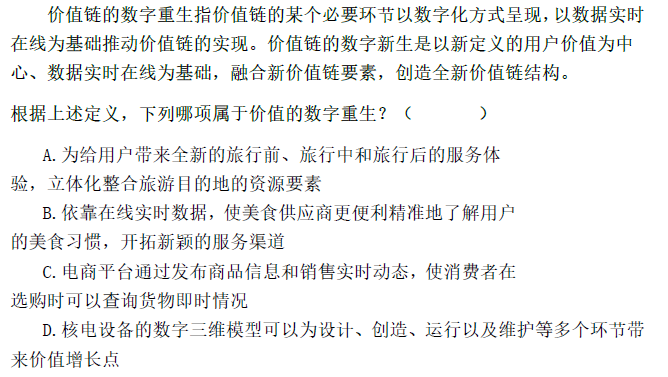

11、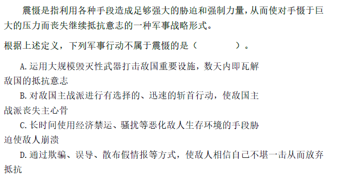

12、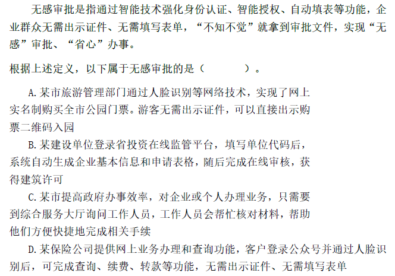

## 8月19日

1、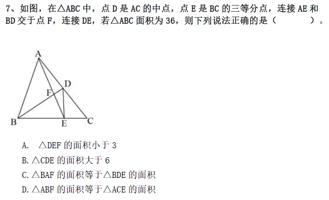

2、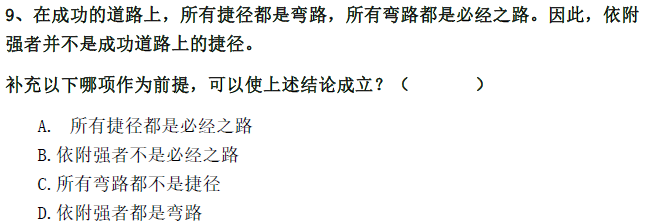

3、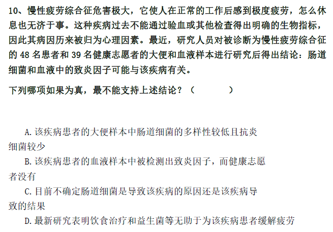

4、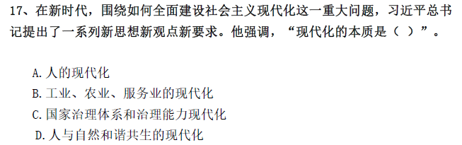

5、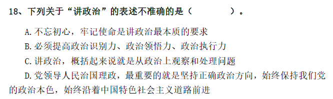

6、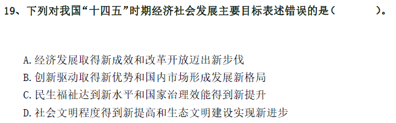

7、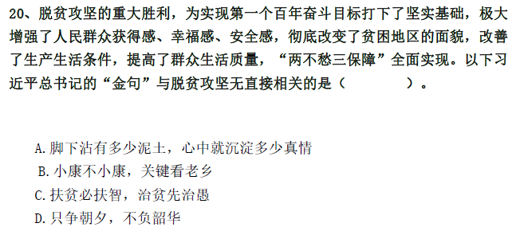

## 8月28日

1、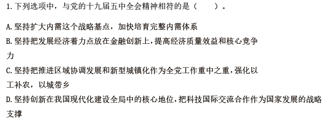

2、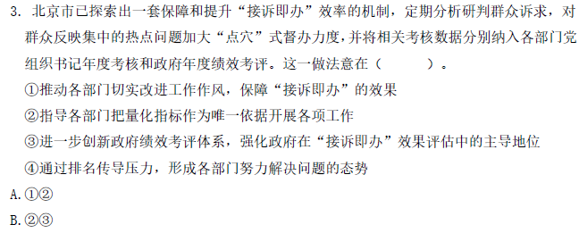

C.2,4

D.1,4

3、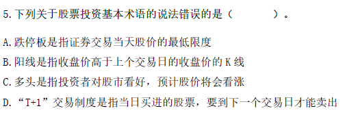

4、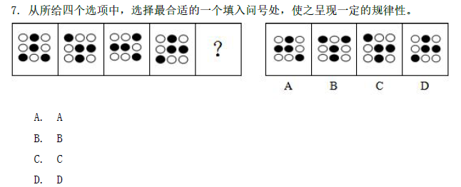

5、

6、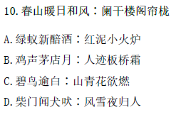

7、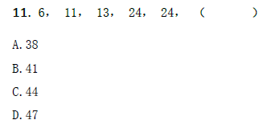

8、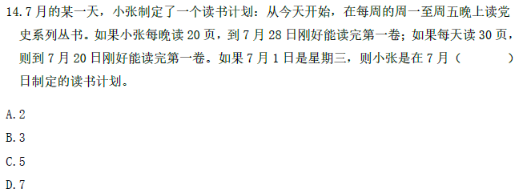

9、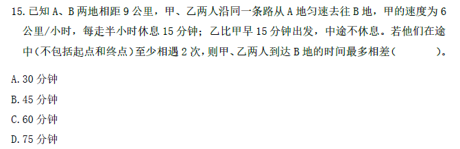

10、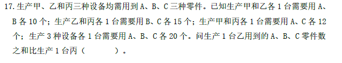

​        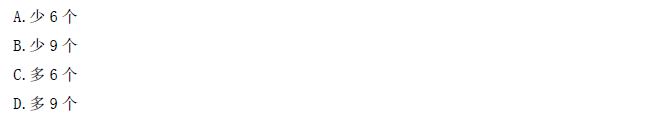

11、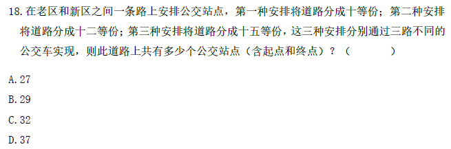

12、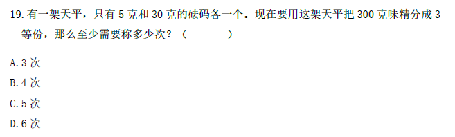

## 8月30日

1、

​      

2、

3、

4、

## 8月31日

1、(多选)

2、

3、

4、   

​      

5、

6、

7、

8、

9、

10、

11、

# 9月

## 9月1日

1、

2、

​      

3、

4、

5、

6、

7、

8、

9、

## 9月2日

1、

2、

3、

4、

5、

​      

6、

7、

8、

9、

10、

11、

## 9月3日

1、

2、

3、

4、

5、

6、

7、

8、

​      

9、

10、

## 9月6日

1、

2、

​      

3、

4、

5、

6、

7、

8、

​      

9、

10、

## 9月7日

1、

2、

​      

3、

4、

5、

6、

7、

8、

9、

10、

## 9月8日

1、

2、

3、

4、

5、

6、

7、

​      

8、

9、

## 9月9日

1、

2、

3、

4、

​      

5、

6、

7、

8、

9、

​      

## 9月10日

1、

2、

3、

4、

5、

6、

7、

8、

9、

​      

10、

## 9月11日

1、

2、

3、

4、

​     

5、

6、

7、

8、

9、

10、

11、

12、

## 9月13日

1、

2、

3、

4、

5、

6、

7、

8、

9、

10、

11、

12、

13、

## 9月14日

1、

2、

3、

4、

5、

6、

7、

8、

9、

10、

11、

12、

13、

## 9月15日

1、

2、

3、

4、

5、

6、

7、

8、

9、

10、

11、

12、

13、

## 9月16日

1、

2、

3、

4、

5、

6、

7、

8、

9、

10、

11、

12、

13、

## 9月17日

1、

2、

3、

4、

5、

6、

7、

8、

9、

10、

11、

12、

13、

## 9月18日

1、

2、

3、

4、

5、

6、

7、

8、

9、

10、

11、

12、

13、

## 9月19日

1、

2、

3、

4、

5、

6、

7、

8、

9、

10、

11、

12、

13、

## 9月20日

1、

2、

3、

4、

5、

6、

7、

8、

9、

10、

11、

12、

13、

## 9月21日

1、

2、

3、

4、

5、

6、

7、

8、

9、

10、

11、

12、

13、

## 9月22日

1、

2、

3、

4、

5、

6、

7、

8、

9、

10、

11、

12、

13、

## 9月23日

1、

2、

3、

4、

5、

6、

7、

8、

9、

10、

11、

12、

13、

## 9月24日

1、

2、

3、

4、

5、

6、

7、

8、

9、

10、

11、

12、

13、

## 9月25日

1、

2、

3、

4、

5、

6、

7、

8、

9、

10、

11、

12、

13、

## 9月26日

1、

2、

3、

4、

5、

6、

7、

8、

9、

10、

11、

12、

13、

## 9月26日

1、

2、

3、

4、

5、

6、

7、

8、

9、

10、

11、

12、

13、

## 9月27日

1、

2、

3、

4、

5、

6、

7、

8、

9、

10、

11、

12、

13、

## 9月28日

1、

2、

3、

4、

5、

6、

7、

8、

9、

10、

11、

12、

13、

## 9月30日

1、

2、

3、

4、

5、

6、

7、

8、

9、

10、

11、

12、

13、

# 答案

## 8月5日

6、本题考查基础应用。

第一步：审阅题干。已知三日间鸟的数量变动关系，可用代入排除法进行求解。

第二步：A项代入，最初A区有103只鸟，则B、C区共有180-103=77只。第一天A区有103-77=26只，那么第三天A区有26×4=104只，此时C区有$104×\frac{7}{26}=28$只，符合题意，当选。

故本题选A。

14、本题考查公式化简。

第一步：审阅题干。本题出现“代数式”“求数值”，可知为公式化简问题。

第二步：原式提取公因子$4^{77}$得到$4^{77}×(1+4^{1940}+4^{x-77})$，由于$4^{77}$​是一个完全平方数，要想原式为完全平方数，因此$(1+4^{1940}+4^{x-77})$必须为完全平方数。

$1+4^{1940}+4^{x-77}=1+2^{3880}+2^{2×(x-77)}=1+2×2^{3879}+2^{2×(x-77)}$​​​​，对应完全平方和公式$(a+b)^2=a^2+2ab+b^2$​​，对应的$a=1$​​，$b=2^{3879}$​​，因此$(2^{3879})^2=2^{2×(x-77)}$​​，所以$3879×2=2×(x-77)$​​，解得$x=3956$​​。

故本题选C。

19、第一次拿走所有偶数位置上的牌，剩余编号都为奇数，即还剩的骨牌编号为：1、3、5……2n1-1（1≤n1≤50）；

第二次再从剩余牌中拿走所有偶数位置上的牌，还剩的骨牌编号为：1、5、9……4n2-3（1≤n2≤25）；

第三次再从剩余牌中拿走所有奇数位置上的牌，还剩的骨牌编号为：5、13、21……8n3-3（1≤n3≤12）；

第四次再从剩余牌中拿走所有奇数位置上的牌，还剩的骨牌编号为：13、29、45……16n4-3（1≤n4≤6）；

第五次再从剩余牌中拿走所有偶数位置上的牌，还剩的骨牌编号为：13、45、77；

第六次再从剩余牌中拿走所有偶数位置上的牌，还剩的骨牌编号为：13、77；

第七次再从剩余牌中拿走所有奇数位置上的牌，还剩的骨牌编号为77。

故本题选A。

## 8月6日

1、本题考查等差数列。

第一步：审阅题干。每年营业额的增量一定，则可利用等差数列的前n项和特性进行求解。

第二步：设“十一五”最后一年的营业额为x亿元，则“十二五”期间的营业额为5x+4.5×5=（5x+22.5）亿元，“十三五”期间的营业额为5x+7.5×5+22.5=（5x+60）亿元，“十四五”期间的营业额为5x+15×5+22.5=（5x+97.5）亿元。根据题意有（5x+97.5）=80%×（5x+22.5+5x+60），解得x=10.5。因此该企业在“十二五”到“十四五”期间的总营业额为15×10.5+22.5+60+97.5=337.5亿元，在330～360亿元之间。

故本题选C。

3、本题需先求出复工后每天的产能，可利用等差数列求和公式进行解题。代入法。

故本题选B。

4、本题考查等差数列问题。

第一步：审阅题干。题干出现“最低”、“第五”可确定为基础计算中的等差数列问题。

第二步：采用单循环制的比赛，则Z国女排最终参加了11场比赛，若11场比赛都以3∶0获胜，则最终积分为11×3=33分；若11场比赛每场比赛都以3∶2获胜，则最终积分为33-11×2×0.5=22分，又因每输一局扣0.5分，所以，所有可能的积分组成等差数列，其中，首项a1=33，尾项an=22，公差d=-0.5，可求得a5=33+(5-1)×（-0.5）=31。即第五高积分为31分。31-22=9。

故本题选C。

9、本题考查等比数列问题。

第一步：审阅题干。本题虽考查等比数列，但较为基础，故通过枚举解题即可。

第二步：根据题意可知，周五：A+B=220；周六：$A＋\frac{1}{2}B=210$，因此周五、周六两商品的销售和之差为B商品周六的销量，即为10。则继续推得如图：

|      | 周一 | 周二 | 周三 | 周四 | 周五 | 周六 | 周日 | 合计 |
| ---- | ---- | ---- | ---- | ---- | ---- | ---- | ---- | ---- |
| A    | 200  | 200  | 200  | 200  | 200  | 200  | 200  | 1400 |
| B    | 320  | 160  | 80   | 40   | 20   | 10   | 5    | 625  |

综上所述，周一到周日A商品总计比B商品多卖出1400-635=765件。

故本题选D。

10、本题考查周期问题。

第一步：审阅题干。三颗小行星在同一直线上且在恒星的同侧，即偏离原来位置的角度相同，所求为至少，可从最小项依次代入验证。

第二步：A项代入：210÷60=3.5周，210÷84=2.5周，210÷140=1.5周，即210年后三颗小行星刚好均偏离原来位置180°，在同一直线上且在恒星的同侧，符合。

故本题选A。

## 8月9日

1、本题考查多位数。

第一步：审阅题干。1764=1×2×2×3×3×7×7，那么两人的工号各含有两个7，且各还有三个数未知。

第二步：剩余三个数有如下组合方式：（1，4，9）、（1，6，6）、（2，2，9）、（2，3，6）、（3，3，4），共五种。上述五种组合方式之和分别为14、13、13、11、10，只有14与10之差为4，那么乙工号的五个数字分别为3、3、4、7、7，只有D项符合。

故本题选D。

8、本题考查倍数。
 第一步：审阅题干。人数一定为整数，根据题意可知总人数为10的倍数，可设总人数为10x。
 第二步：男生人数为7x，女生人数为3x，研究生人数为2x，本科生人数为8x。设女研究生人数为y，男本科生人数为4y。
 根据男研究生人数一定，有2x-y=7x-4y，化简得3y=5x，则y至少为5，x至少为3。因此女本科生人数至少为3x-y=3×3-5=4人，男研究生人数至少为7x-4y=7×3-4×5=1人，前者比后者多4-1=3人。
 故本题选A。

9、本题考查倍数。

第一步：审阅题干。可知第一周走访后剩余未走访的户数占贫困总户数的1-46%=54%。

第二步：设贫困户总户数为x户，第二周走访后剩余未走访户数为y户，第二周走访的户数为1.2y户。根据题意有y+1.2y=0.54x，化简得110y=27x，户数为整数，那么y一定为27的整数倍，观察选项，只有C项135为27的整数倍。

故本题选C。

20、将分母分解因数，1022=2×7×73，其中2、7、73均为质数，验证后得2、7、73为题干所给的3个质数。因此题干所求为2+7+73=82。

故本题选B。

## 8月10日

4、本题考查基础经济问题。

第一步：审阅题干。本题中只出现百分数，可设特殊值方便计算。

第二步：设原来每亩产量为8，每千克售价为10。则采用新技术后每亩产量为8×（1+25%）=10，每千克售价为10×（1+20%）=12。设原来每亩的成本为x，则采用新技术后每亩的成本为1.35x。

根据题意有（10×12-1.35x）=2×（8×10-x），解得x≈61.5。因此采用新种植技术后，每亩利润为10×12-1.35×61.5≈37元，占销售收入的比例为$\frac{37}{120}×100\%≈31\%$，在25%～35%之间。

故本题选B。

12、本题考查前提类。

第一步：分析题干论点论据。

论点：对青少年而言，为了保持身体健康，奶茶好喝可别“贪杯”。

论据：市面上的奶茶大多由茶粉勾兑而成，咖啡因超标。

第二步：分析选项，确定答案。

A项：过量摄入咖啡因会影响人们的身体健康，是在“咖啡因超标”与“身体健康”之间搭桥，即在论点论据之间建立联系，是题干论点成立的前提，当选。

B项：奶茶对青少年的吸引力更大，与青少年是否要为了身体健康少喝奶茶无关，不是题干论点成立的前提，排除。

C项：指出奶茶中的咖啡因可能使人兴奋不已，但未明确其是否会威胁到身体健康，不是题干论点成立的前提，排除。

D项：指出青少年对咖啡因更敏感，但未明确其是否会威胁到青少年身体健康，不是题干论点成立的前提，排除。

故本题选A。

14、本题考查前提类。

第一步：分析题干论点论据。

论点：练习打击乐能够有效刺激甚至改变大脑结构。

论据：专业打击乐演奏者的大脑中，胼胝体中的纤维比一般人少且更粗壮。

第二步：分析选项，确定答案。

A项：专业打击乐演奏者的大脑左右半球与普通人存在差异，但是否为练习打击乐所导致的未明确，无法支持题干论点，排除。

B项：其他类型乐手的胼胝体纤维，与练习打击乐是否能刺激大脑结构无关，不是题干论证成立的前提，排除。

C项：假设该项不成立，专业打击乐演奏者在练习打击乐之前的胼胝体纤维与一般人有区别，那么就无法通过练习打击乐后与一般人胼胝体纤维的对比来得出题干论点，因此该项是题干论证成立的前提，当选。

D项：打击乐业余爱好者胼胝体纤维粗细程度与题干论述无关，不是题干论证成立的前提，排除。

故本题选C。

15、本题考查加强类。

第一步：分析题干论点论据。

论点：气温升高将加剧野生动物传染病的暴发。

论据：热带、亚热带或低海拔地区的动物，因生活环境炎热，一直面临着罹患传染病的风险。生活在高纬度或高海拔等低温环境的动物，过去因长久寒冬可免于病毒入侵，但现在冬季正变得越来越温暖，持续时间也越来越短。

第二步：分析选项，确定答案。

A项：指出无论气候如何变化，生活在炎热地带的动物始终面临着患传染病风险，与气温升高是否会加剧野生动物传染病的暴发无关，无法支持题干论点，排除。

B项：指出适应寒带和高海拔栖息地的动物物种遭遇传染病暴发的风险正在升高，与气温升高是否会加剧野生动物传染病的暴发无关，无法支持题干论点，排除。

C项：指出气温高低与野生动物患传染病风险之间存在正相关性，即气温越高患病风险越高，说明气温升高确实会加剧野生动物传染病的暴发，补充论据，最能支持题干论点，当选。

D项：指出寒冷气候可能让野生动物免受病毒入侵，炎热气候却更易导致野生动物感染病毒，重复论据，无法说明气温升高是否会加剧野生动物传染病的暴发，无法支持题干论点，排除。

故本题选C。

16、本题考查加强类。

第一步：分析题干论点论据。

论点：抗击疟疾的设备负责消除空气中的人体气味，在人体周围制造一个范围为2平方米的电场，让气味分子掉落在地上，传播疟疾的蚊子就找不到它们的猎物了。

论据：传播疟疾的蚊子在没有气味的空间中会迷失方向。

第二步：分析选项，确定答案。

A项：吸引疟疾蚊子的芳香物质可直接引诱和杀死这些蚊子，与消除人体气味是否可以对疟疾蚊子产生影响无关，无法支持题干论点，排除。

B项：指出传播疟疾的蚊子对疟疾患者的人体气味感兴趣，而题干讨论的是消除人体气味可以对疟疾蚊子产生影响，并不局限于疟疾患者，无法支持题干论点，排除。

C项：传播疟疾的蚊子如何获得繁殖能量，与消除人体气味是否可以对疟疾蚊子产生影响无关，无法支持题干论点，排除。

D项：指出带疟疾病毒的蚊子无法嗅到人体气味，就会拒绝进食直至死亡，说明通过抗击疟疾的设备消除人体气味，使传播疟疾的蚊子找不到猎物，那么疟疾蚊子就会拒绝进食直至死亡，最能支持题干论点，当选。

故本题选D。

17、本题考查人文类定义判断。

第一步：分析定义要点。“名词的体”的定义要点是“在空间维度所表现出来诸如数量、大小、形状和结构等特征”。

第二步：分析选项，确定答案。

A、B、D三项：“激战”“原始人”“未来”，均不是在空间维度所表现出来诸如数量、大小、形状和结构等特征，不符合定义要点，均排除。

C项：“弯弯的”是对月亮在空间维度上所表现出来的形状特征的一种认知结果，符合定义要点，当选。

故本题选C。

18、本题考查人文类定义判断。

第一步：分析定义要点。“相反相成修辞手法”的定义要点是“把通常相互对立、排斥的两个概念或判断巧妙地联系在一起”。

第二步：分析选项，确定答案。

A项：“横眉”与“俯首”是相互对立、排斥的两个概念或判断，符合定义要点，排除。

B项：“活着”与“死了”是相互对立、排斥的两个概念或判断，符合定义要点，排除。

C项：不存在相互对立、排斥的两个概念或判断，不符合定义要点，当选。

D项：“死去”与“活着”、“伟人”与“小丑”分别是相互对立、排斥的两个概念或判断，符合定义要点，排除。

故本题选C。

19、本题考查解释类。
 第一步：分析题干现象。
 现象：随着移动支付的普及和知识内容消费观念的逐渐养成，知识付费逐渐成为人们普遍接受的学习方式。
 第二步：分析选项，确定答案。
 A项：说明知识付费可以随时满足广大网友广泛的兴趣爱好，所以知识付费可以让人们从海量信息中突围，但兴趣爱好不对应题干的“学习方式”，排除。
 B项：知识付费所获取的知识与“新知识和新技能”的关系不确定，不能解释题干现象，排除。
 C项：知识付费能满足人们低门槛、高效率的学习需要，说明知识付费与学习高度相关，且对应了题干中的“学习方式”，最能解释题干现象，当选。
 D项：粉丝与知识偶像都是特定的群体，仅为个例，不能解释题干现象，排除。
 故本题选C。

20、①和②为下反对关系，二者不能同假，必有一真，则由“上述三个条件中有一个条件为真，两个条件为假”可知③为假，即张老师具有博士学位，因此①为真，②为假，则所有的教师都具有博士学位。
 故本题选A。

## 8月11日

1、本题考查全同关系。

第一步：分析题干词语间的关系。桂是广西的简称，二者为全同关系。

第二步：分析选项，确定答案。

A项：皖是安徽的简称，与江西无明显联系，排除。

B项：杜鹃花的别称是映山红，二者为全同关系，当选。

C项：河流与湖泊为反对关系，排除。

D项：圣女果是西红柿的一种，二者为种属关系，排除。

故本题选B。

2、本题考查全同关系。
 第一步：分析题干词语间的关系。近海指靠近陆地的海域，二者为全同关系，且近海是偏正结构。
 第二步：分析选项，确定答案。
 A项：充足指多到能满足需要，但充足不是偏正结构，排除。
 B项：三包是对“包修包换和包退”的简称，排除。
 C项：四季是春夏秋冬的合称，但四季不是偏正结构，排除。
 D项：忙月指农事繁忙的月份，二者为全同关系，且忙月是偏正结构，当选。
 故本题选D。

3、本题考查属性关系。
 第一步：分析题干词语之间关系。冰融化变成水。
 第二步：分析选项，确定答案。
 A项：木燃烧变成炭，当选。
 B项：桑田和沧海二者无明显联系，排除。
 C项：獒是犬的一种，排除。
 D项：物品经过火烧会变成灰，排除。
 故本题选A。

4、本题考查全异关系。
 第一步：分析题干词语间的关系。桂林和北海均属于广西壮族自治区的地级市，为并列关系中的反对关系。
 第二步：分析选项，确定答案。
 A项：墨汁可作颜料使用，与题干逻辑关系不符，排除。
 B项：自来水加热可成为开水，与题干逻辑关系不符，排除。
 C项：氧气是空气的组成部分，与题干逻辑关系不符，排除。
 D项：红茶和黑茶均属于茶叶中的发酵茶，且为并列关系中的反对关系，与题干逻辑关系一致，当选。

故本题选D。

6、本题考查全异关系。
 第一步：分析题干词语间的关系。物理不属于人文科学，二者是全异关系。
 第二步：分析选项，确定答案。
 A项：重工业属于工业，排除。
 B项：薄荷糖和牛奶糖为反对关系，排除。
 C项：红茶是茶叶的一种，排除。
 D项：湖北人不是北方人，二者是全异关系，当选。
 故本题选D。

13、根据题意可知，快充每小时充60÷1.5=40度，慢充每小时充60÷6=10度。
 A项需要1.5小时充满，需要的费用是1.8×40+5+1.2×20+1=102元。
 B项需要6小时，需要的费用为1.8×10+5+1.2×50+1×5=88元。
 C项需要的费用为1.8×40+5+1.2×20+1×2=103元（之后慢充所需的时间是20÷10=2小时）。
 D项需要的费用为1.8×10+5+1.2×50+1×2=85元（之后快充所需的时间是50÷40=1.25小时）。
 综上，最省钱的是前1小时慢充，之后快充。
 故本题选D。

18、本题考查赋值工作量问题。

第一步：审阅题干。已知两队共同完成某项工程时间和甲队完成工程时间，可对工作量进行赋值，得出两队的工作效率。

第二步：设工作总量为60（12、20的公倍数），则甲队的工作效率为60÷20=3，甲、乙两队的效率之和为60÷12=5，乙队的效率为5-3=2，因此乙单独做了（60-3×5-5×3）÷2=15天，总共做了5+3+15=23天，8月做了31-15+1=17天，9月还需做23-17=6天，则9月6日完成工程。

故本题选B。

19、本题考查圆桌排列问题。
 第一步：审阅题干。本题要求从圆形上七个点中选取三个构成等腰三角形的情况数，可先考虑顶点的选取。
 第二步：七个等分点中任取一点作顶点，都可与其他6个点构成3个等腰三角形，则7个点共可构成3×7=21个等腰三角形，即有21种构图方案。
 故本题选A。

20、本题考查三者容斥。

第一步：审阅题干。题干涉及“超过保质期”“防腐添加剂不合格”“产品外包装标识不规范”三个检查项目，可知为三者容斥问题。

第二步：根据容斥原理可知，三项全部合格的食品种数为36-（7+9+6-5-2×2）=23种。

故本题选C。

## 8月12日

1、本题考查对应关系。

选项逐一代入。

A项：“晕轮效应”指在人际知觉中所形成的以点概面或以偏概全的主观印象，与扬长避短无明显联系；“墨菲定理”的根本内容为如果事情有变坏的可能，不管这种可能性有多小，它总会发生，与变本加厉无明显联系，前后逻辑关系不一致，排除。

B项：以偏概全是晕轮效应的本质内容，“破窗效应”指环境中的不良现象如果被放任存在，会诱使人们仿效，甚至变本加厉，变本加厉是破窗效应的本质内容，前后逻辑关系一致，当选。

C项：晕轮效应与欲扬先抑无明显联系，“增减效应”指人们最喜欢那些对自己的喜欢显得不断增加的人，最不喜欢那些对自己的喜欢显得不断减少的人的人际交往现象，与变本加厉无明显联系，前后逻辑关系不一致，排除。

D项：晕轮效应与举一反三无明显联系，“蝴蝶效应”指在一个动力系统中，初始条件下微小的变化能带动整个系统的长期的、巨大的连锁反应，与变本加厉无明显联系，前后逻辑关系不一致，排除。

故本题选B。

2、本题考查对应关系。

选项逐一代入。

A项：“高屋建瓴”意思是把瓶子里的水从高层顶上倾倒，比喻居高临下、不可阻遏的形势，与格局无明显联系；“左支右绌”指力量不足，应付了这方面，那方面又出了问题，与技艺无明显联系，前后逻辑关系不一致，排除。

B项：高屋建瓴可用于形容形势，“目无全牛”意思是眼中没有完整的牛，只有牛的筋骨结构，形容人的技艺高超，得心应手，已经到达非常纯熟的地步。目无全牛可用于形容技艺，前后逻辑关系一致，当选。

C项：高屋建瓴与气势无明显联系，“天造地设”指自然形成而合乎理想，与技艺无明显联系，前后逻辑关系不一致，排除。

D项：高屋建瓴与地势无明显联系，“逆水行舟”指逆着水流的方向行船，比喻不努力就要后退，与技艺无明显联系，前后逻辑关系不一致，排除。

故本题选B。

3、本题考查对应关系。

第一步：分析题干词语间的关系。握瑜与怀瑾为并列关系，且瑜与瑾均指美玉。

第二步：分析选项，确定答案。

A项：“辕”指车前部驾牲畜的两根直木，“辙”指车轮在地面上碾出的痕迹，二者均不能用于指代马车，排除。

B项：“戈”指古代的一种兵器，“马”指战马，二者均不能直接指代战争，排除。

C项：敲金与击石为并列关系，且“金”与“石”均指钟磬一类的乐器，当选。

D项：“衣”指衣服，“食”指食物，二者均不能用于指代珍馐，排除。

故本题选C。

9、本题考查翻译推理。

第一步：翻译题干信息：市场里所有商户→使用电子付款系统∨使用自动贩卖机。

第二步：分析选项，确定答案。

Ⅰ项：已知市场里所有商户使用电子付款系统或使用自动贩卖机，无法推出有些商户的确定性信息，排除。

Ⅱ项：一家店¬使用自动贩卖机∧¬使用电子付款系统，否定题干的后件，可以推出否定前件，即这家店不在该市场里，当选。

Ⅲ项：一家店使用自动贩卖机∧使用电子付款系统，肯定题干的后件，无法推出确定性结论，排除。

故本题选B。

19、本题考查年龄问题。

第一步：审阅题干。年龄问题可运用方程辅助解题。

第二步：根据题意，2018年母亲的年龄是女儿的5倍，母亲的年龄比女儿大24岁，则2018年女儿的年龄为24÷（5-1）=6岁，母亲为24+6=30岁，父亲为6×6=36岁。设从2018年起再过x年，父母年龄之和是女儿的4倍，则有36+30+2x=4×（6+x），解得x=21，2018+21=2039，即在2039年，父母的年龄之和是女儿的4倍。

故本题选B。

## 8月13日

7、本题考查等差数列问题。

第一步：审阅题干。本题为等差数列与整除问题的杂糅题，可根据等差数列的相关公式和整除特性解题。

第二步：根据等差数列求和公式可得产品总量为$\frac{(X+1)X}{2}=48n$（n代表箱子个数），即X（X+1）=96n，则可因式分解96为3×2×2×2×2×2，X与（X+1）相邻，且其中必然一奇一偶，偶数最小为$2^5=32$。则可分情况讨论如下：

当X=32时，即32×33=96n，符合条件；

当X+1=32时，即31×32≠96n，不存在3因数，不符合条件。

因此，X的最小值为32，在20～40之间。

故本题选B。

8、本题考查等差数列问题。

第一步：审阅题干。根据表述“从第二天起每天都比前一天降价2元/千克”可判断本题考查等差数列问题，则可利用等差数列的相关公式解题。

第二步：设该糖果第一天的售价为x元/千克，则平均售价为$\frac{x+6}{2}$；总共销售N天，即总进货量为10N。根据题意，可列式$\frac{x+6}{2}=12×2$，解得x=42。又由等差数列公式可得6=42+（N-1）×（-2），解得N=19。因此总共进了19×10=190千克这种糖果。

故本题选D。

9、算出每个人跑一圈的时间，求最小公倍数。

故本题选B。

11、本题考查数量类规律。

第一步：观察图形。题干各图形组成元素相同，优先考虑元素方面的规律。题干各图形均包含4个顶点朝上的正三角形，则问号处图形应包含4个顶点朝上的正三角形。

第二步：分析选项，确定答案。

A项：包含3个顶点朝上的正三角形，排除。

B项：包含5个顶点朝上的正三角形，排除。

C项：包含2个顶点朝上的正三角形，排除。

D项：包含4个顶点朝上的正三角形，当选。

故本题选D。

12、本题考查数量类规律。

第一步：观察图形。题干各图形组成不相似，考虑数量类规律。

第二步：分析题干的数量类规律。①⑤⑥图形中两元素公共边数量为1，②③④图形中两元素公共边数量为2。

故本题选D。

13、本题考查数量类规律。

第一步：观察图形。题干各图形组成凌乱，线条较多，考虑数量类规律。题干各图形的直角数依次为：2、3、（4）、5、6，则问号处图形应含有4个直角。

第二步：分析选项，确定答案。

A项：含有6个直角，排除。

B项：含有4个直角，当选。

C项：含有12个直角，排除。

D项：含有6个直角，排除。

故本题选B。

14、本题考查数量类规律。

第一步：观察图形。题干各图形组成不同，对称性明显，优先考虑属性类规律，未发现明显规律，考虑数量类规律。

第二步：分析各组图形的特征。①③⑥图形为一笔画图形，②④⑤图形不是一笔画图形。

故本题选B。

## 8月14日

1、

2、

3、

4、

​      

5、

6、

## 8月16日

1、

2、

3、

​      

4、

5、

## 8月17日

1、

​      

2、

3、

4、

5、

6、

7、

8、

## 8月18日

1、

2、

3、

4、

5、

​          

6、

7、

8、

9、

10、

​        

11、

​        

12、

​         

## 8月19日

1、

​      

2、

​      

3、

​      

4、

5、

​      

6、

7、

## 8月28日

1、

2、

3、

4、

​      

5、

6、

7、

8、

9、

​       

10、

11、

​        

12、

## 8月30日

1、

2、

3、

4、

## 8月31日

1、

2、

​      

3、

4、

5、

6、

7、

8、

9、

10、

11、

# 9月

## 9月1日

1、

2、

3、

4、

5、

6、

7、

8、

9、

## 9月2日

1、

2、

3、

4、

5、

6、

​     

7、

8、

9、

10、

11、

## 9月3日

1、

2、

3、

4、

5、

6、

7、

8、

9、

10、

## 9月6日

1、

2、

3、

4、

5、

6、

​      

7、

8、

9、

10、

​        

## 9月7日

1、

2、

3、

​      

4、

5、

6、

7、

8、

9、

10、

## 9月8日

1、

2、

3、

4、

5、

​       

6、

7、

8、

9、

## 9月9日

1、

2、

3、

4、

5、

6、

7、

8、

9、

## 9月10日

1、

2、

3、

4、

5、

6、

​      

7、

​      

8、

9、

10、

## 9月11日

1、

2、

3、

4、

5、

6、

7、

8、

9、

10、

11、

​        

12、

## 9月13日

1、

2、

3、

4、

5、

6、

7、

8、

9、

10、

11、

12、

13、

## 9月14日

1、

2、

3、

4、

5、

6、

7、

8、

9、

10、

11、

12、

13、

## 9月15日

1、

2、

3、

4、

5、

6、

7、

8、

9、

10、

11、

12、

13、

## 9月16日

1、

2、

3、

4、

5、

6、

7、

8、

9、

10、

11、

12、

13、

## 9月17日

1、

2、

3、

4、

5、

6、

7、

8、

9、

10、

11、

12、

13、

## 9月18日

1、

2、

3、

4、

5、

6、

7、

8、

9、

10、

11、

12、

13、

## 9月19日

1、

2、

3、

4、

5、

6、

7、

8、

9、

10、

11、

12、

13、

## 9月20日

1、

2、

3、

4、

5、

6、

7、

8、

9、

10、

11、

12、

13、

## 9月21日

1、

2、

3、

4、

5、

6、

7、

8、

9、

10、

11、

12、

13、

## 9月22日

1、

2、

3、

4、

5、

6、

7、

8、

9、

10、

11、

12、

13、

## 9月23日

1、

2、

3、

4、

5、

6、

7、

8、

9、

10、

11、

12、

13、

## 9月24日

1、

2、

3、

4、

5、

6、

7、

8、

9、

10、

11、

12、

13、

## 9月25日

1、

2、

3、

4、

5、

6、

7、

8、

9、

10、

11、

12、

13、

## 9月26日

1、

2、

3、

4、

5、

6、

7、

8、

9、

10、

11、

12、

13、

## 9月26日

1、

2、

3、

4、

5、

6、

7、

8、

9、

10、

11、

12、

13、

## 9月27日

1、

2、

3、

4、

5、

6、

7、

8、

9、

10、

11、

12、

13、

## 9月28日

1、

2、

3、

4、

5、

6、

7、

8、

9、

10、

11、

12、

13、

## 9月30日

1、

2、

3、

4、

5、

6、

7、

8、

9、

10、

11、

12、

13、

# 10月

## 10月1日

1、

2、

3、

4、

5、

6、

7、

8、

9、

10、

11、

12、

13、

## 10月2日

1、

2、

3、

4、

5、

6、

7、

8、

9、

10、

11、

12、

13、

## 10月3日

1、

2、

3、

4、

5、

6、

7、

8、

9、

10、

11、

12、

13、

## 10月4日

1、

2、

3、

4、

5、

6、

7、

8、

9、

10、

11、

12、

13、

## 10月5日

1、

2、

3、

4、

5、

6、

7、

8、

9、

10、

11、

12、

13、

## 10月6日

1、

2、

3、

4、

5、

6、

7、

8、

9、

10、

11、

12、

13、

## 10月7日

1、

2、

3、

4、

5、

6、

7、

8、

9、

10、

11、

12、

13、

## 10月8日

1、

2、

3、

4、

5、

6、

7、

8、

9、

10、

11、

12、

13、

## 10月9日

1、

2、

3、

4、

5、

6、

7、

8、

9、

10、

11、

12、

13、

## 10月10日

1、

2、

3、

4、

5、

6、

7、

8、

9、

10、

11、

12、

13、

## 10月11日

1、

2、

3、

4、

5、

6、

7、

8、

9、

10、

11、

12、

13、

## 10月12日

1、

2、

3、

4、

5、

6、

7、

8、

9、

10、

11、

12、

13、

## 10月13日

1、

2、

3、

4、

5、

6、

7、

8、

9、

10、

11、

12、

13、

## 10月14日

1、

2、

3、

4、

5、

6、

7、

8、

9、

10、

11、

12、

13、

## 10月15日

1、

2、

3、

4、

5、

6、

7、

8、

9、

10、

11、

12、

13、

## 10月16日

1、

2、

3、

4、

5、

6、

7、

8、

9、

10、

11、

12、

13、

## 10月17日

1、

2、

3、

4、

5、

6、

7、

8、

9、

10、

11、

12、

13、

## 10月18日

1、

2、

3、

4、

5、

6、

7、

8、

9、

10、

11、

12、

13、

## 10月19日

1、

2、

3、

4、

5、

6、

7、

8、

9、

10、

11、

12、

13、

## 10月20日

1、

2、

3、

4、

5、

6、

7、

8、

9、

10、

11、

12、

13、

## 10月21日

1、

2、

3、

4、

5、

6、

7、

8、

9、

10、

11、

12、

13、

## 10月22日

1、

2、

3、

4、

5、

6、

7、

8、

9、

10、

11、

12、

13、

## 10月23日

1、

2、

3、

4、

5、

6、

7、

8、

9、

10、

11、

12、

13、

## 10月24日

1、

2、

3、

4、

5、

6、

7、

8、

9、

10、

11、

12、

13、

## 10月25日

1、

2、

3、

4、

5、

6、

7、

8、

9、

10、

11、

12、

13、

## 10月26日

1、

2、

3、

4、

5、

6、

7、

8、

9、

10、

11、

12、

13、

## 10月26日

1、

2、

3、

4、

5、

6、

7、

8、

9、

10、

11、

12、

13、

## 10月27日

1、

2、

3、

4、

5、

6、

7、

8、

9、

10、

11、

12、

13、

## 10月28日

1、

2、

3、

4、

5、

6、

7、

8、

9、

10、

11、

12、

13、

## 10月30日

1、

2、

3、

4、

5、

6、

7、

8、

9、

10、

11、

12、

13、

# last

1、

2、

3、

4、

5、

6、

7、

8、

9、

10、

11、

12、

13、

14、

15、

16、

17、

18、

19、
