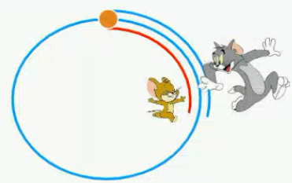

[TOC]

# 言语理解

## 片段阅读

### 中心理解题

<strong>重点内容</strong>

1. **转折**、**因果**关联词及重点位置
2. 逆向思维的用法
3. 主题词的特征
4. 正确及错误选项的特征(文段的话题，选项的套路)

行文脉络：总分、分总、总分总、分总分、分分

正确选项的特征：

- 包含主题词，是中心句的同义替换

错误选项的特征：

- 转折前的表述
- 偏离主题
- 非重点（背景、例子、解释说明）
- 无中生有
- 表述不明确（对比择优）

解题顺序：

`提问一文段一选项`

提问方式:

这段文字**主要**/**旨在**/**重在**/**意在**/**想要**说明（论述、强调）的是......

这段文字的**主旨**／**主题**/**观点**是......

对这段文字**概括**最恰当的一项是......

`有中心句——同义替换（几乎没有完全一样的句子）`

`无中心句——全面概括`

`有多个正确的选项——对比择优`

#### 转折关系

转折关系关联词：

虽然······但是······
尽管······可是······
······不过······
······然而······
······却······
其实/事实上/实际上

理论要点：

转折之后是重点

略读句子特征：

下定义：“是······” “即······” “称为······” （引出话题，名字，人名，地名）

例子：比如、例如、正如、就像等

原因：因为、由于等

背景：近年来、随着、在···背景下等（目前、当下）

"而"的用法：
转折一学而不思则罔
并列一敏而好学
顺承一引弦而战
递进一君子博学而日参省乎已

逆向思维

理论依据：转折前后句子意思相反

方法应用：将转折前内容反过来，即是正确答案适用文段特征：

1. "很多人都认为"、“有些人认为"、"西方观点认为"、"传统观点认为"..t（人的观点）
2. 转折表述

##### 主题词

1. 文段绕其展开
2. 一般高频出现（也有可能只在中心句出现1次）
3. 多为名词
4. 前有引入（随着、近年来）或后有解释说明（比如、再比如）

`高频词不一定是主题词`

理论要点：

正确选项中需包含文段主题词

干扰选项：

1. 范围扩大
2. 范围缩小
3. 偷换概念

#### 因果关系

典型格式：

因为······所以······

由于······因此······

理论要点：结论是重点

引导结论的标志：

1. 所以、因此、因而、故而、于是、可见、看来、从而
2. 导致、致使、使得、造成

提示：

如果文段较长，尾句出现结论词，可以优先看尾句

结论句出现在文段开头/中间，之后仍有其他语句

1. 之后的语句是进一步解释说明，此时中心句仍为结论句
2. 之后又出现并列、因果、转折，需结合多种关联词共同分析

因果结构，**果重要**

文段结构：

结果——原因解释

原因分析、现象、背景——结果（使得、导致、因此）

选项设置：

为什么、为何、何以是+结果

解释、揭示、阐述+结果的原因

#### 必要条件关系

必要条件——对策类

1. 对策标志词及行文脉络
2. 反面论证的用法
3. 程度词及其作用
4. 并列关系文段及选项特征

典型格式：
只有······才······

必要条件是重点，即“只有”和“才”之间的部分

标志词：

1. 应该、应当、必须、需要、亟须、亟待+做法、应、须、要
2. 通过／采取…手段/途径/措施/方式/方法/渠道，才能···（名词）
3. 呼吁、倡导、提倡、提醒、建议+做法 （动词）
4. 前提、基础、保障（负有······的义务，······依托于······）

`注意文段和选项的互换`

行文脉络：

1. 提出问题（是什么）+分析问题（为什么）+**解决问题**（怎么办）
2. **对策**+正反论证/原因论证（因为、由于）
3. 提出问题+**解决问题**（重点，答案所在）+意义效果
4. 提出问题+分析问题（**优选对策**，对策要有针对性、契合主题）

问题：

1. 危害、瓶颈、误区、弊端、不足、挑战、矛盾
2. 转折后（但是）

正面论证：

1. 只有······才······
2. 必须
3. 需要
4. 要
5. ······的重要突破口

反面论证：

1. 如果、倘若、一旦······+不好的结果
2. 假设变成现实的表述
3. 把做法反过来，即为正确答案

**重要**

- 若文段前有对策，那么反面论证是非重点
- 若文段前没有对策，或是问题，那么反面论证提对策就是重点

`当文段中只有“提出问题一分析问题"的部分时，"解决问题"通常会作为正确答案出现在选项里。`

解决问题需满足：

1. 有针对性
2. 契合主题

> 现在雾霾问题非常严重，这里面的原因是多方面的，有建筑污染、工业污染、大气气压等原因。
>
> 文段作者意在说明：
>
> A. 雾霾需要综合治理（对策）
>
> B. 面对雾霾建议绿色出行（无中生有）
>
> C. 大气问题治理需多方考量（扩大）
>
> D. 雾霾问题非常严重（问题）
>
> 正确答案：A

##### 程度词

标志词：更、尤其、正是、特别是、真正、根本、最（核心、突出）等

理论要点：程度词所在的语句通常为重点

选项设错：程度词之前非重点

#### 并列关系

文段特征：

1. 包含并列关联词或标点，如此外、另外、同时、以及、"；"
2. 层次分明，格式工整
3. 无明显其他关联词语

选项特征：

1. 两方面情况：和、及、与、同
2. 更多种情况：许多、一些、不同、各种、一系列

坑：

1. 表述片面
2. 偏离主题

`分句表达意思相同——提取共性`

### 细节判断题

重点内容：

1. 中心句及分述句的特征
2. 细节判断题解题思维及错误选项特征
3. 相对绝对法的应用

理论要点：把握**中心句**及**分述句**的特征

中心句特征：

观点（对策、结论、评价）

对策：应该、应当、必须、需要······

结论：因此、所以、于是、从这个角度上、“这”······

评价：作者认为、感叹······，专家、学者、政府认为、感叹······

分述句特征：

1. 举例子： “比如" “例如" "······就是例证” “好比”等
2. 调查报告、数据资料等（数字）
3. 正反论证
4. 原因解释（因为、由于）
5. 并列分述（；；；）个人，企业，国家，社会

总——分（观点+解释说明）

`中心句后为不同类型的解释说明`

分——总

结论的3种基本情况

1. 结论（因此，所以）
2. 对策（应该，必须）
3. 代词（这，此），从这个角度上说等 引导的尾句需关注

选项对比维度：

1. 主题词
2. 和中心句匹配程度（主题词之外的其他信息）
3. 明确VS不明确
4. 反推

细节判断题的提问方式：

以下对文段理解**正确**/**不正确**的是···
**符合**/**不符合**这段话意思的是···
从文段中可以**得知**/**推出**的是···

提示：

1. 注意审题，尤其选**非**题
2. 细心细致，把握常见的易错项
3. 不要脑补，忠于文段

错误选项类型：

1. 无中生有
2. 偷换概念（替换、混搭）（GDP,GNP)
3. 偷换时态(目前还是日前)
           将来时（将要、立刻、趋势、以后）
           完成时（已、已经、了、完成）
           进行时（正在、在 中、着）
4. 绝对表述

相对绝对法（优先对比方向）

如果是一道选非题，优先对比含有绝对标志词的选项：

绝对标志词：一定、全部、完全、所有、均、永远、任何、取代、主导、唯一、只要……就……、无论….…等

如果是一道选是题，优先对比含有相对标志词的选项：

相对标志词：可能、也许、或许、大概、一般、尽量、往往、容易、······之一等

## 语句表达

### 语句排序题

解题要点：

1. 根据选项提示，对比后确定首句
2. 确定捆绑集团/确定顺序/确定尾句
3. 验证（只验证你基本锁定的答案，而非全部验证）

“三步走”战略

第一步：根据选项提示，对此后确定首句（**一定要对比**！）

第二步：确定捆绑集团/确定顺序/确定尾句（“同时进行”，结合题目特点灵活运用）

第三步：验证（只验证你“基本锁定的答案”，而非全部验证）

#### 确定首句

（一）下定义

- ······就是/是指······
- ······称为······
- ······即······

（二）背景引入

- 随着
- 近年来
- 在······大背景下/环境下

（三）提出观点

- 有人说、人们普遍认为

（四）非首句特征

- 指代词无指代对象
  - 人称代词：他/她/它
  - 指示代词：这/那/此
- 关联词后半部分单独出现
  - 但是
  - 更重要的是
  - 还、也
  - 所以
  - 另一方面
  - 同时

#### 确定捆绑集团

（一）指代词捆绑

- 这、那、他、该、其

（二）关联词捆绑

- 配套出现
  - 不但······而且······
  - 虽然······但是······
- 单独一个
  - 但、同时
  - 分析句子意思

#### 确定顺序

（一）时间顺序

- 年份
- 朝代
- 时间词

> 朝代歌
>
> 三皇五帝始，尧舜禹相传
> 夏商与西周，东周分两段
> 春秋与战国，一统秦两汉
> 三分魏蜀吴，两晋前后延
> 南北朝并立，隋唐五代传
> 宋元明清后，王朝至此完
> 民国再共和，代代往下传

（二）逻辑顺序

观点和解释说明

先论述A，再论述B

只能确定A、B的先后顺序，A和B无法确定

#### 尾句特征

- 结论：因此、所以、看来、于是、这
- 对策：应该、需要

> 排序题口诀
> 看首句，扫尾句，对比内容是第一
> 抓捆绑，判顺序，借助选项省力气
> 三步走，莫畏惧，难题验证需谨记

建议：

1. 集中刷题效果好
2. 穷尽每道题涉及的所有考虑
3. 正确选项代入，通读文段，把握常考脉络

### 语句填空题

不要语感，关键要找主题词

#### 横线在结尾

一般段落是分总结构

1. 总结前文，因此、可见、可以说、这
2. 提出对策，问题+因此

抓住主题词

横线处和前面分包有紧的逻辑关系时，需注意与前面分句的街接，保证前后话题一致。

#### 横线在开头

需概括文段的中心内容

### 接语选择题

提问方式：

作者接下来最有可能讲述的是.....

`尾句——话题`

理论要点：重点关注文段最后一句话（核心）
干扰项特征：文段中已经论述过的内容

理解要紧紧依托文段，不能无中生有。

## 逻辑填空

1. 搜寻段落的提示、线索
2. ”词意“靠平时的积累
   1. 多做真题，自己造句
   2. 总结
   3. 举一反三，以题找题

### 词的辨析

重点是`找差异`

#### 词义侧重

辨析方法：

1. 拆字组词：用不一样的字单独组词

2. 整词搭配：用整个词进行组词搭配

   如`权利——权力`——>`利——利益`——>`力——力量`

> 【例1】 （ 2019广东选调）我国多地正 ____ 以企业纳税情况为重要参考，为企业提供融资服务， ____  企业融资难、融资贵等状况，实现对实体经济的支持。
>
> 依次填入画横线部分最恰当的一项是：
> A.尝试	缓和
> B.尝试	缓解
> C.试图	缓解
> D.试图	缓和
>
> 尝试——试图，尝是品尝，是正在做的；图是想法，只是在想的；故选尝试
>
> 缓和——缓解，和是平和，解是解决。问题是解决的；故选缓解
>
> 故答案为B

> 【例2】 （ 2018陕西）生命只有一次，而人生也不过是时间的 ____  。若让今天的时光白白 ____  ，就等于毁掉人生最后一页。珍惜今天的一分一秒，因为它们将一去不复返。人无法把今天存入银行，明天再来取用。时间像风一样不可 ____  。每一分一秒，要用双手捧住，用爱心抚摸，因为它们如此宝贵。
> 依次填入画横线部分最恰当的一项是：
> A.累积	流失	捕捉
> B.累计	流走	捕捉
> C.累计	流失	捕获
> D.累积	流走	捕获
>
> 累积——累计，积是由少变多；计是计算；人生与时间，更合适的是由少变多，故选累积
>
> 流失——流走，差别不大
>
> 捕捉——捕获，捕捉可以是具体的（昆虫），也可以是抽象的（灵感）；捕获只能是具体的；段落中为风，故选捕捉
>
> 故答案为A

#### 固定搭配

看搭配，找对应

1. 常用词搭配、热点词搭配（约定俗成）
   - 发挥（能力）/ 发扬（风格）
   - 经济新`常态`，`供给`侧结构性改革，京津翼`协同`发展，打赢`脱贫`攻坚战
2. 找搭配对象（瞻前顾后）
   - 敦煌星图所 ____ 的单独恒星数量远远多于托勒密星`表`。（`记录` /  描绘）
3. 一搭多
   - 这个时代，人与人在`空间`和`情感`上越来越 ____  。（冷漠 /  `疏离`）

搭配常见的角度

1. 人/物
   - 爱护（人、物） / 爱戴（人）
   - 启用（人、物） / 起用（人）
2. 上对下/下对上
   - 垂爱（上对下） / 垂青（都行）
   - 赡养（下对上）/ 抚养（上对下） / 扶养（都行）
3. 具体/抽象
4. 快慢/大小/高低
   - 速度（快慢）
   - 力度（大小）
   - 水平（高低）

> 【例1】（2020山东）新技术的商业价值是 ____ 的，往往是针对某种具体应用场景而言的。所以，技术的商业价值，**需要**以某种形式将其商业化之后，才能 ____ 地**体现**出来。而技术商业化的核心，是设计有效的商业模式。
> 依次填入画横线部分最恰当的一项是：
> A.具体	厚积薄发（多多积蓄，慢慢放出，形容准备充分才能办好事）
> B.潜在	淋漓尽致（形容文章、谈话等详尽透彻，发挥充分）
> C.无形	顺理成章（指某种情況合乎情理，自然产生某种结果）
> D.巨大	具体而微（指事物的各个组成部分大体都有了，不过形状和规模比较小些）
>
> （2020国家）"内容即营销"的理念也在短视频上**体现**得淋漓尽致。
> （2019河北）人们对春天的希望，对人生的畅想，全在这些岁令时节中淋漓尽致地**表达**出来。
> （2017联考）神奇虚幻的故事借助动画的假定性不仅可以得到淋漓尽致的**表现**，而且...
> （2015山东）院落就可以将这一特征**表达**得淋漓尽致。
>
> 答案为B。

> 【例2】 （2018吉林）“山一程，水一程，身向榆关那畔行，夜深千帐灯。”在文化节目《经典咏流传》的舞台上，当纳兰性德的《长相思·山一程》被棋手柯洁用深情的声唱出时，这句 ____ 的词句还是给予我惊艳和陌生。那份数百年前的故园情思、羁旅感慨因悠扬的旋律被再度激活，令人 ____ 。
> 依次填入画横线部分最恰当的一项是：
> A.耳熟能详（指听得多了，能够说得很清楚、很详细）		 耳目一新（指听到的、看到的跟以前完全不同，使人感到 鲜）
> B.耳闻能诵（指听过就能背出来，形容记忆力强）				 赏心悦目（指看到美好的景色而心情愉快）
> C.目知眼见（指亲眼所见，形容熟悉了解）							心旷神怡（心境开阔， 精神愉快）
> D.驾轻就熟（比喻对某事有验熟悉做起来容易）					焕然一新（改变旧面貌，出现新的气象）
>
> 答案为A。

> 【例3】 （2019联考）云南在西、巴蜀在北，贵州有着说不尽的历史。这片西南中国的广袤土地，呈现了华夏山河的 ____ 、见证了中国革命的风云际会、记录了多民族文化的交流激荡。现在，贵州正在以绿色发展谋求生态红利，率先推进了中国生态文明建设的地方探索。
> 填入画横线部分最恰当的一项是：
> A.海晏河清（比喻太平盛世，天下太平）
> B.渊淳岳峙（比喻人品德如渊水深沉，如高山耸立）
> C.钟灵毓秀（指美好的山川孕育出优秀的人才）
> D.瑕瑜互见（比喻优点、缺点都有）
>
> 答案为C。

> 【例4】（2019山东）纪录片是众多国家进行对外文化传播的重要工具。 ____ 时代之魂、 ____ 时代之需、 ____ 时代之变、 ____ 时代之风，纪录片创作者应当充分挖掘和盘活“讲好中国故事”这个富矿，向世界展现真实、立体、全面的中国，提高国家文化软实力和中国文化影响力。
> 依次填入画横线部分最恰当的一项是：
> A.把握	关注	聚焦	引领  																																																	B.筑牢	聚焦	关注	传承
> C.筑牢	洞悉	凝神	传承																																																		D.把握	留意	警醒	引领
>
> 留意时代之需，错误，排除
>
> 凝神时代之变，错误，排除
>
> 引领和传承，纪录片创作者最重要的是带领，故选引领
>
> 答案为A。

> 【例5】（2018联考）口号是意识的一种表现形式，适量适度、通俗易懂、提炼准确的口号，对鼓舞士气、振奋人心、推动工作会产生积极作用。今天，改革攻坚面临繁重任务，群众的拥护和支持显得 ____ ，务须以诚心换真心、以守信换信任，让口号和行动同频共振，把每一个诺言都 ____ 成可感的实绩。
> 依次填入画横线部分最恰当的一项是：
> A.弥足珍贵（非常宝贵）																兑现
> B.历久弥新（指经历长久的时间而更加鲜活，更加有活力）	  履行
> C.难能可贵（指不容易做到的事居然能做到，非常可贵）		  践行
> D.来之不易（表示财物的取得或事物的成功是不容易的）		  实现
>
> 历久弥新多用来形容传统文化。
>
> 答案为A。

> 【例6】 （ 2020江苏）多年宣传之后，垃圾分类真的要走入每个中国家庭的生活了。在这场与垃圾 ____ 的拉锯战中，中国是否能借助垃圾分类扭转局势，并通过利用自身的回收行业优势提升人们的环保意识，真正解决垃圾问题，避免重蹈发达国家的覆辙，我们 ____ 。
> 依次填入画横线部分最恰当的一项是：
> A.殚精竭虑（形容用尽精力、费尽心思）				 翘首以盼（形容盼望股切）
> B.旷日持久（指耗费时日）										拭目以待（形容股切期望或等待某件事情的实现）
> C.分秒必争（形容抓紧时间）									整装待发（整理好行装，等待出发）
> D.势均力敌（形容双方势力相当、不分高下）		 胸有成竹（比喻办事以前已有全面的设想和安排）
>
> 答案为B。

> 【例7】（2016浙江）现代传媒尤其是电子传媒有着比传统纸质传媒更宽广的尺度， ____ **更多批判的意识和更多的异端**。无数专家、学者在电子传媒会客厅中针对各种会现象接受访谈，发表意见，**甚至**不乏 ____ 的声音。分析之深、论证之严密、言论之犀利，传统媒体均**无法** ____ 。
> 依次填入画横线部分最恰当的一项是：
> A.鼓励（褒义）		特立独行		相提并论 （差距大，不同的人）
> B.滋生（贬义）		针锋相对		同日而语（差距大，同一个人，强调时间上的）
> C.允许（中性）		振聋发聩		一目了然
> D.容纳（中性）		惊世骇俗		望其项背（望尘莫及）
>
> 振聋发聩：指言论、文章有使人醒悟、启发愚蒙的作用
> 惊世骇俗：言行异于寻常而使人震惊
>
> 答案为D。

> 【例8】（2016河北）在这个时代，人与人之间虽然在**空间**和**情感**上越来越 ____ ，但是每个人的利益却又 ____ 地与他人的利益和行为紧密地联系在一起。这促成人们主动参与公共事务，呼吁公共利益。
> 依次填入画横线部分最恰当的一项是：																																													A.冷漠		无孔不入（比喻有空子就钻）
> B.疏离		前所未有（指从来没有过的）
> C.隔绝		迫不得已（被逼得没有办法，不得不这样）
> D.封闭		始料未及（指没有想到，在意料之外的）
>
> 答案为B。

#### 程度轻重

理论要点：
所填词语的程度轻重与文段意思的程度轻重保持一致。

> 【例1】 （ 2018联考）白大褂在19世纪末登上历史舞台是因为它能有效隔绝细菌，而一百多年后它遭到 ____ 却是因为在隔绝细菌上**做得不够好**。在前一个阶段，白大褂顺应了现代医疗的发展潮流，而在后一个阶段它被一部分人视作现代医疗发展的 ____ 。人们对白大褂态度的变化，从本质上说是人类认识进一步深化，更为接近事物原貌的结果，这么看，白大褂的发展也是**现代医疗事业发展**的 ____ 。
> 依次填入画横线部分最恰当的一项是：
> A.质疑（轻）		羁绊		缩影（代表同类型具体而微的事物）
> B.否定（重）		桎梏		截图
> C.挫折					壁垒		象征（具体表抽象）
> D.排斥					累赘		历史
>
> 答案为A。

> 【例2】 （ 2018浙江）任何时候，内容推送不能少了“总编辑”，再好的传播渠道也要有“看门人”，即使在**技术为王**的时代，也不能**完全**让算法 ____ 内容。这一方面需要更完善的法律法规、更理性健康的舆论空间，为互联网算法时代的信息传播 ____ ，但更少不了作为内容提供者的智能平台，肩负起应该承担的社会责任，扬长避短，让技术和算法真正造福这个时代。
> 依次填入画横线部分最恰当的一项是：
> A.干预		添砖加瓦（比喻增添一份微薄的力量）
> B.决定		保驾护航（泛指保护）
> C.影响		遮风挡雨（比喻起保护作用）
> D.代替		披荆斩棘（比喻在迁就道路上清除障碍，克服困难）
>
> 答案为B。

> 【例3】（2019国考）中国的传统文化中，“老”是一个褒义的字眼。一个年轻人处事得当，会被说老练、老成。但是进入互联网特别是移动互联网时代，**这沿袭了数千年的观念**，**短短**数十年 ____ 。年龄大、资历老逐渐不再是一种优势，有时反而成了学习新事物的一种 ____ 。							依次填入画横线部分最恰当的一项是：
> A.土崩瓦解（指像土崩塌，瓦破碎一样，不可收拾，比喻事物的分裂）		羁绊
> B.化为鸟有（指全部消失或完全落空）															  阻力
> C.灰飞烟灭（比喻事物消失净尽）																	 累赘
> D.分崩离析（指四分五裂，多形容国家、集团等分裂瓦解）						   弊端
>
> 答案为A。

> 【例4】 （2018国考）一方面，受世界经济 ____ 影响，大宗资源产品价格**走低**，资源型企业纷纷陷入困境，资源型城市财政收人也急剧**下降**，无力增加投入；另一面，随着经济发展进入新常态，大规模经济**刺激**已经 ____ ，来自中央政府的强力支持相应**减弱**，资源型城市债务扩张趋于**收紧**。资源型城市转型面临的资金约束日益 ____ 。
> 依次填入画横线部分最恰当的一项是：
> A.下行		失效		紧张
> B.萎缩		放缓		强化
> C.低迷		弱化		严重
> D.恶化		减退		明显
>
> 答案为C。

> 【例5】 （2017联考）对于社会性动物人类来说，社交的重要性 ____ ，活动中必不可少的技能就是要认清别人的脸。不幸得脸盲症的话，真是会 ____ 。
> 依次填入画横线部分最恰当的一项是：
> A.昭然若揭（形容真相全部暴露，一切都明明白白）				见笑于人（被人笑话）
> B.毋庸赘述（指用不着多说）									   				贻笑大方（指让内行人笑话）
> C.不言而喻（指不用说话就能明白）										   窘态百出（指尴尬无语、郁闷的状态）
> D.显而易见（指形容事情或道理很明显，极容易看清楚）		羞愧难当（指感到十分羞愧内疚）
>
> 答案为C。

程度轻重小结：

1. 关注提示词（一定/完全/最；可能/一部分/或许/减弱/下降）
2. 结合常识
3. 政治正确（有关部门）

#### 感情色彩

理论要点：

1. 褒义、贬义、中性
2. 所填词语的感情色彩与文段的感情色彩保持一致

- 成果（褒义），结果（中性），后果（贬义）
- 不胜枚举（中性），罄竹难书（贬义）

> 【例1】（2019联考）习近平主席在上海合作组织成员国元首理事会第十八次会议上的重要讲话，深刻分析了我们今天所共同面对的风险挑战：当今世界霸权主义和强权政治 ____ 存在；各种传统和非传统安全威胁不断 ____ ；单边主义、贸易保护主义、逆全球化思潮不断有新的表现；文明冲突、文明优越等论调不时 ____ 。
> 依次填入画横线部分最恰当的一项是：
> A.依旧		显现		拨云见日（比喻冲破黑暗见到光明，也比喻疑团消除心里顿时明白）
> B.仍然		出现		激浊扬清（比喻清除坏的，发扬好的）																																				C.依然		涌现		沉渣泛起（比喻已经绝迹了的腐朽、陈旧事物又重新出现）
> D.仍旧		浮现		振臂高呼（举起手欢呼，形容非常高兴）
>
> 答案为C。

> 【例2】 （2018辽宁）她 ____ 盲人和正常人一样也能做很多事情，这正是她只身来到拉萨旅游的原因。她喜欢这座 ____ 在历史和信仰中的圣城，尽管看不见，她也能感受到这里绵延的雪山、清冽的空气、闪耀着金光的寺庙和那些 ____ 向大昭寺缓缓前行的信徒。
> 依次填入画横线部分最恰当的一项是：
> A.相信		沉醉		顶礼膜拜 （指崇拜到了极点）																																								B.自信		沉溺		诚心诚意
> C.坚信		沉浸		三步一叩（表示对某些事物的虔诚和敬畏）
> D.确信		沉迷		毕恭毕敬（形容极为恭敬）
>
> 答案为C。

> 【例3】 （2019四川）在产品广告和自媒体营销号中，我们经常看到对“防癌食品” “抗癌保健品”的 ____ 。许多营销文案还能列出一篇篇的科学文献，动不动就说“某著名大学发现” “某权威医学期刊证实”等，显得“很有科学依据"。其实，科学领域说的“致癌”和“防癌”，跟广大公众心中所想的“致癌” “防癌” ____ 。
> 依次填入画横线部分最恰当的一项是：
> A.鼓吹		相去甚远（指互相之间存在很大差异和距离）
> B.宣传		毫不相干
> C.炒作		南辕北辙（指行动和目的相反，一个主体）
> D.正名		判若云泥（比喻相差极为悬殊）
>
> 答案为A。

### 语境分析

重点是`找线索`

1. 关联关系：转折、递进、并列
2. 对应关系：解释类、重点词句

#### 关联关系

##### 转折

理论要点：
前后语义相反

> 【例1】 （ 2019浙江）近二十几年来，人类已发现数千颗围绕其他恒星公转的行星，其中绝大多数与地球 ____ 。**不过**， 《发现》杂志曾预测，观察大约150个邻近星系，就应该会找到一个**类似**地球的小型行星。
> 填入画横线部分最恰当的一项是：
> A.泾渭分明（比喻界限清楚、是非、好坏分明）
> B.唇齿相依（比喻彼此关系密切，互相依赖）
> C.息息相关（形容彼此的关系非常密切）
> D.大相径庭（比喻相差很远，大不相同）
>
> 答案为D。

> 【例2】 （2019山东）在网络书店的强有力竞争下，不少实体书店 ____ ，而书店的租金、人工等费用**却**在猛增。这时候通过装修店面，给读者带来全新的感受，不失为一个好办法。实际上，与网络书店相比，实体书店能给人带来独特的体验，那就是逛书店。
> 填入画横线部分最恰当的一项是：
> A.人不敷出（指收入不够支出）
> B.进退维谷（无论是进还是退，都是处在困境之中。形容进退两难）
> C.门可罗雀（形容十分冷落，宾客稀少）
> D.万人空巷（多指庆祝、欢迎等盛况）
>
> 答案为C。

##### 递进

理论要点：
语义程度前轻后重

而且、甚至、更、不但

- 语义接近

- 感情接近

> 【例1】（ 2015浙江）中国改革已进入**攻坚期和深水区**，需要解决的问题格外艰巨，都是难啃的硬骨头。这个时候就要一鼓作气， ____ 、畏蕙不前，**不仅**不能前进，**而且**可能 ____ 。
> 依次填入画横线部分最恰当的一项是：
> A.优柔寡断		半途而废
> B.三心二意		功败垂成（事情在接近成功时遭遇失败）
> C.迟疑不决		功亏一篑（做事情只差最后一点没有完成）
> D.瞻前顾后		前功尽弃（以前的功劳努力全部丢失白费）
>
> 答案为D。

> 【例2】 （ 2019联考）现在的诗词普及，还有许多需要留心和甄别的地方。如今市面上诗词普及的图书尤其多，也尤为 ____ 。有不少普及读物，其中文字**错漏百出**，采用的故事也都是 ____ ，**甚至**是**杜撰**而来。作为读者，应该加以甄别。尽量选择学者编写的图书，他们的材料、解读都较为严谨扎实，采用的故事也都有正史作为依据。
> 依次填入画横线部分最恰当的一项是：
> A.鱼目混珠（指以假乱真）													   稗官野史（指旧时的小说和私人编撰的史书）
> B.滥竽充数（比喻无本领的充有本领，次货冒充好货）		 逸闻轶事（指世人不大知道而感兴趣的传闻和故事）
> C.鱼龙混杂（指好的坏的掺杂在一起）									道听途说（泛指没有根据的传闻）
> D.龙蛇混杂（指好的坏的掺杂在一起）									胡编乱造（泛指没有根据的编造）
>
> 答案为C。

> 【例3】（2018四川）君子之德要求坚守**正道**、深明**大义**、矢志不移，**乃至** ____ ，不为各种威逼利诱所降服。这就是孟子所谓“富贵不能淫，贫贱不能移，威武不能屈，此之谓大丈夫”。君子要讲和谐，但不能随波逐流，更不能 ____ 。《中庸》所谓“君子和而不流”，就是指在大是大非面前不能有丝毫含糊。
> 依次填入画横线部分最恰当的一项是：
> A.以身殉道（为追求的道义牺牲自己的性命）		 人云亦云（指没有主见，只会随声附和）
> B.杀身成仁（指为正义而牺牲生命）						口是心非（指口所言说的与心中所思想的不一致）
> C.视死如归（不怕牺牲生命）									沆瀣一气（比喻臭味相投的人结合在一起）
> D.舍生取义（为正义而牺牲生命）							同流合污（多指跟着坏人一起做坏事）
>
> 答案为D。

##### 并列

理论要点：

1. 同义并列：顿号（、）、逗号（，）
2. 反义并列：不是······而是······、是······不是······、相反、反之等
3. 相同句式表并列

> 【例1】（2020国考）科学家网上科普， “高大上”的国家科研机构与轻松娱乐的网络文化场域相遇，不仅没有出现文化上的巨大冲突、碰撞，反倒形成了一种 ____ 、寓教于乐的可爱画风，受到很多年轻人的喜爱。这种意外，看似有很大的 ____ ，实则是一种科普方式的积极探索创新，预示了打通两个文化场域的可能性。
> 依次填入画横线部分最恰当的一项是：
> A.别出心裁（独创一格，与众不同）											 随意性
> B.相映成趣（相互衬托着显得很有趣味）									 特殊性
> C.亦庄亦谐（既严肃又风趣）														偶然性
> D.妙趣横生（语言、文章、美术品等洋溢着美妙的意趣）		  随机性
>
> 答案为C。

> 【例2】（2017浙江）现实生活中，真正能够平心静气、 ____ 者，似乎为数不多。相反，惯于给灵魂做加法，喜欢抛头露面、彰显自我的人倒是不少。君不见，有的人只要有机会，不是东拉西扯、侃侃而谈，便是谈天说地、 ____ 。不少人喜欢把逛街购物、唱歌喝酒、头疼脑热、感冒鼻塞之类的闲事琐事无聊事，统统发到朋友圈里去。
> 依次填入画横线部分最恰当的一项是：
> A.委曲求全（指勉强迁就，以求保全）													口若悬河（中性）
> B.心如止水（形容坚持信念，不受外界影响）										指桑骂槐（贬义）
> C.波澜不惊（看见风浪不惊慌，比喻心态鍵定）									口诛笔伐（贬义）
> D.心无旁骛（指心思没有另外的追求，形容心思集中，专心致志） 	津津乐道（中性）
>
> 答案为D。

> 【例3】 （2019甘肃）很多人都喜欢将自己眼中的世界分门别类，并用固有的认知打上标签。这种“刻板印象”的存在，确实在某种程度上**提高**了我们的认知 ____ ，但也将我们的思维框定到已有的版图中，周边世界千变万化，而我们却在熟悉的境地里 ____ **停滞不前**。
> 依次填入画横线部分最恰当的一项是：
> A.层次		泥足深陷（比喻陷入麻烦的境地却无法轻易脱离或陷于某件事不能自拔）——困难
> B.水平		闭门造车（强调不考客观实际情况，只凭主观想法办事）
> C.效率		固步自封（比喻守着老一套，不求进步）
> D.能力		一意孤行（指不接受别人的劝告，顽固地按照自己的主观想法去做）——固执
>
> 答案为C。

> 【例4】（2017四川）好的作品会对一些人的人生产生重大和深远的影响。它能让人变得更加坚强，让**人生目标**更加 ____ 。曾几何时，一部《钢铁是怎样炼成的》一部《平凡的世界》，成为许多青年人精神世界的“圣经”，成为他们一生中经受 ____ ，战胜**苦难**的强大精神动力。
> 依次填入画横线部分最恰当的一项是：
> A.笃定					磨难（与苦难同程度）
> B.确定					波折（相对于苦难程度偏低）
> C.淡定（人）		磨炼
> D.镇定（人）		挫折
>
> 答案为A。

> 【例5】 （ 2017广州）依次填入下列横线处的词语，最恰当的一组是：
> 量子力学认为真空并非“ ____ ”，而是充斥着大量“虚”的粒子和反粒子对。它们同时产生，刹那之间又相互 ____ 。
> A.一无所有（什么也没有）										淹没
> B.空谷幽兰（比喻人品高雅）									进发
> C.熙熙攘攘（形容人来人往，非常热闹拥挤）		 吞噬
> D.空无一物（没有任何东西）									湮灭（消失；证据、历史；）
>
> 答案为D。

> 【例6】 （2020国考）五四运动表现出来的爱国主义精神，与以往的爱国主义相比较，具有历史进步性和鲜明时代性。这种爱国主义不是盲目排外，而是为了维护国家独立和民族尊严；不是 ____ 而是与民主和科学精神紧密联系，追求发展进步；不是 ____ 而是付诸行动，以"直接行动”投入反帝运动。
> 依次填入画横线部分最恰当的一项是：
> A.刻舟求剑（一般比喻死守教条，拘泥成法，固执不变通的人）										  	作壁上观（比喻置身事外，在旁不协助任何一方）
> B.邯郸学步（比喻一味地模仿别人，不仅没学到本事，反而把原来的本事也丢了）			   闭门造车（比喻脱离实际，只凭主观办事）
> C.固步自封（比喻守着老一套，不求进步）																				纸上谈兵（比喻空谈理论，不能解决实际问题）
> D.拾人牙慧（比喻拾取别人的一言半语当作自己的话）															 夸夸其谈（形容说话浮夸不切实际）
>
> 答案为C。

> 【例7】 （ 2018国考）历史认识的局限性成就了历史研究的魅力。历史认识有局限性，才需要人们不断拷问、修正和创新。如果研究者因此而敬畏研究对象，兢兢业业， ____ ，这正是历史研究的幸事。反之，如果把历史认识的局限性作为规避责任的遁词和**主观**臆断的托词，人们就会愈发相信历史毫无 ____ 可言。
> 依次填入画横线部分最恰当的一项是：
> A.身体力行（指亲身体验）										科学性（客观）
> B.恪尽职守（指谨慎认真地做好本职工作）			 公平性（不公）
> C.如履薄冰（比喻行事极为谨慎，存有戒心） 		客观性
> D.谨言慎行 （形容人言语行动小心谨慎）				系统性（零散）
>
> 答案为C。

#### 对应关系

##### 解释类对应

题干特点：分句，____ ，分句

标志词：是、就是、即、无异于、无疑是、比如、例如等

标点：冒号（：）、破折号（——）

> 【例1】 （2019上海）当年刘邦入咸阳， “缓刑弛禁，以慰其望"，采取的是"有所不为”。后刘备入蜀，诸葛亮则“威之以法” “限之以爵"，采取的是“有所为”。“为”与“不为” ____ ，都深得人心，实现大治。原因就在于 ____ ：秦朝苛政，百姓苦不堪言，不为而治，顺应人民的意愿；而蜀中刘璋长期暗弱，豪强专权自恣，必须严刑峻法。
> 依次填入画横线部分最恰当的一项是：
> A.异曲同工（比喻一件事情 做法不而都巧妙地达到目的）			度德量力（衡量自己的德行是否能够服人，估计自己的能力是否能够任）
> B.殊途同归（比喻采取不同的方去而得到相同的结果）			 	审时度势（观察分析时势，估计情况的变化）
> C.背道而驰（行动与正确的方向相反）											实事求是
> D.见仁见智（不同的人从不同的立场或角度不同的看法）			 量力而行
>
> 答案为B。

> 【例2】 （2018事业单位联考）管理者往往对直观信息熟视无睹，对数字情有独钟。结果，他们就可能 ____ 一些关键线索，不能真正了解到对方的优势和劣势。由此导的结果，要么是“ ____ "，要么是“交友不慎"。
> 依次填入画横线处的词语，最恰当的一项是：
> A.遗漏			铤而走险（指在无路可走的时候采取冒险行动）
> B.轻视			畏首畏尾（比喻做事胆子小，顾虑多）
> C.丢失			误入歧途（比喻走上了错误的道路）
> D.忽略			坐失良机（不主动及时行动而失去好机会）
>
> 答案为D。

> 【例3】 （2018浙江） 19世纪末，中国维新派代表人物严复将经济学家亚当·斯密的著作译为《原富》，献给光绪皇帝，但并没有引起足够重视。可以说，与市场经济 ____ 是近代中国经济落后的重要原因。
> 填入画横线部分最恰当的一项是：
> A.若即若离（指好像接近，又好像不接近）
> B.分道扬镳（比喻目标不同，各走各的路或各干各的事）
> C.南辕北辙（比喻行动与目的正好相反）
> D.失之交臂（当面错过好机会）
>
> 答案为D。

> 【例4】 （2019山东）故事片的叙事及视觉语言，一个重要而基本的原则，便是隐藏起摄影机的存在。换言之，故事片叙事的最重要而基本的特征，便是 ____ 叙事行为的痕迹。于是，似乎是场景、事件自身在 ____ 呈现。
> 依次填入画横线部分最恰当的一项是：
> A.突出		自动
> B.抹去		自行
> C.强调		客观
> D.忽视		主动
>
> 答案为B。

> 【例5】（ 2019国考）基层离百姓最近，可以快速反馈百姓的感受和意见，随时进行政策调整，故能“因病施治”；基层直接面对错综复杂的情况，最了解体制机制改革的症结和痛点所在，故能“ ____ ”；基层最看重的是实效， ____ 不得人心、难以持久，故内生的改革措施往往能“药到病除”。
> 依次填入画横线部分最恰当的一项是：
> A.不药而愈（指生病不用吃药而自行痊愈）												夸夸其谈
> B.对症下药（此喻针对事物的问题所在，采取有效的措施）				 	花拳绣腿
> C.一针见血（比喻说话直截了当，切中要害）											朝令夕改
> D.标本兼治（指要解决问题表象，又要从根本上杜绝问题的产生）		 华而不实
>
> 答案为B。

> 【例6】（2018联考）科学的发展和进步往往 ____ 于科学假说，科学理论发展的历史就是假说的形成、发展和假说之间的竞争、更迭的历史。面对茫茫人类史源头，面对 ____ 虚虚实实的人类文明历史遗存，科学假说同样至关重要。他 ____ 地将历史、文化、人性、环境视角的“聚光灯”汇集在一起，形成了属于他的一盏“无影灯”，并以这样的视角照射幽暗的历史深处，从而解析出一些可能接近历史本源的朦胧真相。
> 依次填入画横线部分最恰当的一项是：
> A.发轫		凤毛麟角（指珍贵而稀少）							含英咀华 （比读吸取其精华）
> B.肇始		吉光片羽（比喻残存的珍贵文物）				 独辟蹊径（比喻独创一种新风格或者新方法）
> C.滥觞		汗牛充栋（形容藏书很多）							苦心孤诣（指为寻求解决问题的办法而煞费苦心）中性
> D.开端		如火如茶（形容气势旺盛热烈或激烈）		 毛举细故（指烦琐地列举小事情，加以责难或攻击）贬义
>
> 答案为B。

> 【例7】（2019事业单位联考）中国自古是农耕国家，在农耕社会，农业经济收益周期较长，而且大自然往往具有不确定性，因此长年与大自然打交道的中国人就养成了 ____ 和勤俭节约的良好品质。“细水长流，吃穿不愁”的文化观念，使我们习惯于平常 ____ ，将省下或富余的财富储蓄起来，为未来做打算。
> 依次填入画横线部分最恰当的一项是：
> A.知足常乐（形容安于已经得到的利益、地位）						 开源节流
> B.随遇而安（指能顺应环境，在任何境遇中都能满足）			 节衣缩食
> C.未雨绸缪（比喻事先做好准备工作）										量入为出
> D.居安思危（指随时有应付意事件的思想准备）						粗茶淡饭（生活简朴）
>
> 答案为C。

##### 重点词句对应

重点词：指代词/主题词/形象表达

重点句：完整语句

重点词句之“指代词”

标志：这、此

答题要点：所填词语与代词指代的内容形成对应

> 【例1】 （2019四川）即便是比较严肃的史学著作，在习惯了一种写作和思维路径后，也很难有别的考察和分析视角。这样一来，人们读到的史书就难免 ____ ，这在一定程度上使读者 ____ 。
> 依次填入画横线部分最恰当的一项是：
> A.如出一辙（比喻两件事情非常相似）				 心不在焉（思想不集中）
> B.人云亦云（指没有主见， 只会随声附和）		不求甚解（学习研究不深入）
> C.众口一词（指许多人都说局样的话）				味同嚼蜡（语言或文章枯燥无味）
> D.大同小异（指大体根同，略有差异）				兴味索然（一点兴趣也没有）
>
> 答案为D。

> 【例2】 （2019国考）《“健康中国2030”规划纲要》中提出，要努力实现从以治病为中心向以健康为中心转变，从以“治已病”为中心向以“治未病”为中心转变，从疾病管理向健康管理转变。在这种背景下，中医药 ____ 。
> 填入画横线部分最恰当的一项是：
> A.举足轻重（重要）
> B.不可或缺（重要）
> C.大有可为（未来有所作为）
> D.大有裨益（对······大有裨益的格式，排除）
>
> 答案为C。

> 【例3】（2020国考）军事伪装可追溯到上古时代，比如《荷马史诗》中提及的“特洛伊木马”就是军事伪装的早期实例，即将人员和装备伪装成无害的事物，使得军事行动 ____ 。巧妙运用军事伪装技术， ____ 自身真实的作战意图，往往能取得令人称奇的胜利。
> 依次填入画横线部分最恰当的一项是：
> A.扑朔迷离（形容事情错综复杂，难以辨别清楚）		 转移
> B.悄无声息（形容没有声音）											掩饰
> C.防不胜防（形容防备不过来）										严守
> D.出其不意（指出乎对方的意料）									隐藏
>
> 答案为D。

> 【例4】（2018联考）尽管每个知名品牌都具有高辨识度的独特气质，凝结着创始人 ____ 的心灵史，沉淀着消费者殷殷的情感寄托，但品牌的载浮载沉符合市场规律即便是一些陪伴我们成长的知名品牌，也有许多水没沧海，查然不见。从当年与柯达、富士上演“三国演义”的乐凯胶卷，到一度为人 ____ 的海鸥牌相机、回力运鞋……一个个淡出大众视野。
> 依次填入画横线部分最恰当的一项是：
> A.栉风沐雨（形容人经常在外面不顾风雨地辛苦奔波）			 交口赞誉
> B.呕心沥血（泛指为事业、工作、文艺创作等用心的艰苦）	 心驰神往
> C.鞠躬尽瘁（指竭尽所能，贡献出全部力量）							如数家珍
> D.筚路蓝缕（形容艰苦创业）													   耳熟能详
>
> 答案为D。

> 【例5】 （2017联考）随着3D打印技术的发展，人们将不再需要等待皮肤在实验室中研发出来，化妆品公司也将能够更加快速地通过 ____ 皮肤来创建相应的模型，而且还能够创建更加强大的原型。皮肤非常薄，对3D打印而言，制造皮肤将是一个相对 ____ 的过程。3D打印机中的一个注射器能够沿着器官线移动，并非常缓慢地挤压出细胞溶液。然后，再一层层增加，以此达到用户所想要的厚度。
> 依次填入画横线部分最恰当的一项是：
> A.打印		容易
> B.复制		简单
> C.保养		复杂
> D.修复		简易
>
> 答案为A。

重点词句之形象表达

标志：比如、就像、类似、""

答题要点：所填词语与形象表达的词语形成对应

> 【例6】（2019国考）历史是昨天的新闻，新闻是明天的历史。历史与新闻有如隔世兄弟， ____ 。历史作为事实的记载，往往和文学相互补充，而文学的天赋是想象、虚构和夸张。因此，沾上了文学的历史与新闻就像到了岔路口，不光是 ____ ，可能还会走向对立。
> 依次填入画横线部分最恰当的一项是：
> A.情同手足（比喻情谊深厚，如同兄弟一样）			 前途未卜
> B.一脉相通（犹如一条脉络贯穿下来可以互通）		 分道扬镳
> C.唇齿相依（比喻双方关系密切，相互依存）			 互不相容
> D.休戚与共（形容关系密切，利害相同）					各行其是
>
> 答案为B。

> 【例7】（2018国考）开花的塔黄零星分布在空旷的流石滩上，草蚊是如何及时发现它们的呢？原来蚊头上的触角**就像**人类的鼻子，能感受并 ____不同的气味。开花的塔黄会挥发20多种化合物，其中一种不常见的化合物（二甲基丁酸甲酯）占所有化合物的30%左右。野外诱导试验证实，这种化合物可以 ____传粉的豐蚊，为其“**导航**"。
> 依次填入画横线部分最恰当的一项是：
> A.记忆		引诱
> B.区分		吸引
> C.识别		刺激
> D.追踪		迷惑
>
> 答案为B。

> 【例8】（2019辽宁）历史城区、历史文化街区和文物建筑都是 ____ 历史信息的资源，是历史的“活化石”，对待历史文化遗存，要使其" ____"，而不是“返老还童”。一些古城区成片拆除、全迁居民另建仿古街，这不是名城保护，也不是棚户区改造的正确方法，既丢了人气，文化传承也无从说起。
> 依次填入画横线部分最恰当的一项是：
> A.包含			老当益壮（虽然年老而斗志更坚）强调壮
> B.囊括			焕然一新（指改变旧面貌，出现崭新的气象）
> C.蕴藏			方兴未艾（指事物正在发展，尚未到达止境）
> D.饱含			延年益寿（延长寿命）
>
> 答案为D。

> 【例9】（2018联考）直到3月中旬，长白山远望还是一片白雪皑皑。春天的脚步出了关外，到长白山脚下时，就有点 ____ 了。其实，立春以后没几天，长白山区的积雪就开始悄悄融化了，别看山里依旧寒风刺骨，但这与严冬腊月已经大不一样，凛冽中还夹杂着一丝潮湿 ____  的暖意。
>
> 依次填入画横线部分最恰当的一项是：
> A.外强中干（外表强大，实际虚弱）			乍暖还寒（冬末春初忽冷忽热）
> B.人不敷出（收入不够开支）						犹抱琵琶
> C.购蹰不前（迟疑不决，不敢前进）			若隐若现
> D.优柔寡断（做事犹豫，缺乏决断）			东躲西藏
>
> 答案为C。

> 【例10】（2019江苏）去年冬天，我终于再次回到家乡。踏上这片 ____ 的土地，不觉中满眼尽是熟悉的情景。猛地回到现实中，我早已泪眼 ____ 。街市的路面依然那样光亮，如同镜面一样，反衬着天空和街道两侧时常变换的店舍，时间似乎并没有在此**停留**，而是**平静**地 ____ 着正在发生的一切。
> 依次填入画横线部分最恰当的一项是：
> A.魂牵梦绕（形容十分挂念、思念的样子）	 婆娑		诉说
> B.知根知底（指非常了解某个人）					 朦胧		讲述
> C.牵肠挂肚（指非常挂念， 很不放心）			模糊		呈现
> D.日思夜想（形容思念极深）							迷离		反映
>
> 答案为A。

> 【例11】（2018浙江）不少人有这样的阅读经历：偶一日拿起一本书来，竟然一读就 ____ ，超然物外，沉浸书中，数小时流逝而不觉。而那一度浮躁的心气竟然也 ____ 下来，有一种难得的静谧，更仿佛有一种沁人心脾的馨香在缭绕。这便是阅读的力量。
> 依次填入画横线部分最恰当的一项是：
> A.欲罢不能		沉静
> B.手不释卷		沉稳
> C.乐此不疲		安宁
> D.爱不释手		安定
>
> 答案为A。

> 【例12】（2018联考）这部著作把对历史文化追索的触角更深入地探触到历史时空的幽微之处，更敏锐地 ____ 虽然缥缈却血脉相连的文化传承，让远逝的鸿影显现出朦胧的真相，使冰冷荒漠的历史有了人性的 ____ 。他将华夏祖先的图腾放置在人类文明进步的历史大背景中予以 ____，在历史与现实之间银转反侧、抒发见解，带给我们新的思考。
> 依次填入画横线部分最恰当的一项是：
> A.感知		温度		观照
> B.揭示		弱点		洞察
> C.探究		纠葛		揣度
> D.体悟		温暖		臆想
>
> 答案为A。

文段中的完整语句可作为解题的提示。

> 【例13】（2019安徽）形成有文化特色、有地域特色、可识别的小城镇发展模式，是一个长期的渐进过程。我们应尊重当地实际， ____ 、远近结合、量力而行，不能盲目 ____ 。在模式选择上，可以借鉴国内外小城镇建设的经验，但更重要的是结合自身实际、体现自身特色。
> 依次填入画横线部分最恰当的一项是：
> A.循规蹈矩（比喻按规矩行事，或拘泥保守，不敢变通） 	分庭抗礼（比喻平起平坐，彼此对等的关系）
> B.按部就班（指按照一定的顺序、步骤进行）						投闲置散（指担当不重要的工作或不担任工作，不予重用）
> C.循序渐进（按照一定顺序逐渐深入或提高）						贪大求快
> D.按图索骥（比喻按照线索去寻找事物）								急于求成
>
> 答案为C。

> 【例14】（2018浙江）在候鸟的眼中，中国的东北是湖沼成群、草水茫茫的绝佳驿站。每年春季，鹤、鹤、天鹅等候鸟纷纷飞向安静凉爽的地球北端求偶育雏。漫漫长路之中，它们会 ____ 地从富饶的东北湿地经过，有的吃饱睡足之后继续北上，有的则干脆在这里筑巢安家，等待秋天的到来。
> 填入画横线部分最恰当的一项是：
> A.千里迢迢
> B.拖家带口
> C.不约而同
> D.隔三差五
>
> 答案为C。

应试策略：

1. 把握常规解题方法，基础分数拿到手；
2. 依托真题进行积累；
3. 充分利用选项信息进行排除；
4. 适当取舍。

# 判断推理

九宫格，先横后竖

## 图形推理

### 位置规律

`位置规律注意结合选项差异快速解题！`

题型特征：元素组成相同

#### 平移

1. 方向：直线（上下、左右、斜对角线）、绕圈（顺时针、逆时针）
2. 常见步数：恒定、递增
3. 小技巧：对比选项找差异

宫格黑块平移

1. 个别黑块可重合
   - 题干和选项大部分元素组成完全一致，个别一两幅图少黑块
   - 题干第一幅图的黑块一般不会重合

2. 黑块走到头后怎么办？

   - 循环走：从头开始
   - 折返走：直接弹回

   

3. "双胞胎"黑块们如何分辨：就近走

   

“回”字走

题型特征：

1. 16宫格图形黑块平移
2. 中间黑块数量相同：优先考虑"回字形"内外圈分开看

经典题型

| 题型                               | 例子                                                         |
| ---------------------------------- | ------------------------------------------------------------ |
| 不同元素位置变化：分别看、排除做   |  |
| 相同元素位置变化：先区分、再分别看 |  |
| 16宫格看中间黑块是否相同：内外圈看 |  |

#### 旋转、翻转

旋转

方向：顺、逆时针

常见角度：45°、60°、90°、180°

> 如果线条多，没思路；那么就相邻比较找规律！

翻转

| 翻转形式           | 例子                                                         |
| ------------------ | ------------------------------------------------------------ |
| 左右翻转：竖轴对称 |  |
| 上下翻转：横轴对称 |  |

快速判断旋转、翻转

| 图形                                                         | 结论                       |
| ------------------------------------------------------------ | -------------------------- |
|  | 左右翻转：左右变，上下不变 |
|  | 上下翻转：上下变，左右不变 |
|  | 180°旋转：左右变，上下变   |

#### 总结

1. 位置类识别特征：元素组成相同
2. 位置类考点：
   1. 平移——多宫格内外圈、走到头后如何走、重合、就近假设
   2. 旋转——方向+角度
   3. 翻转——左右翻转+上下翻转（区分翻转和旋转180°）
3. 重要思维：对比选项找差异、相邻比较、哪个容易看哪个

### 样式规律

题型特征：元素组成相似

#### 遍历

图形特征：相同元素重复出现

解题技巧：缺啥补啥

分开看

1. 外框形状的遍历
2. 内部图案的遍历

#### 加减同异

### 属性规律

### 特殊规律

### 数量规律

### 空间重构

## 类比推理

### 外延关系

1. 全同关系	A就是B，B就是A。两个概念所指代的范围完全一样
2. 属种关系    A是B，有的B是A。（干扰性选项为组成关系）
3. 交叉关系   有的A是B，有的A不是B，有的B不是A
4. 矛盾关系   非此即彼
5. 反对关系   还有第三种情况

### 内涵关系

1. 充分与必要			入股与分红
2. 对应与组成（职业，功能，常识，目的）
3. 属性关系（必然与或然）

### 言语关系

1. 动词，名词，形容词（规律弱，一般不用于直接选答案，一般只用于二级辨析）
2. 褒义词与贬义词（同上）
3. 主谓，动宾，主宾     庄稼与耕种，鸟与鸣叫
4. 近义词与反义词
   - 神机妙算与诡计多端
   - 国色天香与貌美如花，自信与自大
5. 因果关系（导致，使，有利于，提高，降低，影响等等）水滴石穿
6. 象征关系 貔貅 蝙蝠丝竹三尺汗青蚍蜉
   - 玫瑰红豆仙鹤松树乌龟
7. 先后顺序，不同主体(招聘，应聘，上岗）

## 定义判断

## 逻辑判断

# 数量关系

## 数字推理

### 基础数列

#### 简单数列

等差数列：相邻数字之间差相等

`1, 6, 11, 16, 21, 26`

等比数列：相邻数字之间商相等

`3, 6, 12, 24, 48, 96`

#### 质数、合数数列

质数数列：只有1和它本身两个约数的自然数叫做质数，素数

`2, 3, 5, 7, 11, 13, 17, 19`

合数数列：除了1和它本身还有其它约数的自然数叫做合数

`4, 6, 8, 9, 10, 12, 14, 15, 16, 18, 20`

0和1：既不是质数、也不是合数。

#### 周期数列

数字循环

` 1, 5, 1, 5, 1, 5`

符号循环

`1, -2, 3, -4, 5, -6`

#### 简单递推数列

和递推（① + ② = ③）

`1, 2, 3, 5, 8, 13, 21` 

差递推（① - ② = ③）

`21, 13, 8, 5, 3, 2, 1`

积递推（① * ② = ③）

`1, 2, 2, 4, 8, 32`

商递推（① / ② = ③）

`32, 8, 4, 2, 2, 1`

### 特征数列

#### 作商数列

题型特征：相邻两项之间**倍数关系明显**

解题思路：两两作商；商可以是**正数**也可以是**负数**，可以是**整数**可以是**分数**（包括**小数**）；作商时**统一方向**。

`-1, 1, 2, 10, 80`

作商，`1 / (-1) = -1`，`2 / 1 = 2`、`10 / 2 = 5`、`80 / 10 = 8`，得到`-1, 2, 5, 8`，公差为`3`的等差数列，则下一项为`11`，则数列的下一项为`80 * 11 = 880`。

`4, 4, 6, 12, 30`

4和4是1倍，6和12是2倍，有倍数关系，作商，后/前，`4 / 4 = 1`，`6 / 4 = 1.5`，`12 / 6 = 2`，`30 / 12 = 2.5`，得到`1, 1.5, 2, 2.5`公差为`0.5`的等差数列，下一项为`3`，则数列的下一项为`30 * 3 = 90`。

#### 幂次数列

题型特征：数字本身都是幂次数（普通幂次）或都在幂次数附近（修正次）。

很多修正幂次数列，都会考到64附近的数，如果出现64±5的数字，考虑找修正幂次的规律。

解题思路：

- 普通幂次：直接转化成 an 找规律
- 修正幂次：先表示为普通幂次 ± 修正项，再转化找规律

`25, 36, 49, 64`

都是幂次数，25 = 52，36 = 62，49 = 72，64 = 82则数列下一项为 92=81。

`24, 35, 48, 63`

24 = 52 - 1，35 = 62 - 1，48 = 72 - 1，63 = 82 - 1则数列下一项为 92 - 1 =80。

> 平方数
>
> 12 = 1, 22 = 4, 32 = 121, 42 = 16, 52 = 25, 62 = 36, 72 = 49, 82 = 64, 92 = 81, 102 = 100,
>
> 112 = 121, 122 = 144, 132 = 169, 142 = 196, 152 = 225, 162 = 256, 172 = 289, 182 = 324, 192 = 361, 202 = 400
>
> 立方数
>
> 13 = 1, 23 = 8, 33 = 27, 43 = 64, 53 = 125, 63 = 216, 73 = 343, 83 = 512, 93 = 729
>
> 4次幂
>
> 14 = 1, 24 = 16, 34 = 81, 44 = 256, 54 = 625
>
> 5次幂
>
> 15 = 1, 25 = 32, 35 = 243, 45 = 1024
>
> 64
>
> 82 = 64, 43 = 64,  26 = 64
>
> 特殊
>
> 1 = 1n = m0, 0 = 0n
>
> 优先转化唯一变化的幂次数（先避开1，64，81等）

#### 分数数列

题型特征：全部或大部分是分数

解题思路：观察分子、分母是否单调变化

- 是
  - 分开看：上看下看，分子分母母分别成规律
  - 一起看：左看右看，分子分母之间做运算
- 否
  - 反约分转化为分子分母满足单调趋势的形式

`1/4, 2/5, 2/3, 8/7`

分母中4、5、7是增长的，但中间2/3缩水了，破坏整体变化趋势，将2/3反约分。约分是将6/10化为3/5，反约分是将3/5化为6/10、9/15、12/20。
本题中分母4、5、6、7比较有规律，则将2/3反约分为4/6，分子是公比为2的等比数列，则所求项分子为8*2=16；分母是公差为1的等差数列，则所求项分母为7+1-8，所以数列下一项为16/8=2。

浙江特色：若以上尝试均无规律，考虑前后作差

实战经验：相邻项分母存在倍数关系，可以考虑分数作差

#### 多重数列

##### 一般多重数列

题型特征：数列项数较多，一般在7项或7项以上（包括末知项）

解题思路：

1. 交叉：奇数项和偶数项分别成规律
2. 分组：两两分组或三三分组（总项数一般为9项或12项）

##### 特殊多重数列

题型特征：（1）均为小数（2）均为多位数

解题思路：划分后在组间或组内找规律

1. 小数：划分成整数部分、小数部分
2. 多位数：
   1. 划分成2-3组
   2. 拆分各位数字作和（常见全是三位数的数列）

#### 图形数列

题型特征：三角形，圆形（有中心、无中心）

解题思路：

- 有中心凑中心
- 无中心凑相等

优先考虑角线，其次横向、纵同、整体

要凑的数大：加和、倍数、乘积、平方、最小公倍数

要凑的数小：减法、除法、开、最大公约数

### 非特征数列

#### 多级数列

题型特征：无其他明显特征，一般数列变化平缓

解题思路：

- 两两作差（一般最多作两次差）
- 两两作和（浙江特色）

注意点：

1. 方向性：要么后减前，要么前减后。
2. 有根号：先统一表示形式，即均化为根号内。

#### 递推数列

题型特征：无明显特征，非多级数列

解题思路：

1. 看趋势
   - 递推数列变化较均匀：一般考虑作差、作和、倍数
   - 递推数列变化较陡：一般考虑乘积、幂次
2. 试规律（圈三数，尝试找规律）
3. 做验证

注意：

1. 圈三数时，往往圈相对好算（不大不小）的数字
2. 浙江特色：圈四数，找规律（和）

## 数学运算

### 代入排除法

常用题型：年龄、多位数、余数、不定方程

- 年龄：涉及到年龄的问题
- 多位数：出现“+位数""百位数"，或者位数变化
- 余数：平均分组，出现"余""剩""缺"等关键字
- 不定方程：未知数个数多于方程个数

选项信息充分：

- 选项为一组数（问法：分别/各/比例）
- 选项可以转化为一组数

其他情况：

- 排除后只剩两项
- 题目描述过程复杂

先排除再代入：

排除：尾数、奇偶、倍数等题干条件

代入：最值代入、好算代入

### 倍数特性法

题型：

1. 平均分配物品、平均数
2. 题干存在三量关系：`A  = B x C`

方法：只要找到 答案 = 已知整数a x 未知数x 的形式，就可以确定答案是已知整数a的倍数

> 整除判定法则
>
> 3，9看各位和
>
> 2，5看末1位
>
> 4，25看末2位
>
> 8，125看末3位
>
> 复杂倍数用因式分解，注意分解后的2个数必须互质（互质即除了1没有公约数）
>
> 拆分法：判定y是否为x的整数倍，将y拆分成x的若干倍 ± 小数字b；若小数字b也能被x整除，则y能被x整除。

#### 余数型

适用环境：平均分组，`余` `多` `剩` `少` `缺`

方法：如果 `答案 = ax ± b`

那么`答案 -+ b`能被a整除。（a，x均为整数）

#### 比例型

适用环境：题目中出现分数、比例、百分数、倍数

已知`A / B = m / n`，可知

1. `A`是`m`的倍数
2. `B`是`n`的倍数
3. `A + B`是`m + n`的倍数
4. `A - B`是`m - n`的倍数

注意：`m / n`必须是最简比

常见形式：

1. 男生是女生人数的（分数）
2. 男生与女生人数之比是2：5（比例）
3. 男生是女生人数的40%（百分数）
4. 男生是女生人数的0.4倍（倍数）

### 方程法

找等量关系：设未知数、列方程、解方程（确定答案）

#### 普通方程

设未知数技巧：

1. 求谁设谁（避免陷阱）
2. 设小不设大（避免分数）
3. 设中间量（方便列式）
4. 比例设份数（避免分数）

#### 不定方程

解不定方程技巧：

分析奇偶、倍数、尾数等数字特性，尝试代入排除。

`ax + by = M`

解不定方程技巧：

- 奇偶
  - 适用：`ax + by = M`，当a，b恰好一奇一偶时，考虑奇偶特性
- 尾数
  - 适用：`ax + by = M`，当a或b尾数是或5时，考虑尾数特性

#### 不定方程组

- 未知数一定是整数（主流）
  - 消元法：先消元转化为不定方程，再按不定方程求解。

- 未知数不一定是整数
  - 特值法（一般赋零）
    - 对于未知数不一定是整数的不定方程组，可以赋其中1个未知数为零，进而快速计算出其他未知数。
  - 配系数

### 工程问题

三量关系：总量 = 效率 × 时间

#### 给完工时间型

注：完工时间指的是 完成 同一项工程 的 多个时间

1. 赋总量（完工时间的公倍数）
2. 算效率：效率 = 总量：时间
3. 根据工作过程列式计算

#### 给效率比例型

1. 赋效率（满足比例即可）
2. 算总：效率x时间=总量
3. 根据工作过程列式计算

给效率比例的几种不同形式：

- 直接型——给效率关系
  甲的**效率**是乙的1.5倍
- 间接型——给工作量关系
  甲2天的工作量是乙3天工作量的一半
- 特殊型——给工作人数、机器数等数量（单位效率相同）
  建筑公司安排80名工人去修路······中途调走了20个人······

#### 给具体单位型

识别：题目中有具体的工作量或工作效率

方法：找等量关系，列式、设未知数列方程

#### 牛吃草模型

题型判定：

1. 常见排比句（A头牛a天吃完，B头牛b天吃完）
2. 总量在沟速变化（草在长）且其他在消耗（牛在吃）

公式：草地原有草量=（牛吃草效率-草生长效率）x 天数

简写：`Y = (N - X) x T`（用排比信息列连等式）

Y：原有草量
T：吃完时间
N：牛吃草效率（=牛数）
x：草生长效率

### 行程问题

三量关系：`路程 = 速度 * 时间` ，`S = v * t `。

#### 基础行程

基本公式：`路程S=速度Vx时间T`

平均速度公式：

通用公式：
$$
\overline{V}=\frac{总路程}{总时间}
$$
等距离平均速度：
$$
\overline{V}=\frac{2v_1v_2}{v_1+v_2}
$$
适用于：等距离两段、直线往返、上下坡往返

等距离两段，直线往返

上下坡往返

> 大胆猜：上下坡往返问题，总平均速度 = 平路速度

#### 相对行程

##### 相遇追及

直线相遇：两人同时相向而行

公式：
$$
S_和=v_和×t_遇
$$

直线追及：两人同时同向而行

公式：
$$
S_差=v_差×t_追\\S_差:追及刚开始时两人相差的距离
$$

##### 多次运动

直线两端出发多次往返相遇

推导：从两端出发（单程全长S）

到第1次迎面相遇，共走1S

到第2次迎面相遇，共走3S 

到第3次迎面相遇，共走5S

到第n次迎面相遇，共走
$$
S_和 =(2n-1)S = v_和 × t_遇
$$
任意两次相遇的过程中，两人都走2S

环形相遇（同点出发）

相遇公式：
$$
S_和=v_和 × t
$$
路程关系：
$$
相遇1次， S_和=1圈\\
相遇n次， S_和=n圈
$$

环形追及（同点出发）

追及公式：
$$
S_差=v_差 × t
$$
路程关系：
$$
相遇1次， S_差=1圈\\
相遇n次， S_差=n圈
$$

##### 流水行船

船在水上走，船速受到水速的影响。

常识：
$$
v_顺=v_船+v_水\\
v_逆=v_船-v_水
$$
理解：
$$
v_船=\frac{v_顺+v_逆}{2}\\
v_水=\frac{v_顺-v_逆}{2}
$$
注意：静水速度=船速、漂流速度=水速

#### 比例行程

三关系：路程=速度x时间

结论：

路程一定（相同），速度与时间成反比

速度一定（相同），路程与时间成正比

时间一定（相同），路程与速度成正比

### 经济利润问题

常用公式

1. 利润 = 售价（收入）- 进价（成本）
2. 利润率 = 利润 + 进价
3. 利润 = 利润率 × 进价
4. 售价 = 进价 + 利润 = 进价 x（1 + 利润率）
5. 折扣 = 折后价+ 折前价
6. 总价 = 单价 x 数量 
7. 总利润 = 单个利润 x 数量

#### 基础经济

1. 已知具体价格，求具体价格（利润、成本、售价）
   - 方法：列式、列方程
2. 已知比例，求比例（利润率、折扣）
   - 方法：赋值法
3. 三量关系只知道一个（总价 = 单价 × 数量）
   - 方法：赋值法
4. 涉及价格变化、价格比较
   - 辅助技能：列表法

#### 分段计费

题型判定：水电费、出租车费、税费等，不同阶段计装标准不同。

计算方法——找到分段点

1. 按标准，分别计算
2. 计算后，汇总加和

#### 函数最值

题型判定：单价和销量此消彼长，问何时总价（总利润）最高？

计算方法——设提价次数为x，根据总价=单价x数量列式

1. 设提价X数为x，根据总价（总售价、总利润）= 单价 x 数量
2. 令总价为0，解得x1，x2
3. 当x = (x1 + x2) / 2时，取得最值

### 最值问题

#### 最值思维

加和一定时，此消彼长

考虑最极限情况

> 一项考试共有35道试题，答对一题得2分，答错一题扣1分，不答则不得分。一名考生一共得了47分，那么，他最多答对（ ）题。

#### 构造数列

问法识别：在数列中某个主体最多/少

> 一次数学测验，三人共获得奖学金99元，三人获得的奖学金金额均为整数，且满足关系：甲>乙>丙。
> 问：三人中获得奖学金最多的人最少获得多少钱？

解题方法：
构造名次——求谁设谁——反推其它——加和求解（反向取整）

#### 最不利构造

问法识别：至少······保证······

> 袋子中装有5个红球，8个白球，10个黄球。问：至少取出（  ）个，才能保证有红球。
>
> 至少取出（  ）个，有可能有红球。

核心思维：找到最不利情况+1

常见问法：要保证同种至少n个

最不利情况：每种各取（n-1）个（如果有不够n的全取）最后再+1

### 排列组合与概率问题

#### 原理

加法原理：分类用加法

> 从杭州到北京有A、B共2趟航班，a、b、c共3趟高铁。请问从杭州到北京一共有多少方案可以选择？

乘法原理：分步用乘法

> 从杭州到南京有A、B共2趟航班，从南京到北京有a，b，c共3趟高铁。请问从杭州到北京一共有多少方案可以选择？

排列与组合（从n个元素中选出m个）

排列（A）：与顺序有关

> 从5个人中选出2个人任命班长和副班长，共有多少种任命方式？

组合（C）：与顺序无关

> 从5个人中选出2个人组成学习小组，共有多少种组队方式？

【区分排列&组合】从已选主体当中任意的挑出两个，调换顺序

对结果有影响，与顺序有关（排列）

对结果无影响，与顺序无关（组合）

排列组合思维逻辑三步走

1. 明确要求
2. 拆“分"要求——分类相加，分步相乘
3. 计算情况数——排列还是组合

#### 方法

##### 枚举法

观察选项如果数据不大，可以利用枚举的方法

注意：不重不漏，最好按照一个标准，从大到小有序枚举

##### 捆绑法

都在一起/相邻/相连

方法：

1. 先捆：把相邻的元素捆绑起来，注意内部有无顺序
2. 再排：将捆绑后的看成一个元素，进行后续排列。

##### 插空法

都不在一起/不相邻/不相连

方法：

1. 先排：先安排没有不相邻要求的元素，形成若干个空位；
2. 再插：将不相邻的元素插入到空位中。

#### 概率

给概率求概率

分类用加法：P = P1 + P2 + ...+Pn

分步用乘法：P = P1 x P2 x .... x Pn

给情况求概率

公式：概率 = 满足要求的情況数 / 所有的情况数

逆向思维：正难反易，P=1-反面情况概率

跟屁虫问题：第一个随意定，只分析第二个概率

### 高频几何问题

#### 公式类

1. 规则图形--直接用公式
2. 不规则图形--割补转化成规则图形

平面几何最值：

1. 周长一定，越接近于圆，其面积越大
2. 面积一定，越接近于圆，其周长越小

推论：四边形中，面积一定，正方形周长最小

#### 技巧类

##### 勾股定理

基础关系：
$$
a^2+b^2=c^2
$$
常见考点：

常见勾股数：`3, 4, 5`, `6, 8, 10`,`5, 12, 13`

特殊三星形三边关系
$$
1, \sqrt3,2\\
1,1,\sqrt2
$$

##### 相似三角形

判定：两个三角形的两个角分别对应相等，则三角形相似

结论：对应边之比等于相似比，面积比等于相似比的平方

##### 平面最短距离

题型：

1. 点到点直接连
2. 点到线做对称

技巧：

1. 做一个点的镜像点
2. 连接镜像点到另一个点的距离即最短距离

#### 几何建议

1. 结合思维导图整理每节课的思维逻辑，看回放查缺补漏，把能够掌握的题型做到烂熟于心，对于确实怎么都弄不懂的题型可以战略性放弃。
2. 理论知识掌握扎实后，不断做题总结，将题目和理论相结合。
3. 题目选择：浙江/江苏/国考/北京/联考/山东等。
4. 坚持经常参加每周的模考，不断寻找实战的感觉。

初级思维：基础→特征→非特征依次尝试

高级思维：尝试过程心算→发现规律动笔

终极思维：凭“感觉”发现规律

数量关系怎么学？

1. 识别送分题
   - 高频几何、代入排除、倍数特性、方程
2. 拿稳套路题
   - 工程、最值问题、经济利润
3. 攻克薄弱题
   - 行程、排列组合、概率、小题型
4. 每天刷5题
   - 错题本本用起来，数量关系进步快！

## 资料分析

# 申论

## 申论基础

## 单一题

## 综合题

## 公文题

## 文章写作题