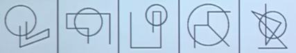
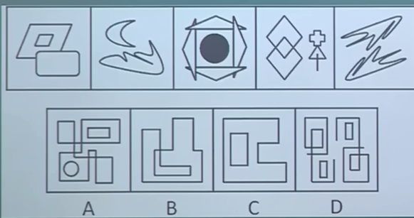
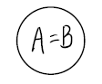
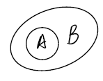
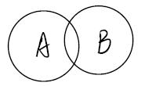
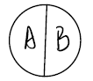
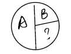

# 判断推理

## 逻辑推理

### 翻译推理

先翻译，再推理

肯前必肯后，否后必否前，否前与肯后得不出必然性结论，但是可以得出可能性。

A → B

A属于充分条件，B属于必要条件。充分条件特性有他就行，必要条件特性没他不行。

氧气与燃烧。有了氧气不一定有燃烧，没有氧气一定没有燃烧，所以氧气是燃烧没他不行的条件，所以氧气是燃烧的必要条件。

水涨与船高。水涨船高，有了水涨就会有船高，所以水涨是船高有他就行的条件，所以水涨是船高的充分条件。没有水涨也可以有船高，比如通过起重机。

#### 十个逻辑关联词

1. 如果A那么B	A → B
   - 如果考上公务员，那么一定通过了笔试。	公务员→笔试
2. 只要A就B A→B
   - 只要美就有人追 美→有人追
3. A离不开B A→B
   - 鱼离不开水 鱼→水
4. 为了A，一定要B A→B
   - 为了迎娶白富美，一定要帅。 迎娶白富美→帅
5. 只有A才B B→A
   - 只有骑白马的才是白马王子
6. 除非A否则不B B→A
   - 除非我爱你，否则我不会娶你 娶你→爱你
7. 除非A否则B 否B→A，否A→B
   - 除非你睡觉，否则我打你	不打你→睡觉	不睡觉→打你
8. 不A不B B→A
   - 不经历风雨，不会见到彩虹 彩虹→风雨
   - 不入虎穴，不得虎子
9. A是B必须的 B→A（保证，保障，必要条件，基础，前提。）
   - 爱情是婚姻的基础 婚姻→爱情。
10. A必须B A→B
    - 结果必须开花结果→开花

#### 且

A且B ：同时成立

- 物美价廉 物美且物廉
- 白富美 白且富且美
- 小张和小王都是好人 小张好人且小王好人
- 小张和小王都不是好人小张不是好人且小王不是好人
- 虽然你很好，但是你不适合我。你很好且你不适合我

A且B为真→A与B都真

A且B为假→A与B至少一假

全真才真，一假为假。

#### 或

A或B：至少有一个成立

- 中午火锅炒菜我至少吃一样 	中午吃火锅或者中午吃炒菜
- 小王和小张至少有一个是好人	小王好人或者小张好人
- 小王和小张至少有一个不是好人	小王不是好人或者小张不是好人	小王是坏人或者小张是坏人

丑→不漂亮，丑能推出不漂亮，不漂亮不能推出丑。

A或B为真→A与B至少一真

A或B为假→A与B都为假

一真为真，全假才假

要么A要么B ：二选一

#### 矛盾命题

1. A→B与 非A或者B 等价。
   - A→B的矛盾命题：A且非B（唯一），非A且B不是A→B的矛盾命题。
   - A且非B的矛盾命题为非A或者B
2. A→-A：-A恒成立。
   - 如果一个命题推出了他的矛盾命题，那么他的矛盾命题恒成立。
3. A或者B，非A或者C。得出结论B或者C。

### 论证

论点：题干所持有的观点 杭州很美丽

论据：支持论点成立的依据 杭州有西湖，西湖很美丽

可以支持与可以推出是否等同？

可以支持，只要能为论点的成立提供帮助就行。可以推出要保证结论百分之百的成立。

1. 看设问（支持，削弱，最不能支持，最不能削弱，除了哪一项最能支持，除了哪一项最不能支持，前提假设，支持论证。）
   - 单纯削弱，支持，一般只看论点，直接去做题，做不出来再找论据，削弱做不出来要找论据的概率偏高。
2. 再找论点。

最强的思维。

1.理论论据最强。

论点：坐在前排有利于学习成绩的提升。

A.很多坐在前排的同学，学习成绩有了很明显的提升。（事实论据的支持，可以支持但是不是最强的，没有其他更强的可以考虑选）

B.坐在前排的同学上课注意力会更集中，会有更多和老师交流的机会，所以学习效果会更好。（理论论据的支持，最强，可以直接选）

什么是理论论据？

覆盖论点的所有个体。解释内因。只要满足第一个就行。

论证二选一时，谁的范围越大谁的支持和削弱效果就更好。

常见错误：诉诸权威

名人名言：某权威专家说。。。。

例外：某权威专家根据实验数据得出结论…..

全世界顶尖的科学家都在研究芦荟的抗癌效果。

2.内容缺失。

论点：全班同学都爱学习

论据：男生爱学习

最能支持该结论

1. 班上漂亮的女生爱学习。（事实论据的支持）
2. 班上的女生爱学习。（支持，补上了全部缺少的内容，最强）
3. 班上只有男生
4. 男生能代表全班的整体水平
5. 男生占绝大多数

最强的削弱

1. 漂亮的女生不爱学习（事实论据的削弱，不是最强）
2. 女生不爱学习
3. 男生不能代表全班的整体水平
4. 男生只占很少的一部分

论点：他们不付费

论据：一定有人付费

前提假设，支持论证削弱论证。一定要看论据，正确答案一般都不是理论论据与事实论据，一般都是论据到论点的缺陷（比如内容缺失结构缺失，结构缺失偏多）

结构缺失

论据：A→B A→美

论点：A→C A→追

最强的支持：B→C 美的人都有很多人追。（没有B→C时也可以考虑C→B）

最强的削弱 B→否C 美的人花钱特别厉害，大家都不敢去追。

B与C无关

B→D（D代表题干未出现的一个新事物）频率最高

A导致B，与C无关。最强削弱：C导致A。

男：你脾气不还导致我们分手的，与我没钱没关系。

女：你没钱导致我脾气不好的。

老师：补习班导致没有快乐童年，与学校没关系。

方案建议

最强支持：按照建议去做有效果

二强支持：建议具有可实施性

最强削弱：按照建议去做没效果

二强削弱：建议不具有可实施性

削弱中的干扰性选项：提出了一个更好的建议。

a.保证对比之前样本属性一样

b.保证样本在实验期间影响实验结果的条件一样

c.补上对照组

### 智力推理

1.排除法（选项或者题干信息多，已知一些真实信息）
2.最大信息法
3.确定信息法
4.假设法
5.代入法
6.错位法

### 原因解释

因果关系
什么是因果关系？A→B与因果关系是否等同？
导致，有利于，提高，影响，降低。
水滴与石穿
因果关系的加强
1.理论论据
2.实验类（a.b.C）
3.排除他因
因果关系的削弱
最强：理论论据，实验类，因果倒置。
论点：坐在前排有利于学习成绩的提升。
=因为前排所以成绩提升。（前排这个事件在时间维度上一定先发生）
因果倒置的削弱：因为成绩提升，所以坐在前排。
因果倒置的削弱：老师只成绩好的学生坐在前排。
只有成绩好的学生才会坐到前排。（意思理解）（前排是后发生，所以百分之百不是原因）（颠倒了因果时间顺序的因果倒置）
前排→成绩好
二强：有因无果
三强：无因有果，另有他因
论点：因为炒股，所以有钱。
常见错误：诉诸公众
广大人民群众都认为他是一个好人。（可以支持，力度不是最强的，一般都是干扰性选项）

### 推断结论

## 图形推理

1. 位置类：组成一样
2. 形状类(样式类)：相似
3. 标记类(功能类)：共同的小图形（黑点，圆圈，箭头）
4. 属性类：杂乱无章。（对称：大部分，全部都是对称图案）
5. 数量类：杂乱无章
6. 空间类：立方体、四面体

位置类：组成一样
样式类：相似
功能类：共同的小图形（黑点，圆圈，箭头）
数量类：杂乱无章
属性类：杂乱无章。（对称：大部分，全部都是对称图案）

### 位置类

图形特征：组成一样

周期只考虑三种：等差，常数，周期

1. 平移（方向，步数）
2. 旋转（方向，角度）
3. 翻转
   - 鉴别翻转的方法：时针法，A-B-C

### 形状类(样式类)

图形特征：长得相似

1. 遍历（所有的样子都经历一遍，缺啥补啥）
2. 叠加（简单，颜色）（图形的轮廓一样，内部颜色不一样，考虑颜色叠加）
3. 去同存异
4. 去异求同
5. 求同（整体求同，相邻求同）
   - 整体求同指整体图形都有某一个共同图案。
   - 相邻求同指相邻的两个图案有一个共同图形。
6. 相似（最大的/最小的/外轮廓）
   - 有图案相似
7. 连接性
   - 相交，相离，相切，内含
   - 点连接：点直接相连，点间接相连
   - 线连接：线包含与线错位，一条线与两条线，曲线与直线，最长边与最短边

### 功能类(标记类)

1. 定位功能（点，线，角，面）
   - 内部、外部
   - 最长边、最短边
   - 交点
2. 两点连线
   - 是否能相连
   - 连成线的特殊性

### 属性类

1. 对称（数量，种类，方向，夹角，与某一条实线或者交点重合）
   - 两个图形的夹角
2. 曲直
3. 开闭（封闭、开放、半开放半封闭）
4. 凹凸。

### 数量类

图形特征：图形杂乱无章

1. 数什么？点、线、角、面、素（素：有几个分开的部分）
2. 数列规律有哪些：
   - 强：常数，等差，周期，等比
   - 弱：运算，对称，奇偶，乱序。

常见考点

1. 对称轴的条数 111 235 多条
2. 素（部分） 111 245 多个素
3. 笔画 111 356 多笔画
4. 面
5. 两个面组成的图
6. 相交，相离，点线连接
7. 对称轴的夹角
8. 线条数

<strong>点</strong>

交点：直与直的交点，曲与曲的交点，直与曲的交点，切点，面里面的交点，内部线条与外轮廓的交点。

端点：面外面的端点常常单独考。

<strong>线</strong>

直线与曲线

文字笔画

一笔画（奇点：由某个点引出的线为奇数点即是奇点端点也是奇点；一个独立图形的最少笔画数为奇点数除以2，奇点数为0或2即一笔画图形；奇点数不可能为奇数。）

平行线

<strong>角</strong>

直角，锐角，钝角

角不重复数

<strong>面</strong>

面的个数（相同面最多几个）

三角形可以重复数，也可以不重复数

面的种类（全直线面之三角形与四边形，全曲线面，有直有曲面）

面积

<strong>素</strong>

素的个数

素的种类

素的运算

素的替换

### 空间类

主要方法

1. 相对面法
   - 间隔一个。
   - "Z"字型两端。
   - 相对面技巧：不可能同时看到一组相对面，也不可能相对面中一个都看不到。
2. 坐标法
   - 移面技巧
     a.四个面，一条线，直接移。
     b.垂直面，旋转90移。

### 九宫格

1. 横看
2. 竖看
3. 米字型看
4. 整体看
5. O型看
6. S型看

#### 火柴棍的考法

1. 样式类
2. 火柴棍数量
3. 移一笔
4. 对称，头头相连，头尾相连

#### 黑白块

位置类，颜色叠加（黑白运算），数量类（黑块数量），对称，一笔画，部分数（黑白区域个数之和，之差），移一笔，点线连接。

样式类（去同存异，整体求同，相邻求同）

最多有几个黑块相连。

#### 汉字

强：素，面，对称，曲直，开闭，笔画

弱：样式（去同存异，整体求相同），横线竖线撇，结构

汉字+几何图形

素面对称曲直开闭笔画。

拼音：音节的字母个数，首字母在字母表种的排列顺序。

尾笔时针

#### 乱线

一般考：交点、面、笔画

#### 基本面+密集

面里的交点

#### 一笔画

简单图形，田字的变形，相切的，叠加的（正方形正方形，三角形三角形）

#### 挖空题

端点、交点

#### 没有思路

素、面、对称、曲直、开闭、笔画

## 定义判断

## 类比推理

| **名称**                                                     | **简称**                                                     | **[行政中心](https://baike.baidu.com/item/行政中心)** |
| ------------------------------------------------------------ | ------------------------------------------------------------ | ----------------------------------------------------- |
| [北京市](https://baike.baidu.com/item/北京市)                | [京](https://baike.baidu.com/item/京/15808773)               | [北京](https://baike.baidu.com/item/北京/128981)      |
| [天津市](https://baike.baidu.com/item/天津市)                | [津](https://baike.baidu.com/item/津/15842294)               | [天津](https://baike.baidu.com/item/天津/132308)      |
| [河北省](https://baike.baidu.com/item/河北省)                | [冀](https://baike.baidu.com/item/冀/10182710)               | [石家庄](https://baike.baidu.com/item/石家庄)         |
| [山西省](https://baike.baidu.com/item/山西省)                | [晋](https://baike.baidu.com/item/晋/9334717)                | [太原](https://baike.baidu.com/item/太原/24334)       |
| [内蒙古](https://baike.baidu.com/item/内蒙古/173741)[自治区](https://baike.baidu.com/item/自治区/987423) | 内蒙古                                                       | [呼和浩特](https://baike.baidu.com/item/呼和浩特)     |
| [辽宁省](https://baike.baidu.com/item/辽宁省)                | [辽](https://baike.baidu.com/item/辽/9050157)                | [沈阳](https://baike.baidu.com/item/沈阳)             |
| [吉林省](https://baike.baidu.com/item/吉林省)                | [吉](https://baike.baidu.com/item/吉/19742608)               | [长春](https://baike.baidu.com/item/长春)             |
| [黑龙江省](https://baike.baidu.com/item/黑龙江省)            | [黑](https://baike.baidu.com/item/黑/4550329)                | [哈尔滨](https://baike.baidu.com/item/哈尔滨)         |
| [上海市](https://baike.baidu.com/item/上海市)                | [沪](https://baike.baidu.com/item/沪/9185857)                | [上海](https://baike.baidu.com/item/上海/114606)      |
| [江苏省](https://baike.baidu.com/item/江苏省)                | [苏](https://baike.baidu.com/item/苏/15844447)               | [南京](https://baike.baidu.com/item/南京)             |
| [浙江省](https://baike.baidu.com/item/浙江省)                | [浙](https://baike.baidu.com/item/浙/15838620)               | [杭州](https://baike.baidu.com/item/杭州)             |
| [安徽省](https://baike.baidu.com/item/安徽省)                | [皖](https://baike.baidu.com/item/皖/15838445)               | [合肥](https://baike.baidu.com/item/合肥)             |
| [福建省](https://baike.baidu.com/item/福建省)                | [闽](https://baike.baidu.com/item/闽/66475)                  | [福州](https://baike.baidu.com/item/福州/165311)      |
| [江西省](https://baike.baidu.com/item/江西省)                | [赣](https://baike.baidu.com/item/赣/9830904)                | [南昌](https://baike.baidu.com/item/南昌)             |
| [山东省](https://baike.baidu.com/item/山东省)                | [鲁](https://baike.baidu.com/item/鲁/10183319)               | [济南](https://baike.baidu.com/item/济南)             |
| [河南省](https://baike.baidu.com/item/河南省/59474)          | [豫](https://baike.baidu.com/item/豫/10183590)               | [郑州](https://baike.baidu.com/item/郑州)             |
| [湖北省](https://baike.baidu.com/item/湖北省)                | [鄂](https://baike.baidu.com/item/鄂/12643257)               | [武汉](https://baike.baidu.com/item/武汉)             |
| [湖南省](https://baike.baidu.com/item/湖南省)                | [湘](https://baike.baidu.com/item/湘/85178)                  | [长沙](https://baike.baidu.com/item/长沙)             |
| [广东省](https://baike.baidu.com/item/广东省)                | [粤](https://baike.baidu.com/item/粤/9830969)                | [广州](https://baike.baidu.com/item/广州/72101)       |
| [广西壮族自治区](https://baike.baidu.com/item/广西壮族自治区) | [桂](https://baike.baidu.com/item/桂/9445096)                | [南宁](https://baike.baidu.com/item/南宁/156452)      |
| [海南省](https://baike.baidu.com/item/海南省)                | [琼](https://baike.baidu.com/item/琼/15840304)               | [海口](https://baike.baidu.com/item/海口)             |
| [四川省](https://baike.baidu.com/item/四川省)                | [川](https://baike.baidu.com/item/川)或[蜀](https://baike.baidu.com/item/蜀) | [成都](https://baike.baidu.com/item/成都)             |
| [贵州省](https://baike.baidu.com/item/贵州省)                | [贵](https://baike.baidu.com/item/贵/7389903)或[黔](https://baike.baidu.com/item/黔/15838639) | [贵阳](https://baike.baidu.com/item/贵阳)             |
| [云南省](https://baike.baidu.com/item/云南省)                | [云](https://baike.baidu.com/item/云/541818)或[滇](https://baike.baidu.com/item/滇/13882453) | [昆明](https://baike.baidu.com/item/昆明)             |
| [重庆市](https://baike.baidu.com/item/重庆市)                | [渝](https://baike.baidu.com/item/渝/15841585)               | [重庆](https://baike.baidu.com/item/重庆/23586)       |
| [西藏自治区](https://baike.baidu.com/item/西藏自治区)        | [藏](https://baike.baidu.com/item/藏/6370196)                | [拉萨](https://baike.baidu.com/item/拉萨)             |
| [陕西省](https://baike.baidu.com/item/陕西省)                | [陕](https://baike.baidu.com/item/陕/15840536)或[秦](https://baike.baidu.com/item/秦/2681948) | [西安](https://baike.baidu.com/item/西安)             |
| [甘肃省](https://baike.baidu.com/item/甘肃省)                | [甘](https://baike.baidu.com/item/甘/18595645)或[陇](https://baike.baidu.com/item/陇/15838918) | [兰州](https://baike.baidu.com/item/兰州)             |
| [青海省](https://baike.baidu.com/item/青海省)                | [青](https://baike.baidu.com/item/青/6923)                   | [西宁](https://baike.baidu.com/item/西宁)             |
| [宁夏回族自治区](https://baike.baidu.com/item/宁夏回族自治区) | [宁](https://baike.baidu.com/item/宁/19523352)               | [银川](https://baike.baidu.com/item/银川)             |
| [新疆维吾尔自治区](https://baike.baidu.com/item/新疆维吾尔自治区) | [新](https://baike.baidu.com/item/新/34058)                  | [乌鲁木齐](https://baike.baidu.com/item/乌鲁木齐)     |
| [香港](https://baike.baidu.com/item/香港/128775)[特别行政区](https://baike.baidu.com/item/特别行政区/2411153) | [港](https://baike.baidu.com/item/港)                        | [香港](https://baike.baidu.com/item/香港/128775)      |
| [澳门](https://baike.baidu.com/item/澳门/24335)[特别行政区](https://baike.baidu.com/item/特别行政区/2411153) | [澳](https://baike.baidu.com/item/澳)                        | [澳门](https://baike.baidu.com/item/澳门/24335)       |
| [台湾省](https://baike.baidu.com/item/台湾省)                | [台](https://baike.baidu.com/item/台/9906418)                | [台北](https://baike.baidu.com/item/台北)             |

### 外延关系

1. 全同关系	
   - 两个概念所指代的范围完全一样，可以用`A就是B`与`B就是A`去验证。
   - 
2. 属种关系   （干扰性选项为组成关系）
   - 指一个概念是另一个概念的子类。可以用`A是B`与`有的B是A`去验证。
   - 
3. 交叉关系   
   - 指两个概念的范围有一定的重合。可以用`有的A是B`，`有的A不是B`，`有的B不是A去`验证。
   - 
4. 矛盾关系
   - 一个事件的所有可能性只有两种情况，那这两种情况就是矛盾关系。可以用`非此即彼`去验证。
   - 
5. 反对关系 
   - 一个事件的所有可能性除了这两种情况之外还有第三种情况，那这两种情况就是反对关系。可以用`还有第三种情况`去验证。
   - 

### 内涵关系

1. 充分与必要			（入股与分红）
   - 充分条件特性有他就行，必要条件特性没他不行。
2. 对应与组成
   - 对应关系主要分为职业对应，功能对应，目的对应，常识对应。
   - 组成关系指一个概念是另一个概念身体上的一部分。
3. 属性关系（必然与或然）
   - 必然属性指一定会有的属性，或然属性指可能会有的属性。

### 言语关系

1. 动词，名词，形容词
   - 规律弱，一般不用于直接选答案，一般只用于二级辨析
   - 常见用于二级辨析的还有人工与天然，生物与非生物，可食用与不可食用。
2. 褒义词与贬义词（同上）
3. 主谓，动宾，主宾     庄稼与耕种，鸟与鸣叫
   - 主谓指主体与动词，动宾指动词与宾语
4. 近义词与反义词
   - 神机妙算与诡计多端
   - 国色天香与貌美如花，自信与自大
5. 因果关系      （水滴石穿）
   - 能用导致，有利于，使，影响，降低等词语造句子即可。
6. 象征关系
   - 蛇孵：自不量力的人
   - 春蚕：奉献的人
   - 烽烟：战争
   - 汗青：史册
   - 總貅：财富
   - 红豆：相思
   - 黄发：老人
   - 垂昏：小孩
   - 蝙蝠：福气
   - 麒麟：祥瑞
   - 仙鹤，乌龟，松树：长寿
   - 荆棘：困难
   - 南冠：囚犯
   - 丝竹：音乐
   - 三尺：法律
   - 浮屠：佛塔
   - 袍泽：战友
7. 先后顺序，不同主体(招聘，应聘，上岗）
   - 先后顺序指事情出现的时间先后顺序，也叫顺承关系。
   - 做题先考虑先后顺序，答案唯一直接选，不唯一再通过不同主体进行二级辨析。

# 资料分析

## 量和率

基期：统计中作为参照标准的时期。描述基期的具体数值叫作基期量。

现期：是相对于基期而言的。是与基期相比较的后一时期。描述现期的具体数值叫作现期量。
$$
增长率=\frac{现期量-基期量}{基期量}=\frac{现期量}{基期量}-1=\frac{增长量}{基期量}
$$

$$
a=\frac{A-B}{B}=\frac{A}{B}-1=\frac{\Delta A}{B}
$$

A：表示现期量		 B：表示基期量 				a：表示现期增长率 			△A：表示增长量

`图表题: 划 标题，起止时间，单位`

`文字题: 划 年份，其中，截至，数据显示`

`判定考点：时间，单位，选项差距`

基期量（有单位）
$$
B=\frac{A}{1+a}=A-\Delta A
$$
A：表示现期量		 B：表示基期量 				a：表示现期增长率 			△A：表示增长量

估算公式，较为精确
$$
B=\frac{A}{1+a}\approx A-A\cdot a\\B=\frac{A}{1-a}\approx A+A\cdot a
$$
增长量
$$
\Delta A=A-B=B\cdot a=\frac{A}{1+a}\times a
$$
隔期基期量

| 2010 | 2009 | 2008 |
| ---- | ---- | ---- |
| A    | B    | G    |

B->A 	a

G->B	 b

G->A	 g
$$
G\approx \frac{A}{1+a+b}
$$
G代表隔期基期量 A代表现期量		a代表现期增长率		b代表基期增长率

百分数；表示一个数是另一个数的百分之几的数，也叫百分率或百分比。表现为x%

百分点：指不含百分号的百分数。表现为x个百分点。

+回落、下降、减少、收紧、收窄放缓x个百分点→加法

-加快、上升、提高、增长、放宽x个百分点→减法

隔期增长率与隔期倍数
$$
g=a+b+ab\\隔期倍数=1+g
$$
g代表隔期增长率			a代表现期增长率 			b代表基期增长率

倍数：指两个量之间的比例关系。如：M除以N等于X，即M是N的X倍。

隔期倍数：指现期量与隔期量之间的比例关系。

预期量

预期：指现期之后的某一时期。

描述预期的具体数值叫作预期量。用字母X表示。
$$
X=A\times (1+a)=\frac{A^2}{B}
$$

## 比值

现期比值
$$
\frac{M}{N}
$$
现期比重、倍数、平均数

现期比重：M表示现期部分量；N表示现期整体量

现期倍数：如："男生是女生的多少"，M表示男生；N表示女生；

现期平均数：如："平均每人捐多少钱"，M表示钱；N表示人数；

基期比值
$$
\frac{M}{N}\times \frac{1+n}{1+m}
$$
基期比重、倍数、平均数 

基期比重：M：表示现期部分值；N：表示现期整体值；m：表示部分增长率；n：表示整体增长率

基期倍数：如："男生是女生的多少倍"，M表示男生；N表示女生；m男生增长率；n女生增长率

基期平均数：如："平均每人捐多少钱"，M表示钱；N表示人数；m钱的增长率；n人数的增长率

当m > n时，现期比重>基期比重，现期较基期上升。

当m < n时，现期比重<基期比重，现期较基期下降。

另外，部分增长率>整体增长率，现期较基期上升。

兩期比重差值

两期比重差值：现期比重与基期比重的差值。即现期比重-基期比重
$$
\frac{M}{N}\times \frac{m-n}{1+m}
$$
平均数的增长率
$$
\frac{现期平均数}{基期平均数}-1；r=\frac{m-n}{1+n}
$$
指现期平均数相对于基期平均数的增长率

3个判定必须同时满足

1. 题中有 平均，户均，亩产，单位产量，单位面积
2. 题中有 同比，与上年相比
3. 选项单位必须是%

## 基期现期关系

## 概念类

盐水原理：指两个部分混合成一个整体，整体的增长率介于两个部分增长率之间。

结论

1. a，b、r满足，r介于a，b之间。
2. r介于a，b之间，但是偏向基期量大的一方。

判定条件

1. 题中有进口，出口，进出口
2. 1-X月
3. 房地产，房+地=房地产
4. 中央+地方=全国
5. 男+女=整体
6. 城镇+农村=全国

年平均增长量

年平均增长：反映在一段时间内某指标平均每年的增长情况
$$
年平均增长量=\frac{末期量-初期量}{年分差}=\frac{A-B}{m}
$$

$$
\overline{r}=\sqrt[年分差]{\frac{末期量}{初期量}}-1；\sqrt[m]{\frac{A}{B}}-1
$$

$$
\overline{r}=\frac{\frac{末期量}{初期量}-1}{年分差}；\frac{\frac{A}{B}-1}{m}(\overline{r}<10\%时使用)
$$

$$
\overline{r}=\frac{r_1+r_2+\dots +r_n}{年份数}；\frac{r_1+r_2+\dots +r_n}{n}
$$

拉动增长率与贡献率

拉动增长率：指总体中某部分的增长量带动总体增长的百分比。

贡献率：指总体中某部分的增长量占总体增长量的比值。
$$
拉动增长率=\frac{部分增长量}{总体基期量}=\frac{\Delta A}{B}
$$

$$
贡献率=\frac{部分增长量}{总体增长量}=\frac{\Delta A_{部分}}{\Delta A_{整体}}
$$

