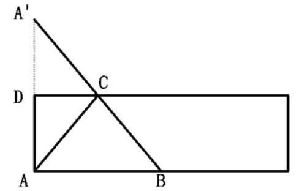

# 题目

1、Z国女排参加世界锦标赛，本次锦标赛共12支国家队，并采用单循环赛制，每场比赛为五局三胜制。每赢得一场比赛可获得3个积分，但各场次比赛中每输一局则要扣0.5分。最终Z国女排以全胜的战绩获得冠军，问Z国女排夺冠的可能积分中，最低积分与第五高积分的差是多少分？
$$
\begin{matrix}
A. 5 &&&&&&&
B. 7.5&&&&&&&
C. 9&&&&&&&
D.11.5&&&&&&&
\end{matrix}
$$
2、"斐波那契一卢卡斯数列"为1、3、4、7、11、18... 该数列前两项相加可得到第三项。现在小明将此数列写到了第2020个，在这些数字中，3的倍数有多少个？
$$
\begin{matrix}
A. 500&&&&&&&
B. 501&&&&&&&
C. 504&&&&&&&
D.505&&&&&&&
\end{matrix}
$$
3、某村居民整体进行搬迁移民，现安排载客（不含司机）20人/辆的中巴车和30人/辆的大巴车运载所有村民到搬迁地实地考察。如安排12辆中巴车，则大巴车需要18辆，且除一辆大巴车载6人以外，其他车全部载满。现本着安排车辆数最少的原则派车，问最少要安排多少辆大巴车？
$$
\begin{matrix}
A.20&&&&&&&
B.22&&&&&&&
C.24&&&&&&&
D.26&&&&&&&
\end{matrix}
$$
4、某企业选拔170多名优秀人才平均分配为7组参加培训。在选拔出的人才中，党员人数比非党员多3倍，接受培训的党员中的10%在培训结束后被随机派往甲单位等12个基层单位进一步锻炼。已知每个基层单位至少分配1人，问甲单位分配人数多于1的概率在以下哪个范围内？
$$
\begin{matrix}
A.不到14\%&&&&&
B.14\%-17\%之间&&&&&
C.17\%-20\%之间&&&&&
D.超过20\%&&&&&
\end{matrix}
$$
5、小王和小李沿着绿道往返运动，绿道总长度为3公里。小王每小时走2公里；小李每小时跑4公里。如果两人同时从绿道的一端出发，则当两人第7次相遇时，距离出发点多少公里。
$$
\begin{matrix}
A.0&&&&&&&
B.1&&&&&&&
C.1.5&&&&&&&
D.2&&&&&&&
\end{matrix}
$$
6、某次圆桌会议共设8个座位，有4个部门参加，每个部门2人，排座位时，要求同一部门的两人相邻，若小李和小王代表不同部门参加会议，则他们座位相邻的概率是多少？
$$
\begin{matrix}
A.\frac{1}{48}&&&&&&&
B.\frac{1}{24}&&&&&&&
C.\frac{1}{12}&&&&&&&
D.\frac{1}{6}&&&&&&&
\end{matrix}
$$
7、一个不计厚度的圆柱型无盖透明塑料桶，桶高2.5分米，底周长为24分米，AB为底面直径。在塑料桶内壁桶底的B处有一只蚊子，此时，一只壁虎正好在塑料桶外壁的A处，则壁虎从外壁A处爬到内壁B处吃到蚊子所爬过的最短路径长约为多少？

$$
\begin{matrix}
A.10分米&&&&&&&
B.12.25分米&&&&&&&
C.12.64分米&&&&&&&
D.13分米&&&&&&&
\end{matrix}
$$
8、某高校组织了篮球比赛。其中机械学院队、外语学院队、材料学院队和管理学院队被分在同一个小组，每两队之间进行一场比赛且无平局。结果机械学院队赢了管理院队，且机械学院队、外语学院队和材料学院队胜利的场数相同，则管理学院队胜了多少场？
$$
\begin{matrix}
A.3&&&&&&&
B.2&&&&&&&
C.1&&&&&&&
D.0&&&&&&&
\end{matrix}
$$
9、一条圆形跑道长500米，甲、乙两人从不同起点同时出发，均沿顺时针方向匀速跑步。已知甲跑了600米后第一次追上乙，此后甲加速20%继续前进，又跑了1200米后第二次追上乙。问甲出发后多少米第一次到达乙的出发点？
$$
\begin{matrix}
A.150&&&&&&&
B.180&&&&&&&
C.100&&&&&&&
D.120&&&&&&&
\end{matrix}
$$
10、某省选派若干名本科生和研究生去乡村支教，其中男生和女生的比例是7：3，研究生和本科生的比例是1：4，若男本科生的人数恰好为女研究生人数的4倍，则女本科生至少比男研究生多多少？
$$
\begin{matrix}
A.3人&&&&&&&
B.6人&&&&&&&
C.9人&&&&&&&
D.12人&&&&&&&
\end{matrix}
$$
11、一人爬有20个阶梯的楼梯，假定每次向上爬5个阶梯，又向下走3个阶梯。问该人需几次能爬到楼梯的顶部？
$$
\begin{matrix}
A.7&&&&&&&
B.8&&&&&&&
C.9&&&&&&&
D.10&&&&&&&
\end{matrix}
$$
12、有一个四位数，已知其个位数字加1等于其十位数字，十位数字加2等于其百位数字，把这个四位数颠倒次序排列所成的数与原数之和等于11110问这个四位数除以4的余数是几？
$$
\begin{matrix}
A.0&&&&&&&
B.1&&&&&&&
C.2&&&&&&&
D.3&&&&&&&
\end{matrix}
$$
13、某公司举办迎新晚会，参加者每人都领取一个按入场顺序编号的号牌，晚会结束时宣布：从1号开始向后每隔6个号的号码可获得纪念品A，从最后一个号码开始向前每隔8个号的号码可获得纪念品B。最后发现没有人同时获得纪念品A和B，则参加迎新晚会的人数最多有多少？
$$
\begin{matrix}
A.46人&&&&&&&
B.48人&&&&&&&
C.52人&&&&&&&
D.54人&&&&&&&
\end{matrix}
$$

# 答案

**1、【参考答案】C**

【解题思路】

本题考查等差数列问题。

第一步：审阅题干。题干出现“最低”、“第五”可确定为基础计算中的等差数列问题。

第二步：采用单循环制的比赛，则Z国女排最终参加了11场比赛，若11场比赛都以3∶0获胜，则最终积分为$11×3=33$分；若11场比赛每场比赛都以3∶2获胜，则最终积分为$33-11×2×0.5=22$分，又因每输一局扣0.5分，所以，所有可能的积分组成等差数列，其中，首项$a_1=33$，尾项$a_n=22$，公差$d=-0.5$，可求得$a_5=33+(5-1)×（-0.5）=31$。即第五高积分为31分。31-22=9。

故本题选C。

 **2、【参考答案】D**

【解题思路】

本题考查余数问题与周期问题的杂糅。

第一步：审阅题干。本题可通过简单枚举辅助理解题目并求解。

第二步：根据题意，且由同余定理可得，余数的和等于和的余数，所以此数列除以3的余数为1、0、1、1、2、0、2、2、1、0……，即每8个数呈周期循环规律，且含有两个3的倍数。综上所述，2020 / 8 = 252，则3的倍数的数字有252×2+1=505个。

故本题选D。

 **3、【参考答案】C**

本题考查思维统筹问题。
第一步：审阅题干。以车辆数最少为前提，求大巴车最少的情况，需分析各种情况。
第二步：根据题意可知，该村共有12x20+18x30-（30-6）=756人进行搬迁移民，要使安排的车辆数最少，则优先安排大巴车。756/30=25....6，排大巴车26辆，或25辆大巴车、1辆中巴车，或24辆大巴车、2辆中巴车，或23辆大巴车、4辆中巴车..发现最少安排26辆车，其中最少安排24辆大巴车。
故本题选C。

 **4、【参考答案】B**

本题考查基础概率问题。
第一步：审阅题干。171~179中7的整数倍只有175，则党员有$175\div5\times4=140$人，随机派往基层单位锻炼的党员有$140\times10\%=14$人。每个人都是随机分配，则甲单位分配人数多于1的概率等于甲单位分配人数多于1的情况数除以总情况数。
第二步：甲单位分配人数多于1的概率为$\frac{1+C_{11}^1}{C_{12}^2+C_{12}^1}=\frac{2}{13}\approx15.4\% $，即在14%~17%之间。
故本题选B。

5、解析
本题考查非规律型多次相遇追及。
第一步：审阅题干。已知两人第n次相遇时所走路程和为2nS=（v1+v2）t。

第二步：当两人第7次相遇时，有2x7x3=（2+4）t，解得t=7。此时，小王走了2x7=14公里，距离出发点14-3x2x2=2公里。
故本题选D。

6、本题考查基础概率问题。
与小李相邻的座位有2个，其中1个坐的是与小李同部门的人，另一个位置可能是其他6人中的任意一人，且概率相等，则其恰好为小王的概率为1/6。
故本题选D。

7、本题考查立体几何问题。
第一步：审阅题干。要求从A到B的最短路径，有两种方式：①FA点沿着垂直于底面的外壁爬入桶内，由于不计厚度，因此壁虎依然在桶内A点，再沿底面直径AB从A点爬到B点即可；②延长线段AD，使AD=A‘D，如下图，壁虎爬行路径为A-C-B。

第二步：方式0：壁虎爬行的距离为$2.5x2+\frac{24}{\pi}\approx12.64$分米；方式②：壁虎爬行的距离为AC+BC，而AD=A'D，那么AC+BC=A'C+BC=A'B，根据勾股定理可得$A'B=\sqrt{(2.5\times2)^2+(\frac{24}{2})^2}=13$分米。综上，壁虎从外壁A处爬到内壁B处吃到蚊子所爬过的最短路径长为12.64分米。
故本题选C。

8、本题考查比赛问题。
第一步：审阅题干。无平局即总胜利场数等于总比赛场数，机械学院队赢了管理学院队，而机械学院队、外语学院队和材料学院队胜利的场数相同，则管理学院队胜利场数最少。
第二步：4个学院每两队之间进行一场比赛共需要进行$C_4^2=6$场比赛，则机械学院队、外语学院队和材料学院队胜利的场数均为2场，管理学院队胜0场（其他队不可能只胜1场，否则管理学院队胜3场，不符合管理学院队胜利场数最少）。
故本题选D。

9、本题考查非规律型多次相遇追及问题。
第一步：审阅题干。本题已知距离求解距离，其余量均未知，故可通过比例求解。
第二步：根据题意，追及距离等于环形跑道长度，则从甲第一次追上乙到第二次追上乙，乙跑了1200-500=700米，则甲加速后甲、乙的速度之比为12：7。甲加速前二者的速度比为10：7，则第一次追及时甲跑了600米，乙跑了600/10x7=420米，因此甲出发后600-420=180米第一次到达乙的出发点。
故本题选B。

10、本题考查倍数。
第一步：审阅题干。人数一定为整数，根据题意可知总人数为10的倍数，可设总人数为10x第二步：男生人数为7x，女生人数为3x，研究生人数为2x，本科生人数为8x。设女研究生人数为y，男本科生人数为4y。
根据男研究生人数一定，有2x-y=7x-4y，化简得3y=5x，则y至少为5，x至少为3。因此女本科生人数至少为3x-y=3x3-5=4人，男研究生人数至少为$7x-4y=7x3-4x5=1$人，前者比后者多4-1=3人故本题选A。

11、本题考查正负效率交替合作问题的变形。

根据题意可知，每次上升2个阶梯，进行7次时，上升了14个阶梯；进行第8次时，先上升到19个阶梯，再下降到第19-3-16个阶梯，还未到达顶部；第9次时，从第16个阶梯上升5个，可到达顶部，此时不需要再向下走。因此需要9次。
故本题选C。

12、本题考查多位数。
第一步：审阅题干。已知这个四位数颠倒次序排列所成的数与原数之和等于11110，那么该数的千位数字+个位数字=10。
第二步：设该数的个位数字为x，则其十位数字为x+1，百位数字为x+3，千位数字为10-x。根据题意有1+（x+3）+（x+1）=11，解得x=3。因此该四位数为7643，7643/4=1900...3.
故本题选D。

13、本题考查约数。
第一步：审阅题干。根据题意可知A获奖号码成公差为7的等差数列；B获奖号码成公差为-9的等差数列。所求为最多的人数，可从最大选项依次代入排除。
第二步：获得纪念品A的号码有1、8、15、22、
29.36，43，50，57..
选项依次代入验证：
D项代入：获得纪念品B的号码有54、45、36....
号码36同时获得纪念品A、B，排除。
C项代入：获得纪念品B的号码有52、43...号码43同时获得纪念品A、B，排除。
B项代入：获得纪念品B的号码有48、39、30、21、12、3，无人同时获得纪念品A，B，当选。
故本题选B。