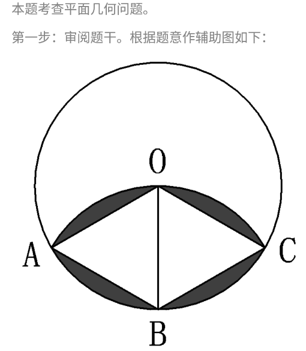
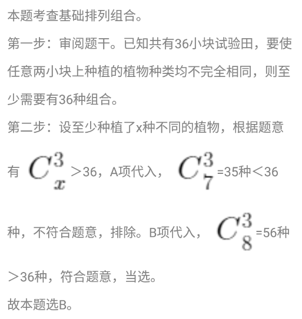

# 题目

## 模考

### 9月8日

4.一个长方体实心零件，长、宽、高分别为12厘米、8厘米和4厘米，如将其最大面朝下放在另一个长方体水槽中，零件将被完全淹没，且水面上升3厘米。问零件最大面的面积比水槽底面积小多少平方厘米？

A.32

B.64

C.96

D.128

6.小明写下一个等差数列，小飞写下一个等比数列，老师发现两个数列都是整数列，都不是常数列，它们的首项一样，第二项也一样，但是等比数列第三项减去等差数列的第三项恰好是等差数列的公差，那么等比数列的公比是多少？

A.1

B.2

C.3

D.4

7.某学校举行年级排球比赛，共有8个班参加，每两个班之间需要比两场，其中赢一场得3分，输一场得-1分，平局不得分，那么在该比赛中获得第一名的班级最多比第二名的班级多多少分？

A.44

B.20

C.25

D.10

8.甲、乙两船分别从上游和下游同时出发，甲顺流而下，乙逆流而上，相遇时甲、乙走过的路程之比为3：1，两船相遇后各自立即掉头沿原路返回，甲、乙各自返回到出发点所用时间之比为5：10设船速和水流速度均不变，则甲船速度与乙船速度的比值是（）。

A.$\frac{7}{5}$

B.$\frac{8}{5}$​

C.$\frac{9}{7}$​

D.$\frac{9}{8}$​

10.对某单位的100名员工进行调查，结果发现他们喜欢看球賽、电影和戏剧。其中58人喜欢看球赛，38人喜欢看戏剧，52人喜欢看电影，既喜欢看球賽又喜欢看戏剧的有18人，既喜欢看电影又喜欢看戏剧的有16人，三种都喜欢看的有12人。则只喜欢看电影的有（）。

A.22人

B.28人

C.30人

D.36人

18.某公司新近录用五名应聘人员，将分别安排到产品开发、管理、销售和售后服务这四个部门工作，每个部门至少一人。若其中有两人只能从事销售或售后服务两个部门的工作，其余三人均能从事四个部门的工作，则不同的选择方案有（）。

A.12种

B.18种

C.36种

D.48种

19.小张每周一、周三、周五和周日各写1篇日记，其余时间不写日记，从不间断。某年第三季度，他写的日记数量与第四季度相同，问当年劳动节是周几？（）

A.周一

B.周二

C.周三

D.周四

20.某次考试每名考生的成绩都不一样，已知张的名次比李高10名，且成绩比张好的人比成绩比李差的人少10人，王比张、李的成绩都好，且比王成绩好的人比成绩位于王、李之间的人多。问这次考试最少有多少人参加？（）

A.42

B.43

C.44

D.45

23.某研究团队发现，每种类型的细胞都有一个独特的复制时序程序，而且患病的细胞在该程序中有明显的变化。他们研究了复制时序程序的变化如何影响DNA及其调控分子（统称为表观基因组）的折叠，他们发现一种名为Rif的蛋白质有助于调节DNA的复制。在去除Rif蛋白质后，复制程序严重受损，此时不同细胞中的所有染色体片段会在不同的时间进行复制。在没有Rin蛋白质的情况下，如果阻止细胞复制DNA，它们的表观基因组会维持正常。然而，一旦DNA开始复制，与DNA相关的调控分子就被错误地结合，并随着每一轮DNA复制而恶化。最终，染色体的三维折叠也发生了改变。该研究团队认为不当的DNA复制时序会对人体健康产生很大影响。
以下哪项如果为真，最能支持上述论点？（）

A.当表观基因组由于复制时序程序的改变而被破坏时，细胞可能无法执行其正常功能，或执行一些不适当的功能

B.最新实验证实了复制时序程序的特定改变，在统计学上与儿童白血病以及早衰等疾病的不良预后有关

C.复制时序程序为人们识别疾病状态提供了一种全新的分子途径和生物标记，帮助患者更早地诊断和更准确地预后

D.细胞不只复制DNA，还会复制所有读取DNA的调控分子

31.把下面的图形分为两类，使每一类图形具有共同的特征，分类最恰当的一组是（）。

A.①③⑤，②④⑥

B.①②⑥，③④⑤

C.①②④，③⑤⑥

D.①④⑤，②③⑥

32.把下面的六个图形分为两类，使每一类图形都有各自的共同特征或规律，分类正确的一项是（）。

A.①⑤⑥，②③④

B.①③④，②⑤⑥

C.①②⑥，③④⑤

D.①②④，③⑤⑥

34.从所给的四个选项中，选择最合适的一项填入问号处，使之呈现一定的规律性。

### 9月15日

1.公司要购买电脑桌和电脑椅各200个，甲单位的报价为电脑桌每个240元且买五送一，电脑椅每个100元，乙单位的报价为电脑桌每个220元，电脑椅每个120元且买四送一。如果公司要在这两家单位购买这些物品，至少要花（）元。

A.52560

B.52640

C.59240

D.63200

3.甲、乙两车同时从A、B两地出发相向而行，两车在距离B地60千米处第一次相遇。相遇后两车仍以原速度继续行驶，并且在到达对方出发点后，立即沿原路返回。途中两车在距离第一次相遇点80千米处第二次相遇。问：第二次相遇点距离A地多少千米？

A.20

B.30

C.40

D.50

6.如图，正方形的迷你轨道边长为1米，1号电子机器人从点A以1米/秒的速度顺时针绕轨道移动，2号电子机器人从点A以3米/秒的速度逆时针绕轨道移动，则它们的第2017次相遇在（）。

A.点D

B.点C

C.点B

D.点A

15.某品牌家用血糖仪说明书上表示，该血糖仪测量误差在20%以内属于正常情况。老王用该血糖仪测空腹血糖为5.2，但是医院测量数据为4.5。假设该血糖仪的误差一直保持同一数值，那么老王用该血糖仪测餐后血糖为8.7，则其实际餐后血糖最接近

A.7.2

B.7.5

C.7.8

D.8.0

16.两人在环形跑道上匀速跑步，同向跑每3分钟相遇一次，相向跑每1分钟相遇一次。若速度较快者每因用时1.5分钟，则速度较慢者每圈用时是

A.3分钟

B.4分钟

C.5分钟

D.2分钟

18.某省筹备国庆，园林部门决定利用现有的3490盆甲种花卉和2950盆乙种花卉搭配A、B两种园艺造型共50个摆放在迎宾大道两侧。已知搭配一个A种造型需要甲种花卉80盆，乙种花卉40盆；搭配一个B种造型需要甲种花卉50盆，乙种花卉90盆，则搭配方案共有（）。

A.3种

B.4种

C.5种

D.6种

19.某市在工作日对本地机动车实行尾号限行，规则为：周-限行"1"g"，周二限行"2"8"，周三限行"3"7"，周四限行"4"6"，周五限行"5"0"。已知某年7月份尾号"1"g"""5"0"的限行天数一样多，则该年的7月1日是（）。

A.周六

B.周日

C.周一

D.周二

21.人们常说，最佳的减肥方式是"管住嘴迈开腿"，但由于工作紧张，生活节奏加快或是缺少持之以恒的毅力等诸多原因，很多体重超标及肥胖的人士很难做到用正确的方式保持良好的身材，更多的人选择剑走偏锋--"饿瘦"，他们认为“胃越饿越小，越撑越大”。
下列哪项如果为真，最能质疑上述看法？（）

A.胃组织是由粘膜层、黏膜下层、固有肌层和浆膜层组成，具有一定的弹性和韧性，因此胃的体积能够自由伸缩

B.刻意节食并不会达到减肥的目的，还可能产生厌食症等疾病，造成不良后果，甚至断送生命

C.饥饿感和饱腹感都是由大脑发出的信号，胃只是作为接收器

D.胃不管是“胀大”还是“缩小”，胃体积的变化是有一定范围的

23.弓形虫是一种常见于猫身上的寄生虫。此前的研究认为，弓形虫会针对性地使小鼠不再害怕猫科动物，从而更容易被后者吃掉，帮助弓形虫通过猫粪传播。而据一项发表于《细胞报告》上的新研究，弓形虫并非特异性地减轻被感染小鼠对猫的恐惧，而是普遍降低它们的焦虑和对风险的感知。下列哪项如果为真，最有助于加强上述结论？

A.弓形虫可能会破坏老鼠大脑的嗅觉区，防止鼠类闻到猫的气味会引发恐惧感

B.弓形虫侵入小鼠体内后，会造成短时间的感染，并且会在小鼠大脑中产生囊肿

C.弓形虫在全球各地都能找到，并且已经感染了许多哺乳动物，包括人类

D.被感染小鼠对猫和非天敌动物气味的好奇心并无明显差异，但都大于未感染小鼠

30.学科对于（）相当于星座对于（）

A.专业——宇宙

B.数学——银河

C.知识——星空

D.积淀——光年

31.把下面的六个图形分为两类，使每一类图形都有各自的共同特征或规律，分类正确的一项是（）。

A.①②⑥，③④⑤

B.①③⑤，②④⑥

C.①③④，②⑤⑥

D.①④⑥，②③⑤

33.从所给的四个选项中，选择最合适的一项填入问号处，使之呈现一定的规律性。

34.从所给四个选项中，选择最适合的一个填入问号处，使之呈现一定的规律性。

35.从所给的四个选项中，选择最合适的一个填入问号处，使之呈现一定的规律性。

### 第5次

3、甲、乙、丙从长360米的圆形跑道上的不同点同时出发，沿顺时针方向匀速跑步。3分钟后甲追上乙，又过1分30秒后丙也追上乙，又过3分30秒后丙追上甲，又过5分30秒后丙第二次追上乙。问出发时甲在乙身后多少米？

A.48

B.84

C.108

D.144

4、一块长方形土地ABCD中绘有3条会侧线如图所示。已知AE和CF垂直于对角线BD，AE、EF分别长8米和12米。问整块土地的面积为多少平方米？（）

A.96

B.156

C.160

D.240

8、公用电话亭中有两部电话，六个人排队打电话。打完即走，他们的通话时间分别为3分钟、5分钟、4分钟、13分钟、7分钟、8分钟，则大家在此公用电话亭逗留的总时间最少为（）分钟。

A.60

B.66

C.72

D.78

10、太平洋上有一个圆形的平坦小岛，岛上遍布森林，闪电击中处于小岛边缘的树木引发森林火灾（如图所示）。假设火线是以圆弧状往小岛深处推进，问当大火烧到小岛中心位置时，过火面积占全岛面积的比例大约是多少？（）

A.45%

B.40%

C.35%

D.30%

11、一块实验田被划分为36小块，每小块上种植3种不同的植物，任意两小块上种植的植物种类均不完全相同，问至少种植了多少种不同的植物？（）

A.7

B.8

C.9

D.10

13、某兴趣组有男女生各5名，他们都准备了表演节目。现在需要选出4名学生各自表演1个节目，这4人中既要有男生、也要有女生，且不能由男生连续表演节目。那么，不同的节目安排有多少种？（

A.3600

B.3000

C.2400

D.1200

## 临时

1. Z国女排参加世界锦标赛，本次锦标赛共12支国家队，并采用单循环赛制，每场比赛为五局三胜制。每赢得一场比赛可获得3个积分，但各场次比赛中每输一局则要扣0.5分。最终Z国女排以全胜的战绩获得冠军，问Z国女排夺冠的可能积分中，最低积分与第五高积分的差是多少分？
   $$
   \begin{matrix}
   A. 5 &&&&&&&
   B. 7.5&&&&&&&
   C. 9&&&&&&&
   D.11.5&&&&&&&
   \end{matrix}
   $$
   
2. "斐波那契一卢卡斯数列"为1、3、4、7、11、18... 该数列前两项相加可得到第三项。现在小明将此数列写到了第2020个，在这些数字中，3的倍数有多少个？
   $$
   \begin{matrix}
   A. 500&&&&&&&
   B. 501&&&&&&&
   C. 504&&&&&&&
   D.505&&&&&&&
   \end{matrix}
   $$
   
3. 某村居民整体进行搬迁移民，现安排载客（不含司机）20人/辆的中巴车和30人/辆的大巴车运载所有村民到搬迁地实地考察。如安排12辆中巴车，则大巴车需要18辆，且除一辆大巴车载6人以外，其他车全部载满。现本着安排车辆数最少的原则派车，问最少要安排多少辆大巴车？
   $$
   \begin{matrix}
   A.20&&&&&&&
   B.22&&&&&&&
   C.24&&&&&&&
   D.26&&&&&&&
   \end{matrix}
   $$
   
4. 某企业选拔170多名优秀人才平均分配为7组参加培训。在选拔出的人才中，党员人数比非党员多3倍，接受培训的党员中的10%在培训结束后被随机派往甲单位等12个基层单位进一步锻炼。已知每个基层单位至少分配1人，问甲单位分配人数多于1的概率在以下哪个范围内？
   $$
   \begin{matrix}
   A.不到14\%&&&&&
   B.14\%-17\%之间&&&&&
   C.17\%-20\%之间&&&&&
   D.超过20\%&&&&&
   \end{matrix}
   $$
   
5. 小王和小李沿着绿道往返运动，绿道总长度为3公里。小王每小时走2公里；小李每小时跑4公里。如果两人同时从绿道的一端出发，则当两人第7次相遇时，距离出发点多少公里。
   $$
   \begin{matrix}
   A.0&&&&&&&
   B.1&&&&&&&
   C.1.5&&&&&&&
   D.2&&&&&&&
   \end{matrix}
   $$
   
6. 某次圆桌会议共设8个座位，有4个部门参加，每个部门2人，排座位时，要求同一部门的两人相邻，若小李和小王代表不同部门参加会议，则他们座位相邻的概率是多少？
   $$
   \begin{matrix}
   A.\frac{1}{48}&&&&&&&
   B.\frac{1}{24}&&&&&&&
   C.\frac{1}{12}&&&&&&&
   D.\frac{1}{6}&&&&&&&
   \end{matrix}
   $$
   
7. 一个不计厚度的圆柱型无盖透明塑料桶，桶高2.5分米，底周长为24分米，AB为底面直径。在塑料桶内壁桶底的B处有一只蚊子，此时，一只壁虎正好在塑料桶外壁的A处，则壁虎从外壁A处爬到内壁B处吃到蚊子所爬过的最短路径长约为多少？

   
   $$
   \begin{matrix}
   A.10分米&&&&&&&
   B.12.25分米&&&&&&&
   C.12.64分米&&&&&&&
   D.13分米&&&&&&&
   \end{matrix}
   $$
   
8. 某高校组织了篮球比赛。其中机械学院队、外语学院队、材料学院队和管理学院队被分在同一个小组，每两队之间进行一场比赛且无平局。结果机械学院队赢了管理院队，且机械学院队、外语学院队和材料学院队胜利的场数相同，则管理学院队胜了多少场？
   $$
   \begin{matrix}
   A.3&&&&&&&
   B.2&&&&&&&
   C.1&&&&&&&
   D.0&&&&&&&
   \end{matrix}
   $$
   
9. 一条圆形跑道长500米，甲、乙两人从不同起点同时出发，均沿顺时针方向匀速跑步。已知甲跑了600米后第一次追上乙，此后甲加速20%继续前进，又跑了1200米后第二次追上乙。问甲出发后多少米第一次到达乙的出发点？
   $$
   \begin{matrix}
   A.150&&&&&&&
   B.180&&&&&&&
   C.100&&&&&&&
   D.120&&&&&&&
   \end{matrix}
   $$
   
10. 某省选派若干名本科生和研究生去乡村支教，其中男生和女生的比例是7：3，研究生和本科生的比例是1：4，若男本科生的人数恰好为女研究生人数的4倍，则女本科生至少比男研究生多多少？
    $$
    \begin{matrix}
    A.3人&&&&&&&
    B.6人&&&&&&&
    C.9人&&&&&&&
    D.12人&&&&&&&
    \end{matrix}
    $$
    
11. 一人爬有20个阶梯的楼梯，假定每次向上爬5个阶梯，又向下走3个阶梯。问该人需几次能爬到楼梯的顶部？
    $$
    \begin{matrix}
    A.7&&&&&&&
    B.8&&&&&&&
    C.9&&&&&&&
    D.10&&&&&&&
    \end{matrix}
    $$
    
12. 有一个四位数，已知其个位数字加1等于其十位数字，十位数字加2等于其百位数字，把这个四位数颠倒次序排列所成的数与原数之和等于11110问这个四位数除以4的余数是几？
    $$
    \begin{matrix}
    A.0&&&&&&&
    B.1&&&&&&&
    C.2&&&&&&&
    D.3&&&&&&&
    \end{matrix}
    $$
    
13. 某公司举办迎新晚会，参加者每人都领取一个按入场顺序编号的号牌，晚会结束时宣布：从1号开始向后每隔6个号的号码可获得纪念品A，从最后一个号码开始向前每隔8个号的号码可获得纪念品B。最后发现没有人同时获得纪念品A和B，则参加迎新晚会的人数最多有多少？
    $$
    \begin{matrix}
    A.46人&&&&&&&
    B.48人&&&&&&&
    C.52人&&&&&&&
    D.54人&&&&&&&
    \end{matrix}
    $$
    
14. 7月的某一天，小张制定了一个读书计划：从今天开始，在每周的周一至周五晚上读党史系列丛书。
    如果小张每晚读20页，到7月28日刚好能读完第一卷；如果每天读30页，则到7月20日刚好能读完第一卷。如果7月1日是星期三，则小张是在7月几日制定的读书计划。
    $$
    \begin{matrix}
    A.2&&&&&&&
    B.3&&&&&&&
    C.5&&&&&&&
    D.7&&&&&&&
    \end{matrix}
    $$
    
15. 某单位开设a、b、c、d，e、f门培训课程，员工自愿报名参加。经统计，员工选择的课程组合共有四种：a+f，d+f，a+c+e，b+c+f，所有培训结束后，统一安排考试，为不影响工作要求，在1月4日至10日中的连续六天考完，每天只考一门，且每位员工都不会连续两天参加考试，则安排这六门课程考试日期的不同方法共有多少种。
    $$
    \begin{matrix}
    A.2&&&&&&&
    B.4&&&&&&&
    C.8&&&&&&&
    D.12&&&&&&&
    \end{matrix}
    $$
    
16. 某公司需要将A、B两地的同一产品运往甲、乙两个工厂。已知A，B两地分别有该产品500吨和700吨，甲、乙两个工厂对该产品需求量均为600吨，若从A地出发运往甲、乙两个工厂的运价分别为150元/吨和130元/吨，从B地出发的运价分别为160元/吨和145元/吨，则完成此项运输任务的运费最少是多少元。
    $$
    \begin{matrix}
    A.174000&&&&&&&
    B.174500&&&&&&&
    C.175000&&&&&&&
    D.175500&&&&&&&
    \end{matrix}
    $$
    
17. 某种商品有小箱和大箱两种包装，一大箱这种商品有400件，张和王同时开始制造这种商品，制造一小箱和一大箱这种商品后，张比王多做50件。如果王此时的效率提高100%，并与张再共同制造一大箱这种商品，则王制造的总件数比张多50件。问一小箱这种商品有多少件？
    $$
    \begin{matrix}
    A.50&&&&&&&
    B.100&&&&&&&
    C.150&&&&&&&
    D.200&&&&&&&
    \end{matrix}
    $$
    
18. 安排4名护士护理3个病房，每个病房至少一名护士，每名护士固定护理一个病房，则共有多少种安排方法。
    $$
    \begin{matrix}
    A.24&&&&&&&
    B.36&&&&&&&
    C.48&&&&&&&
    D.72&&&&&&&
    \end{matrix}
    $$
    
19. 某公司职员小王要乘坐公司班车上班，班车到站点的时间为上午7点到8点之间，班车接人后立刻开走；小王到站点的时间为上午6点半至7点半之间。假设班车和小王到站的概率是相等（均匀分布）的，那么小王能够坐上班车的概率为多少。
    $$
    \begin{matrix}
    A.\frac{1}{8}&&&&&&&
    B.\frac{3}{4}&&&&&&&
    C.\frac{1}{2}&&&&&&&
    D.\frac{7}{8}&&&&&&&
    \end{matrix}
    $$
    
20. 某单位财务主管准备去办理公积金业务，他在时钟的时针和分针重合时准时出发，当他办理完业务返回时，时针刚好旋转30度，此时分针旋转过的角度是时针旋转过的角度的多少倍。
    $$
    \begin{matrix}
    A.8&&&&&&&
    B.15&&&&&&&
    C.12&&&&&&&
    D.10&&&&&&&
    \end{matrix}
    $$
    
21. 公司安排6位新员工共同参加一次为期两天的活动，6个人围成一个圆桌进行交流。为促进新员工间的互动，如果要求第二天每个人身边坐着的两个人都与第一天不同，则新员工们有多少种座位安排方式？
    $$
    \begin{matrix}
    A.5&&&&&&&
    B.6&&&&&&&
    C.7&&&&&&&
    D.8&&&&&&&
    \end{matrix}
    $$
    
22. 某单位有80名职工参加了义务劳动、希望工程捐款和探望敬老院三项公益活动中的至少一项。只参加一项的人数与参加超过一项的人数相同，参加所有三项公益活动的与只捐款的人数均为12人，且只探望敬老院的人比只参加义务劳动的人多16人。问探望敬老院的人最多比参加义务劳动的人多多少人？
    $$
    \begin{matrix}
    A.28&&&&&&&
    B.32&&&&&&&
    C.36&&&&&&&
    D.44&&&&&&&
    \end{matrix}
    $$
    
23. 某木场有甲、乙、丙三位木匠师傅生产桌椅，甲每天能生产12张书桌或13把椅子；乙每天能生产9张书桌或12把椅子；丙每天能生产9张书桌或15把椅子。现在书桌和椅子要配套生产（每套一张书桌一把椅子），则7天内这三位师傅最多可以生产桌椅多少套。
    $$
    \begin{matrix}
    A.116&&&&&&&
    B.129&&&&&&&
    C.132&&&&&&&
    D.142&&&&&&&
    \end{matrix}
    $$
    
24. 为了实现营养的合理搭配，某营养师拟推出适合不同人群的甲、乙两个品种的饮食。其中，1份甲品种中有3千克A食物、1千克B食物、1千克C食物；1份乙品种中有1千克A食物、2千克B食物、2千克C食物。甲、乙两个品种的成本价分别为A，B，C三种食物的成本价之和。已知A食物每千克的成本价为6元，甲品种每份售价为58.5元，利润为成本的30%，乙品种的利润为成本的20%。问如果两品种的总销售利润率至少要达到总成本的24%，销售甲、乙两个品种饮食的份数之比应不低于多少？
    $$
    \begin{matrix}
    A.5：7&&&&&&&
    B.6：8&&&&&&&
    C.7：9&&&&&&&
    D.8：9&&&&&&&
    \end{matrix}
    $$
    
25. 某单位有72名职工，为丰富业余生活，拟举办书法、乒乓球和围棋培训班，要求每个职工至少参加一个班。已知三个班报名人数分别为36，20，28，则同时报名三个班的职工数至多是多少人。
    $$
    \begin{matrix}
    A.6&&&&&&&
    B.12&&&&&&&
    C.16&&&&&&&
    D.20&&&&&&&
    \end{matrix}
    $$
    
26. 小李第一次买了A，B.C三种饮料各若干瓶，共花去了75元；之后他再次买了这三种饮料若干瓶，共花去了134元。两次购买的每种饮料数量之和相同，那么若三种饮料各买1瓶最多需花费多少元。（假设饮料价格都是整数元）
    $$
    \begin{matrix}
    A.11&&&&&&&
    B.15&&&&&&&
    C.19&&&&&&&
    D.23&&&&&&&
    \end{matrix}
    $$

## 千题

### 第5练

1. 人体严密的免疫防御系统，会在细菌入侵时引起炎症反应，白细胞和大量"防御斗士"对病原体展开攻击，防御的一方通常会胜利。理论上讲，"刺激"消除后，炎症反应会逐渐消失，组织回到正常状态。但在某些特定情况下，炎症依然会持续，这种低度炎症不像通常的炎症那样可以明显感觉到它的存在，其更像人体内未被完全熄灭的"火苗"。机体通过炎症反应抵抗病原体的过程，保障了人类的生存，但是科学家发现，这种低度炎症会缩短生命，促进许多年龄相关性症状，如认知衰退、神经变性、动脉粥样硬化等。不过，引起和维持这些变化的机制，目前尚不能明确。这段文字主要介绍（ ）。

   A.人体免疫系统的防御机制

   B.低度炎症的发生机制与影响

   C.细菌对人类生存的影响

   D.年龄相关性症状的研究现状

2. 每一个民族的文化复兴，都是从总结自己的遗产开始的。在几千年历史长河中，我国各族人民创造了丰富的历史文化财富，留下了大量文物遗存。历史文物是传统文化的重要物质载体，记录着我们历史的光辉过去，延续着我们国家和民族的精神血脉，承载着我们民族的认同感和自豪感。保护历史文物和文化遗产，是传承中华优秀传统文化、坚定文化自信的必然要求。不断加大文物保护力度，让我们的城市建筑更好地体现地域特征、民族特色和时代风貌，有助于我们传承优秀传统文化，凝聚伟大民族精神，为实现民族复兴提供正确的精神指引和强大的精神动力。
   这段文字意在强调（）。
   
   A.民族文化复兴的途径
   
   B.传统文化的物质载体
   
   C.城市规划要富有特色
   
   D.文物保护的深远意义
   
3. 人们在评判手机拍照功能时，总是直观地认为手机像素越高，拍照效果越好，然而事实真的是这样吗？从成像原理来看，像素值的大小对生成的图像会产生一定的影响，当手机的图像传感器面积一定的时候，像素值越高，单位像素面积就越小，而单位像素面积直接影响到进光量。单位像素面积越小，图像传感器上进光量就越少，拍摄出的照片就会变得灰暗模糊；像素值越低，单位像素感光面积大，感光性能更好，因此在成像的高感光画质以及画面层次等方面都有更好的表现。这段文字接下来最有可能（）。

   A.阐述像素的定义及其提升途径

   B.介绍提高手机拍照效果的技巧

   C.揭示进光量与像素值间的关系

   D.指出影响手机成像效果的因素

4. 银行无人化，用智能设备替代繁琐的人工操作，当然是未来的趋势。减少人力开支，让有限的人力发挥更大的价值，可能是银行积极推广无人技术的最大动力。但是，银行不能为了减少成本而降低服务水平，忽略部分群体的实际需要，也不能在无人化的未来，推卸保护客户资产安全的责任。在技术应用中，找到用户普遍的“痛点"，才能更好地玩转无人银行。毕竟，智能技术的应用目的，归根结底在于提高银行业的服务水平，让每个用户都能享受到更好的服务。
   这段文字意在说明（）。

   A.银行无人化符合新时代技术发展的趋势
   
   B.银行采用智能技术不能牺牲服务与安全
   
   C.无人银行的发展应基于用户的实际需要
   
   D.更好的服务质量才应是银行的追求目标
   
5. 虽然树种对水分的利用规律大同小异，但不同的森林类型涵养水源的作用大小不一。科学评估显示，长江上游天然林保护工程的实施为岷江上游的水生态安全做出了明显贡献，但大面积的人工植被覆盖可能加重区域生态用水，从而降低流域产水量，且大规模集中连片种植的人工纯林引发的外来物种入侵、病虫害、生态系统健康问题凸显。因此，应首先____
   填入划横线部分最恰当的一句是（）。

6. 城市发展的本质是人类对自然环境占有和改造的过程，也是人类对自身赖以生存的自然生态环境的认识与适应过程。无论是过去、现在还是未来，城市的发展质量在很大程度上不仅取决于人类对城市的认知和定位，更取决于城市的规划和建设理念。随着全球城市化加速发展和城市病日益突出，探索出未来可持续发展城市模式，成为一个时代命题。
   这段文字意在说明（）。

7. 新冠肺炎疫情防控期间，部分地区公安机关利用警用无人机在"非接触式"情境中执行空中巡检、防控、运输、消毒、测温等空域警务任务。在运用警用无人机开展疫情防控工作时，应对人才供需失衡和空中执法能力不足等突出问题的基本策略是加强警航队伍建设和完善警用无人机执法流程，从而实现队伍机制和空中执法程序机制的不断健全。警用无人机的发展要注重执法打击能力和防控服务能力之间的平衡，不断促进执法手段和无人机应用的多样性和灵活性，更好地为政府处置重大疫情工作服务。
   这段文字着重说明，警用无人机用于疫情防控（）。

8. 近来，多家情商教育机构针对不同年龄段推出相应套餐，"情商班"火爆家长圈。情商是控制和驾驭情的能力，对人的生活和工作有重要的作用。可是，在很多人的心里，情商的内涵已经被异化，最早的情商概念和如今流行的情商观念大相径庭。许多人对情商的理解，是圆滑世故、阿谀奉承的另一种说法。实际上，情商的核心既是对自身情绪的认识和控制能力，也包括与人交往、融入集体的能力。这两种能力的培养，需要在日常生活中实践。孩子能否培养出良好的情绪控制能力和社交能力，很大程度上取决于家长，任何情商培训都无法取代日常生活中的情商培养。
   接下来最有可能讲述的是（）。

9. 为了躲避天敌和高温日晒，许多候鸟迁徙时选择夜间飞行。当必须飞越某些天然地理屏障如墨西哥湾时，它们甚至会不眠不休地连续飞行24小时。与人一样，长期缺乏睡眠会令鸟儿极度疲惫，灵活性降低，这必然导致它们在中途休息时面临更大的危险。然而一项最新研究表明，侯鸟们自有一套聪明的解决办法。科学家观测了7只捕获到的斯文氏夜鸫，发现这种惯常夜间飞行的候鸟白天休息时并非完全放松，通常会睁着一只眼睛。而脑电波也显示，它们只有半个大脑处于标准休眠状态。
   下列哪项最适合作为这段文字的标题？（）

10. 语言经济学作为一门新兴的交叉学科，是运用经济学的概念、分析方法及工具，把语言作为变量，不仅研究语言本身产生、发展、演化和变迁的规律和路径，语言对个体的作用机理和传导机制等内容，而且考察语言在经济活动中的作用以及语言和经济活动之间的关系，并在此基础上，为语言教育、翻译等语言产业的发展及相关语言政策的制定提供建议。
    根据上文意思，下面说法有误的是（）。

11. 书院是中国历史上一种独具特色的文化教育形式，在书院发展的一千多年历史进程中，它不仅是中国文化的象征，更是中国文化向域外传播的窗口。书院之名起于唐代，由最早的修书、藏书的机构，逐步演变为具有教学、研究功能的场所。书院制度在宋代不断发展、壮大、成熟，清代是书院发展的鼎盛时期，无论是穷乡僻壤，还是边陲小镇都可见到书院。不仅如此，书院还随儒学走出国门，在朝鲜半岛生根、萌芽、兴盛起来，对中国文化传播起着不可替代的作用。
    这段文字主要说明（）。

### 第7练

## last题

# 答案

## 模考

### 9月8日

4.“零件将被完全淹没”是指一开始就完全淹没，而非完全放入后完全淹没。因为是完全放入后完全淹没的话，题目没法做。是刚好淹没，还是淹没后还高于零件？这个范围不知道，无法解题。

本题考查立体几何问题。
第一步：审阅题干。可知该长方体实心零件体积为12x8x4=384立5厘Ж.
第二步：由题意可知，水槽底面积x水面上升高度=
实心零件体积，则该水槽的底面积为384+3-128平方厘米。因此该零件最大面的面积比水槽底面积小128-12x8=32平5厘米。
故本题选A。

6.设等差数列首项为a1，公差为d，等比数列公比为q，根据题意有$a_1q^2-(a_1,+ 2d)=d, a_1+d=a_1q$ 化简得$q=20$​

故本题选B。

如何化简？

我自己做题的时候，是凑出来的，$1,2,3,4;1,2,4,8$​正好是答案。

7.8个班级比赛，每两个班之间需比赛两场，则每个班级需要比赛2x7=14场。要使第一名与第二名得分相差最多，则应使第一名得分尽量多，第二名得分尽量少。第一名比赛全部获胜，共得14x3=42分，剩余7个班级并列第二名，且输给第一名两场比赛，得-2分。因此获得第一名的班级最多比第二名的班级多42-（-2）=44分。
故本题选A。

剩余7名，并列第2，得-2分，这怎么来的

8.设甲船速度、乙船速度和水速分别为x、y，zo甲、乙两船相遇时，所用时间相同，路程比为3：1，则速度比为3：1，即（x+z）：（y-z）=3：1；返回时路程比为3：1，时间比为5：1，%速度%3：5，即（x-z）：（y+z）=3：5。两式联立化简得x:y=9：7

故本题选C。

10.本题考查三者容斥问题。
第一步：审阅题干。涉及到三个电视节目观看情况，可知本题考查三者容斥问题。
第二步：根据题意可知，设既喜欢看球赛又喜欢看电影的有x人，根据三者容斥公式可列方程58+38+52-18-16-x+12=100，解得x=26，因此只喜欢看电影的有52-（26+16-12）=22人。
故本题选A。

两集合
A+B-AB=总个数-都不满足的个数
三集合1
A+B+C-AB-BC-AC+ABC=总个数-都不满足的个数
三集合2 

A+B+C-只满足两个条件个数-2x满足三个条件个数=总个数-都不满足的个数

18.本题考查复杂排列组合。
第一步：审阅题干。由于5人安排到4个部门且有限制条件，可知为复杂排列组合。
第二步：先安排只能从事销售或售后服务两个部门工作的两人，分三种情况考虑：
①两人分别安排在销售和售后服务部门，剩余三人可全部安排到其他两个部门中，或者三人中一人安排在销售或售后服务部门，另两人安排在其他两个部门，有$A_2^2\times(C_3^2\times  A_2^2+C_3^1\times C_2^1\times A_2^2)$=36种选择方案；
②两人一起安排在销售部门，有$A_3^3=6$种；
③两人一起安排在售后服务部门，有$A_3^3=6$​种。
综上，共有36+6+6=48种。
故本题选D。

19.第三季度和第四季度均有31+31+30=92天，
$92\div7=13\dots\dots1$​，此可知，9月30号和10月1号是否写日记的情况一致，即要么都写要么都不写，而小张每周一、周三、周五和周日各写1篇日记，只有9月30号和10月1号都写才符合，即9月30号为周日。5月1日距离9月30号有
30+30+31+31+30=152，$152\div7=21\dots\dots5$​ 月日往前推5天应为周二（注意5月1日是在9月30号之前，应该用往前数）。
故本题选B。

20.本题考查基础最值问题。
第一步：审阅题干。要使本次考试总人数最少，则应使比王成绩好的人数尽可能少。
第二步：由题意可知，比王成绩好的人比成绩位于王、李之间的人多，则应使王的成绩为张的前一名，那么王、李之间共有9+1=10人。已知所求为“最少”，那么比王成绩好的有11人，比张成绩好的有11+1=12人，成绩比李差的有12+10-22人。因此这次考试最少有11+12+22=45人参加。
故本题选D。

23.题干论点：不当的DNA复制时序会对人体健康产生很大影响。
A项指出当表观基因组由于复制时序程序的改变而被破坏时，细胞可能无法执行其正常功能，只是预测不是事实，加强力度小，排除。
B项指出复制时序程序的特定改变与致儿童白血病以及早衰等疾病的不良预后有关，加强力度最大，当选。
C、D项均属于无关项，排除。
故本题选B。

31.①③⑤图形部分数均为2，②④⑥图形部分数均为3.
故本题选A。

32.本题考查对称规律。
第一步：观察图形。题干各图形均为轴对称图形，考虑对称规律。
第二步：分析题干图形的对称规律，确定答案。
①⑤⑥图形的对称轴与图形本身的某条线重合，
②③④图形的对称轴不与图形本身的某条线重合。
故本题选A。

33.九宫格第一行三个汉字笔画数分别为9、4、5。第二行三个汉字笔画数分别为7、4、3。第一个汉字的笔画数等于后两个汉字笔画数之和。第三行汉字笔画数分别为10、5，则问号处汉字笔画数应为5观察选项，只有C项符合。
故本题选C。

### 9月15日

1.根据题意可知，在甲单位购买6个电脑桌单价为$240\times 5\div6=200<220$元，在乙单位购买5个电脑椅单价为$120\times 4\div5=96<100$元。应尽量购买甲单位的电脑桌、乙单位的电脑椅，则由$200\div6=33\dots2$，可得，至少要花33x6x200+2x220+200x96=59240元。
故本题选C。

3.设甲、乙第二次相遇点距离A地x千米，由题意可知，第一次相遇时，乙行驶了60千米，甲行驶了（x+80）千米，时间一定，则甲、乙两人的速度之比等于路程之比，根据题意有60x2+80 / 2x+80=x+80/60，解得x=20.
60故本题选A。

6.本题考查周期问题。
第一步：审阅题干。本题相遇次数很多，因此必定与周期问题相关。
第二步：正方形边长为1米，1号机器人的速度为1米/秒，2号机器人的速度为3米/秒，则第1次相遇在点D。依此类推，第2次相遇在点C，第3次相遇在点B，第4次相遇在点A，第5次相遇在点D，依次循环。2017/4=504....1，第2017次与第1次相遇点相同，为点D。
故本题选A。

15.本题考查基础数学问题。
血糖仪的误差一直保持同一数值，则每次测量，测量值与实际值之间的比值保持不变。测量值为5.2时，实际值为4.5，则测量值为8.7时，实际值为
8.7/(5.2/4.5)=7.50故本题选Bo

16.本题考查一次相遇追及问题。
第一步：审阅题干。本题为环形跑道上的相遇追及问题，已知追及时间和相遇时间，则可赋值跑道长度求出两人之间的速度关系。
第二步：设该环形跑道的长度为3，则两人的速度之和为3+1-3，两人的速度之差为3-3-1，则速度较快者的速度为（3+1）+2-2，速度较慢者的速度为（3-1）+2-1。因此速度较快者和速度较慢者跑完一圈需要的时间之比为1：2，已知速度较快者每圈用时1.5分钟，则速度较慢者每圈用时1.5x2=3分钟。
故本题选A。

18.设搭配A种造型x个，则搭配B种造型（50-x）个，所需甲种花卉盆数为80x+50x（50-x）<3490，所需乙种花卉盆数为40x+90x（50-x）s2950，解得31sxs33。因此搭配方案有A种造型31个和B种造19个、A种造型32个和B种造型18个、A种造型33个和B种造型17个这三种。
故本题选A。

19.本题考查日期问题。
第一步：审阅题干。尾号"1"9"和"5"0"出现的次数一样多，即周一和周五出现的天数一样多，如果都是5天，那么该月至少有4x7+5=33天，因此周一和周五各有4天。
第二步：7月共31天，除了4整周外，多的3天只能为周二、周三、周四，则7月的前三天、后三天都为周二、周三、周四。因此该年7月1日是周二。
故本题选D。

21.题干论点：胃越饿越小，越撑越大。
A项指出胃的体积能够自由伸缩，但未说明是否会因为食量改变，属于不明确项，排除。
B项指出刻意节食可能造成不良后果，与胃是否会因为食量变化大小无关，排除。
C项胃是接收器，与食量能否改变胃的大小无关排除。
D项指出胃体积的变化是有一定范围的，因此不会越饿越小，越撑越大，最能削弱题干论点，当选。
故本题选D。

23.题干论点：弓形虫并非特异性地减轻被感染小鼠对猫的恐惧，而是普遍降低它们的焦虑和对风险的感知。
A项指出弓形虫可以防止鼠类闻到猫的气味引发恐惧感，削弱题干论点，排除。
B项介绍了弓形虫在小鼠体内的作用，未说明其是否会降低它们的焦虑和对风险的感知，属于无关项，排除。C项弓形虫的分布和感染范围与其对小鼠的影响无关，排除。
D项指出被感染小鼠对猫和非天敌动物气味的好奇心并无明显差异，说明弓形虫并非特异性地减轻被感染小鼠对猫的恐惧，都大于未感染小鼠说明弓形虫普遍降低它们的焦虑和对风险的感知，最能加强题干论点，当选。
故本题选D。

30.本题考查组成关系。
选项逐一代入。
A项：各专业下包含众多学科，宇宙中包含众多星座，前后逻辑关系一致，当选。
B项：数学是一门重要的学科，银河系中包含众多星座，前后逻辑关系不一致，排除。
c项：知识可按学科进行分类，星座是星空的组成部分，前后逻辑关系不一致，排除。
D项：学科与积淀无明显联系，星座与光年无明显联系，排除。故本题选A。

31.本题考查笔画规律。
第一步：观察图形。题干各图形组成凌乱，考虑数量类规律。
第二步：分析题干图形的数量类规律。026图形均为两笔画图形，34⑤图形均为一笔画图形。
故本题选A。

32.题干图形组成相似。进一步观察发现，题干各图形矩形数依次为5、6、7、8，为等差数列。因此问号处矩形数应为9个，只有D选项符合。
故本题选D。

33.题干每列第一个图形中点的个数与第二个图形中点的个数相加等于第三个图形中点的个数，第一个图形内部角的个数与第二个图形内部角的个数相加等于第三个图形中内部角的个数。
第三列图形遵循此规律，则问号处图形中点的个数应为1+1=2个，内部角的个数应为5+4=9个。
观察选项，只有D项符合。
故本题选D。

35.题干各汉字均含有"丿”，九宫格第一行汉字均为左右结构，第二行汉字均为半包围结构，第三行汉字前两个均为上下结构，则问号处应为含有"J"的上下结构汉字。观察选项，只有A项符合。
故本题选A。

### 第5次

3、本题考查多次相遇追及。
第一步：审阅题干。本题入手点在丙从第一次追上乙到丙第二次追上乙整整追及一圈（360米），共用时3.5+5.5=9分钟，则丙的速度比乙快360/9=40米/分钟。
第二步：甲追上乙时，丙距离乙（甲）1.5×40=60米，丙追及甲（60米）需要的时间为1.5+3.5=5分钟，则丙的速度比甲快60/5=12米/分钟。则甲的速度比乙快40-12=28米/分钟。则出发时甲在乙身后28×3=84米。
故本题选B。

4、

8、本题考查基础最值问题。
第一步：审阅题干。总打电话时间不变，要使得总逗留时间最短，则应让总等待时间最短。
第二步：总打电话时间为3+5+4+13+7+8=40分钟。
为使总等待时间最短，则让通话时间最短的排在最前面。则两部电话顺序应分别为3、5、8分钟和4、
7、13分钟。总等待时间为3×2+5+4×2+7=26分钟。则总逗留时间最少为40+26=66分钟。
故本题选B。

10、

11、

13、本题考查插空法。
第一步：审阅题干。本题有两个限制条件，运用其一分类，看是否满足其二。且需借助插空法的思路解题，即男生不能连续，优先考虑女生的情况。第二步：选出的4名既要有男生，也要有女生，则有如下三种情况：
①选出1名女生3名男生，则一定存在男生连续表演节目的情况，不符合题意。
②选出2名女生2名男生，先将2名女生的节目全排列，再从女生形成的3个“空”中选出2个“空”安排男生，最后男生内部进行全排列，则有1200种。
③选出3名女生1名男生，再将4名学生的节目全排列，则有=1200种。
综上，不同的节目安排有1200+1200=2400种。
故本题选C。

## 临时

**【参考答案】C**

1. 【解题思路】

   本题考查等差数列问题。第一步：审阅题干。题干出现“最低”、“第五”可确定为基础计算中的等差数列问题。第二步：采用单循环制的比赛，则Z国女排最终参加了11场比赛，若11场比赛都以3∶0获胜，则最终积分为$11×3=33$分；若11场比赛每场比赛都以3∶2获胜，则最终积分为$33-11×2×0.5=22$分，又因每输一局扣0.5分，所以，所有可能的积分组成等差数列，其中，首项$a_1=33$，尾项$a_n=22$，公差$d=-0.5$，可求得$a_5=33+(5-1)×（-0.5）=31$。即第五高积分为31分。31-22=9。

   故本题选C。

2.  **【参考答案】D**

   【解题思路】

   本题考查余数问题与周期问题的杂糅。

   第一步：审阅题干。本题可通过简单枚举辅助理解题目并求解。

   第二步：根据题意，且由同余定理可得，余数的和等于和的余数，所以此数列除以3的余数为1、0、1、1、2、0、2、2、1、0……，即每8个数呈周期循环规律，且含有两个3的倍数。综上所述，2020 / 8 = 252，则3的倍数的数字有252×2+1=505个。

   故本题选D。

3.  **【参考答案】C**

   本题考查思维统筹问题。
   第一步：审阅题干。以车辆数最少为前提，求大巴车最少的情况，需分析各种情况。
   第二步：根据题意可知，该村共有12x20+18x30-（30-6）=756人进行搬迁移民，要使安排的车辆数最少，则优先安排大巴车。756/30=25....6，排大巴车26辆，或25辆大巴车、1辆中巴车，或24辆大巴车、2辆中巴车，或23辆大巴车、4辆中巴车..发现最少安排26辆车，其中最少安排24辆大巴车。
   故本题选C。

4.  **【参考答案】B**

   本题考查基础概率问题。
   第一步：审阅题干。171~179中7的整数倍只有175，则党员有$175\div5\times4=140$人，随机派往基层单位锻炼的党员有$140\times10\%=14$人。每个人都是随机分配，则甲单位分配人数多于1的概率等于甲单位分配人数多于1的情况数除以总情况数。
   第二步：甲单位分配人数多于1的概率为$\frac{1+C_{11}^1}{C_{12}^2+C_{12}^1}=\frac{2}{13}\approx15.4\% $，即在14%~17%之间。
   故本题选B。

5. 本题考查非规律型多次相遇追及。
   第一步：审阅题干。已知两人第n次相遇时所走路程和为2nS=（v1+v2）t。

   第二步：当两人第7次相遇时，有2x7x3=（2+4）t，解得t=7。此时，小王走了2x7=14公里，距离出发点14-3x2x2=2公里。
   故本题选D。

6. 本题考查基础概率问题。
   与小李相邻的座位有2个，其中1个坐的是与小李同部门的人，另一个位置可能是其他6人中的任意一人，且概率相等，则其恰好为小王的概率为1/6。
   故本题选D。

7. 本题考查立体几何问题。
   第一步：审阅题干。要求从A到B的最短路径，有两种方式：①FA点沿着垂直于底面的外壁爬入桶内，由于不计厚度，因此壁虎依然在桶内A点，再沿底面直径AB从A点爬到B点即可；②延长线段AD，使AD=A‘D，如下图，壁虎爬行路径为A-C-B。

   

   第二步：方式0：壁虎爬行的距离为$2.5x2+\frac{24}{\pi}\approx12.64$分米；方式②：壁虎爬行的距离为AC+BC，而AD=A'D，那么AC+BC=A'C+BC=A'B，根据勾股定理可得$A'B=\sqrt{(2.5\times2)^2+(\frac{24}{2})^2}=13$分米。综上，壁虎从外壁A处爬到内壁B处吃到蚊子所爬过的最短路径长为12.64分米。
   故本题选C。

8. 本题考查比赛问题。
   第一步：审阅题干。无平局即总胜利场数等于总比赛场数，机械学院队赢了管理学院队，而机械学院队、外语学院队和材料学院队胜利的场数相同，则管理学院队胜利场数最少。
   第二步：4个学院每两队之间进行一场比赛共需要进行$C_4^2=6$场比赛，则机械学院队、外语学院队和材料学院队胜利的场数均为2场，管理学院队胜0场（其他队不可能只胜1场，否则管理学院队胜3场，不符合管理学院队胜利场数最少）。
   故本题选D。

9. 本题考查非规律型多次相遇追及问题。
   第一步：审阅题干。本题已知距离求解距离，其余量均未知，故可通过比例求解。
   第二步：根据题意，追及距离等于环形跑道长度，则从甲第一次追上乙到第二次追上乙，乙跑了1200-500=700米，则甲加速后甲、乙的速度之比为12：7。甲加速前二者的速度比为10：7，则第一次追及时甲跑了600米，乙跑了600/10x7=420米，因此甲出发后600-420=180米第一次到达乙的出发点。
   故本题选B。

10. 本题考查倍数。
    第一步：审阅题干。人数一定为整数，根据题意可知总人数为10的倍数，可设总人数为10x第二步：男生人数为7x，女生人数为3x，研究生人数为2x，本科生人数为8x。设女研究生人数为y，男本科生人数为4y。
    根据男研究生人数一定，有2x-y=7x-4y，化简得3y=5x，则y至少为5，x至少为3。因此女本科生人数至少为3x-y=3x3-5=4人，男研究生人数至少为$7x-4y=7x3-4x5=1$人，前者比后者多4-1=3人故本题选A。

11. 本题考查正负效率交替合作问题的变形。

    根据题意可知，每次上升2个阶梯，进行7次时，上升了14个阶梯；进行第8次时，先上升到19个阶梯，再下降到第19-3-16个阶梯，还未到达顶部；第9次时，从第16个阶梯上升5个，可到达顶部，此时不需要再向下走。因此需要9次。
    故本题选C。

12. 本题考查多位数。
    第一步：审阅题干。已知这个四位数颠倒次序排列所成的数与原数之和等于11110，那么该数的千位数字+个位数字=10。
    第二步：设该数的个位数字为x，则其十位数字为x+1，百位数字为x+3，千位数字为10-x。根据题意有1+（x+3）+（x+1）=11，解得x=3。因此该四位数为7643，7643/4=1900...3.
    故本题选D。

13. 本题考查约数。
    第一步：审阅题干。根据题意可知A获奖号码成公差为7的等差数列；B获奖号码成公差为-9的等差数列。所求为最多的人数，可从最大选项依次代入排除。
    第二步：获得纪念品A的号码有1、8、15、22、29、36、43、50、57...
    选项依次代入验证：
    D项代入：获得纪念品B的号码有54、45、36....号码36同时获得纪念品A、B，排除。
    C项代入：获得纪念品B的号码有52、43...号码43同时获得纪念品A、B，排除。
    B项代入：获得纪念品B的号码有48、39、30、21、12、3，无人同时获得纪念品A、B，当选。
    故本题选B。
    
14. 本题考查日期问题。
    第一步：审阅题干。已知7月1日是周三，那么7月20日一，7月28日二，7月20日~7月28日之间只有一个周末（两天）不需阅读。
    第二步：设小张每天读30页需要x天读完，则每天读20页需要（x+6）天读完。根据题意有30x=20x（x+6），解x=12.因此小张是在7月3日制定的读书计划。
    故本题选B。

15. 本题考查基础排列组合。
    第一步：审阅题干。每位员工都不会连续两天参加考试，即a、{不能相邻，d、坏能相邻，a、c、e不能相邻，b、c、不能相邻。
    第二步：根据题意可知，a可以和b、d相邻，b可以和a、d、e相邻，c只能和d相邻，d可以和a、b、c、e相邻，e可以和b、d、f相邻，只能和e相邻。则c、只能在第一天或最后一天，d、e位置固定，则a的位置也固定，因此安排这六门课程考试的顺序只有2种：c-d-a-b-e-f和f-e-b-a-d-co考试时间1月4日至10日有7天，则连续6天有4日至9日或5日至10日2种情况。因此安排这六门课程考试日期的不同方法共有2×2=4种。
    故本题选B。

16. 本题考查思维统筹。
    第一步：审阅题干。从A地出发运往甲、乙两个工厂的运价差价为150-130=20元/吨，从B地出发的运价差价为160-145=15元/吨，则优先从A地运输产品到乙工厂。
    第二步：A地500吨运往乙工厂，B地运100吨到乙工厂、600吨到甲工厂，所需运费为500x130+100x145+600x160=175500元。
    故本题选D

17. 本题考查基础工程问题。
    第一步：审阅题干。可知第二次制造一大箱该商品的王比张多制造了$50+50=100$件，而该商品一大箱有400件，那么第二次张制造了$(400-100)\div2=150$件，王制造了$400-150=250$件第二步：根据第一步可知，第二次制造时张与王的工作效率之比为$150:250=3:5$，那么第一次制造时二人的工作效率之比为$3:(5\div2)=6:5$，而第一次制造时张比王多做50件，则两人第一次共制造了$(6+5)\times50=550$件，因此一小箱这种商品有$550-400=150$件。
    故本题选C。
    
18. 本题考查捆绑法。
    第一步：审阅题干。4名护士3个病房，每个病房要有1个护士，则可先将2名护士捆绑在一起，再考虑顺序。
    第二步：选择2名护士捆绑在一起，有$C_4^2=6$种情况，再将"3"个护士分配到不同的病房，有6种情况。因此共有6x6=36种安排方法。
    故本题选B。

19. 本题考查几何概率问题。
    第一步：审阅题干。存在两个变量，构建二维几何概型进行解题。
    第二步：设小王到站的时间为x，班车到站的时间为y，则小王在下图阴影部分区域中可以坐上班车，因此小王能够坐上班车的概率为$\frac{7}{8}$

    

    故本题选D

20. 本题考查钟表问题。
    第一步：审阅题干。本题出现"时针"分针"角度"，可知为钟表问题。
    第二步：时针每分钟旋转0.5°，分针每分钟旋转6°，因此每分钟分针旋转的角度都是时针的6/0.5=12倍，即时针刚好旋转30度时，分针旋转过的角度是时针旋转过的角度的12倍。
    故本题选C。

21. 本题考查圆桌排列问题。
    第一步：审阅题干。可先将6位新员工编号，然后画图辅助分析。
    第二步：第二天可先确定A的位置，然后安排B和F的位置：

    

    当B和F的位置固定，其余员工的安排方式只有一种，因此总共有$2\times C_2^3=6$种座位安排方式。
    故本题选B。

22. 本题考查三者容斥。
    第一步：审阅题干。本题出现"3个项目、只参加一项、三项都参加"，可知为三者容斥问题。
    第二步：只参加一项的人数与参加超过一项的人数相同，而总人数为80人，则只参加一项的和参加超过一项的都为40人，又因为参加三项活动的有12人，则只参加两项的人数为28人，要想探望敬老院的人比参加义务劳动的人多尽可能多，则只参加两项的28人全部为参加敬老院和捐款，又因为只探望敬老院的人比只参加义务劳动的多16人，所以探望敬老院的人最多比参加义务劳动的人多28+16-44人。
    故本题选D。

23. 本题考查工程统筹问题。
    第一步：审阅题干。本题出现三个人两项工作，求最多工作量，可知为工程统筹问题。要使最终工作总量最多，先需要合理分工。
    第二步：甲、乙、丙三位师傅各自生产桌椅的效率比分别为12：13.9：12.9：15，根据"每个人做自己最擅长的工作"原则进行分工。根据效率之比可以看到，甲最擅长生产书桌，因此甲全部负责生产书桌，丙最擅长生产椅子，丙全部负责生产椅子，乙两样都生产一部分。
    第三步：甲7天共生产12x7=84张书桌，丙7天共生产15x7-105把椅子。此时共生产84套桌椅，剩余105-84-21把椅子，则先让乙生产3天书桌，能生产9x3-27张桌子，此时共生产84+21=105套桌椅，剩余27-21=6张书桌，乙还剩4天工作。让乙2天生产书桌，2天生产椅子，能生产9x2=18张书桌，12x2-24把椅子，此时有6+18-24张书桌和24把椅子，正好24套。
    因此7天内这三位师傅最多可生产105+24=129套桌椅。
    故本题选B.

24. 【解题思路】本题考查基础经济问题。
    第一步：审阅题干。已知甲品种售价和利润率，则甲品种的成本为58.5+（1+30%）=45元，利润为58.5-45=13.5元。
    第二步：根据题意可知，B、C两种食物的成本为45-3x6=27元，那么乙品种的成本为6+27x2=60元，利润为60x20%=12元。设当甲、乙两个品种饮食的总销售利润率为24%时，其份数分别为x、y，根据题意有（13.5x+12y）+（45x+60y）=24%，解得x：y=8：9，即甲、乙两个品种饮食的销售份数之比最低为8：9。

    故本题选D。

25. 本题考查容斥极值问题。
    第一步：审阅题干。本题出现"书法、乒乓球、围棋人数，同时报名……多”，可知为考查容斥极值。
    第二步：要求每个职工至少参加一个班，设只报名两个班的为x人，同时报名三个班的为y人，根据三集合公式可知，（36+20+28）-x-2xy=72，解得2y=12-x，要使y最大，则x=0，此时y=12+2-6人。
    故本题选A。

26. 本题考查基础数学问题中的约数。
    第一步：审阅题干。两次购买的每种饮料数量之和相同，则三种饮料各买1瓶的价格应能整除两次的价格之和，即为两次价格之和的约数。
    第二步：75+134=209=11x19，三种饮料的单价之和为11或19，因此三种饮料各买1瓶最多需花费19元。
    故本题选C。

## 千题

### 第5练

1. 文段讲人体的免疫防御系统，会在细菌入侵时引起炎症反应，理论上讲，“刺激"消除后，炎症反应会逐渐消失，但在某些特定情况下，仍会存在低度炎症，后文讲低度炎症的不良影响及其发生机制尚不明确。可见，文段主要介绍低度炎症的发生机制与影响，B项正确。
   A项不是文段的论述重点，C、D项均未涉及文段的论述主体"低度炎症”。
   故本题选B。

2. 文段首先讲民族的文化复兴都离不开遗产，而我国在几千年的历史中也留下了大量文物遗存，指出历史文物对于我国民族文化的意义，由此强调保护历史文物和文化遗产的重要性和深远意义，即能凝聚伟大民族精神，能为实现民族复兴提供精神指引和精神动力。
   可见，文段意在强调文物保护的深远意义，D项正确。A项未指出"途径"具体是什么，B项仅为文段部分内容，C项"城市规规划"非文段论述重点。
   故本题选D。

3. 文段首先抛出"手机像素越高，拍照效果是否越好"的疑问，再从成像原理指出，像素值的大小对生成的图形会产生一定的影响，但直到文段最后都没有对段首的疑问进行回答，而仅仅就像素值与单位像素面积进光量的关系进行介绍。显然，后文必然会对段首的疑问继续进行探讨。A、C项停留于对"像素"的解读，依然无法释疑；B项"拍照技巧"属于人为因素，与手机的硬件无关；D项指出影响手机成像效果的因素很多，直接否定了"手机像素越高，拍照效果越好"这一说法。
   故本题选D。

4. 文段首先讲银行无人化是未来的趋势，再讲银行推广无人技术的最大动力，接着用"但是"转折引出文段的核心，即银行无人化不能降低服务水平、忽略部分群体的实际需要和推卸保护客户资产安全的责任，最后讲银行无人化的目的在于让每个用户享受到更好的服务。可见，文段意在说明银行无人化应提高服务水平、满足用户的实际需要和承担保护客户资产安全的责任，C项正确。A项仅为文段部分内容，B.D项偏离文段论述重点"无人银行"。
   故本题选C。

5. 横线位于文段未句，应起到总结全文的作用。文段先指出不同的森林类型涵养水源的作用大小不一随后讲长江上游天然林保护工程虽然保护了岷江上游的水生态安全，但大面积的人工植被覆盖可能会引发外来物种入侵、病虫害、生态系统健康等问题。因此需要保护好现存的天然林植被，A项正确。B、C项不是文段的论述重点，D项与文意相悖。
   故本题选A。

6. 文段讲城市发展的本质是人类对自然环境的改造和适应，城市的规划和建设理念决定着城市发展的质量，随着城市化快速发展和城市病日益突出，探索新的城市发展模式势在必行。可见，文段意在说明目前的城市发展模式有待转型升级，C项正确。
   A项文段讲决定城市发展质量的因素是人类对城市的认知和定位以及城市的规划和建设理念，并非"管理理念"；B项"注重环境保护"不是文段的论述重点；D项偷换概念，文段讲全球城市化和城市病的凸显是并列关系，并非因果关系。
   故本题选C。

7. 文段首先讲新冠疫情防控期间，部分地区公安机关采用警用无人机执行空中巡检等任务，接着指出在运用警用无人机过程中，针对人才供需等问题的办法是加强队伍建设等，最后强调警用无人机的发展要注重执法打击能力和防控服务能力的平衡。可见，文段着重说明在疫情防控期间，警用无人机所面临的挑战和应对，B项正确。A项仅为文段背景内容，C、D项均为文段策略的部分内容。

   故本题选В

8. 文段讲"情商班"火爆家长圈，情商对人的生活和工作有重要的作用，但是很多人对情商并没有正确的理解，随后指出情商需要的两种能力的培养方式，文段末句指出任何情商培训都无法取代日常生活中的情商培养。可见，接下来最有可能讲述的是家长要理性地看待情商培训班，C项正确。
   A项前文已论述家长很重视情商补习，B项未涉及文段的论述话题"情商”，D项文段无从体现。
   故本题选C。

9. 文段讲为了躲避天敌和高温日晒，许多候鸟迁徙时选择夜间飞行，长期缺乏睡眠会使鸟儿中途休息时面临更大的危险，后文转折指出最新研究表明，候鸟可以处于半梦半醒的状态来缓解疲劳、防御危险，并以斯文氏夜鸦为例加以说明。可见，文段意在强调惯常夜间飞行的候鸟在白天休息时可以处于半梦半醒的状态，A项正确。B项仅为文段的例子；c项表述片面，不如A项更能体现候鸟的睡眠状态；D项为转折之前的内容，非重点。故本题选A。

10. A项正确，由“语言经济学.用经济学的概念.不仅研究语言本身产生、发展、演化和变迁的规律和路径"可得知。
    B项错误，C项正确，由文段中语言经济学"不仅研究语言 而且考察语言在经济活动中的作用以及语言和经济活动之间的关系，并在此基础上，为语言教育、翻译等语言产业的发展及相关语言政策的制定提供建议"可知，语言经济学的研究重点应是"而且"之后内容，B项未提及"为语言教育、翻译等语言产业的发展及相关语言政策的制定提供建议"这一方面；语言经济学能够促进经济活动发展并对社会生活带来有利影响。
    D项正确，根据文段可知，语言经济学是一门新兴的交叉学科并对推动经济发展和语言学的发展都有重要意义。故本题选B。

11. 文段讲首先指出书院是一种文化教育形式，并说明了书院对中国文化的影响。然后详细论述书院的起源、发展演变到鼎盛时期的过程，另外还强调了书院不仅在国内发展鼎盛，更走出了国门，促进了中国文化传播。由此可见，文段主要说明书院具有教育的作用以及对文化传播产生了巨大影响，B项最符合。
    A项仅为文段部分内容，非文段论述重点；C项仅为文段前半部分内容，并未涉及书院对中国文化传播的作用；D项"书院制度"非文段论述主。
    故本题选B。

## last案