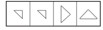

# 10月

## 10月1日

1.运用试管香蕉技术来推广优良香蕉品种，这种技术属于（ ）。

A.基因工程

B.酶工程

C.细胞工程

D.发酵工程

2.我国宋代科学家沈括，于11世纪末著的《梦溪笔谈》中，在记述用天然磁石摩擦钢针可以指南的时候指出：“方家以磁石磨针锋，则能指南，然常微偏东，不全南也。”这个发现比欧洲人哥伦布的发现早了四百多年。沈括发现的是（ ）。

A.磁倾角

B.磁偏角

C.磁感应强度

D.磁场方向

3.钱币被称为“国家名片”，人民币则是中国的名片。目前人民币一共发行了五套，有很多风景曾被印上它们的背面，在担负商品交换媒介职能的同时，也在九百六十万平方公里的土地上传递着浓缩自然、历史、文化为一体的中国精神。下列风景中没有出现在人民币上的是（ ）。

A.延安宝塔山

B.颐和园万寿山

C.井冈山

D.黄山

4.下列食物经过人体口腔能够初步消化的是（ ）。

A.牛肉和鱼

B.鸡蛋和牛奶

C.青菜和螃蟹

D.米饭和馒头

5.下列诗词没有描述生物应激性反应的是（ ）。

A.明月别枝惊鹊，清风半夜鸣蝉

B.我有迷魂招不得，一唱雄鸡天下白

C.人间四月芳菲尽，山寺桃花始盛开

D.飞蛾性趋炎，见火不见我，愤然自投掷

6.从所给四个选项中，选择最合适的一个填入问号处，使之呈现一定的规律性。

7.根据左右图形的变化规律，从所给四个选项中，选择最适合的一项填入问号处。

8.左边给定的是立方体，右边哪一项是它的外表面展开图？请把它找出来。

9.（ ） 之于 大米 相当于 （ ） 之于 面粉

A.米粉 小麦

B.农民 面点师

C.稀饭 早点

D.稻谷 麦子

10.雪花∶大海

A.绿叶∶土地

B.星星∶宇宙

C.白云∶天空

D.树木∶森林

11.$\frac{1}{2},\frac{5}{7},\frac{11}{16},(\space\space\space\space)$​

A.$\frac{11}{21}$

B.$\frac{17}{33}$

C.$\frac{19}{29}$​

D.$\frac{26}{37}$​

12.2， 11， 32， （ ）

A.56

B.42

C.71

D.134

13.某企业员工编号为6位自然数，其中前两位代表入职年份的最后两位数，第3位代表所属部门，后3位代表员工当年在部门中的入职顺序。2018年入职的员工小张发现，自己的员工编号能同时被5、9和101整除。问当年他所在的部门最少可能有多少人入职？（ ）

A.不到250人

B.250～499人之间

C.500～749人之间

D.超过749人

14.甲和乙两个工厂分别接到生产一批玩具的任务，其中甲工厂的任务量是乙工厂的1.5倍，甲工厂以乙工厂1.2倍的效率生产其任务量的50%后效率提升X%继续生产。在乙工厂完成生产任务时，甲工厂的任务完成了90%。问X的值在以下哪个范围内？（ ）

A.X＜30

B.30≤X＜40

C.40≤X＜50

D.X≥50

15.商店购入一百多件A款服装，其单件进价为整数元，总进价为1万元。已知单件B款服装的定价为其进价的1.6倍，其进价为A款服装的75%，销售每件B款服装的利润正好为A款服装的一半。某日商店以定价销售A款服装的总销售额超过2500元。问当天至少销售了多少件A款服装？（ ）

A.13

B.15

C.17

D.19

16.某小学举行作文大赛，家长们对挑选出来的6篇作文进行不记名投票。每张选票可以选择6篇作文中的任意一篇或多篇，但只有选择不超过3篇作文的票才是有效票。6篇作文的得票数（不考虑是否有效）分别为总票数的67%、53%、72%、39%、51%、48%，那么本次投票的有效率最少为（ ）。

A.21%

B.22%

C.23%

D.24%

E.25%

F.26%

G.27%

H.28%

17.防火指挥小组中，男性比重为63%，党员比非党员多12人，那么该小组男性中党员的比重最高为（ ）。

A.83%

B.84%

C.85%

D.86%

E.87%

F.88%

G.89%

H.90%

18.汽车的经济时速是指汽车最省油的行驶速度。据某汽车公司测算，该公司一款新型汽车以每小时70～110公里的速度行驶时，其每公里的耗油量公式为（x为汽车速度，M为耗油量）。那么该款汽车在70～110公里/小时速度区间行驶时每百公里的最低耗油量约为（ ）。

A.9

B.10

C.11

D.12

E.13

F.14

G.15

H.16

19.如下图所示，长度均为六分之五千米的三个圆形跑道汇聚于点O，若甲、乙、丙三人分别以5千米/小时、8千米/小时、12千米/小时的速度同时从O点出发分别绕三个圈奔跑，则三人再次相聚于O点需经过多少分钟？（ ）。

A.40

B.50

C.52

D.60

20.若在某连续的三个月中共有24天是周末，则该年第一个周日是（ ）。

A.1月1日

B.1月2日

C.1月3日

D.1月4日

## 10月2日

1.下列我国重大科技成就按时间先后顺序排列正确的是（ ）。

①第一颗人造卫星发射成功

②第一台亿次巨型计算机研制成功

③神舟五号载人飞船成功返航

④第一株籼型杂交水稻培育成功

⑤第一颗原子弹爆炸成功

⑥三峡大坝全线修建成功

A.①④⑤③⑥②

B.⑤①④②③⑥

C.④①⑤⑥③②

D.⑤⑥①②④③

2.下列关于生活现象的说法错误的是（ ）。

A.无风时落叶各处受空气作用力不均，因此呈曲线翻转落下

B.衣服湿后对光线的反射能力减弱，因此颜色比干的时候深

C.自来水中含有少量次氯酸，因此不宜直接用自来水养鱼

D.挂钟电池耗尽后，秒针因受到重力矩的作用，会停在30秒的位置

3.某军用车辆采用的蜂窝式轮胎，这是一种镂空的汽车轮胎结构，不用充气也不怕钉子。下列关于蜂窝式轮胎的表述，错误的是（ ）。

A.该轮胎能适应各种复杂地形，防止车辆因为轮胎漏气而瘫痪

B.采用蜂窝式结构既可增加轮胎强度，又可减轻轮胎重量

C.和完全实心的轮胎相比，该轮胎的减震性能相对较差

D.和充气轮胎相比，该轮胎行驶过程中受到地面的阻力更大

4.2020年11月，“奋斗者”号研制及海试的成功，体现了我国在海洋高技术领域的综合实力。下列关于“奋斗者”号的说法不正确的是（ ）。

A.“奋斗者号”标志着我国载人深潜水器全面自主创新的突破

B.“奋斗者号”外壳使用的是特殊高强度、高韧性钛合金材料

C.“奋斗者号”是目前世界上最大、搭载人数最多的深潜装备

D.“奋斗者号”的最大下潜深度创造了世界载人深潜的新纪录

5.每一种食物都有特殊的营养成分，食物搭配得当既美味又有利于营养吸收，促进健康，搭配不当则不仅不能吸收原有的营养成分，反而在一定程度上会损害人体的健康。下列食物搭配得当的是（ ）。

A.虾与维生素C

B.鸭肉与山药

C.螃蟹与茄子

D.红糖与皮蛋

6.下列选项中，不能在裁剪或覆盖后折成如图所示立方体的是（ ）。

A.

B.

C.

D.

7.

8.植物∶授粉∶结果

A.米酒∶发酵∶保鲜

B.绿茶∶采摘∶加工

C.灯丝∶导电∶发光

D.石油∶加热∶沉积

9.尝试∶成功

A.奋斗∶目标

B.动力∶创造

C.劝说∶接受

D.改革∶进步

10.（ ） 之于 石匠 相当于 画笔 之于 （ ）

A.技巧 画师

B.凿子 画家

C.工匠 颜料

D.玉石 宣纸

11.1， 1， 4， 13， 43， 142， （ ）

A.469

B.369

C.234

D.198

12.8， 4， 8， 10， 14， （ ）

A.22

B.20

C.19

D.24

13.打字员小张每10分钟可录入1页文档，平均每页有2个错字；打字员小李每15分钟可录入1页文档，平均每页有1个错字，现有12页、7页、11页、8页、14页和20页的6篇文档需要录入，要求每篇文档由同一人录入，且总共在9个小时内完成。问录入文档的错误率最低可以控制在平均每页多少个错字？（ ）

A.不高于1.4个

B.高于1.4个但不高于1.5个

C.高于1.5个但不高于1.6个

D.高于1.6个

14.某单位所有员工都参加艺术、科学、人文三类书籍的阅读活动，每名员工至多阅读2种书籍，阅读1种书籍员工人数比阅读2种书籍的人数多一半，阅读艺术类书籍的人数是阅读科学类书籍人数的，阅读科学类书籍人数是阅读人文类书籍人数的，问该单位至少有多少人？（ ）

A.20

B.25

C.30

D.50

15.某集团有13个分公司，每个分公司的员工数均不超过50人。甲和乙两个分公司各招聘若干人后，员工人数分别达到76人和137人，且集团平均每个分公司的员工数增加了9人。问甲分公司和乙分公司在招聘前的员工数最多相差几人？（ ）

A.4

B.3

C.2

D.1

16.小刘买120元的玫瑰、康乃馨和百合共20朵。其中康乃馨价格为3元/朵，百合和玫瑰的价格也均为整数元。其中，玫瑰的价格比百合便宜但比康乃馨贵；购买玫瑰的数量少于百合但多于康乃馨，问玫瑰最高多少元/朵？（ ）

A.4

B.5

C.6

D.7

17.寒假第一天，骑行社团从学校出发去滑雪，他们以20公里/小时的速度骑行2个小时到达滑雪场，游玩4个小时后按原路以原速返回。骑行社团离开学校5.5小时后，辅导员派大客车以40公里/小时的速度沿相同路线迎接骑行社团，则大客车出发后与骑行社团相遇需要的时长是（ ）。

A.30分钟

B.40分钟

C.50分钟

D.60分钟

18.小王从单位开车去省城，如果他把车速提高20%，可以比原定时间提前15分钟到达；如果按原速行驶30千米后再将车速提高25%，也比原定时间提前15分钟到达。问小王单位距离省城多少千米？（ ）

A.60

B.120

C.180

D.240

19.A、B点和墙的位置如下图所示。现从A点出发以5米/秒的速度跑向墙，接触到墙后再跑到B点。问最少要多少秒到达B点？（ ）

A.30

B.34

C.38

D.42

20.某企业从10名高级管理人员中选出3人参加国际会议。在10名高级管理人员中，有一线生产经验的有6人，有研发经验的有5人，另有2人既无一线生产经验也无研发经验。如果要求选出的人中，具备一线生产经验的人和具备研发经验的人都必须有，问有多少种不同的选择方式？（ ）

A.96

B.100

C.106

D.112

## 10月3日

1.北京时间2019年4月10日，人类首张黑洞照片发布。下列与之相关的说法正确的是（ ）。

A.验证了狭义相对论的正确性

B.该照片是通过高精度光学望远镜获得的

C.该黑洞属于恒星级黑洞

D.图中的不对称性是由黑洞的旋转造成的

2.下列与人体有关的说法错误的是（ ）。

A.消化和吸收的主要场所是小肠

B.尿液中糖分过多可能是由于胰岛素分泌不足

C.分泌生长激素，促进人体生长发育的器官是垂体

D.人能看清远处和近处的物体是因为瞳孔的大小可以调节

3.下列关于植物种子传播方式的说法错误的是（ ）。

A.柳树的种子利用风力传播

B.樱桃会自己裂开通过弹力传播种子

C.莲蓬的种子利用水流传播

D.野葡萄靠鸟类食用和排泄传播种子

4.下列典故的发生年代与“破釜沉舟”最接近的是（ ）。

A.围魏救赵

B.明修栈道，暗度陈仓

C.卧薪尝胆

D.庆父不死，鲁难未已

5.下列与土壤有关的说法正确的是（ ）。

A.犁地可以增加土壤中的矿物质

B.红壤的pH值大于7，是碱性土壤

C.土壤的形成与岩石的风化作用有关

D.土壤的有机质可被植物的根部直接吸收

6.下面四个图形中，只有一个是由上面的四个图形拼合（只能通过上、下、左、右平移）而成的，请把它找出来。

7.下面四个图形中，只有一个是由上面的四个图形拼合（只能通过上、下、左、右平移)而成的，请把它找出来。

8.下面四个图形中，只有一个是由上面的四个图形拼合（只能通过上、下、左、右平移)而成的，请把它找出来。

9.误会∶（ ）∶朋友 相当于 贸易∶（ ）∶（ ）

A.消除 协商 伙伴

B.误解 协商 伙伴

C.消除 合同 出口

D.误解 合同 出口

10.传记 对于 （ ） 相当于 （ ） 对于 基因

A.自传 细胞

B.人物 遗传学

C.文学 染色体

D.纪实 治疗

11.212， 424， 234， 446， 658， （ ）

A.245

B.267

C.233

D.212

12.3672， 5458， 9016， 7450， （ ）

A.3578

B.6473

C.9894

D.4785

13..机关运动会上，来自3个单位的参赛者正好站成1×1、2×2到9×9共9个方阵，且每个方阵的人都来自同一个单位。已知来自甲单位的人组成了1个方阵，来自乙单位的人组成了6个方阵，且乙单位的参赛者正好是丙单位的2倍。则乙单位有多少名参赛者？（ ）

A.108

B.136

C.166

D.184

14.袋子中有若干黑球和白球。若取出一个黑球，则袋中黑球数占总球数的；若取出两个白球，则袋中白球占。从原来袋中抽出3个球，其中有且仅有1个黑球的概率是（ ）。

A.低于20%

B.在20%～40%之间

C.在40%～60%之间

D.高于60%

15.某公司研发部、市场部和销售部共新招了十几名员工，其中研发部新员工数与市场部和销售部新员工数的总和相同。销售部如果将的新员工调到市场部，则两个部门的新员工数相同。现在要为每名新员工各采购一台电脑，其中研发部的电脑每台不超过1万元，销售部和市场部的电脑每台不超过6千元。问采购这批电脑最多需要多少万元？（ ）

A.14.4

B.12.8

C.11.2

D.9.6

16.下图前两行分别表示三位数567和648，那么第三行图形表示的数是（ ）。

A.647

B.753

C.857

D.947

17.1、2、3、4、5、6、7、8、9这九个数字各用一次，组成三个能被9整除的三位数，这三个数的和最大是（ ）。

A.2007

B.2394

C.2448

D.2556

18.用一辆小型箱式货车运送荔枝干，该货车货箱长4.2米、宽1.9米、高1.8米。600克装荔枝干的外包装长20厘米，宽和高都是14厘米。那么一次最多可以运送约（ ）吨荔枝干。

A.2.1

B.2.0

C.1.9

D.1.8

19.集装箱内部空间的长、宽和高分别为20英尺、7英尺和7英尺。某种货物的包装箱尺寸为2×3×5英尺，问一个集装箱内最多可以装多少箱这种货物？（ ）

A.29

B.30

C.31

D.32

20.A、B两台高性能计算机共同运行30小时可以完成某个计算任务，如两台计算机共同运行18小时后，A、B计算机分别抽调出20%和50%的计算资源去执行其他任务，最后任务完成的时间会比预计时间晚6小时，如两台计算机共同运行18小时后，由B计算机单独运行，还需要多少小时才能完成该任务？（ ）

A.22

B.24

C.27

D.30

## 10月4日

1.关于被誉为空难“见证人”的黑匣子，下列说法错误的是（ ）。

A.是航空飞行记录仪器

B.通常安装在飞机中部位置

C.具有极强的抗磁干扰能力

D.外壳采用绝热、防冲击保护材料

2.发酵是人类较早接触的一种生物化学反应，如今在食品工业、生物和化学工业中均有广泛应用。以下没有用到发酵工艺的是（ ）。

A.酱油

B.醋

C.蔗糖

D.味精

3.下列说法正确的是（ ）。

A.在灭火时，冷水和热水的灭火效果相同

B.刹车失灵的情况下，如选择跳车，则向后跳相对比较安全

C.露水多出现在阴天、空气湿度大的情况下

D.白炽灯的灯丝断了，重新搭上后，会比原来亮

4.如下图所示，房间中互相垂直的墙和天花板都是由镜子构成，形成了3个两两互相垂直的平面镜。站在其中的小明会成多少个像？（ ）

A.3个

B.4个

C.7个

D.8个

5.下列关于光现象的物理解释正确的是（ ）。

A.小孔成像——光的衍射现象

B.天空呈现蓝色——光的散射现象

C.早上和黄昏的太阳是红色的——光的反射现象

D.衣服湿了颜色变深——布料沾水后反射到眼睛的光波频率发生变化

6.

 

7.

8.

9.货币∶价值

A.文字∶语言

B.心脏∶生命

C.情感∶玫瑰

D.笑脸∶幸福

10.奖学金∶成绩

A.贷款∶利息

B.补助∶工作

C.遗产∶死亡

D.低保∶收入

11.12， 9， 18， 33， 96， 21， （ ）， （ ）

A.39，3

B.12，24

C.26，27

D.36，51

12.5， 6， （ ）， 10， 15， 30

A.7

B.9

C.$7\frac{1}{2}$

D.$9\frac{1}{2}$​

13.某加工厂要将一批规格相同的三角形铁片裁制成尽可能大的圆形垫片和正方形垫片，如果三角形铁片的三条边长分别为5厘米、12厘米和13厘米。那么，裁制而成的正方形垫片边长和圆形垫片直径分别是多少厘米？（ ）
A.$\frac{\sqrt{60}}{7}$​​，3

B.$\frac{60}{17}$​​，4

C.$\frac{60}{17}$​​，3

D.$\frac{\sqrt{60}}{7}$​​​​​​，4

14.如下图所示，向高度为H的水瓶中注水，注满为止，下列反映注水量V与水深h的函数关系正确的是（ ）。

A.

B.

C.

D.

15.某电影公司准备在1～10月中选择两个不同的月份，在其当月的首日分别上映两部电影。为了避免档期冲突影响票房，现决定两部电影中间相隔至少3个月，则有（ ）种不同的排法。

A.21

B.28

C.42

D.56

16.一头羊用10米长的绳拴在一个长方形小屋外的墙角处，小屋长9米宽7米，小屋周围都是草地，羊能吃到草的草地面积为（ ）平方米。

A.π

B.π

C.75π

D.π

17.公用电话亭中有两部电话，六个人排队打电话。打完即走，他们的通话时间分别为3分钟、5分钟、4分钟、13分钟、7分钟、8分钟，则大家在此公用电话亭逗留的总时间最少为（ ）分钟。

A.60

B.66

C.72

D.78

18.某公司每月成本比上月增加10万元，收入比上月增加20%。已知该公司今年1月份亏损10万元，2月份亏损8万元，则该公司在今年（ ）月份可以第一次实现盈利。

A.3

B.4

C.5

D.6

19.早上7点之前，某小区门口停有100辆共享单车。7点开始，每20秒就有一辆共享单车被骑走。共享单车企业雇佣三轮车从附近的地铁站将无人使用的车辆拉到小区门口，7点拉来第一趟，往后每15分钟拉一趟，每趟拉来30辆共享单车。则下列哪个时间段会出现小区门口没有共享单车的情况？（不存在共享单车损坏和被骑来小区门口的情况）（ ）

A.8点21分至25分

B.8点36分至40分

C.8点41分至45分

D.8点46分至50分

20.某次知识竞赛的决赛有3人参加，共有12道题。规则为每题由1人以抢答方式答题，其余2人不作答。每道题正确得8分，错误扣10分。如所有人均回答了问题，且得分均为正数，则3人得分之和的最小值（ ）。

A.低于10分

B.在10～15分之间

C.在16～20分之间

D.高于20分

## 10月5日

1.半导体在我们的日常生活中有着广泛应用，下列关于半导体的说法正确的是（ ）。

A.麦克斯韦首次发现了半导体现象

B.所有半导体材料都属于金属化合物

C.温度升高，半导体的电阻会随之变高

D.LED灯利用半导体将电能转化为光能

2.下列关于钢表述错误的是（ ）。

A.碳是其最重要的硬化元素，所有钢材中都含碳元素

B.钢按成分不同可分为低碳钢、中碳钢、高碳钢

C.钢是含碳量在一定区间的铁碳合金

D.生铁经过高温煅烧可成为钢

3.在未来信息化战争中，构筑电磁空间安全防御体系成为各国军队建设的重要内容，夺取电磁空间信息优势成为赢得未来战争主动权的先决条件。下列选项中，不属于电磁战的范畴的是（ ）。

A.雷达间对抗

B.无线电信号的窃听和侦收

C.使用电磁炮攻击敌方目标

D.网络加密与解密技术

4.为提升我国深空测定轨能力，服务于嫦娥探月工程等国家重大战略，上海将于2015年建成65米射电天文望远镜。关于射电天文望远镜，下列说法正确的是（ ）。

A.射电天文望远镜像雷达一样，向目标天体发射无线电波，观测所获得的天体反射信息

B.射电天文望远镜的天线面积越大，灵敏度越高

C.射电天文望远镜的镜筒、目镜和物镜比普通的光学望远镜更大更精密

D.射电天文望远镜的显著优点是不受大气层的干扰

5.受东日本大地震影响，福岛核电站损毁严重，泄漏出大量的放射性物质，其中碘131的危害颇受人们关注。下列关于碘131的表述中，不正确的是（ ）。

A.有医疗作用，可用于甲状腺功能检查及甲状腺疾病治疗

B.放射性强，碘131带有强能量射线，可以导致人体DNA发生断裂，并产生一系列的细胞后续反应

C.存在时间久，碘131半衰期长达8年

D.传播远，碘131可附着在空气中的尘埃上，向远处扩散

6.

7.

8.下面四个图形中，只有一个是由上面的四个图形拼合（只能通过上、下、左、右平移）而成的，请把它找出来。

9.衣服∶染料∶植物

A.电缆∶轮胎∶橡胶

B.早餐∶豆浆∶黄豆

C.软件∶博客∶网络

D.道路∶沥青∶石油

10.金文∶青铜器∶书体

A.年轮∶树木∶标志

B.水墨画∶宣纸∶国画

C.沙漏∶玻璃∶容器

D.唐三彩∶陶器∶色彩

11.$3,-\frac{15}{4},\frac{14}{5},-\frac{45}{28},(\space\space\space\space)$

A.$\frac{25}{36}$

B.$\frac{33}{41}$​

C.$\frac{21}{48}$​

D.$\frac{35}{64}$

12.2， 6， 30， 60， （ ）， 210， 350

A.76

B.120

C.130

D.128

13.从1，2，3，4，5，6，7，8，9中选择两个数，使它们的和为质数，则共有多少种不同的选择方式？（ ）

A.19

B.18

C.17

D.16

E.15

F.14

G.13

H.12

14.甲、乙两个单位分别有60和42名职工，共同成立A、B两个业余活动小组，所有职工每人至少参加1个。乙单位职工中仅参加A组的人数是只参加一个小组人数的60%，乙单位职工中参加B组的人数与参加A组的人数之比为3：4，参加B组的人中，甲单位职工占。问有多少人仅参加A组？（ ）

A.35

B.42

C.46

D.56

15.甲和乙两个工厂分别生产X件某种产品，甲工厂每天比乙工厂多生产20件。甲工厂25天后正好完成自己的生产任务，随后立刻开始帮助乙工厂生产。所有生产任务完成时，甲工厂正好帮乙工厂生产300件产品。问X的值为（ ）。

A.1000

B.1200

C.1300

D.1500

16.有甲乙两个工程队负责某小区主干道维修及墙面粉刷。主干道维修，如果两个工程队合作，30天完成，若乙工程队单独进行，105天完成；粉刷墙面，若两个工程队合作，28天完成，若甲工程队单独做，140天完成。如果两项工作两个工程队共同分工合作，最少需要多少天？（ ）

A.34

B.35

C.40

D.41

17.一群有若干人的寻宝团队，在一小岛上发现一处宝藏，经商议按如下规则分配宝藏：首先，第1人分得1百万和剩余部分的$\frac{1}{6}$；其次，第2人分得2百万和剩余部分的$\frac{1}{6}$；接下去第3人分得3百万和剩余部分的$\frac{1}{6}$，依次类推，最后剩余的部分全给了最后一个人。结果每人都得到了同样价值的宝藏。那么，该寻宝团队共有多少人？（ ）

A.5

B.6

C.7

D.8

18.某企业的员工参加了一项需缴纳170元培训费的培训。同时，该企业允许非内部员工参加培训，但其不能享受员工优惠价。参训的非内部员工，如果是男生需交350元；如果是女生需交300元。结果，共有50人参加培训，整个培训收到的费用总额为10000元。由此可知，有多少个不是内部员工的女生参加了培训？（ ）

A.4

B.5

C.6

D.7

19.如图所示，五个圆相连，现在用三种不同颜色分别给每个圆涂色，要求相连接的两个圆不能涂同种颜色，则共有多少种不同的涂色方法？（ ）

A.36

B.72

C.112

D.144

20.某车间有甲、乙、丙三人，其工作效率比为3:4:5。甲单独加工A类产品需要50小时，丙单独加工B类产品需要18小时。现由甲负责加工B类产品，乙负责加工A类产品，丙先帮助甲加工B类产品若干天后转去帮助乙加工A类产品。如要求加工A、B两类产品，且同时开工、同时完工，则丙帮甲工作的时间与丙帮乙工作的时间之比为（ ）。

A.7:3

B.3:7

C.5:3

D.3:5

## 10月6日

1.下列关于吊扇悬挂点的拉力描述正确的有（ ）。

①吊扇不转动时，悬挂点的拉力等于重力 

②吊扇转动时，悬挂点的拉力小于重力

③吊扇转速越大，悬挂点的拉力越小 

④吊扇转速越小，悬挂点的拉力越小

A.1项 

B.2项 

C.3项 

D.4项

2.2019年是中国航天的超级大年，在这一年取得的成就不包括的是（ ）。

A.嫦娥4号在月球背面登陆 

B.长征十一号火箭中国首次海上平台发射

C.长征三号运载火箭发射北斗卫星第54颗 

D.中国运力最强的长征五号遥三“胖五”发射

3.人体在遇到寒冷时会触发一系列生理机制来应对，下列说法错误的是（ ）。

A.发抖是通过骨骼肌的颤抖形成热量

B.人体的体温随着温度降低相应降低，减少能量需求

C.汗毛下的竖毛肌收缩形成“鸡皮疙瘩”，减少热量流失

D.肾上腺素会加大分泌量，促进新陈代谢，增加热能供应

4.下列关于生物常识的说法错误的是（ ）。

A.基因工程育种能产生新的基因，改变生物性状

B.酵母呼吸作用产生的二氧化碳可使馒头膨大松软

C.向日葵向阳而生是由于光引起其生长素分布不均

D.加酶洗衣粉能平整织物表面，是因为它有纤维素酶

5.下列关于声音的说法错误的是（ ）。

A.声音是由物体振动产生的声波 

B.声音在水中传播的速度比在空气中要快

C.用空心砖砌墙降噪是在声源处减弱噪声 

D.接听电话主要靠音色来分辨熟人的声音

6.从所给四个选项中，选择最合适的一个填入问号处，使之呈现一定的规律性。

A.A 
B.B 
C.C 
D.D
7.从所给的四个选项中，选择最合适的一个填入问号处，使之呈现一定的规律性。

A.A
B.B 
C.C 
D.D
8.从所给的四个选项中，选择最合适的一个填入问号处，使之呈现一定的规律性。

A.A 
B.B 
C.C 
D.D
9.范雎∶白起∶秦国
A.商鞅∶李悝∶魏国 
B.田忌∶孙膑∶齐国 
C.蔺相如∶廉颇∶赵国 
D.屈原∶项燕∶韩国
10.聂海胜∶张晓光∶王亚平
A.杨利伟∶费俊龙∶聂海胜
B.翟志刚∶刘伯明∶景海鹏
C.景海鹏∶刘旺∶刘洋 
D.杨利伟∶景海鹏∶聂海胜
11.如图，问号处的数字为（ ）。

A.1 
B.8 
C.19 
D.31
12.如图，问号处的数字为（ ）。

A.168 
B.132 
C.96 
D.72
13.若将一个长方形的长缩短1厘米，宽加长8厘米，所得新长方形的周长和面积分别是原长方形的2倍和4倍，则原长方形的长是（ ）。
A.4厘米 
B.5厘米 
C.6厘米 
D.7厘米
14.梳理甲、乙两个案件的资料，张警官单独完成，分别需要2小时、8小时；王警官单独完成，分别需要1小时、6小时。若两人合作完成，则需要的时间至少是（ ）。
A.3小时 
B.4小时 
C.5小时 
D.6小时
15.某种糖果的进价为12元/千克，现购进这种糖果若干千克，每天销售10千克，且从第二天起每天都比前一天降价2元/千克。已知以6元/千克的价格销售的那天正好卖完最后10千克，且总销售额是总进货成本的2倍。问总共进了多少千克这种糖果？（ ）
A.160 
B.170 
C.180 
D.190
16.扶贫干部每日需要走访村内6个贫困户甲、乙、丙、丁、戊和己。已知甲和乙的走访次序要相邻，丙要在丁之前走访，戊要在丙之前走访，己只能在第一或最后一个走访。问走访顺序有多少种不同的安排方式？（ ）
A.16 
B.24 
C.32 
D.48
17.在美化城市活动中，某街道工作人员想借助如图所示的直角墙角，用28米长的篱笆围成一个矩形花园ABCD，篱笆只围AB、BC两边。图中P为一棵直径为1米的树，其与墙CD、AD的最短距离分别是14米和5米，若要将这棵树围在花园内，则花园的最大面积为多少平方米？（ ）

A.187 
B.192 
C.195 
D.196
18.某企业采购A类、B类和C类设备各若干台，21台设备共用48万元，已知A、B、C类设备的单价分别为1.2万元，2万元和2.4万元。问该企业最多可能采购了多少台C类设备？（ ）
A.16 
B.17 
C.18 
D.19
19.春风街道办事处为丰富老年人文化生活，准备举办老年人才艺秀活动，活动项目共有书法、绘画、歌曲演唱、太极拳四项。参加者报名项数不限、每种报名方式最多可报4人。经统计，共有3人同时报名参加书法和绘画项目。据此，参加老年才艺秀活动最多报名（ ）人。
A.68 
B.73 
C.45 
D.47
20.甲车从A地开往B地，乙车从B地开往A地。上午八点整，两车同时出发，相向而行，相遇后继续向前。甲车又行驶了2小时到达B地，乙车又行驶了4.5小时到达A地。甲乙两车到达目的地后都立即返回，则在返程途中两车再次相遇时，时间为（ ）。
A.14点整
B.14点半
C.15点整
D.15点半
E.16点整
F.16点半
G.17点整
H.17点半
