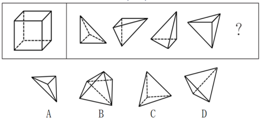
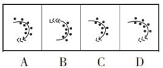

# 题目

## 8月5日

1、100亩实验田中种植了A、B、C三种作物，三种作物亩产量分别为300、500和600千克，总产量为45吨。已知A作物的种植面积是B作物的3倍，问C作物的种植面积是B作物的多少倍？

A.2

B.2.5

C.$\frac{7}{3}$

D.$\frac{8}{3}$

2、一次2小时的在线会议，会议结束前半小时才有人开始退出且每分钟退出会议人数满足$4+(-1)^n，(n=1,2,3,...,30)$。若会议开始后加入会议人数是退出人数的1.5倍，且会议结束时还有100人在线，问会议开始时可能有多少人在线？（ ）

A.40 

B.50 

C.60 

D.70

3、甲单位职工人数是乙单位的2倍，两个单位所有职工中正好有一半是党员。其中甲单位职工中党员占比比乙单位高15个百分点，且甲单位的职工中群众人数比乙单位多18人。问甲单位职工中，党员比群众多多少人？（ ）

A.6 

B.8 

C.10 

D.12

4、某果蔬专业博士生一行8人，深入某贫困山区，为当地3个村的村民传授果树的种植技术，当年3个村的水果产量之比为3:2:5，第2年3个村的水果产量都有不低于20%的增加，且3村水果总产量增加50%，问3个村水果产量的最大增幅可能是多少？（ ）

A.80% 

B.120% 

C.150% 

D.170%

5、某省在新冠疫情期间派出包括传染科医生、重症科医生和护士在内的三批援鄂医疗队。三批医疗队中三者人数之比分别为4:2:4、5:2:3和4:3:3。已知第二批医疗队中医生比护士多40人，且传染科医生数逐批增加并成等差数列，三批共派出护士113人，则三批医疗队共有多少人？（ ）

A.339 

B.350 

C.360 

D.390

6、某公鸟语林共饲养180只鸟。为养护方便，园方将鸟语林分为A、B、C三个区。某日，A区的一部分鸟飞至B、C两区，清点时B、C两区鸟的数量都增加一倍。次日，一些鸟又从B区飞至A、C两区，清点时A、C两区鸟的数量也都增加一倍。第三日，一部分鸟又从C区飞至A、B两区，清点时A、B两区鸟的数量同样增加一倍，而此时C区剩余鸟的数量恰好是A区的$\frac{7}{26}$。那么，最初A区有多少只鸟？（ ）

A.103 

B.104 

C.105 

D.106

7、送奶工人给11楼住户送牛奶，由于小区停电导致电梯无法使用。如果他走楼梯从第1层到第2层需要5秒，以后每多走一层需多花2秒，其中走到5层以后每多走一层需多休息5秒，那么他走到11层需要多少秒？（ ）

A.210 

B.215 

C.220 

D.235

8、小明去某楼盘售楼部咨询售房情况，置业顾问告诉他，如果再卖出50套，则已卖出的数量与未卖出的数量相等；如果再卖出150套，则已卖出的数量比未卖出的数量多一半，问该楼盘目前还剩下多少套房子未卖出？（ ）

A.350套 

B.450套 

C.550套 

D.650套

9、某县政府组织干部职工开展党建知识竞赛，其中甲、乙两镇参赛人数之比为4:3，甲镇有8人、乙镇有24人没有参加竞赛。已知甲、乙两镇干部职工人数之比为5:6，则乙镇的干部职工比甲镇多（ ）人。

A.8 

B.7 

C.6 

D.5

10、某学校组织学生外出学农。如果每间宿舍住6名学生，就会缺7张床位，如果每间宿舍住8名学生，就会空出3张床位，则这批学生一共有（ ）人。

A.50 

B.45 

C.43 

D.37

11、已知：$\sqrt{x}=\sqrt{a}-\frac{1}{\sqrt{a}}$，则$x+2+\sqrt{x^2+4x}=$​

A.$\frac{1}{a}$

B.$a$

C.$2a$

D.$\frac{2}{a}$

12、$13\frac{4}{19}+86\frac{15}{19}\times 0.25 +86\frac{15}{19}\times 0.625 + 86\frac{15}{19}\times 0.125=$

A.98

B.99

C.100

D.101

13、$110.1^2+1210.3^2+1220.4^2+1260.8^2=$​

A.4555940.8 

B.4555940.9 

C.4555941.18 

D.4555940.29

14、要使$4^{77}+4^{2017}+4^x$​成为完全平方数的最大整数x为多少？（ ）

A.2188

B.2576

C.3956

D.4041

E.5545

F.5982

G.6578

H.7056

15、若 $T=\frac{1}{\frac{1}{2002}+\frac{1}{2003}+\dots +\frac{1}{2012}}$​，则T的整数部分是（ ）。

A.180 

B.181 

C.182 

D.183

16、定义A※B=（A+B）/（A-B），则6※（5※3）的值为（ ）。

A.3 

B.4

C.5 

D.6

17、$x@y=x^2+y^2$，$3@1@3=$​

A.109 

B.110 

C.120 

D.160

18、设$x⊕y=2x+3y$，$x⊙y=x•y$，且x、y均为正整数。若当$x⊙y=6$时，$x⊕y$取得最小值，则$x$等于（ ）。

A.2 

B.6 

C.4 

D.3

19、100个骨牌整齐地排成一列，一次编号为1、2、3、4、……99、100。如果第一次拿走所有偶数位置上的牌，第二次再从剩余牌中拿走所有偶数位置上的牌，第三次再从剩余牌中拿走所有奇数位置上的牌，第四次再从剩余牌中拿走所有奇数位置上的牌，第五次再从剩余牌中拿走所有偶数位置上的牌，以此类推。问最后剩下的一张骨牌的编号是多少？（ ）

A.77 　

B.53 

C.39 

D.27

20、若任意正整数x和y，定义$x⊕y=2x+y$​，$x⊙y=y^x$​，则$1⊕(2⊙3)$​=（ ）。

A.10 

B.11 

C.64 

D.81

## 8月6日

1、某企业在“十二五”期间第一年的营业额比上一年增长了1.5亿元，且往后每年的营业额增量都保持1.5亿元不变。已知该企业在“十四五”期间的营业额将是“十二五”和“十三五”期间营业额之和的80%。问该企业在“十二五”到“十四五”期间的总营业额在以下哪个范围内？（ ）

A. 不到300亿元 

B.300～330亿元 

C.330～360亿元 

D.超过360亿元

2、根据下图规律，“？”处图形有（ ）个白色小正方形。

A.18 

B.20 

C.22 

D.24

3、某工厂在做好防疫工作的前提下全面复工复产，复工后第1天的产能即恢复到停工前日产能的60%，复工后每生产4天，日产能都会比前4天的水平提高1000件/日。已知复工80天后，总产量相当于停工前88天的产量。问复工后的总产量达到100万件是在复工后的第几天？（ ）

A.54 

B.56 

C.58 

D.60

4、Z国女排参加世界锦标赛，本次锦标赛共12支国家队，并采用单循环赛制，每场比赛为五局三胜制。每赢得一场比赛可获得3个积分，但各场次比赛中每输一局则要扣0.5分。最终Z国女排以全胜的战绩获得冠军，问Z国女排夺冠的可能积分中，最低积分与第五高积分的差是（ ）分。

A.5 

B.7.5 

C.9 

D.11.5

5、某阶梯会议室有16排座位，后一排比前一排多2个，最后一排有40个座位。这个阶梯会议室共有多少个座位？（ ）

A.300 

B.350 

C.400 

D.440

6、某游戏击中一次加1分，如果连续击中，从第二次击中开始是前一次得分的2倍。小明在游戏中共得到了74分，那么他最多连续击中（ ）次。

A.4 

B.5 

C.6 

D.7

7、某位党员同志制定了个人“新时代e支部”学习目标：每天学习时长都比前一天增加50%。如果他第一天学习时长是16分钟，第5天他的学习时长是（ ）。

A.27分钟 

B.54分钟 

C.81分钟 

D.100分钟

8、一个公比为2的等比数列，第n项与前n-1项和的差等于5，则此数列前4项之和为（ ）。

A.70 

B.85 

C.80 

D.75

9、商店本周从周一到周日出售A、B两种季节性商品，其中A商品每天销量相同，而B商品每天的销量都是前一天的一半。已知周五和周六，A、B两种商品的销量之和分别为220件和210件，问从周一到周日A商品总计比B商品多卖出多少件？（ ）

A.570 

B.635 

C.690 

D.765

10、假设三颗小行星绕着一颗恒星运动，它们的运行轨道都是圆形，每条轨道的圆心都是该恒星。且三条轨道都在同一平面内。若这三颗小行星同向旋转，且绕轨道运行一周的时间分别是60年、84年、140年。现在三颗小行星和恒星在同一直线上且三颗小行星都在恒星的同侧，那么至少（ ）年后他们再次在同一直线上且三颗小行星都在恒星的同侧。

A.210 

B.315 

C.420 

D.630

11、把黑桃、红桃、方片、梅花四种花色的扑克牌按黑桃10张、红桃9张、方片7张、梅花5张的顺序循环排列。问第2015张扑克牌是什么花色？（ ）

A.黑桃 

B.红桃 

C.梅花 

D.方片

12、编号为1～55号的55盏亮着的灯，按顺时针方向依次排列在一个圆周上，从1号灯开始顺时针方向留1号灯，关掉2号灯；留3号灯，关掉4号灯……这样每隔一盏灯关掉一盏，转圈关下去，则最后剩下的一盏亮灯编号是（ ）。

A.50 

B.44 

C.47 

D.1

13、在数列2，3，5，8，12，17，23，……中，第2012个数被5除所得余数是（ ）

A.1 

B.3 

C.2 

D.4

14、$2012^{2012}$​的末位数是（ ）。

A.2 

B.4 

C.6 

D.8

15、$3^{2010}+4^{2011}+8^{2012}$​的个位数为（ ）。

A.9 

B.8 

C.6 

D.4

16、不超过100名的小朋友站成一列，如果从第一人开始依次按1，2，3，…，9的顺序循环报数，最后一名小朋友报的是7；如果按1，2，3，…，11的顺序循环报数，最后一名小朋友报的是9。那么一共有多少名小朋友？（ ）

A.98 

B.97 

C.96 

D.95

17、“斐波那契—卢卡斯数列”为1、3、4、7、11、18…，该数列前两项相加可得到第三项。现在小明将此数列写到了第2020个，在这些数字中，3的倍数有多少个？（ ）

A.500 

B.501 

C.504 

D.505

18、一个盒子里有乒乓球100多个，如果每次取5个出来最后剩下4个，如果每次取4个最后剩3个，如果每次取3个最后剩2个，那么如果每次取12个最后剩多少个？（ ）

A.11 

B.10 

C.9 

D.8

19、某公司组织所有员工分乘一批大巴去旅游，要求每辆大巴乘坐员工人数不超过35人。若每车坐28人，则有1人坐不上车；若开走1辆空车，则所有员工恰好可平均分乘到各车。该公司共有员工（ ）人。

A.281 

B.589 

C.841 

D.981

20、某镇政府办公室集中采购一批打印纸，分发给各个职能部门。如果按每个部门4包分发，则多6包；如果按每个部门5包分发，则有1个部门只能分到3包。这批打印纸的数量是（ ）。

A.38包 

B.36包 

C.40包 

D.42包

## 8月9日

1、某工厂的工号为5位数字。甲乙两个工人工号五位数字连乘之积都等于1764，但是甲的工号五位连加之和比乙的大4。问乙的工号为？（ ）

A.13677 

B.22779 

C.23677 

D.33477

2、有一个四位数，已知其个位数字加1等于其十位数字，十位数字加2等于其百位数字，把这个四位数颠倒次序排列所成的数与原数之和等于11110。问这个四位数除以4的余数是几？（ ）

A.0 

B.1 

C.2 

D.3

3、一个密码由4位不相同的数字组成，已知由这四个数字按次序组成的阿拉伯数字小于2000，且第二位数比第四位数大7，问满足这一条件的密码一共有多少个？（ ）

A.28 

B.36 

C.60 

D.120

4、1005×10061006-1006×10051005=（ ）。

A.0 

B.100 

C.1000 

D.10000

5、甲队参加四场篮球比赛，前两场场均得分为第三场得分的0.75，第四场得72分，是第三场得分的0.9倍。问甲队所有比赛平均每场得多少分？（ ）

A.64 

B.66 

C.68 

D.72

6、某俱乐部选拔优秀选手参加游泳比赛，选手在规定时间内游完全程，就能获得参赛资格。已知有四分之一的选手获得了参赛资格，获得参赛资格选手的平均完成时间比规定时间快6秒，未获得参赛资格选手的平均完成时间比规定时间慢10秒，所有选手的平均完成时间为140秒，则本次选拔的规定时间为多少秒？（ ）

A.116 

B.125 

C.134 

D.139

7、某区财政局年度考核，办公室与国库科平均得分90分，预算科与政府采购科平均得分84分，办公室与政府采购科平均得分86分，政府采购科比预算科多10分，国库科的得分比综合科多5分，那么办公室、预算科、国库科、政府采购科、综合科的平均得分是（ ）。

A.4分 

B.86分 

C.88分 

D.90分

8、某省选派若干名本科生和研究生去乡村支教，其中男生和女生的比例是7:3，研究生和本科生的比例是1:4。若男本科生的人数恰好为女研究生人数的4倍，则女本科生至少比男研究生多（ ）。

A.3人 

B.6人 

C.9人 

D.12人

9、为实现精准扶贫，某县政府工作人员对辖区内所有贫困户进行走访。已知第一周走访的户数为贫困户总户数的46%，第二周走访的户数是两周后剩余未走访户数的1.2倍。问两周后最少还有多少户贫困户未走访？（ ）

A.45 

B.90 

C.135 

D.180

10、某公司举办迎新晚会，参加者每人都领取一个按入场顺序编号的号牌，晚会结束时宣布：从1号开始向后每隔6个号的号码可获得纪念品A，从最后一个号码开始向前每隔8个号的号码可获得纪念品B。最后发现没有人同时获得纪念品A和B，则参加迎新晚会的人数最多有（ ）。

A.46人 

B.48人 

C.52人 

D.54人

11、为加强治安防控，现计划在一段L形的围墙（如下图）上安装治安摄像头，其中A点到B点长度为750米，B点到C点长度为1350米。按要求ABC三个位置必须安装一个摄像头，且相邻两个摄像头之间的距离要保持一致，则整段围墙至少需要安装（ ）个摄像头。

A.14 

B.15 

C.16 

D.17

12、292929÷161616×112=（ ）。

A.174 

B.190 

C.203 

D.206

13、已知$X=\frac{1}{\frac{1}{2002}+\frac{1}{2003}+\dots +\frac{1}{2012}}$​，，问X的整数部分为多少？（ ）

A.182 

B.186 

C.194 

D.196

14、a=8.8+8.98+8.998+8.9998+8.99998。a的整数部分是？（ ）

A.42 

B.43 

C.44 

D.45

15、X千克甲盐水和Y千克乙盐水中的含盐量相同。将X千克乙盐水与X千克甲盐水混合，并蒸发掉X千克水之后，得到的溶液浓度是乙盐水的Z倍。问乙盐水的浓度是甲盐水的多少倍？（ ）

A.$\frac{1}{Z+1}$

B.$\frac{1}{Z-1}$​

C.$\frac{1}{Z+\frac{X}{Y}}$​

D.$\frac{1}{Z+\frac{Y}{X}}$

16、一个容器内有一定量盐水，第一次加入适量水后，容器内盐水浓度为3%，第二次再加入同样多水后，容器内盐水浓度为2%，则第三次加入同样多的水后盐水浓度为（ ）。

A.0.5% 

B.1% 

C.1.2% 

D.1.5%

17、甲烧杯装有浓度为6%的酒精200克，乙烧杯装有浓度为10.5%的酒精100克。现向两个烧杯各加入x克水后，两个烧杯中酒精浓度相同。问x的值为（ ）。

A.350 

B.400 

C.550 

D.600

18、有甲、乙、丙三根管子，甲管以每秒4克的流量流出含盐20%的盐水，乙管以每秒6克的流量流出含盐15%的盐水，丙管以每秒10克的流量流出水，但丙管打开后开始2秒不流，接着流5秒，然后又停2秒，再流5秒，如此循环。现三管同时打开通入一水池中，1分钟后都关上。这时水池得到的混合溶液的浓度是（ ）。

A.10% 

B.12% 

C.15% 

D.20%

19、某企业组织80名员工一起去划船，每条船乘客定员12人，则该企业最少需租（ ）条。

A.10 

B.9 

C.8 

D.7

20、已知3个质数的倒数和为$\frac{671}{1022}$，则这三个质数的和为（ ）。

A.80 

B.82 

C.84

D.86

## 8月10日

1、商店采购了一种水果，第一天在进货成本基础上加价40%销售，从第二天开始，每天的销售价格都比前一天低10%。已知第三天这种水果的售价比第一天降低了13.3元/千克。问这种水果的进货成本为多少元/千克？（ ）

A.35 

B.40 

C.45 

D.50

2、某帮扶项目以每公斤9元的价格从农民手中收购了一批苹果，并以每公斤12元（包邮）的价格在网上销售。售出总量的80%后，价格下调为每公斤10元（包邮）。运费成本为每公斤0.1元。全部售完后，扣除收购成本和运费的总收益为2.5万元，则这批苹果为（ ）吨。

A.5 

B.10 

C.15 

D.20

3、某科技公司向银行申请甲、乙两种一年期的贷款总计5000万元，两种贷款的年利率分别为5.6%和6.2%。若该公司向银行支付的总贷款利息为295.6万元，则甲种贷款的金额是（ ）。

A.2250万元 

B.2400万元 

C.2650万元 

D.2800万元

4、由于采用了新的种植技术，某种农产品的产量和品质都得到了提升。在平均每亩增产25%的同时，每千克售价也增加了20%。尽管每亩生产成本增加了35%，但每亩利润也增加了100%。问采用新种植技术后，每亩利润占每亩销售收入的比例在以下哪个范围内？（ ）

A. 不到25% 

B.25%～35% 

C.35%～45% 

D.超过45%

5、超市采购一批食用油，其中玉米油每桶进价比花生油低20%，若花生油利润定为进价的24%，玉米油利润定为进价的30%，则花生油比玉米油每桶售价高10元。问玉米油每桶比花生油进价低多少元？（ ）

A.10 

B.15 

C.24 

D.25

6、某商场春节期间，开展“年货节”优惠大酬宾活动。消费不足300打九折，超过300的部分打八折。小明买了两件衣服，分别付款243元、342元。但是小明发现如果一次性付款会更加优惠，那么请问如果小明一次性付款购买两件衣服可以比实际节省多少钱？（ ）

A.18 

B.27 

C.35 

D.38

7、一种设备打九折出售，销售12件与原价出售销售10件时获利相同。已知这种设备的进价为50元/件，其他成本为10元/件。问如打八折出售，1万元最多可以买多少件？（ ）

A.80 

B.83 

C.86 

D.90

8、某商店2万元购进一批商品，按原价卖出这批商品的五分之二后，由于市场情况发生变化，决定以七五折销售所剩商品，等商品全部卖出后结算发现这批商品亏损2000元，则降价前这批商品的利润率约为（ ）。

A.6% 

B.7% 

C.8% 

D.9%

9、一件商品相继两次分别按折扣率为10%和20%进行折扣，已知折扣后的售价为540元，那么折扣前的售价为（ ）。

A.600元 

B.680元 

C.720元 

D.750元

10、一批玩具，比进价高200%销售，一段时间后，六一儿童节促销，玩具按定价6折出售，打折后这批价格比进价高百分之几？（ ）

A.20 

B.40 

C.60 

D.80

11、某地居民生活使用天然气每月标准立方数的基本价格为4元/立方，若每月使用天然气超过标准立方数，超出部分按其基本价格的80%收费。某用户2月份使用天然气100立方，共交天然气费380元，则该市每月使用天然气标准立方数为多少立方？（ ）

A.60 

B.65 

C.70 

D.75

12、奶茶，乍一想应该既有奶又有茶，是一种营养丰富的健康饮品。事实果真如此吗?有专家指出，市面上的奶茶大多由茶粉勾兑而成，咖啡因超标。因此专家提醒：对青少年而言，为了保持身体健康，奶茶好喝可别“贪杯”。
要使上述推论成立，可以补充的前提为（ ）。

A.过量摄入咖啡因会影响人们的身体健康

B.相比其他人群，奶茶对青少年的吸引力更高

C.奶茶中的咖啡因可能使人兴奋不已，甚至失眠

D.青少年正处于生长发育的关键期，对咖啡因更敏感

13、根据中国和美国政府机构专家组成的工作组测算，美国官方统计的对华贸易逆差被高估了20%左右。更令人难以信服的是，美国政府引用的贸易数据只包括货物贸易，并未反映服务贸易。如果算进去，所谓的“贸易不平衡论”就更立不住了。
上述结论建立在下列哪项假设的基础之上？（ ）

A.美国对华服务贸易逆差巨大 

B.美国对华服务贸易存在高额顺差

C.美国购买了中国很多的工业产品 

D.美国购买了中国很多的劳务服务

14、胼胝体是人类大脑的重要部分，是连接大脑左右半球的主要通道。研究表明，专业打击乐演奏者的大脑中，胼胝体中的纤维比一般人少且更粗壮。因此，练习打击乐能够有效刺激甚至改变大脑结构。
补充以下选项作为前提，最有助于使上述结论成立的是（ ）。

A.专业打击乐演奏者的大脑左右半球与一般人相比也存在差异

B.其他类型乐手的胼胝体纤维也存在与专业打击乐演奏者相似的特征

C.专业打击乐演奏者在练习打击乐之前的胼胝体纤维与一般人并无区别

D.打击乐业余爱好者胼胝体纤维粗细程度介于专业演奏者和普通人之间

15、野生动物之间因病毒入侵会暴发传染病。最新研究发现，热带、亚热带或低海拔地区的动物，因生活环境炎热，一直面临着罹患传染病的风险。生活在高纬度或高海拔等低温环境的动物，过去因长久寒冬可免于病毒入侵，但现在冬季正变得越来越温暖，持续时间也越来越短。因此，气温升高将加剧野生动物传染病的暴发。
以下哪项如果为真，最能支持上述观点？（ ）

A.无论气候如何变化，生活在炎热地带的动物始终面临着患传染病风险

B.适应寒带和高海拔栖息地的动物物种遭遇传染病暴发的风险正在升高

C.气温高低与野生动物患传染病风险之间存在正相关性，即气温越高患病风险越高

D.寒冷气候可能让野生动物免受病毒入侵，炎热气候却更易导致野生动物感染病毒

16、专家发现，传播疟疾的蚊子被人的气味分子吸引，抗击疟疾的设备负责消除空气中的人体气味，在人体周围制造一个范围为2平方米的电场，让气味分子掉落在地上。这样，传播疟疾的蚊子就找不到它们的猎物了，因为它们在没有气味的空间中会迷失方向。
以下哪项如果为真，最能支持上述观点？（ ）

A.科学家已成功研发出吸引疟疾蚊子的芳香物质，可直接引诱和杀死这些蚊子

B.现有实验已证实，传播疟疾的蚊子对疟疾患者散发出的人体气味特别感兴趣

C.传播疟疾的蚊子必须长时间大量吸食血液才能获得繁殖的能量

D.带疟疾病毒的蚊子无法嗅到人体气味，就会拒绝进食直至死亡

17、名词的体是指人们对名词指示的人或事物在空间维度所表现出来的诸如数量、大小、形状和结构等特征的一种认知方式或结果。
根据上述定义，下列表现名词的体的是（ ）。

A.激战上甘岭 

B.原始人的独木舟 

C.弯弯的月亮 

D.未来的希望

18、相反相成修辞手法是指把通常相互对立、排斥的两个概念或判断巧妙地联系在一起，这样不仅能够揭示出存在于客观事物深层的矛盾辩证关系，还可以增加语言的意蕴。
根据上述定义，下列不属于相反相成修辞手法的是（ ）。

A.横眉冷对千夫指，俯首甘为孺子牛

B.有的人活着，他已经死了；有的人死了，他还活着

C.墙上芦苇，头重脚轻根底浅；山中竹笋，嘴尖皮厚腹中空

D.这一天，死去的伟人在诗的国度里永生；这一天，活着的小丑在人们心上被埋葬

19、随着移动支付的普及和知识内容消费观念的逐渐养成，知识付费逐渐成为人们普遍接受的学习方式。自2015年以来，各种知识付费平台纷纷上线，用户数量快速增长。相关报告显示，2017年我国知识内容付费用户规模达1.88亿人，知识付费正在成为人们从海量信息中突围的利器。
以下哪项如果为真，最能解释上述现象（ ）。

A.知识付费可以随时满足广大网友广泛的兴趣爱好

B.当代青年人对于新知识和新技能的渴求日趋提高

C.知识付费能满足人们低门槛、高效率的学习需要

D.粉丝可以通过知识付费方式随时向知识偶像请教

20、某高校生命科学学院共有教师50人。其中：

①有的教师具有博士学位；

②有的教师不具有博士学位；

③张老师不具有博士学位。

上述三个条件中有一个条件为真，两个条件为假，则该学院中具有博士学位的老师有（ ）。

A.50人 

B.25人 

C.0人 

D.不确定

## 8月11日

1、桂∶广西

A. 皖∶江西 

B.杜鹃花∶映山红 

C.河流∶湖泊 

D.西红柿∶圣女果

2、近海∶靠近陆地的海域

A.充足∶多到能满足需要 

B.三包∶包修包换和包退

C.四季∶春夏秋冬的合称 

D.忙月∶农事繁忙的月份

3、冰∶水

A. 木∶炭 

B.桑田∶沧海 

C.犬∶獒 

D.火∶灰

4、桂林∶北海

A. 墨汁∶颜料 

B.开水∶自来水 

C.氧气∶空气 

D.红茶∶黑茶

5、骄傲 对于 （ ） 相当于 （ ） 对于 不经历风雨，怎能见彩虹

A.由于痛苦而将自己看得太低就是自卑 懦弱 

B.不满足是向上的车轮 退却

C.不以物喜，不以己悲 磨砺 

D.谦逊可以使一个战士更美丽 坚强

6、人文科学∶物理

A. 工业∶重工业 

B.薄荷糖∶牛奶糖 

C.茶叶∶红茶 

D.北方人∶湖北人

7、鸳︰鸯

A. 蚱蜢︰蝗虫 

B.白猫︰黑猫 

C.雄鸡︰雌鸡

D.红男︰绿女

8、人∶成年人∶未成年人

A. 门∶开门∶关门　 

B.手∶左手∶右手 

C.天气∶晴天∶阴天　 

D.车祸∶幸存者∶遇难者

9、进出口商品∶进口商品∶出口商品

A.地图∶东半球∶西半球 

B.硬币∶正面∶反面

C.教授∶哲学教授∶非哲学教授 

D.汽车∶环保型汽车∶节能型汽车

10、固有属性∶偶有属性

A.机械记忆∶长期记忆 

B.寒性食物∶热性食物

C.静态博弈∶动态博弈 

D.名胜古迹∶万里长城

11、线性振动∶非线性振动∶振动

A.花瓣∶花蕊∶牵牛花 

B.食肉动物∶食草动物∶动物

C.投资者∶经营者∶市场主体 

D.主要矛盾∶次要矛盾∶矛盾

12、有理数∶无理数∶实数

A. 洋房∶楼房∶房屋 　 

B.阴刻∶阳刻∶雕刻

C. 西汉∶东汉∶汉朝 

D.西欧∶东欧∶欧洲

13、电动汽车充电站白天（7～21点）充电1.8元/度，停车费5元/小时；夜间（21～7点）充电1.2元/度，停车费1元/小时，停车不满1小时按1小时计算。某电动汽车电池容量为60度，快充1.5小时充满，慢充6小时充满。假设同一种充电下充电速率一直不变。现在是20时，如果要从0度开始充满该电动汽车，选择哪种模式充电最省钱？（ ）

A. 全程快充 

B.全程慢充 

C.前1小时快充，之后慢充 

D.前1小时慢充，之后快充

14、某市出租车收费标准是：5千米内起步费10.8元，以后每增加1千米增收1.2元，不足1千米按1千米计费。现老方乘出租车从A地到B地共支出24元，如果从A地到B地先步行460米，然后再乘出租车也是24元，那么从AB的中点C到B地需车费多少元？（ ）（不计等候时间所需费用）

A.12 

B.13.2 

C.14.4 

D.15.6

15、某停车场按以下方法收费：每4小时收5元，不足4小时按5元收取，每晚超过零时加收5元，并且每天早上8点开始重新计时，某天下午15时小王将车停入停车场，取车时缴纳停车费65元，小王停车时间t的范围是（ ）。

A.41＜t≤44小时 

B.44＜t≤48小时 

C.32＜t≤36小时 

D.37＜t≤41小时

16、某文具厂计划每周生产A、B两款文件夹共9000个，其中A款文件夹每个生产成本为1.6元，售价为2.3元，B款文件夹每个生产成本为2元，售价为3元。假设该厂每周在两款文件夹上投入的总生产成本不高于15000元，则要使利润最大，该厂每周应生产A款文件夹（ ）个。

A.0 

B.6000 

C.7500 

D.9000

17、某商品的进货单价为80元，销售单价为100元，每天可售出120件。已知销售单价每降低1元，每天可多售出20件。若要实现该商品的销售利润最大化，则销售单价应降低的金额是（ ）。

A.5元 

B.6元 

C.7元 

D.8元

18、甲、乙两个工程队共同完成某项工程需要12天，其中甲单独完成需要20天。现8月15日开始施工，由甲工程队先单独做5天，然后甲、乙两个工程队合作3天，剩下的由乙工程队单独完成，问工程完成的日期是（ ）。

A.9月5日 

B.9月6日 

C.9月7日 

D.9月8日

19、有一块圆形花圃，花匠计划在圆形花圃中用花盆摆设图案进行装饰。现在花匠在圆形上设七个等分点，构思以这些点中的三个顶点连成一个等腰三角形，并在三角形内摆放花盆。问共有多少种不同的构图方案？（ ）

A.21 

B.28 

C.35 

D.42

20、某乡镇对集贸市场36种食品进行检查，发现超过保质期的7种，防腐添加剂不合格的9种，产品外包装标识不规范的6种。其中，两项同时不合格的5种，三项同时不合格的2种。问三项全部合格的食品有多少种？（ ）

A.14 

B.21 

C.23 

D.32

## 8月12日

1、晕轮效应 对于 （ ） 相当于 （ ） 对于 变本加厉

A.扬长避短 墨菲定理 

B.以偏概全 破窗效应

C.欲扬先抑 增减效应 

D.举一反三 蝴蝶效应

2、高屋建瓴 对于 （ ） 相当于 （ ） 对于 技艺

A.格局 左支右绌 

B.形势 目无全牛

C.气势 天造地设 

D.地势 逆水行舟

3、握瑜︰怀瑾︰美玉

A.南辕︰北辙︰马车　

B.金戈︰铁马︰战争　

C.敲金︰击石︰乐器　

D.锦衣︰玉食︰珍馐

4、赫兹︰频率

A. 法拉︰电容 

B.焦耳︰功率 

C.牛顿︰压强 

D.电阻︰欧姆

5、某大学张、刘、李、赵4位互不熟悉的选手参加全校演讲比赛。他们来自数学、逻辑、文学和历史专业。赛前4人分别作出了如下猜测：

张：赵的专业是逻辑； 

刘：李的专业是文学；

李：张的专业不是数学； 

赵：刘的专业是历史。

事后得知，只有数学、逻辑专业选手的猜测是正确的。

根据上述信息可以推断，张、刘、李、赵4人各自的专业分别是（ ）。

A.数学、逻辑、文学、历史 

B.数学、历史、文学、逻辑

C.文学、历史、逻辑、数学 

D.历史、文学、逻辑、数学

6、A、B、C、D为四位漂亮女生，她们喜欢穿漂亮衣服。某天，她们穿的衣服颜色各不相同，有黄色、绿色、蓝色和红色四种，在问到她们各自衣服的颜色时。A说：“B的衣服不是黄色的”，B说：“C的衣服是绿色的”，C说：“D的衣服不是蓝色的”，D说：“A、B、C三人中有一个人的衣服是绿色的，而且只有这个人说的是实话。”
如果D说的是实话，那么以下说法中正确的是（ ）。

A.C的衣服是蓝色的，D的衣服是绿色的 

B.B的衣服是蓝色的，C的衣服是红色的

C.A的衣服是绿色的，B的衣服是红色的 

D.D的衣服是绿色的，A的衣服是红色的

7、如果一片森林的树木物种多样性非常丰富，那么这时缺失一个物种对于整个森林的生产力来讲，影响还并不是太大；但在物种多样性越稀缺的时候，树的种类继续变少，对整个森林生产力产生的打击就会越来越大。
由此可以推出（ ）。

A.除非树木物种多样性锐减，整个森林的生产力不会受到影响

B.只要森林的树木物种减少，整个森林的生产力就会受到影响

C.如果森林的生产力下降，那么森林的树木物种多样性就已经受损

D.要么森林的树木物种多样性非常丰富，要么森林的生产力非常可观

8、问思是一家才创立两年左右的文具用品类公司，产品种类频多，有些高端产品价格不菲。问思生产的所有学生文具都设计奇巧，充满了青春色彩。所有充满青春色彩的文具都得到了广大中小学生的喜爱。问思学生文具销量增长飞速，公司因此也加强了对这方面产品的研发与生产。
以下各项都能从题干的论述中推出，除了（ ）。

A.问思生产的所有学生文具都得到了中小学生的喜爱

B.所有不被中小学生喜爱的学生文具都缺乏青春色彩

C.问思生产的价格不菲的产品的销量的增长速度不高

D.问思生产的一些设计奇巧的产品的研发得到了加强

9、某文化用品市场正在推进市场的信息化和电子化，市场主管部门建议市场里的商家可以使用电子付款系统或者使用自动贩卖机。
如果市场里的每家商户都落实了这一建议，那么以下哪项一定为真？（ ）

Ⅰ.市场里的一些商户使用了自动贩卖机

Ⅱ.如果一家商店既没有使用自动贩卖机，也没有使用电子付款系统，那么这家商店一定不在该市场里

Ⅲ.如果一家文具店既使用了自动贩卖机，也使用了电子付款系统，这家商店一定在该市场里

A. 只有Ⅰ 

B.只有Ⅱ 

C.只有Ⅰ和Ⅱ 

D.只有Ⅱ和Ⅲ

10、小赵和小刘是非常熟悉的好朋友，两家相距很近，疫情期间，小赵曾给本单位同处室的同事发了警示微信，小刘也给所在小区他认识的所有人发了警示微信，并进一步通过电话进行了确认提醒，小赵、小刘互通了电话，提醒近期不相互走动，小赵给小刘发过警示微信，小刘没有给小赵发过警示微信。

根据以上陈述，以下哪项不可能？（ ）

A.小赵近期没有去过小刘家 

B.小刘、小赵是同事

C.小刘、小赵不是一个处室的 

D.小赵、小刘住一个小区

11、指出下列推理中正确的一项是（ ）。

A.有些人既喜欢吃牛肉，也喜欢吃鱼片，王佳喜欢吃牛肉，所以她也喜欢吃鱼片

B.大量抽烟会导致肺癌，朱某不抽烟，所以朱某不会得肺癌

C.中国是发展中国家，中国是社会主义国家，所以，有的社会主义国家同时也是发展中国家

D.艺术没有阶级性，艺术是一种社会现象，所以，社会现象都是没有阶级性的

12、某企业参与兴办了甲、乙、丙、丁4个扶贫车间，共投资450万元，甲车间的投资额是其他三个车间投资额之和的一半，乙车间的投资额比丙车间高25%，丁车间的投资额比乙、丙车间投资额之和低60万元。企业后期向4个车间追加了200万元投资，每个车间的追加投资额都不超过其余任一车间追加投资额的2倍，问总投资额最高和最低的车间，总投资额最多可能相差多少万元？（ ）

A.70 

B.90 

C.110 

D.130

13、从某物流园区开出6辆货车，这6辆货车的平均装货量为62吨，已知每辆货车载重量各不相同且均为整数，最重的装载了71吨，最轻的装载了54吨。问这6辆货车中装货第三重的卡车至少装载了多少吨？（ ）

A.59 

B.60 

C.61 

D.62

14、一学生在期末考试中6门课成绩的平均分为92.5分，且6门课的成绩是互不相同的整数，最高分是99分，最低分是76分，则将这些分数从高到低排列居第三的那门课至少得分为（ ）。

A.93 

B.95 

C.96 

D.97

15、某地实行分时电价政策，平时执行基础电价，每度电0.5元；高峰时段基础电价上浮60%；低谷时段按基础电价下浮60%。某户居民某月用电恰好100度，应付电费38元。问该月该用户在低谷时段至少用电多少度？（ ）

A.40 

B.50 

C.60 

D.70

16、小明和姐姐用2013年的台历做游戏，他们将12个月每一天的日历一一揭下，背面粘上放在一个盒子里，姐姐让小明一次性帮她抽出一张任意月份的30号或者31号。问小明一次至少应抽出多少张日历，才能保证满足姐姐的要求？（ ）

A.346 

B.347 

C.348 

D.349

17、一个盒子装有标号为1～24的24张卡片，要从盒子里任意抽取卡片，至少要抽出多少张卡片，才能保证抽出的卡片中一定有两张卡片标号之差为4？（ ）

A.3 

B.12 

C.13 

D.14

18、李工程师家里有4口人，母、妻、儿、本人。2013年，4人的年龄和为152岁，平均年龄正好比李工程师年龄小2岁，比妻子大2岁。若2007年时，妻子年龄正好是儿子的6倍，问哪一年时，母亲年龄正好是妻子年龄的2倍？（ ）

A.2004年 

B.2006年 

C.2008年 

D.2010年

19、2018年父亲年龄是女儿年龄的6倍，是母亲年龄的1.2倍。已知女儿出生当年（按0岁计算）母亲24岁，则哪一年父母年龄之和是女儿的4倍？（ ）

A.2036 

B.2039 

C.2042 

D.2045

20、某篮球比赛14:00开始，13:30允许观众入场，但早有人来排队等候入场，假设从第一个观众来到时起，每分钟来的观众人数一样多，如果开3个入场口，13:45时就不再有人排队；如果开4个入场口，13:40就没有人排队，那么第一个观众到达的时间是（ ）。

A.13:00 

B.13:05 

C.13:10 

D.13:15

21、某政务服务大厅开始办理业务前，已经有部分人在排队等候领取证书，且每分钟新增的人数一样多。从开始办理业务到排队等候的人全部领到证书，若同时开5个发证窗口就需要1个小时，若同时开6个发证窗口就需要40分钟。按照每个窗口给每个人发证需要1分钟计算，如果想要在20分钟内将排队等候的人的证书全部发完，则需同时开（ ）个发证窗口。

A.7 

B.8

C.9 

D.10

## 8月13日

1、一次2小时的在线会议，会议结束前半小时才有人开始退出且每分钟退出会议人数满足4+（-1）n，（n=1，2，3，……，30）。若会议开始后加入会议人数是退出人数的1.5倍，且会议结束时还有100人在线，问会议开始时可能有多少人在线？（ ）

A.40 

B.50 

C.60 

D.70

2、某省在新冠疫情期间派出包括传染科医生、重症科医生和护士在内的三批援鄂医疗队。三批医疗队中三者人数之比分别为4:2:4、5:2:3和4:3:3。已知第二批医疗队中医生比护士多40人，且传染科医生数逐批增加并成等差数列，三批共派出护士113人，则三批医疗队共有多少人？（ ）

A.339 

B.350 

C.360 

D.390

3、某公鸟语林共饲养180只鸟。为养护方便，园方将鸟语林分为A、B、C三个区。某日，A区的一部分鸟飞至B、C两区，清点时B、C两区鸟的数量都增加一倍。次日，一些鸟又从B区飞至A、C两区，清点时A、C两区鸟的数量也都增加一倍。第三日，一部分鸟又从C区飞至A、B两区，清点时A、B两区鸟的数量同样增加一倍，而此时C区剩余鸟的数量恰好是A区的$\frac{7}{26}$。那么，最初A区有多少只鸟？（ ）

A.103 

B.104 

C.105 

D.106

4、小黎去水果店买牛油果、火龙果，向老板问了价格后，老板的答复是：“2个牛油果、3个新鲜火龙果一共32元；特价火龙果10元3个。”小黎最后买了5个牛油果和8个新鲜火龙果，花了82元，但是回家发现有2个牛油果坏了，她赶回水果店要求老板退换，老板答应了。那么，小黎可以换（ ）。

A.3个新鲜火龙果、1个牛油果 

B.3个特价火龙果、1个牛油果

C.2个新鲜火龙果、3个特价火龙果 

D.6个新鲜火龙果

5、一个公比为2的等比数列，第n项与前n-1项和的差等于5，则此数列前4项之和为（ ）。

A.70 

B.85 

C.80 

D.75

6、一个公比为2的等比数列，第n项与前n-1项的和的差等于3，则此数列的前4项之和是（ ）。

A.54 

B.45 

C.42 

D.36

7、某种产品每箱48个，小李制作这种产品，第1天制作了1个，以后每天都比前一天多制作1个。X天后总共制作了整数箱产品。问X的最小值在以下哪个范围内？（ ）

A. 不到20 

B.在20～40之间 

C.在41～60之间 

D.超过60

8、某种糖果的进价为12元/千克，现购进这种糖果若干千克，每天销售10千克，且从第二天起每天都比前一天降价2元/千克。已知以6元/千克的价格销售的那天正好卖完最后10千克，且总销售额是总进货成本的2倍。问总共进了多少千克这种糖果？（ ）

A.160 

B.170 

C.180 

D.190

9、如下图所示，长度均为六分之五千米的三个圆形跑道汇聚于点O，若甲、乙、丙三人分别以5千米/小时、8千米/小时、12千米/小时的速度同时从O点出发分别绕三个圈奔跑，则三人再次相聚于O点需经过多少分钟？（ ）。

A.40 

B.50 

C.52 

D.60

10、一个盒子里有乒乓球100多个，如果每次取5个出来最后剩下4个，如果每次取4个最后剩3个，如果每次取3个最后剩2个，那么如果每次取12个最后剩多少个？（ ）

A.11 

B.10 

C.9 

D.8

11、从所给的四个选项中，选择最合适的一个填入问号处，使之呈现一定的规律性。

12、把下面的六个图形分为两类，使每一类图形都有各自的共同特征或规律，分类正确的一项是（ ）。

A.①②④，③⑤⑥ 

B.①③⑤，②④⑥

C.①③⑥，②④⑤ 

D.①⑤⑥，②③④

13、从所给的四个选项中，选择最合适的一个填入问号处，使下列正方形图形呈现一定的规律性。

14、把下面的六个图形分为两类，使每一类图形都有各自的共同特征或规律，分类正确的一项是（ ）。

A.①②④，③⑤⑥ 

B.①③⑥，②④⑤ 

C.①②⑤，③④⑥ 

D.①⑤⑥，②③④

15、吴老师、张老师、孙老师、苏老师都是某校老师，分别教授语文、生物、物理、化学四门课程。
已知：

①如果吴老师教语文，那么张老师不教生物

②或者孙老师教语文，或者吴老师教语文

③如果张老师不教生物，那么苏老师也不教物理

④或者吴老师不教化学，或者苏老师教物理

下列哪项如果为真，可以推出孙老师教语文？（ ）

A. 吴老师教语文 

B.张老师不教生物 

C.吴老师教化学 

D.苏老师不教物理

16、李白的《江上吟》末二句云：“功名富贵若长在，汉水亦应西北流。”汉水，又名汉江，发源于今陕西省宁强县，东南流经湖北襄阳，至汉口汇入长江。
根据以上信息，下列哪项最符合李白的观点？（ ）

A.功名富贵能常在，但汉水不应西北流 

B.若功名富贵不常在，则汉水不应西北流

C.功名富贵不能常在 

D.若汉水能西北流，则功名富贵能常在

17、AI助手在医学应用上有着明显的优势：放射科医生每天要阅读并分析大量的影像，医生会因为疲劳导致效率降低，AI助手则不会，它甚至比人眼能更加迅捷地找到影像中的可疑病变，帮助医生做出初步诊断。
以下哪项如果为真，最能支持上结论？（ ）

A.甲医院医生借助AI技术将疑难影像分类归档

B.乙医院呼吸科借助AI助手完成了一次远程会诊

C.丙医院放射科利用AI技术半天就可完成对200多个患者的影像诊断

D.丁医院借助AI助手检测出远程会诊患者胸腔部位的异常征象，并为其确定治疗方案

18、某大学研究人员首次用嗜黏蛋白阿克曼氏菌进行小规模人体试验。32名超重或肥胖的志愿者被分为3组，分别每天口服活的嗜黏蛋白阿克曼氏菌、经过巴氏消毒法灭活的这种细菌和安慰剂，同时不改变饮食和运动习惯。结果显示，3个月后服用灭活细菌的志愿者对胰岛素敏感性提高，血浆总胆固醇水平降低。服用安慰剂的志愿者体内上述指标继续恶化。
由此可以推出（ ）。

A.服用该灭活菌能改善人体的代谢状况

B.该菌灭活后降低糖尿病的效果甚至好于活细菌

C.服用该菌能够降低罹患心血管疾病和糖尿病的风险

D.肥胖者可以将该灭活菌作为膳食补充剂达到减肥的目的

19、调查显示，在中国，男性越来越时兴购买并使用洗面奶、化妆水等护肤品，还开始购买并使用遮瑕膏或BB霜等化妆品，某大型商场推介会上，展出的化妆品全部面向男性，导购也是清一色妆容精致的男士。某大型电商在2019年“双十一”开始1小时内，男性化妆品交易额达到上年同期的44倍，中国男性化妆品市场的快速增长是消费需求的反映。
由此可以推出（ ）。

A.越来越多中国青年男性开始使用化妆品 

B.消费观念多元化导致中国男性喜欢化妆

C.男性化妆时尚正通过社交媒体迅速传播 

D.购买并使用化妆品的中国男性越来越多

20、某实验结果表明：源于植物的“天然化合物”组合可以分解新冠病毒与人细胞相连的刺突蛋白，从而能非常有效地抑制新冠病毒，该化合物组合很可能对抑制暴露在新冠病毒环境中的人群遭受感染方面具有立竿见影的效果。
要得到上述研究推论，还需基于以下哪一前提？（ ）

A.新冠病毒的刺突蛋白会随着传播过程发生突变

B.新冠病毒主要是通过呼吸道飞沫和密切接触而传播

C.刺突蛋白是病毒本身将其侵入人体细胞的组成部分

D.刺突蛋白变异会使传染性更强，药物是否有效还待验证

## 8月14日

1、大米∶大米粥

A.蜘蛛∶蜘蛛网 

B.玻璃∶玻璃水 

C.马尾∶马尾辫 

D.图书∶图书馆

2、头雁︰雁阵

A.蜂王︰蜂巢 

B.猎狗︰羊群 

C.蚁后︰工蚁 

D.狮王︰狮群

3、售后︰品控

A.数据︰科学 

B.融资︰风投 

C.龙骨︰地板 

D.听证︰监管

4、机芯∶手表

A.主机∶计算机 

B.瓶盖∶酒瓶 

C.压缩机∶空调 

D.车轴∶轮胎

5、（ ） 对于 花蕊 相当于 叶脉 对于 （ ）

A.蜂蜜 二氧化碳 

B.花瓣 叶肉

C.花朵 叶片 

D.花蜜 水分

6、闹钟∶发条∶计时

A.微生物∶细菌∶分解 

B.工具∶钳子∶修理

C.空调∶压缩机∶制冷 

D.土豆∶碳水化合物∶营养

7、鱼∶潜水艇

A.飞机∶鸟 

B.鲨鱼∶泳衣 

C.虾∶汽车 

D.蝙蝠∶雷达

8、快递企业在激烈的市场竞争中会被迫大幅下调收费单价，而特色快递企业能够避免卷入激烈的市场竞争。快递员都愿意在收费单价高的快递企业工作，但某国的快速员并没有为特色快递企业工作的强烈愿望。
由此可以推断（ ）。

A.该国快递市场竞争不激烈 

B.该国快递企业很难招到快递员

C.该国快递行业收费单价普遍不高 

D.该国特色快递企业的快递员收入不高

9、有些参加语言学暑期高级讲习班的学生获得过青年语言学奖。所有中文专业的三年级硕士生都参加了语言学暑期高级讲习班。所有中文专业的一年级硕士生都没有参加语言学暑期高级讲习班。
如果以上陈述为真，可以推出（ ）。

A.有些获得过青年语言学奖的学生是中文专业的三年级硕士生

B.有些中文专业的三年级硕士生获得过青年语言学奖

C.有些获得过青年语言学奖的学生不是中文专业的一年级硕士生

D.有些中文专业的一年级硕士生获得过青年语言学奖

10、随着个体化医疗和临床癌症基因组研究的发展，基因检测服务需求越来越广泛。基因组学技术和靶向治疗能够为癌症患者带来巨大益处，在癌症研究领域使用基因组学技术治疗疾病对患者来说很有吸引力，所以网络上提供基因检测服务的公司越来越受追捧。但专家发现，大部分网站提供的个性化癌症诊断或治疗的基因检测项目中至少有一项没有临床应用价值。
由此可以推出（ ）。

A.网络基因检测公司的有些服务没有临床意义

B.并非所有的基因检测项目都是科学、准确的

C.并非所有的基因检测项目都是跟癌症有关的

D.个性化医疗的推广促进了基因组研究的开展

11、王大妈与李大妈两人分别从小区外围环形道路上A、B两点出发相向而行。走了5分钟两人第一次相遇，接着走了4分钟后，李大妈经过A点继续前行，又过了26分钟两人第二次相遇。问李大妈沿小区外围道路走一圈需要几分钟？（ ）

A.54 

B.59 

C.60 

D.63

12、甲和乙走完A、B两地之间的距离分别需要120分钟和x分钟。某日甲从A地出发前往B地，1小时后乙从B地出发前往A地，两人到达目的地后都立刻折返。如甲和乙前两次遇见都是迎面相遇，问x的取值范围为（ ）。

A.30＜x＜150 

B.30＜x＜180 

C.40＜x＜150

D.40＜x＜180

13、甲、乙、丙三人跑步比赛，从跑道起点出发，跑了20分钟，甲超过乙一圈，又跑了10分钟，甲超过丙一圈，问再过多长时间，丙超过乙一圈？

A.30分钟 

B.40分钟 

C.50分钟 

D.60分钟

14、已知A、B两地相距9公里，甲、乙两人沿同一条路从A地匀速去往B地，甲的速度为6公里/小时，每走半小时休息15分钟；乙比甲早15分钟出发，中途不休息。若他们在途中（不包括起点和终点）至少相遇2次，则甲、乙两人到达B地的时间最多相差（ ）。

A.30分钟 

B.45分钟 

C.60分钟 

D.75分钟

15、甲、乙两人从湖边某处同时出发，反向而行，甲每走50分钟休息10分钟，乙每走1小时休息5分钟。已知绕湖一周是21千米，甲、乙的行走速度分别为6千米/小时和4千米/小时，则两人从出发到第一次相遇所用的时间是（ ）。

A.2小时10分钟 

B.2小时22分钟 

C.2小时16分钟 

D.2小时28分钟

16、公路上有三辆同向行驶的汽车，其中甲车的时速为63公里，乙、丙两车的时速均为60公里，但由于水箱故障，丙车每连续行驶30分钟后必须停车2分钟。早上10点，三车到达同一位置。问1小时后，甲、丙两车最多相距多少公里？（ ）

A.5 

B.7 

C.9 

D.11

17、一辆汽车在高速公路上以60公里/小时的速度匀速行驶，此时司机开始以固定的加速度进行加速，加速后50秒内，汽车行驶了1公里。则汽车从开始加速，到加速至高速公路的速度上限120公里/小时需要多长时间？（ ）

A.100秒 

B.125秒

C.150秒 

D.180秒

18、A、B、C三个社区需要建设若干个5G基站，三个社区可供选择的建设基站地点分别有2个、4个、5个，现从A、B、C三个社区分别选取1、2、3个地点随机分配给甲、乙、丙三个施工队进行建设，要求每个施工队只能承接一个社区，则承建方式有（ ）。

A.720种 

B.480种 

C.360种 

D.120种

19、随着人们生活水平的提高，汽车拥有量迅速增长，汽车牌照号码需要扩容。某地级市交通管理部门出台了一种小型汽车牌照组成办法，每个汽车牌照后五位的要求必须是：前三位是阿拉伯数字，后两位为两个不重复的英文字母（字母O、I不参与组牌），那么用这种方法可以给该地区汽车上牌照的数量为（ ）。

A.397440辆 

B.402400辆 

C.552000辆 

D.576000辆

20、县公安局计划举办篮球比赛，6支报名参赛的队伍将平均分为上午组和下午组进行小组赛。其中甲队与乙队来自同部门，不能分在同一组，则分组情况共有（ ）种可能。

A.6 

B.8 

C.10 

D.12

## 8月16日

1、小张早上起床的时候，发现挂钟电池没电已经停止了，他把挂钟换好电池，但未来得及调整时间就匆忙出门上班了，出门前挂钟显示时间是5点25分。小张赶到单位时，刚好是8点整。中午12点小张从单位返回家中吃饭，12点半进门。假设小张上下班路上花费时间相等，则小张进门时家里挂钟显示时间为（ ）。

A.9点25分 

B.9点55分 

C.10点25分 

D.10点55分

2、为保证一重大项目机械产品的可靠性，试验小组需要对其进行连续测试。测试人员每隔5小时观察一次，当观察第120次时，手表的时针正好指向10。问观察第几次时，手表的时针第一次与分针呈60度角？（ ）

A.2 

B.4 

C.6 

D.8

3、某单位实行弹性工作制，不严格规定上下班时间，但是上班打卡时间与下班打卡时间差应不少于9小时。某天上午小刘到单位打卡时，从镜子里看到时钟显示如下图。则小刘当天最早的下班打卡时间为（ ）。

A.18:05 

B.18:35 

C.12:05 

D.17:55、

4、某单位财务主管准备去办理公积金业务，他在时钟的时针和分针重合时准时出发，当他办理完业务返回时，时针刚好旋转30度，此时分针旋转过的角度是时针旋转过的角度的（ ）。

A.8倍 

B.15倍

C.12倍 

D.10倍

5、在一幅比例尺为1:200的地图上标注有一个长方形的鱼塘，该鱼塘的长与宽之比为3:2，在地图上量得的周长为30厘米。则该鱼塘的实际面积是（ ）平方米。

A.216 

B.432 

C.864 

D.900

6、平行四边形ABCD如图所示，E为AB上的一点，FG分别为AC与DE、DB的交点。若AB=3AE，则四边形BEFG与ABCD的面积之比是（ ）。 

A.2:7 

B.3:13 

C.4:19 

D.5:24

7、某单位共有240名员工，其中订阅A期刊的有125人，订阅B期刊的有126人，订阅C期刊的有135人，订阅A、B期刊的有57人，订阅A、C期刊的有73人，订阅3种期刊的有31人，此外，还有17人没有订阅这三种期刊中的任何一种。问订阅B、C期刊的有多少人？（ ）

A.57 

B.64 

C.69 

D.78

8、某公司招聘员工，按规定每人至多可投考两个职位，结果共42人报名，甲、乙、丙三个职位报名人数分别是22人、16人、25人，其中同时报甲、乙职位的人数为8人，同时报甲、丙职位的人数为6人，那么同时报乙、丙职位的人数为（ ）。

A.7人 

B.8人 

C.5人 

D.6人

9、某单位有80名职工参加了义务劳动、希望工程捐款和探望敬老院三项公益活动中的至少一项。只参加一项的人数与参加超过一项的人数相同，参加所有三项公益活动的与只捐款的人数均为12人，且只探望敬老院的人比只参加义务劳动的人多16人。问探望敬老院的人最多比参加义务劳动的人多多少人？（ ）

A.28 

B.32 

C.36 

D.44

10、某班参加学科竞赛人数40人，其中参加数学竞赛的有22人，参加物理竞赛的有27人，参加化学竞赛的有25人，只参加两科竞赛的有24人，参加三科竞赛的有多少人？（ ）

A.2 

B.3 

C.5 

D.7

11、从所给的四个选项中选择最合适的一项，嵌入到题干图形的黑色区域使之构成一个完整的立方体（ ）。

12、要想使右侧图形在不旋转的情况下拼合成左侧的正方体造型，还需在问号处添加的图形是（ ）。

13、冰∶水

A. 木∶炭 

B.桑田∶沧海 

C.犬∶獒 

D.火∶灰

14、分母∶除数

A. 内角∶外角 

B.加减法∶乘除法 

C.百分比∶百分率 

D.横坐标∶纵坐标

15、竞聘 对于 （ ） 相当于 （ ） 对于 回报

A.演讲 报酬 

B.岗位 补偿

C.连任 投资 

D.任期 付出

16、超速︰追尾︰处罚

A.高温︰自燃︰追责　

B.购票︰乘车︰出行

C.谨慎︰寡言︰冷落　

D.勤政︰声望︰爱戴

17、臭氧层∶天气变暖

A.偷猎∶物种灭绝 

B.森林∶水土流失 

C.干旱∶土地沙化 

D.酸雨∶水源污染

18、唇亡∶齿寒

A. 安居∶乐业 

B.纲举∶目张 

C.开卷∶有益 

D.惩前∶毖后

19、路见不平∶拔刀相助

A.蛇鼠一窝∶猫鼠同眠 

B.过街老鼠∶人人喊打

C.兴高采烈∶喜气洋洋 

D.卧薪尝胆∶扬眉吐气

20、众人拾柴∶火焰高

A.多行不义∶必自毙　

B.打破砂锅∶问到底　

C.敬酒不吃∶吃罚酒　

D.四海之内∶皆兄弟

## 8月17日

1、某书店按阶梯价格出售一批书，原价每本15元，10本以下部分按原价计算，第11本至第20本按原价九折计算，第21本至第30本部分按原价八折计算，折扣以此类推，但最低只能为五折。则用1000元最多可以买多少本书？（ ）

A.66 

B.95 

C.103 

D.111

2、劳务费计税方式为：总额不高于4000元时，应纳税额=（总额-800）×20％；高于4000元时，应纳税额=（总额-总额×20％）×20％。某单位甲、乙两部门在同一月份要为某专家发放劳务费，金额均不超过4000元，如果两笔劳务费分别计税，应纳税额之和为780元，但按照规定，两笔劳务费应合并计税，则该专家实际应纳税额为（ ）。

A.780元 

B.815元 

C.880元 

D.940元

3、某个项目由甲、乙两人共同投资，约定总利润10万元以内的部分甲得80%，10万元～20万元的部分甲得60%，20万元以上的部分乙得60%。最终乙分得的利润是甲的1.2倍。问如果总利润减半，甲分得的利润比乙（ ）。

A. 少1万元 

B.少2万元 

C.多1万元 

D.多2万元

4、为了节约水资源，某城市规定若每人每月不超过5吨，则按2.5元/吨收费；超出5吨的，超出部分按4元/吨收费，每次收费用水量都按整数计算，已知胡家3口人，熊家4口人，每月月底结算时，胡家收费69.5元，比熊家多交了15.5元。那么，熊家该月用了多少吨水？（ ）

A.20 

B.21 

C.22 

D.23

5、某地区居民生活用水每月标准用水量的基本价格为每吨3元，若每月用水量超过标准用水量，超出部分按基本价格的130%收费。某户六月份用水25吨，共交水费83.1元，则该地区每月标准用水量为（ ）。

A.12吨 

B.14吨 

C.15吨 

D.16吨

6、某地居民用水价格分二级阶梯，户年用水量在0～180（含）吨的水价5元/吨；180吨以上的水价7元/吨。户内人口在5人以上的，每多1人，阶梯水量标准增加30吨。老张家5人，老李家6人，去年用水量都是210吨。问老李家的人均水费比老张家少约多少元？（ ）

A.12 

B.35 

C.47 

D.60

7、甲乙两人需托运行李。托运收费标准为10kg以下6元/kg，超出10kg部分每公斤收费标准略低一些。已知甲乙两人托运费分别为109.5元、78元，甲的行李比乙重了50%。那么，超出10kg部分每公斤收费标准比10kg以内的低了（ ）元。

A.1.5

B.2.5 

C.3.5 

D.4.5

8、某单位开设a、b、c、d、e、f六门培训课程，员工自愿报名参加。经统计，员工选择的课程组合共有四种：a+f，d+f，a+c+e，b+c+f，所有培训结束后，统一安排考试，为不影响工作要求，在1月4日至10日中的连续六天考完，每天只考一门，且每位员工都不会连续两天参加考试，则安排这六门课程考试日期的不同方法共有（ ）。

A.2种 

B.4种 

C.8种 

D.12种

9、将5个相同的圆锥体零件表面涂上红、黄、蓝三种颜色。要求同一个零件的底面只能用一种颜色，同一个零件的斜面也只能用一种颜色，且5个零件的颜色彼此不完全相同，问总共有多少种不同的涂色方式？（ ）

A.84 

B.126 

C.172 

D.180

10、一块长方形土地的周长为260米，面积为3600平方米。将该土地划分成边长10米的小正方形土地。现从中选取3块，使得任意两块既不同行也不同列。问有多少种不同的选取方式？（ ）

A. 不到200种 

B.200～400种 

C.400～800种 　

D.超过800种

11、去年全年，某地区因驾驶员酒驾导致的交通事故数量是因驾驶员疲劳驾驶导致的交通事故数量的2倍。因此，在禁止疲劳驾驶方面的宣传工作要比禁止酒驾的宣传工作做得更好。

下列哪项问题的答案最能对上述结论作出评价？（ ）

A.交通事故的数量是否与交通安全方面的宣传工作有直接关系

B.在下一个年度中，因疲劳驾驶而导致的交通事故数量是否会增加

C.是不是所有疲劳驾驶的驾驶员都会出交通事故

D.如果加大禁止酒驾的宣传力度，能在多大程度上降低酒驾导致的交通事故数量

12、研究人员通过对某国500名儿童进行跟踪研究发现，人类大脑成长最快的时期是在出生后三个月内，大脑的尺寸可以达到成人的一半以上。

下列（ ）项的答案最能评价上述结论的正确性。

A.500名儿童中有没有人的大脑是在出生三个月后才快速生长的

B.有没有对其他国家的儿童进行跟踪研究

C.儿童的大脑功能和成人是不是一样

D.男童和女童的大脑成长速度是否一样

13、某地区自上世纪70年代开始，引入栽种欧美黑杨，用于造纸。这些欧美黑杨适应当地气候环境，生长速度快，种植面积迅速扩大。然而近年来，当地生态环境问题日趋严重。因此有人认为，可以通过砍掉这些欧美黑杨来修复该地区生态环境。

以下选项最能指出上述论证缺陷的是（ ）。

A.假设了有其他的作物可以替代欧美黑杨的经济价值

B.忽视了该地区引入栽种的其他外来植物也会影响生态环境

C.假设了该地区引入的欧美黑杨栽种面积远超当地树种面积

D.默认了欧美黑杨种植面积扩大和生态环境问题间存在因果关系

14、我坚信火星上有生命存在，不信你看火星上有许多长条状阴影，就是火星人在上面开凿的运河。

以下哪项与上述论证方式最为相似？（ ）

A.我坚信相对论是真理，你想爱因斯坦是天才，他能说错吗？

B.我坚信这件事就是他干的，你想如果不是他干的，还会有谁呢？

C.我坚信地球以外一定居住着其他智慧生物，你看宇宙那么大，要不然就太浪费了

D.我坚信全球气候正在变暖，你看有些耐寒的动物己经灭绝了，那就是全球变暖导致的

15、均衡化的国家治理价值目标结构指引下的农地制度设置能够强化农业要素供给。农业供给侧结构性改革的重点是强化农业要素供给，因此，国家治理价值目标的均衡化有利于农业供给侧结构性改革。

以下选项的逻辑推理结构与题干最为相似的是（ ）。

A.传统中国没有现代意义上的自然科学，它的认识论本身就是审美化的。因此中国美学研究不能执守西方现代科学为美学划定的边界

B.方言体系保存越完整的地方，往往宗族性就越强大，地方文化也越发相对闭合。因此，地方文化相对闭合的地方，方言体系往往能够完整保存

C.产业结构的转型给人们的职业流动创造了机会，职业流动有利于劳动者获得丰厚的劳动报酬。因此，产业结构的转型有利于人们获得丰厚的劳动报酬

D.改革开放以来，我国城市化发展迅速，城市的管理水平和宜居程度也随之有了巨大提升。因此，城市宜居程度的普遍提高是我国改革开放的一大成果

16、希望过上好日子的村民都愿意接受就业辅导。村民小王愿意接受就业辅导，因此，他希望过上好日子。

以下选项存在与题干最为相似的逻辑错误的是（ ）。

A.该店所有出售的水果都通过了农药残留检测，苹果通过了农药残留检测，因此该店正在出售苹果

B.张家苗圃在使用了这批肥料后花木长势很好，李家苗圃长势不好，因此李家苗圃没有使用这批肥料

C.许多坚持运动的儿童身体都比较健康，许多成年人也会坚持运动，因此坚持运动的成年人身体都比较健康

D.只有经过Ⅲ期临床试验的新药才可能被批准上市，该新药没有经过Ⅲ期临床试验，所以它没有被批准上市

17、老王是胰腺癌晚期患者，医生曾告知他可能只能存活几个月。他在医生建议下，尝试了一种免疫新疗法，现在已生存了5年。根据老王的情况，医生认为这种免疫新疗法对治疗胰腺癌有效果，应该进行推广。

以下哪项如果为真，不能削弱医生的观点？（ ）

A.这种免疫疗法在临床中尚未得到大面积推广

B.这种免疫疗法所起到的效果与老王的个人体质有关

C.即便只做手术和化疗，也会有2%左右的胰腺癌患者存活超过5年

D.一种新的治疗方法是否可以推广应慎重决定，不能仅根据个案作出判断

18、很多人认为，农村家养的土鸡、土猪，采用传统方式喂养，吃的是粮食、蔬菜、青草，不吃饲料，生长周期长，运动量大，肌肉紧实，更有营养，味道更加鲜美，所以市场上的土鸡，土猪通常售价更高。但研究者指出，其实土鸡或土猪并不比集中饲养的肉鸡和肉猪更有营养、更安全。

以下各项如果为真，哪项不能支持研究者的结论？（ ）

A.大型饲养场的鸡和猪，集中饲养、集中喂食，产蛋量更多，体型也更大

B.土鸡的蛋白质含量略高于肉鸡，但肉鸡的维生素A和脂肪含量超过土鸡

C.因为饲料中会添加相应的营养物质，所以肉鸡的维生素E和某些矿物质含量更高

D.家养的鸡和猪，可以避免人为的污染，但无法避免污水、重金属等自然污染因素

19、铅和镉是香烟烟雾中排出的两种重金属。在流行病学研究中，铅和镉分别与包括肾癌和肺癌在内的人类癌症有关。虽然香烟的滤嘴可以去除其中的一部分，但环境烟气污染主要是通过吸烟者呼出的烟气和燃烧时产生的侧流烟气来实现的。因此，吸烟不仅有害吸烟者的健康，也通过污染空气而对吸二手烟的人的健康造成威胁。

以下陈述如果为真，哪项最能支持上述结论？（ ）

A.侧流烟气中重金属的含量远远低于吸烟者呼出的烟气中的含量

B.吸入香烟烟雾之后，烟雾中的铅和镉会沉积在肺组织的深处

C.有统计显示，有相当多的从未吸过烟的人也患上了肺癌

D.重金属在环境中普遍存在，蔬菜和水当中也含有铅、镉等重金属

20、近日，某些城市上线了“随手拍交通违法”小程序，市民可以将自己拍摄的机动车闯红灯、违停等各类违法行为的照片或者视频，通过该小程序实名上传并进行举报。对于所举报的交通违法行为一经核实，相关部门会给予举报人奖励。有专家由此断定，“随手拍交通违法”可以有效扩大交通监督的范围，形成警民共治的局面。

以下哪项如果为真，最能支持上述专家的断定？（ ）

A.交警部门的执法力量相对有限，不足以应对现实生活中大量交通违法的行为

B.国家有关法律明令禁止闯红灯，违停等交通违法行为，并有相应的处罚规定

C.有些地方出现过举报人信息被泄露的案例，保护举报者个人隐私已刻不容缓

D.“随手拍交通违法”小程序上线以来，有关部门已接到大量交通违法行为举报

## 8月18日

1、习近平总书记指出：“要把新时代坚持和发展中国特色社会主义这场伟大社会革命进行好，我们党必须勇于进行自我革命，把党建设得更加坚强有力。”该论断蕴含的哲理是（ ）。

A.人们在改造客观世界的过程中改造主观世界，通过改造主观世界来改造客观世界

B.人民在客观规律面前，并不是消极被动的，能够认识和利用规律来改造客观世界

C.人的意识活动是一个能动的创造性过程，在认识和改造世界中，具有巨大的能动作用

D.人民在实践中所获得的真理，既是相对的，也是绝对的，是相对性与绝对性统一

2、习近平总书记在《辩证唯物主义是中国共产党人的世界观和方法论》一文中指出，“学习和运用唯物辩证法，就要反对形而上学的思想方法”，中国古代成语中，就有对形而上学思想的批判，下列成语不属于对形而上学思想批判的是（ ）。

A.盲人摸象；刻舟求剑 

B.缘木求鱼；邯郸学步

C.坐井观天；水中捞月 

D.老骥伏枥；老马识途

3、针对我国疫情防控工作，习近平总书记指出“要变压力为动力，善于化危为机”。以下典故与“善于化危为机”所蕴含的哲学原理一致的是（ ）。

A.塞翁失马，焉知非福 

B.绳锯木断，水滴石穿

C.千里之堤，溃于蚁穴 

D.南橘北枳，便分两等

4、下列选项中三国典故与哲学论断对应错误的是（ ）。

A.士别三日，当刮目相看——用发展的眼光看问题

B.草船借箭——人可以认识并利用规律

C.张飞醉酒失徐州，借酒破张郃——矛盾是对立统一的

D.望梅止渴——理性认识依赖于感性认识

5、党的十八大以来，以习近平同志为核心的党中央提出了许多党的建设新思想、新观点、新论断，极大地丰富了党的建设理论。下列关于党的建设的表述，不正确的是（ ）。

A.党的政治建设是党的根本性建设 

B.制度建设是全面从严治党的重要保障

C.坚定理想信念是党的思想建设的首要任务 

D.党内民主建设是党的纪律建设的核心任务

6、一只挂钟的秒针长30厘米，分针长20厘米，当秒针的顶点走过的弧长约为9.42米时，分针的顶点走过的弧长约为多少厘米？（ ）

A.6.98厘米 

B.10.47厘米 

C.15.70厘米 

D.23.55厘米

7、电子计时器一天显示的时间是从00:00到23:59，每一时刻都由四个数字组成，问一天中显示的四个数字之和为24的时刻一共会出现多少次？（ ）

A.24 

B.12 

C.1 

D.0

8、某收藏家有三个古董钟，时针都掉了，只剩下分针，而且都走的较快，每小时分别快2分钟、6分钟及12分钟。如果在中午将这三个钟的分针都调整指向钟面的12点位置，（ ）小时后这3个钟的分针会指在相同的时钟位置。

A.24 

B.26 

C.28 

D.30

9、甲习惯在每月的1日去星光剧院观看话剧，而乙习惯在每周一到星光剧院观看话剧。甲、乙上一次同日在该剧院观看话剧是在4月1日，则在甲、乙保持原有看话剧的习惯不变的情况下，两人下一次同日在星光剧院观看话剧的日期为（ ）。

A.7月1日 

B.8月1日 

C.9月1日 

D.10月1日

10、某市在工作日对本地机动车实行尾号限行，规则为：周一限行“1”“9”，周二限行“2”“8”，周三限行“3”“7”，周四限行“4”“6”，周五限行“5”“0”。已知某年7月份尾号“1”“9”和“5”“0”的限行天数一样多，则该年的7月1日是（ ）。

A. 周六 

B.周日 

C.周一 

D.周二

11、小刘每连续3天去健身房休息1天，而小张每连续2天去健身房休息3天。今年5月，有11天小张和小刘两人都去了健身房。问以下哪天两人一定都去了健身房？（ ）

A.5月2日 

B.5月4日 

C.5月8日 　

D.5月11日

12、甲、乙、丙三人跑步比赛，从跑道起点出发，跑了20分钟，甲超过乙一圈，又跑了10分钟，甲超过丙一圈，问再过多长时间，丙超过乙一圈？（ ）

A.30分钟 

B.40分钟 

C.50分钟 

D.60分钟

13、甲、乙两名运动员在400米的环形跑道上练习跑步，甲出发1分钟后乙同向出发，乙出发2分钟后第一次追上甲，又过了8分钟，乙第二次追上甲，此时乙比甲多跑了250米，问两人出发地相隔多少米？（ ）

A.200 

B.150 

C.100 

D.50

14、分粥效应是哲学家罗尔斯在《正义论》中讨论社会财富时作的一个比喻，说明只要把制度建立在对每一个人都不信任的基础上，就可以导出合理、具有监管力度的制度。这种制度不但要科学，而且其制定一定要有所依据、简单明了，具有针对性、可操作性，便于执行。

根据上述定义，假设“M”是某团队一项小福利，下列选项最能体现该定义的是（ ）。

A.通过选举，由品德高尚的小李主持分“M”，基本公平公正

B.拟定一人负责分“M”工作，并成立董事会，及时处理问题

C.选举产生分“M”委员会和监督委员会，有效落实执行和监督

D.参与者轮流值日分“M”，但主持分“M”者每次必须最后领取

15、价值链的数字重生指价值链的某个必要环节以数字化方式呈现，以数据实时在线为基础推动价值链的实现。价值链的数字新生是以新定义的用户价值为中心、数据实时在线为基础，融合新价值链要素，创造全新价值链结构。

根据上述定义，下列哪项属于价值的数字重生？（ ）

A.为给用户带来全新的旅行前、旅行中和旅行后的服务体验，立体化整合旅游目的地的资源要素

B.依靠在线实时数据，使美食供应商更便利精准地了解用户的美食习惯，开拓新颖的服务渠道

C.电商平台通过发布商品信息和销售实时动态，使消费者在选购时可以查询货物即时情况

D.核电设备的数字三维模型可以为设计、创造、运行以及维护等多个环节带来价值增长点

16、震慑是指利用各种手段造成足够强大的胁迫和强制力量，从而使对手慑于巨大的压力而丧失继续抵抗意志的一种军事战略形式。

根据上述定义，下列军事行动不属于震慑的是（ ）。

A.运用大规模毁灭性武器打击敌国重要设施，数天内即瓦解敌国的抵抗意志

B.对敌国主战派进行有选择的、迅速的斩首行动，使敌国主战派丧失主心骨

C.长时间使用经济禁运、骚扰等恶化敌人生存环境的手段胁迫使敌人崩溃

D.通过欺骗、误导、散布假情报等方式，使敌人相信自己不堪一击从而放弃抵抗

17、感觉营销是指企业以产品或服务为载体，利用人们的感受器官（眼、耳、鼻、口、指等）对光线、色彩、声音、气味等基本刺激的直接反应为消费者创造出一种心理舒适与精神满足，从而达到营销目的的营销方式。

根据上述定义，下列不属于感觉营销的是（ ）。

A.某面包店把新鲜的出炉的面包拿给过路群众免费试吃，不少人觉得好吃进店购买

B.某影院开了一家爆米花店。爆米花飘香四溢，即使是刚用过餐的顾客也觉得十分诱人，会购买一大桶带进放映厅

C.咖啡店通常光线较暗，并播放曲调舒缓的音乐，这样会给顾客带来一种独立的空间感和自在感，让更多顾客喜欢这里

D.人们往往倾向于填补图中缺少的部分，如被遮住的一部分文字或图形等，许多公司正是利用这一点来鼓励人们参与活动，宣传自己的产品

18、无感审批是指通过智能技术强化身份认证、智能授权、自动填表等功能，企业群众无需出示证件、无需填写表单，“不知不觉”就拿到审批文件，实现“无感”审批、“省心”办事。

根据上述定义，以下属于无感审批的是（ ）。

A.某市旅游管理部门通过人脸识别等网络技术，实现了网上实名制购买全市公园门票。游客无需出示证件，可以直接出示购票二维码入园

B.某建设单位登录省投资在线监管平台，填写单位代码后，系统自动生成企业基本信息和申请表格，随后完成在线审核，获得建筑许可

C.某市提高政府办事效率，对企业或个人办理业务，只需要到综合服务大厅询问工作人员，工作人员会帮忙核对材料，帮助他们方便快捷地完成相关手续

D.某保险公司提供网上业务办理和查询功能，客户登录公众号并通过人脸识别后，可完成查询、续费、转款等功能，无需出示证件、无需填写表单

19、共享用工：指企业在特殊时期，为了降低人力成本或解决人工短缺问题，通过借用或外派员工实现劳动力共享的临时用工方式。
下列属于共享用工的是（ ）。
A.为节省成本支出，某广告公司长期通过创客网站发包设计任务，并与一些水平较高的自由创客人员签订了合作协议，建立了密切的业务关系
B.某公司正在扩大生产经营规模，急需大量技术人员，通过线上线下相结合的形式，招聘一批兼职技术人员，既解决了无人可用的燃眉之急，又节约了用人成本
C.疫情期间，某生鲜电商平台订单激增，该平台与当地的餐饮、酒店等行业的数十家公司进行协商合作，利用他们派来的员工，缓解了自身的用工压力
D.某高校在科研项目攻关过程中遇到研发人员不足的问题，于是借用多家单位的科研人员组成联合攻关团队，终于成功解决了一系列技术难题

20、皈依者狂热是指后来皈依的教众比生于信教家庭的教众（老信徒）更加虔诚或诸如此类的社会现象。

根据上述定义，下列不属于皈依者狂热的是（ ）。

A.英国的餐桌礼仪来自于法国，但后来英国人对餐桌礼仪的讲究程度却远胜法国人

B.通过多年申请，韩国人小金终于获得美国绿卡，他认为自己比任何人更像美国人了

C.老张以前只在超市买东西，今天第一次接触网购，一口气在网上买了几万元的商品

D.罗恩原籍德国，加入中国国籍后，致力于研究史书典籍，比很多中国人都更热爱中国历史

## 8月19日

1、已知易拉罐的直径为8cm，现将7个易拉罐如图捆扎在一起，那么需要（ ）cm长的绳子。（仅计算一圈的绳长）

A.4π+24 

B.4π+48 

C.8π+24 

D.8π+48

2、甲地在乙地的正东方，在丙地的正南方。甲乙之间距离为2.1千米。小张从甲地骑车直线前往丙地，回程时以相同速度直线前往乙地再直线返回甲地，回程时的路程比去程长$\frac{1}{3}$。问甲丙之间的距离在以下哪个范围内？（ ）

A.不到5千米 　

B.在5～6千米之间 

C.在6～7千米之间 

D.超过7千米

3、过年要写春联，小李拿来一张长宽分别为85厘米和75厘米的红纸，打算裁开使用。已知春联每联7个字，一副春联上下两联，再加一个4字横批，每个字长宽都是10厘米，则这张红纸最多可以制作（ ）副春联。

A.2 

B.3 

C.4 

D.5

4、一个长方形长6cm，宽4cm，现分别平行于长和宽剪了若干刀，将长方形分割成若干个小长方形，这些小长方形的周长之和比原长方形周长多了56cm。那么最多剪了（ ）刀。

A.3 

B.4 

C.5 

D.6

5、在一块下图所示的梯形土地中种植某种产量为1.2千克/平方米的作物。已知该梯形的高为100米，ABC、BCD和CDE为正三角形，且BAF和DEG的角度都是90度。问该土地的总产量为多少吨？（ ）

A.$\frac{72}{\sqrt{3}}$

B.$\frac{84}{\sqrt{3}}$​

C.$\frac{108}{\sqrt{6}}$​

D.$\frac{126}{\sqrt{6}}$​

6、一个不计厚度的圆柱型无盖透明塑料桶，桶高2.5分米，底面周长为24分米，AB为底面直径。在塑料桶内壁桶底的B处有一只蚊子，此时，一只壁虎正好在塑料桶外壁的A处，则壁虎从外壁A处爬到内壁B处吃到蚊子所爬过的最短路径长约为（ ）。

A.10分米 

B.12.25分米 

C.12.64分米 

D.13分米

7、如图，在△ABC中，点D是AC的中点，点E是BC的三等分点，连接AE和BD交于点F，连接DE，若△ABC面积为36，则下列说法正确的是（ ）。

A. △DEF的面积小于3 

B.△CDE的面积大于6

C.△BAF的面积等于△BDE的面积 

D.△ABF的面积等于△ACE的面积

8、如下图1所示，在一个金字塔造型（底面为正方形，侧面为四个全等的等腰三角形）的铸造件内部挖空一个圆柱。现沿铸造件顶点A且垂直底面的方向切开，切开后的截面如下图2所示，已知DE、GF为圆柱的高，BC=4$\sqrt2$分米，DE=2分米，AO=4分米，那么挖后铸造件的体积是多少立方分米？（ ）

A.$128-4\pi$​

B.$\frac{128}{3}-4\pi$

C.$\frac{64}{3}-4\pi$

D.$64-4\pi$

9、在成功的道路上，所有捷径都是弯路，所有弯路都是必经之路。因此，依附强者并不是成功道路上的捷径。

补充以下哪项作为前提，可以使上述结论成立？（ ）

A. 所有捷径都是必经之路 

B.依附强者不是必经之路

C.所有弯路都不是捷径 

D.依附强者都是弯路

10、慢性疲劳综合征危害极大，它使人在正常的工作后感到极度疲劳，怎么休息也无济于事。这种疾病过去不能通过验血或其他检查得出明确的生物指标，因此其病因历来被归为心理因素。最近，研究人员对被诊断为慢性疲劳综合征的48名患者和39名健康志愿者的大便和血液样本进行研究后得出结论：肠道细菌和血液中的致炎因子可能与该疾病有关。

下列哪项如果为真，最不能支持上述结论？（ ）

A.该疾病患者的大便样本中肠道细菌的多样性较低且抗炎细菌较少

B.该疾病患者的血液样本中被检测出致炎因子，而健康志愿者没有

C.目前不确定肠道细菌是导致该疾病的原因还是该疾病导致的结果

D.最新研究表明饮食治疗和益生菌等无助于为该疾病患者缓解疲劳

11、近年来，通过多项针对科研人员参与科普情况的调查分析，发现存在重科研轻科普的现象，科研人员从事科普工作往往被某些圈内人士看作不务正业、不思进取，做科普反倒给学术形象的塑造带来了“负面”效应。科研人员一旦缺席科普，非专业的“科普人士”就会哗众取宠，谣言就有了存在的空间，最终不利于科学事业本身的发展。有学者认为，让更多有热情、有能力的科研人员投身科普，关键在于社会要形成科普与科研同等重要的共识。

以下哪项如果为真，最能支持该学者的观点？（ ）

A.在中国创造成为时代强音的今天，社会和公众需要越来越多的“网红”科学家

B.把科研成果描述得让社会和普通公众能明白、看得懂，才是科研人员的真本事

C.科研人员被认为是“科学传播的第一发球员”，他们有责任培养更多的科学公民

D.在科研和人才考评体系中把科普纳入考核范围，可以促使科研人员挺直腰杆做科普

12、很多人认为，农村家养的土鸡、土猪，采用传统方式喂养，吃的是粮食、蔬菜、青草，不吃饲料，生长周期长，运动量大，肌肉紧实，更有营养，味道更加鲜美，所以市场上的土鸡，土猪通常售价更高。但研究者指出，其实土鸡或土猪并不比集中饲养的肉鸡和肉猪更有营养、更安全。
以下各项如果为真，哪项不能支持研究者的结论？（ ）

A.大型饲养场的鸡和猪，集中饲养、集中喂食，产蛋量更多，体型也更大

B.土鸡的蛋白质含量略高于肉鸡，但肉鸡的维生素A和脂肪含量超过土鸡

C.因为饲料中会添加相应的营养物质，所以肉鸡的维生素E和某些矿物质含量更高

D.家养的鸡和猪，可以避免人为的污染，但无法避免污水、重金属等自然污染因素

13、波音737飞机出现后的50年中，航空发动机的直径越来越大，所以新一代的737MAX系列不得不将发动机的安装位置向机翼的前方移动，并尽可能升高，但这又可能会使飞机在飞行中自动向上抬头，导致失速。为解决这一问题，737MAX新增MCAS（机动特性增强系统），在必要的时候实现飞机“自动低头”的功能。但有专家分析，最近737MAX机型接连发生两次空难，可见MCAS系统并不可靠。
以下陈述如果为真，哪项可以作为专家的论据？（ ）

A.不少执飞737MAX机型的飞行员并不熟悉新款MCAS系统，错误操作可能导致事故

B.飞机传感器出现故障，使得MCAS接收到错误数据，进而不断执行“自动低头”的指令

C.两次空难均显示飞行速度大幅超过限制，进而产生飞机结构无法承受的气动力

D.两次空难均显示起飞后，飞行员与MCAS系统争夺控制权，但都没能阻止MCAS的“自动低头”功能，最终导致飞机俯冲

14、最近，一些海洋考古人员在地中海卡梅尔海岸附近的海底发现了一堵约100米长的巨型石墙。尽管石墙上没有留下任何文字符号，历史上也没有留下关于这堵石墙的任何记录，考古人员仍然通过对散落在石墙附近的木桩、石碗和兽骨等物品的测定，认为石墙是7000年前人类创造的遗迹。它的用途究竟是什么？由于当时敌人很难来自海上，研究人员推断，当时这里的人们筑起石墙，主要是为了避免海水上涨后淹没村庄。

以下哪项如果为真，最能支持上述研究人员的推断？（ ）

A.7000年前，地球正处于冰河期结束前期，地中海海平面每年抬升4至7毫米

B.石墙之后发现有人类定居点的遗迹，现在它们都被海水淹没在三四米深的海底

C.考古发现的石墙虽然只有100米长，但算上损毁部分，其长度足够包围定居点

D.今天的人类同样面临海平面上升的风险，有的国家也采取筑墙防御的应对策略

15、羟苯甲酮是一种常见的紫外线吸收剂，多用于防晒护肤品中，全球3500种品牌的防晒霜中均含有该物质。研究表明，即使是极低浓度的羟苯甲酮也会给珊瑚带来致命的伤害。有专家指出，为了保护珊瑚，在海滨浴场应该禁止使用防晒霜。
以下哪项如果为真，最能支持上述观点？（ ）

A.一些远离海岸的大洋中部水域已检测到羟苯甲酮，但浓度较低

B.羟苯甲酮易引起皮肤过敏，长期使用会影响人体免疫力和生殖能力

C.羟苯甲酮会破坏、改变珊瑚的DNA，降低幼年珊瑚正常发育的几率

D.人们在很多场合都使用防晒霜，仅在海滨浴场限制使用效果有限

16、党的十八大以来，以习近平同志为核心的党中央提出了许多党的建设新思想、新观点、新论断，极大地丰富了党的建设理论。下列关于党的建设的表述，不正确的是（ ）。

A.党的政治建设是党的根本性建设 

B.制度建设是全面从严治党的重要保障

C.坚定理想信念是党的思想建设的首要任务 

D.党内民主建设是党的纪律建设的核心任务

17、在新时代，围绕如何全面建设社会主义现代化这一重大问题，习近平总书记提出了一系列新思想新观点新要求。他强调，“现代化的本质是（ ）”。

A.人的现代化 

B.工业、农业、服务业的现代化

C.国家治理体系和治理能力现代化 

D.人与自然和谐共生的现代化

18、下列关于“讲政治”的表述不准确的是（ ）。

A.不忘初心，牢记使命是讲政治最本质的要求

B.必须提高政治识别力、政治领悟力、政治执行力

C.讲政治，概括起来说就是从政治上观察和处理问题

D.党领导人民治国理政，最重要的就是坚持正确政治方向，始终保持我们党的政治本色，始终沿着中国特色社会主义道路前进

19、下列对我国“十四五”时期经济社会发展主要目标表述错误的是（ ）。

A.经济发展取得新成效和改革开放迈出新步伐

B.创新驱动取得新优势和国内市场形成发展新格局

C.民生福祉达到新水平和国家治理效能得到新提升

D.社会文明程度得到新提高和生态文明建设实现新进步

20、脱贫攻坚的重大胜利，为实现第一个百年奋斗目标打下了坚实基础，极大增强了人民群众获得感、幸福感、安全感，彻底改变了贫困地区的面貌，改善了生产生活条件，提高了群众生活质量，“两不愁三保障”全面实现。以下习近平总书记的“金句”与脱贫攻坚无直接相关的是（ ）。

A.脚下沾有多少泥土，心中就沉淀多少真情 

B.小康不小康，关键看老乡

C.扶贫必扶智，治贫先治愚 

D.只争朝夕，不负韶华

## 8月20日

1、中华人民共和国全国人民代表大会是最高国家权力机关。全国人民代表大会行使的职权不包括（ ）。

A.选举国家监察委员会主任以及最高人民法院院长

B.撤销全国人民代表大会常务委员会不适当的决定

C.编制和执行国民经济和社会发展计划和国家预算

D.制定和修改刑事、民事、国家机构的和其他的基本法律

2、在中央国家机关中，负责编制《中华人民共和国国民经济和社会发展第十四个五年规划纲要》的是（ ）。

A.中共中央 

B.国务院 

C.全国人大 

D.全国人大常委会

3、下列说法不符合我国宪法规定的是（ ）。

A.国家监察机关和审判机关均由人民代表大会产生

B.国家工作人员就职时应当依照法律规定公开进行宪法宣誓

C.上级人民法院、人民检察院领导下级人民法院、人民检察院的工作

D.监察委员会依照法律规定独立行使监察权，不受行政机关、社会团体和个人的干涉

4、小王和小张系工友，因琐事发生纠纷后互殴，小王将小张打成轻伤，公安机关立案后双方达成和解协议，小张也表示了谅解。下列说法错误的是（ ）。

A.人民检察院可以作出不起诉的决定

B.公安机关可以向人民检察院提出从宽处理的建议

C.人民检察院可以向人民法院提出从宽处罚的建议

D.公安机关可以撤销刑事立案并作出行政处罚的决定

5、近年来，“共享单车”在许多城市兴起，给群众带来方便的同时，也被一些不法分子盯上。下列表述不正确的是（ ）。

A.赵某用技术开锁的手段解锁共享单车并贩卖，价值共计5000元，构成盗窃罪

B.钱某酒后为寻求刺激砸坏多辆共享单车，价值共计5000元，构成寻衅滋事罪

C.孙某将共享单车搬回家里解锁后又砸坏，价值共计5000元，构成故意毁坏财物罪

D.李某将共享单车上的二维码换成手机病毒二维码，非法获利5000元，构成诈骗罪

6、某学校举行迎新篝火晚会，100名新生随机围坐在篝火四周，其中，小张与小李是同桌，他俩坐在一起的概率为（ ）。

A.$\frac{2}{97}$

B.$\frac{2}{98}$

C.$\frac{2}{99}$

D.$\frac{2}{100}$

7、一家早餐店只出售粥、馒头和包子。粥有三种：大米粥、小米粥和绿豆粥，每份1元；馒头有两种：红糖馒头和牛奶馒头，每个2元；包子只有一种三鲜大肉包，每个3元。陈某在这家店吃早餐，花了4元，假设陈某点的早点不重样，问他吃到包子的概率是多少？（ ）。

A.30% 

B.35% 

C.40% 

D.45%

8、某基层机关有甲和乙两个办公室，共有10名员工。其中甲办公室人数为乙办公室人数的1.5倍，现从这10名员工中随机抽出2人借调到上级机关，问借调的人来自同一办公室的概率为（ ）。

A.$\frac{1}{3}$

B.$\frac{2}{5}$

C.$\frac{4}{9}$

D.$\frac{7}{15}$

9、某单位的会议室有5排共40个座位，每排座位数相同。小张和小李随机入座，则他们坐在同一排的概率（ ）。

A.不高于15% 

B.高于15%但低于20% 

C.正好为20% 

D.高于20%

10、安排4名护士护理3个病房，每个病房至少一名护士，每名护士固定护理一个病房，则共有（ ）种安排方法。

A.24 

B.36 

C.48 

D.72

11、某学习平台的学习内容由观看视频、阅读文章、收藏分享、论坛交流、考试答题五个部分组成。某学员要先后学完这五个部分，若观看视频和阅读文章不能连续进行，该学员学习顺序的选择有（ ）。

A.24种 

B.72种 

C.96种 

D.120种

12、扶贫干部每日需要走访村内6个贫困户甲、乙、丙、丁、戊和己。已知甲和乙的走访次序要相邻，丙要在丁之前走访，戊要在丙之前走访，己只能在第一或最后一个走访。问走访顺序有多少种不同的安排方式？（ ）

A.16 

B.24 

C.32 

D.48

13、6辆汽车排成一列纵队，要求甲车和乙车均不在队头或队尾，且正好间隔两辆车。问共有多少种不同的排法？（ ）。

A.48 

B.72 

C.90 

D.120

14、某兴趣组有男女生各5名，他们都准备了表演节目。现在需要选出4名学生各自表演1个节目，这4人中既要有男生、也要有女生，且不能由男生连续表演节目。那么，不同的节目安排有多少种？（ ）

A.600 

B.3000 

C.2400 

D.1200

15、某城市一条道路上有4个十字路口，每个十字路口至少有一名交通协管员，现将8个协管员名额分配到这4个路口，则每个路口协管员名额的分配方案有（ ）。

A.35种 

B.70种 

C.96种 

D.114种

16、病人∶生老病死∶医学

A.股票∶商海沉浮∶经济学 

B.大海∶潮涨潮落∶海洋学

C.战术∶枪支弹药∶军事学 

D.地貌∶斗转星移∶地理学

17、春雨︰杏花︰江南

A.夏荷︰烈日︰江北　

B.秋风︰腊梅︰华北

C.秋霜︰枯草︰塞外　

D.冬雪︰牡丹︰边疆

18、青衿∶读书人

A.南冠∶囚犯 

B.浮屠∶寺庙 

C.春蚕∶奉献 

D.袍泽∶官员

19、山有色︰水无声

A.山河在︰草木深 

B.客舍青︰柳色新 

C.鸟飞绝︰人踪灭 

D.花作尘︰鸟不惊

20、筚路蓝缕∶艰辛

A.焦金流石∶干燥 

B.伏虎降龙∶强大 

C.毕雨箕风∶简陋 

D.集萤映雪∶夏夜

## 8月23日

1、东西方关于管理学的思想有许多共通之处。下列西方管理学原理与东方哲理相对应的是（ ）。

A.破窗理论：防微杜渐，亡羊补牢 

B.木桶原理：尺有所短，寸有所长

C.彼得原理：人尽其才，物尽其用 

D.马太效应：木秀于林，风必摧之

2、“灰犀牛”事件是指太过于常见以至于人们习以为常的风险，比喻大概率且影响巨大的潜在危机。下列说法中，与防范应对“灰犀牛”事件思路有关的一项是（ ）。

A.明者防祸于未萌，智者图患于将来 

B.祸兮福之所倚，福兮祸之所伏

C.在危机中育先机，于变局中开新局 

D.一室之不治，何以天下家国为

3、下表为某市政务服务大厅公共服务事项清单上列明的部分内容。表中①②③依次代表的内容应该是（ ）。

A. 服务类型、设定依据、常见问题 

B.承办单位、收费标准、承诺时限

C.事项类别、服务标准、咨询电话 

D.政策规定、收费方式、评价统计

4、为整治电动自行车交通违法行为，某市交管部门向市民公开征求意见。下列建议中，交管部门不应采纳的是（ ）。

A.对电动自行车随机测速，超速严重的要依法处罚

B.禁止电动自行车在机动车禁鸣区内长时间按喇叭

C.有条件的路口，在人行横道线两侧划出电动自行车过街斑马线

D.违反交规的电动自行车骑车人要现场学法，答题合格才能离开

5、党中央明确提出，要加强数字社会、数字政府建设，提升公共服务、社会治理等数字化智能化水平。关于“数字政府”下列说法正确的是（ ）。

A.数字政府要求政府的运行实现无纸化的信息传递

B.数字政府就是要将数字化作为实施社会治理的核心手段

C.数字政府旨在充分利用信息课件提升社会治理效能

D.数字政府是运用大数据重构政府的组织架构和运行机制

6、某单位组建兴趣小组，每人选择一项参加。羽毛球组人数是乒乓球组人数的2倍，足球组人数是篮球组人数的3倍，乒乓球组人数的4倍与其他3个组人数的和相等。则羽毛球组人数等于（ ）。

A.足球组人数与篮球组人数之和 

B.乒乓球组人数与足球组人数之和

C.足球组人数的1.5倍 

D.篮球组人数的3倍

7、某单位有不到100人参加远足活动，如将该单位人员平均分成N组（N＞1且每组人数＞1），则每组的人数有且仅有6种不同的可能性。则该单位参加活动的人数可能的最小值和最大值之间相差多少人？（ ）

A.32 

B.48 

C.56 

D.64

8、设有编号为1、2、3、……、10的10张背面向上的纸牌，现有10名游戏者，第1名游戏者将所有编号是1的倍数的纸牌翻成另一面向上的状态，接着第2名游戏者将所有编号是2的倍数的纸牌翻成另一面向上的状态，……，第n名（n≤10)游戏者，将所有编号是n的倍数的纸牌翻成另一面向上的状态，如此下去，当第10名游戏者翻完纸牌后，那些纸牌正面向上的最大编号与最小编号的差是（ ）。

A.2 

B.4 

C.6 

D.8

9、一工厂生产的某规格齿轮的齿数是一个三位数的质数（除了1和它本身之外，不能被其他整数整除的正整数），其个、十、百位数字各不相同且均为质数。若将该齿数的百位数字与个位数字对调，所得新的三位数比该齿数大495，则该齿数的十位数字为（ ）。

A.7 

B.5 

C.3 

D.2

10、有甲、乙两个瓶子，甲瓶里装了200毫升清水，乙瓶里装了200毫升纯酒精。第一次把20毫升纯酒精由乙瓶倒入甲瓶，第二次把甲瓶中20毫升溶液倒回乙瓶，此时甲瓶里含有纯酒精的量（ ）乙瓶里含水的量。

A.大于 

B.小于 

C.等于 

D.不能确定

11、实验室有A、B、C三个实验试管，分别装有10克、15克、20克的水，小明把含有一定浓度的10克药水倒进A试管中，混合后取出10克倒入B试管中，再次混合后，从B试管中取出10克倒入C试管中，最后用化学仪器检测出C试管中药水浓度为2%。试计算刚开始倒入A试管中药水的浓度是多少？（ ）

A.10% 

B.20% 

C.30% 

D.40%

12、调酒师调配鸡尾酒，先在调酒杯中倒入120毫升柠檬汁，再用伏特加补满，摇匀后倒出80毫升混合液备用，再往杯中加满番茄汁并摇匀，一杯鸡尾酒就调好了。若此时鸡尾酒中伏特加的比例是24%，问调酒杯的容量是多少毫升？（ ）

A.220 

B.200 

C.180 　

D.160

13、现有一种浓度为15%的盐水30千克，如果用50千克浓度更高的盐水和它混合，混合后的盐水浓度将大于20%，而小于35%。据此可知，后加入的盐水的浓度（假设浓度为x）范围是（ ）。

A.23%＜x＜47% 

B.15%＜x＜35% 

C.15%＜x＜23% 

D.23%＜x＜50%

14、A、B两点是圆形体育场直径的两端，两人从A、B点同时出发，沿环形跑道相向匀速而行，他们在距A点弧形距离80米处的C点第一次相遇，接着又在距B点弧形距离60米处的D点第二次相遇，问这个圆形体育场的周长是多少米？（ ）

A.240 

B.300 

C.360 

D.420

15、小张、小王二人同时从甲地出发，驾车匀速在甲、乙两地之间往返行驶。小张的车速比小王快，两人出发后第一次和第二次相遇都在同一地点，那么小张的车速是小王的（ ）倍。

A.1.5 

B.2 

C.2.5 

D.3

16、请从所给的四个选项中，选出最恰当的一项填入问号处，使之呈现一定的规律性。

17、从所给的四个选项中，选择最合适的一个填入问号处，使之呈现一定的规律性。 

18、从所给四个选项中，选择最合适的一个填入问号处，使之呈现一定规律性。

19、从所给的四个选项中，选择最合适的一个填入问号处，使之呈现一定的规律性。

20、请选择最适合的一项填入问号处，使之符合整个图形的变化规律。（ ）

## 8月26日

1.下列说法与其所蕴含的法治原则对应不正确的是（ ）。

A.切蛋糕者最后拿蛋糕——效率原则

B.两害相权取其轻——利益权衡原则

C.有恒产者有恒心——人权保障原则

D.法无授权不可为——权力制约原则

2.下列不属于中国共产党在延安时期制定的廉政制度的是（ ）。

A.《陕甘宁边区政府惩治贪污暂行条例》

B.《陕甘宁边区政务人员公约》

C.《陕甘宁边区保障人权财权条例》

D.《陕甘宁边区各级政府干部奖惩暂行条例草案》

3.下列关于2021年3月1日起施行的《中华人民共和国长江保护法》的亮点描述准确的是（ ）。

①做好了统等协调、系统保护的顶层设计

②坚持把保护和修复长江流域生态环境放在压倒性位置

③突出共抓大保护、不搞新开发

④坚持责任导向，加大处罚力度

⑤切实增强了长江保护和发展的系统性、整体性、协同性

A.①③④ 

B.②④⑤ 

C.①②③④ 

D.①②④⑤

4.下列关于黄河流域的说法错误的是（ ）。

A.陕西境内秦岭以北的河流皆属该流域 

B.以“水少沙多、水沙异源”为突出特点

C.该流域下游常因泥沙堆积形成“地上河” 

D.“泾渭分明”的现象发生在该流域的上游

5.环渤海经济圈是“实现东部新跨越”战略方针中的重要区域，下列与之相关的说法错误的是（ ）。

A.天津滨海新区是其重要组成部分

B.该地区是我国重要的小麦和棉花产区

C.该地区是我国的重工业和化学工业基地

D.人口密度是影响其可持续发展的首要因素

6.乡风︰民俗︰乡村文化

A.德治︰法治︰治理能力

B.小学︰中学︰基础教育

C.习惯︰民约︰社会规则

D.通讯︰网络︰通信网络

7.党员︰干部︰服务人民

A.青年︰才俊︰报效国家

B.科学︰精英︰科技立身

C.大国︰工匠︰技术强国

D.学校︰教师︰教书育人

8.防爆膜∶防刮花∶抗撞击

A.驱蛇粉∶驱动器∶驱逐舰 

B.萤火虫∶荧光棒∶荧惑星

C.防晒伞∶超轻便∶抗强风 

D.净水器∶除杂质∶去异味

9.从所给四个选项中，选择最合适的一个填入问号处，使之呈现一定的规律性。

10.把下面的六个图形分为两类，使每一类图形都有各自的共同特征或规律，分类正确的一项是（
）。

A.①③⑥，②④⑤ 

B.①②⑤，③④⑥

C.①⑤⑥，②③④

D.①③⑤，②④⑥

11.工匠师傅甲擅长制作工艺品A，师傅乙擅长制作工艺品B，当有制作A任务时，甲只制作A，有制作B任务时，乙只制作B。两人8周可以制作一车工艺品A，如由乙单独完成则需40周。两人60天可制作一车工艺品B，如由甲单独完成则需30周，现需要制作A、B各占一半的一车工艺品，问两位师傅共同完成需要多少天？（ ）

A.40

B.45

C.50

D.55

12.一车救灾物资从早上8点起开始运往1900公里外的某地，白天平均车速80公里/小时，夜间60公里/小时（假定8:00到18:00为白天，其他时段为夜间），司机每驾驶2小时必须休息20分钟，且每名司机每天驾驶时间不能超过8小时（00:00后即为新的一天）。问车上至少应配备几名司机且至少要用多长时间才能抵达该地？（ ）

A.3名；27小时15分

B.3名；27小时25

C.4名；33小时30分

D.4名；33小时40分

13.一辆垃圾转运车和一辆小汽车在一段狭窄的道路上相遇，必须其中一辆车倒车让道才能通过。已知小汽车倒车的距离是转运车的9倍，小汽车的正常行驶速度是转运车的3倍，如果小汽车倒车速度是其正常速度的六分之一，垃圾转运车倒车速度是正常速度的五分之一，问应该由哪辆车倒车才能使两车尽快通过？（ ）

A.小汽车

B.垃圾转运车

C.两车均可

D.无法计算

14.某公园鸟语林共饲养180只鸟。为养护方便，园方将鸟语林分为A、B、C三个区。某日，A区的一部分鸟飞至B、C两区，清点时B、C两区鸟的数量都增加一倍。次日，一些鸟又从B区飞至A、C两区，清点时A、C两区鸟的数量也都增加一倍。第三日，一部分鸟又从C区飞至A、B两区，清点时A、B两区鸟的数量同样增加一倍，而此时C区剩余鸟的数量恰好是A区的7/26。那么，最初A区有多少只鸟？（ ）

A.103 

B.104 

C.105 

D.106

15.某市江滨有一处边长为50米的等边三角形广场。广场里设计有三个大小相等的 环期卵石道路供市民散步。如右图所示，各圆相切，各圆与三角形也相切，问沿三个圆环外围石道（不含圆切点之间的弧）散步一圈约为多少米?

A.95

B.105 

C.115 

D.125

16.某装修公司订购了一条长为2.5m的长方体条形不锈钢管，要剪裁成60cm和43cm长的两种规格长度不锈钢管若干根，所裁钢管的横截面与原来一样，不考虑剪裁时材料的损耗，要使剩下的钢管尽量少，此时材料的利用率为（ ）。

A.0.998

B.0.996

C.0.928

D.0.824

17.随着人们生活水平的提高，汽车拥有量迅速增长，汽车牌照号码需要扩容。某地级市交通管理部门出台了一种小型汽车牌照组成办法，每个汽车牌照后五位的要求必须是：前三位是阿拉伯数字，后两位为两个不重复的英文字母（字母O、I不参与组牌），那么用这种方法可以给该地区汽车上牌照的数量为（ ）。

A.397440辆

B.402400辆

C.552000辆

D.576000辆

18.一块长方形土地ABCD中绘有3条会侧线如图所示。已知AE和CF垂直于对角线BD，AE，EF分别长8米和12米。问整块土地的面积为多少平方米？

A.96

B.156

C.160

D.240

19.在周长为300米的环形跑道的某处，甲、乙两人分别以6米/秒，3米/秒的速度同时同向出发，沿跑道奔跑，甲每次追上乙后都减速0.5米/秒，直至他们两人的速度相同，问在他们出发后的30分钟内，甲和乙以相同速度跑过的路程为多少米？（ ）

A.990

B.1080

C.1530

D.1800

20.李强家的钟走时正确，但显示时间被调错了，某天上班出发时，家里的钟显示时间为8:04，到达办公室恰好是北京时间8:00，下班时间李强于北京时间17:00准时离开办公室，到家时发现家里的钟显示的时间为17:30。如果李强上、下班所用时间相同，则他从家到办公室需要多少分钟？（ ）

A.13

B.14

C.15

D.16

## 8月28日

1.下列选项中，与党的十九届五中全会精神相符的是（ ）。

A.坚持扩大内需这个战略基点，加快培育完整内需体系

B.坚持把发展经济着力点放在金融创新上，提高经济质量效益和核心竞争力

C.坚持把推进区域协调发展和新型城镇化作为全党工作重中之重，强化以工补农，以城带乡

D.坚持创新在我国现代化建设全局中的核心地位，把科技国际交流合作作为国家发展的战略支撑

2.刚满15周岁的杨文，冒用其兄的身份证，与某工程公司签订劳动合同，从事铲车司机工作。8个月后，杨 文在工作中受伤，关于本案，下列说法不正确的是（ ）。

A. 杨文与工程公司间的劳动合同无效 

B. B.工程公司应按非法用工承担工伤赔偿

C. 杨文与工程公司之间存在劳动关系 

D. 工程公司不得在工伤期间将杨文辞退

3.北京市已探索出一套保障和提升“接诉即办”效率的机制，定期分析研判群众诉求，对群众反映集中的热点问题加大“点穴”式督办力度，并将相关考核数据分别纳入各部门党组织书记年度考核和政府年度绩效考评。这一做法意在（ ）。

①推动各部门切实改进工作作风，保障“接诉即办”的效果

②指导各部门把量化指标作为唯一依据开展各项工作

③进一步创新政府绩效考评体系，强化政府在“接诉即办”效果评估中的主导地位

④通过排名传导压力，形成各部门努力解决问题的态势

A.①② 

B.②③ 

C.②④ 

D.①④

4.某单位要给贫困地区的孩子邮寄一批学习用品，想在物资上写上一句古诗词，下列诗词最合适的是（ ）。

A.谁言寸草心，报得三春晖 

B.海上生明月，天涯共此时

C.唯有门前镜湖水，春风不改旧时波 

D.长风破浪会有时，直挂云帆济沧海

5.下列关于股票投资基本术语的说法错误的是（ ）。

A.跌停板是指证券交易当天股价的最低限度

B.阳线是指收盘价高于上个交易日的收盘价的K线

C.多头是指投资者对股市看好，预计股价将会看涨

D.“T+1”交易制度是指当日买进的股票，要到下一个交易日才能卖出

6.左边给定的是纸盒的外表面，下面哪一项是由它折叠而成？（ ）

7.从所给四个选项中，选择最合适的一个填入问号处，使之呈现一定的规律性。

8.国家︰治理︰现代化

A.企业︰规制︰自动化 

B.社会︰建设︰法治化

C.社区︰服务︰数字化 

D.政府︰管理︰一体化

9.《蒹葭》∶古体诗∶诗歌

A.花椰菜∶紫甘蓝∶十字花科 

B.电话∶手机∶电子产品

C.老虎∶猫科∶哺乳动物 

D.摩洛哥∶阿拉伯∶南非

10.春山暖日和风∶阑干楼阁帘栊

A.绿蚁新醅酒∶红泥小火炉 

B.鸡声茅店月∶人迹板桥霜

C.碧鸟逾白∶山青花欲燃 

D.柴门闻犬吠∶风雪夜归人

11.6， 11， 13， 24， 24， （ ）

A.38 

B.41 

C.44 

D.47

12.36 12 30 36 51 （ ） 94.5

A.61 

B.69 

C.77 

D.85

13.某果蔬专业博士生一行8人，深入某贫困山区，为当地3个村的村民传授果树的种植技术，当年3个村的水果产量之比为3:2:5，第2年3个村的水果产量都有不低于20%的增加，且3村水果总产量增加50%，问3个村水果产量的最大增幅可能是多少？（ ）

A.80% 

B.120% 

C.150% 

D.170%

14.7月的某一天，小张制定了一个读书计划：从今天开始，在每周的周一至周五晚上读党史系列丛书。如果小张每晚读20页，到7月28日刚好能读完第一卷；如果每天读30页，则到7月20日刚好能读完第一卷。如果7月1日是星期三，则小张是在7月（ ）日制定的读书计划。

A.2 

B.3 

C.5 

D.7

15.已知A、B两地相距9公里，甲、乙两人沿同一条路从A地匀速去往B地，甲的速度为6公里/小时，每走半小时休息15分钟；乙比甲早15分钟出发，中途不休息。若他们在途中（不包括起点和终点）至少相遇2次，则甲、乙两人到达B地的时间最多相差（ ）。

A.30分钟 

B.45分钟 

C.60分钟 

D.75分钟

16.统计学专业学生正在学习《博弈论》，老师给每个学生发了一张卡片，要求每个学生在卡片上随机地从1到100中写下一个数，谁写下的数离他们的平均数的二分之一最近就胜出。已知该专业共50人，问写下哪个数最可能胜出？（ ）

A.12 

B.25 

C.50 

D.60

17.生产甲、乙和丙三种设备均需用到A、B、C三种零件。已知生产甲和乙各1台需要用A、B各10个；生产乙和丙各1台需要用B、C各15个；生产甲和丙各1台需要用A、C各12个；生产3种设备各1台需要用A、B、C各20个。问生产1台乙用到的A、B、C零件数之和比生产1台丙（ ）。

A.少6个 

B.少9个 

C.多6个 

D.多9个

18.在老区和新区之间一条路上安排公交站点，第一种安排将道路分成十等份；第二种安排将道路分成十二等份；第三种安排将道路分成十五等份，这三种安排分别通过三路不同的公交车实现，则此道路上共有多少个公交站点（含起点和终点）？（ ）

A.27 

B.29 

C.32 

D.37

19.有一架天平，只有5克和30克的砝码各一个。现在要用这架天平把300克味精分成3等份，那么至少需要称多少次？（ ）

A.3次 

B.4次 

C.5次 

D.6次

20.某演唱会检票前若干分钟就有观众开始排队等候入场，而每分钟来的观众人数一样多。从开始检票到等候队伍消失，若同时开4个入场口需50分钟，若同时开6个入场口则需30分钟。问如果同时开7个入场口需几分钟？（ ）

A.18 

B.20 

C.22 

D.25

## 8月30日

1.动物园中有三种动物：骆驼、大象和猴子，它们的年龄均为整数。三个伙伴小张、小王和小李去动物园参观动物，他们各选择一种动物去参观，三人选的动物各不相同。已知：

①大象住在动物园东边的动物馆；

②骆驼已经4岁，住在西边动物馆；

③小王去看的是动物园东边和西边之间的动物；

④小张去看的动物年龄最小；

⑤三种动物年龄从西到东依次增加，且平均年龄为5岁。

以下说法正确的是（ ）。

A. 猴子年龄为5岁 

B. 大象年龄为7岁 

C. 小王参观的是大象 

D. 小李参观的是骆驼

2.问思是一家才创立两年左右的文具用品类公司，产品种类频多，有些高端产品价格不菲。问思生产的所有学生文具都设计奇巧，充满了青春色彩。所有充满青春色彩的文具都得到了广大中小学生的喜爱。问思学生文具销量增长飞速，公司因此也加强了对这方面产品的研发与生产。

以下各项都能从题干的论述中推出，除了（ ）。

A.问思生产的所有学生文具都得到了中小学生的喜爱

B.所有不被中小学生喜爱的学生文具都缺乏青春色彩

C.问思生产的价格不菲的产品的销量的增长速度不高

D.问思生产的一些设计奇巧的产品的研发得到了加强

3.普通消费者囿于专业弱势群体的地位无从对错误或失真的负面信息进行有效甄别，即便企业努力澄清，但在当前“好事不出门，坏事传千里”的舆论传播环境下，强烈的记忆效应将使得追求风险规避的人们很难改变原有的错误认知，他们仍然会将之作为未来相当长一段时间内的消费决策指南，致使某些守法企业的“不白之冤”难以澄清，也给企业带来了严重损失。

以下哪项如果为真，最能削弱上述观点？（ ）

A.传媒利用其便利且易与大众认知结构相契合的特点向社会普及专业知识

B.监管部门为企业建立信用档案，为消费者提供企业状况的动态信息全景

C.那些有过“前科”但力图“改过自新”的企业很难回归正常的交易轨道

D.不良声誉一旦成为社会的集体记忆，在公众的认知中就具有很强的粘性

4.某小区业主拟将其住宅改变为经营性民宿，下列选项中不属于其应当具备的前提条件是（ ）。

A.应当遵守国家有关公共防疫的规定

B.应当遵守小区业主委员会通过的管理规约

C.应当获得该业主所在楼栋的其他全体业主同意

D.应当获得小区全体业主三分之二以上多数同意

5.近年来，国家相关法律法规对保健食品广告的用语进行了严格规范，虚假用词、夸大用词、绝对化用词被明令禁止。下列保健食品广告用语，符合国家有关规定的是（ ）。

A.某保健品胶囊广告：祖传秘方，宫廷秘制，强身健体

B.某保健口含片广告：增强免疫力，调理肠胃，调节血脂

C.某保健品袋泡茶广告：坚持冲泡，治疗三高，十天见效

D.某灵芝保健品广告：无毒副作用，无效退款，全额承保

6.下图右侧四个选项中，哪一个不是左侧零件的立面？（ ）

7.从所给的四个选项中，选择最合适的一个填入问号处，使之呈现一定的规律性。

8.恳求∶要求

A.复杂∶嘈杂 

B.恪守∶遵守 

C.动机∶动力 

D.妥协∶协调

9.水车 之于 （ ） 相当于 （ ） 之于 计算器

A.风车 口算 

B.稻田 计算

C.河水 数据 

D.水泵 算盘

10.博弈论∶经济学∶纳什

A.历史学∶新儒学∶钱穆 

B.小说∶文学∶梁启超

C.日心说∶天文学∶哥白尼 

D.量子物理∶物理学∶薛定谔

11.$2,4\sqrt2,12,8\sqrt7,10\sqrt{11},(  \space\space)$

A.$18\sqrt7$

B.$18\sqrt7$

C.48

D.72

12.数列：[1，2]=3，[1，2，3]=0，[1，2，3，4]=4，[1，2，3，4，5]=-1，[1，2，3，4，5，6]=5，[1，2，3，4，5，6，7]=-2，[1，2，3，4，5，6，7，8]=6，…，则[1，2，3，…，100]=（ ）

A.52 

B.50 

C.-50 

D.-52

13.某省在新冠疫情期间派出包括传染科医生、重症科医生和护士在内的三批援鄂医疗队。三批医疗队中三者人数之比分别为4:2:4、5:2:3和4:3:3。已知第二批医疗队中医生比护士多40人，且传染科医生数逐批增加并成等差数列，三批共派出护士113人，则三批医疗队共有多少人？（ ）

A.339 

B.350 

C.360 

D.390

14.工匠师傅甲擅长制作工艺品A，师傅乙擅长制作工艺品B，当有制作A任务时，甲只制作A，有制作B任务时，乙只制作B。两人8周可以制作一车工艺品A，如由乙单独完成则需40周。两人60天可制作一车工艺品B，如由甲单独完成则需30周，现需要制作A、B各占一半的一车工艺品，问两位师傅共同完成需要多少天？（ ）

A.40 

B.45 

C.50 

D.55

15.太平洋上有一个圆形的平坦小岛，岛上遍布森林，闪电击中处于小岛边缘的树木引发森林火灾（如图所示）。假设火线是以圆弧状往小岛深处推进，问当大火烧到小岛中心位置时，过火面积占全岛面积的比例大约是多少？（ ）

A.45% 

B.40% 

C.35% 

D.30%

16.送奶工人给11楼住户送牛奶，由于小区停电导致电梯无法使用。如果他走楼梯从第1层到第2层需要5秒，以后每多走一层需多花2秒，其中走到5层以后每多走一层需多休息5秒，那么他走到11层需要多少秒？（ ）

A.210 

B.215 

C.220 

D.235

17.某果品公司急需将一批不易存放的水果从A市运到B市销售。现有四家运输公司可供选择，这四家运输公司提供的信息如下：

如果A、B两市的距离为S千米（S＜550千米），且这批水果在包装与装卸以及运输过程中的损耗为300元/小时，那么要使果品公司支付的总费用（包装与装卸费用、运输费用及损耗三项之和）最小，应选择哪家运输公司？（ ）

A. 甲 

B. 乙 

C. 丙 

D. 丁

18.某装修公司订购了一条长为2.5m的长方体条形不锈钢管，要剪裁成60cm和43cm长的两种规格长度不锈钢管若干根，所裁钢管的横截面与原来一样，不考虑剪裁时材料的损耗，要使剩下的钢管尽量少，此时材料的利用率为（ ）。

A.0.998 

B.0.996 

C.0.928 

D.0.824

19.一块实验田被划分为36小块，每小块上种植3种不同的植物，任意两小块上种植的植物种类均不完全相同，问至少种植了多少种不同的植物？（ ）

A.7 

B.8 

C.9 

D.10

20.在周长为300米的环形跑道的某处，甲、乙两人分别以6米/秒，3米/秒的速度同时同向出发，沿跑道奔跑，甲每次追上乙后都减速0.5米/秒，直至他们两人的速度相同，问在他们出发后的30分钟内，甲和乙以相同速度跑过的路程为多少米？（ ）

A.990 

B.1080 

C.1530 

D.1800

## 8月31日

1.公共管理是以政府为核心的各类公共组织为保障和促进公共利益而提供公共产品和公共服务、管理公共事务的所有活动。公共管理的主体不仅包括国家行政机关，而且包括（ ）。

A.立法、司法等整个国家政权机关

B.法定的公权机关

C.非营利性质的社会公共组织 

D.各类事业单位

2.下列关于外汇储备的说法不正确的是（ ）。

A.可以用来弥补国际收支逆差 

B.规模越大越有利于实现国民经济的内外均衡

C.是实现国民经济内外平衡的重要手段

D.可以用来干预外汇市场以维持本国货币的汇率稳定

3.下列诗句中所提到的花对应错误的是（ ）。

A.雪虐风饕愈凛然，花中气节最高坚——梅花

B.菡萏香销翠叶残，西风愁起绿波间——紫薇花

C.直须看尽洛城花，始共春风容易别——牡丹花

D.蒂有余香金淡泊，枝无全叶翠离披——菊花

4.多选：《国务院关于加强市县政府依法行政的决定》明确提出，要在市县两级政府推行重大行政决策听证制度，并对制度建设提出了明确要求。下列选项中，符合要求的是（ ）。

A.涉及重大公共利益和群众切身利益的决策事项，都要进行听证

B.规范听证程序，科学合理地遴选听证代表，听证代表确定后，应当将名单向社会公布

C.对听证意见采纳情况及其理由要以书面形式告知听证代表

D.听证举行30日前，应当告知听证代表拟做出行政决策的内容、理由、依据和背景资料

5.下列关于生活常识的说法，正确的是（ ）。

A.发现煤气中毒病人后，施救者应立即进行人工呼吸

B.商场中绿色的消防安全标志用于指示安全和疏散通道

C.暴雨黄色预警信号生效时，所在区域的中小学校应当自动停课

D.隔夜茶指放置时间超过6小时的茶，其致癌物的含量会显著增加

6.高屋建瓴 对于 （ ） 相当于 （ ） 对于 技艺

A.格局 左支右绌 

B.形势 目无全牛

C.气势 天造地设 

D.地势 逆水行舟

7.因循守旧 对于 （ ） 相当于 （ ） 对于 胆量

A.创新 畏缩不前 

B.古板 闻风丧胆

C.保守 胆大妄为 

D.落后 一往无前

8.天然气∶气体∶燃料

A.读后感∶感想∶散文 

B.量角器∶圆规∶文具

C.金银花∶花卉∶中药 

D.互联网∶网络∶网站

9.左边给定的是多面体的外表面，右边哪一项能由它折叠而成？请把它找出来。

10.把下面的六个图形分为两类，使每一类图形都有各自的共同特征或规律，分类正确的一项是（ ）。

A. ①②③，④⑤⑥ 

B. ①②⑤，③④⑥ 

C. ①②④，③⑤⑥ 

D. ①④⑥，②③⑤

11.小李用几天时间看完了一本400页的书，第一天看30页，然后每天比前一天多看20页。在小李看书这几天的前半段时间（按整天计算），小李一共看了多少页？（ ）

A.130 

B.150 

C.170 

D.190

12.4， 9， 8， 11， 12， （ ）

A.13 

B.14 

C.17 

D.19

13.两个大人带四个孩子去坐只有六个位置的圆型旋转木马，那么两个大人不相邻的概率为（ ）。

A.$\frac{2}{5}$

B.$\frac{3}{5}$

C.$\frac{1}{3}$

D.$\frac{2}{3}$

14.随着人们生活水平的提高，汽车拥有量迅速增长，汽车牌照号码需要扩容。某地级市交通管理部门出台了一种小型汽车牌照组成办法，每个汽车牌照后五位的要求必须是：前三位是阿拉伯数字，后两位为两个不重复的英文字母（字母O、I不参与组牌），那么用这种方法可以给该地区汽车上牌照的数量为（ ）。

A.397440辆 

B.402400辆 

C.552000辆 

D.576000辆

15.一块长方形土地ABCD中绘有3条会侧线如图所示。已知AE和CF垂直于对角线BD，AE、EF分别长8米和12米。问整块土地的面积为多少平方米？（ ）

A.96 

B.156 

C.160 

D.240

16.某天，自行车运动员小吴训练了3个小时，他先匀速骑行了一段上坡路程，又以2倍的速度匀速骑行了一段下坡路程，最终共骑行60千米，则（ ）。

A.如果上坡路程大于下坡路程，他上坡的时速必然小于15千米

B.如果上坡路程大于下坡路程，他上坡的时速必然大于20千米

C.如果下坡路程大于上坡路程，他下坡的时速必然小于30千米

D.如果下坡路程大于上坡路程，他下坡的时速必然大于25千米

17.如图所示，周长为24米的平行四边形绿化地被划分为三块区域，两边为三角形的花坛，中间为矩形的草地。已知a、b、c长度之比为4:2:，则矩形草地的面积为（ ）平方米。

A.6

B.$6\sqrt3$

C.12

D.$12\sqrt3$

18.小王和小李沿着绿道往返运动，绿道总长度为3公里。小王每小时走2公里；小李每小时跑4公里。如果两人同时从绿道的一端出发，则当两人第7次相遇时，距离出发点（ ）公里。

A.0 

B.1 

C.1.5 

D.2

19.某公司举办迎新晚会，参加者每人都领取一个按入场顺序编号的号牌，晚会结束时宣布：从1号开始向后每隔6个号的号码可获得纪念品A，从最后一个号码开始向前每隔8个号的号码可获得纪念品B。最后发现没有人同时获得纪念品A和B，则参加迎新晚会的人数最多有（ ）。

A.46人 

B.48人 

C.52人 

D.54人

20.师徒二人在非遗展馆现场为游客剪纸，有6名游客各自挑选了心仪的花样。已知徒弟制作这6种剪纸的时间分别为2、6、10、12、15、25（单位：分钟），师傅的工作效率是徒弟的1.5倍，则这6名游客中最后一个拿到剪纸的游客，需要等待的时间至少是（ ）。

A.25分钟 

B.27分钟 

C.28分钟 

D.30分钟

# 答案

## 8月5日

1、本题考查基础应用。

第一步：审阅题干。已知A、B、C三种作物之间的数量关系，可设代数进行求解。

第二步：设B作物的种植面积为x亩，则A作物的种植面积为3x亩，C作物的种植面积为（100-4x）亩。根据题意有300×3x+500x+600×（100-4x）=45000，解得x=15。因此C作物的种植面积为100-4×15=40亩，是B作物的$40÷15=\frac{8}{3}$倍。

故本题选D。

2、本题考查基础应用。

第一步：审阅题干。当n为奇数时，每分钟退出的人数为3人；当n为偶数时，每分钟退出的人数为5人。

第二步：会议结束前半小时退出3×15+5×15=120人，则会议开始后加入人数为120×1.5=180人。因此会议开始时有100+120-180=40人。

故本题选A。

3、本题考查基础应用。

第一步：审阅题干。已知甲单位职工中党员占比比乙单位高15个百分点，则甲单位职工中群众人数占比比乙单位低15个百分点。

第二步：设乙单位的群众人数为x人，职工人数为y人，则甲单位的群众人数为（x+18）人，职工人数为2y人。根据题意有$\frac{x}{y}-\frac{2x+18}{2y}=15\%$,$(x+x+18)\times 2 =3y$，解得x=36，y=60。因此甲单位职工中，党员比群众多60×2-（36+18）×2=12人。

故本题选D。

4、本题考查基础应用。

第一步：审阅题干。赋值当年3个村的水果产量分别为30、20、50。要使3个村中某个村的水果产量增幅最大，则另外两村的增幅应尽可能小，且该村的基期值应尽可能小。

第二步：结合已知条件，可使第2个村的产量增幅最大，则第1和第3两村的增长率均为20%，增长量分别为30×20%=6、50×20%=10。因此第2个村的增幅为（100×50%-6-10）÷20=170%。

故本题选D。

5、第一步：审阅题干。已知第二批医疗队中医生比护士多40人，而医生与护士人数之比为（5+2）:3=7:3，因此第二批医疗队共有40÷（7-3）×（7+3）=100人，传染科医生、重症科医生和护士分别有50人、20人和30人。

第二步：设第一批医疗队有护士x人，则第三批医疗队有护士113-30-x=（83-x）人，那么第一批医疗队传染科医生有x人，第三批医疗队传染科医生有$\frac{4}{3}(83-x)$​人。根据题意有$50-x=\frac{4}{3}（83-x）-50$​，解得x=32。因此三批医疗队共有32÷4×10+100+（83-32）÷3×10=350人。

故本题选B。

6、本题考查基础应用。

第一步：审阅题干。已知三日间鸟的数量变动关系，可用代入排除法进行求解。

第二步：A项代入，最初A区有103只鸟，则B、C区共有180-103=77只。第一天A区有103-77=26只，那么第三天A区有26×4=104只，此时C区有$104×\frac{7}{26}=28$只，符合题意，当选。

故本题选A。

7、本题考查基础应用。

第一步：审阅题干。每多走一层需要多花2秒，而走到5层以后，每多上一层需要多休息5秒，走楼梯时间和休息时间均为等差数列，且走到第11层时不需要算上休息时间。

第二步：从第1层走到第11层需要（5+5+2×9）×10÷2=140秒，其中要休息（5+5+5×4）×5÷2=75秒，因此送奶工人走到第11层需要140+75=215秒。

故本题选B。

8、本题考查基础应用。

第一步：审阅题干。已知已卖出和未卖出房子间的数量关系，可设代数进行求解。

第二步：设目前已卖出和未卖出房子分别有x、y套，根据题意有x+50=y-50，$x+150=\frac{3}{2}×(y-150)$​，解得x=450，y=550。

故本题选C。

9、本题考查基础应用。

第一步：审阅题干。已知题干中数量关系，可设代数进行求解。

第二步：设甲镇参赛人数为4x人，则乙镇为3x人。根据题意有$\frac{4x+8}{3x+24}=\frac{5}{6}$，解得x=8。因此乙镇的干部职工比甲镇多3×8+24-4×8-8=8人。

故本题选A。

10、本题考查基础应用。

第一步：审阅题干。已知学生与床位之间的数量关系，可设代数进行求解。

第二步：设共有x间宿舍，根据题意有6x+7=8x-3，解得x=5。因此这批学生共有6×5+7=37人。

故本题选D。

11、本题考查公式化简。

第一步：审阅题干。算式较为复杂，可直接利用特值法代入排除。

第二步：a=1,x=0，代入得原始=2；a=2,x=0.5，代入得原始=4；

故本题选C。

12、C

13、本题考查公式化简。

原式小数部分为0.01+0.09+0.16+0.64=0.90，只有B项符合。

故本题选B。

14、本题考查公式化简。

第一步：审阅题干。本题出现“代数式”“求数值”，可知为公式化简问题。

第二步：原式提取公因子$4^{77}$得到$4^{77}×(1+4^{1940}+4^{x-77})$，由于$4^{77}$​是一个完全平方数，要想原式为完全平方数，因此$(1+4^{1940}+4^{x-77})$必须为完全平方数。

$1+4^{1940}+4^{x-77}=1+2^{3880}+2^{2×(x-77)}=1+2×2^{3879}+2^{2×(x-77)}$​​​，对应完全平方和公式$(a+b)^2=a^2+2ab+b^2$​，对应的$a=1$​，$b=2^{3879}$​，因此$(2^{3879})2=2^{2×(x-77)}$​，所以$3879×2=2×(x-77)$​，解得$x=3956$​。

故本题选C。

15、$\frac{2002}{11}<T<\frac{2012}{11}<\frac{2013}{11}$，即$182<T<183$​，因此T的整数部分为182。

故本题选C。

16、本题考查定义新运算。

第一步：审阅题干。定义新运算问题，直接将数字代入定义公式中，注意运算顺序。

第二步：5※3=（5+3）/（5-3）=4。6※4=（6+4）/（6-4）=5。

故本题选C。

17、A

18、x⊙y=x•y=6，则x、y取值可能有（1、6）、（2、3）、（3、2）、（6、1）共四种情况。将四种情况分别代入x⊕y中，可知当x、y取值为（3、2）时，x⊕y有最小值，为2×3+3×2=12。
 故本题选D。

19、第一次拿走所有偶数位置上的牌，剩余编号都为奇数，即还剩的骨牌编号为：1、3、5……2n1-1（1≤n1≤50）；

第二次再从剩余牌中拿走所有偶数位置上的牌，还剩的骨牌编号为：1、5、9……4n2-3（1≤n2≤25）；

第三次再从剩余牌中拿走所有奇数位置上的牌，还剩的骨牌编号为：5、13、21……8n3-3（1≤n3≤12）；

第四次再从剩余牌中拿走所有奇数位置上的牌，还剩的骨牌编号为：13、29、45……16n4-3（1≤n4≤6）；

第五次再从剩余牌中拿走所有偶数位置上的牌，还剩的骨牌编号为：13、45、77；

第六次再从剩余牌中拿走所有偶数位置上的牌，还剩的骨牌编号为：13、77；

第七次再从剩余牌中拿走所有奇数位置上的牌，还剩的骨牌编号为77。

故本题选A。

20、B

## 8月6日

1、本题考查等差数列。

第一步：审阅题干。每年营业额的增量一定，则可利用等差数列的前n项和特性进行求解。

第二步：设“十一五”最后一年的营业额为x亿元，则“十二五”期间的营业额为5x+4.5×5=（5x+22.5）亿元，“十三五”期间的营业额为5x+7.5×5+22.5=（5x+60）亿元，“十四五”期间的营业额为5x+15×5+22.5=（5x+97.5）亿元。根据题意有（5x+97.5）=80%×（5x+22.5+5x+60），解得x=10.5。因此该企业在“十二五”到“十四五”期间的总营业额为15×10.5+22.5+60+97.5=337.5亿元，在330～360亿元之间。

故本题选C。

2、本题考查等差数列。

第一步：审阅题干。观察图形可知，每次增加3个白色小正方形，同时有1个白色小正方形变为黑色，即每次增加2个白色小正方形。

第二步：第一个图形中有6个白色小正方形，则第n个图形有6+2（n-1）=2n+4个白色小正方形，因此“？”处图形有2×10+4=24个白色小正方形。

故本题选D。

3、本题需先求出复工后每天的产能，可利用等差数列求和公式进行解题。代入法。

故本题选B。

4、本题考查等差数列问题。

第一步：审阅题干。题干出现“最低”、“第五”可确定为基础计算中的等差数列问题。

第二步：采用单循环制的比赛，则Z国女排最终参加了11场比赛，若11场比赛都以3∶0获胜，则最终积分为11×3=33分；若11场比赛每场比赛都以3∶2获胜，则最终积分为33-11×2×0.5=22分，又因每输一局扣0.5分，所以，所有可能的积分组成等差数列，其中，首项a1=33，尾项an=22，公差d=-0.5，可求得a5=33+(5-1)×（-0.5）=31。即第五高积分为31分。31-22=9。

故本题选C。

5、本题考查等差数列。

第一步：审阅题干。根据题意可知，第一排有40-15×2=10个座位。

第二步：根据等差数列求和公式可知，这个阶梯会议室共有（10+40）×16÷2=400个座位。

故本题选C。

6、本题考查等比数列。

第一步：审阅题干。如果是连续击中，从第二次开始，得分是前一次的2倍，即成等比数列。选项次数均不多，所求为“最多”，可从最大项开始代入验证。

第二步：若小明从第一次击中之后一直连续击中了若干次，则小明的得分为1、2、4、8、16、32、……

若连续击中7次，则得分为（1+2+4+8+16+32+64）分，明显大于74分，排除D项。

若连续击中6次，则得分为1+2+4+8+16+32=63分＜74分，符合题意。

故本题选C。

7、本题出现“每天都比前一天增加50%”，可知为等比数列问题。

故本题选C。

8、公比为2的等比数列的第n项与前n-1项的差为5，即a4-（a1+a2+a3）=5，8a1-（a1+2a1+4a1）=5，a1=5，则这个等比数列的前4项分别为5、10、20、40，则前四项和为75。

故本题选D。

9、本题考查等比数列问题。

第一步：审阅题干。本题虽考查等比数列，但较为基础，故通过枚举解题即可。

第二步：根据题意可知，周五：A+B=220；周六：$A＋\frac{1}{2}B=210$，因此周五、周六两商品的销售和之差为B商品周六的销量，即为10。则继续推得如图：

|      | 周一 | 周二 | 周三 | 周四 | 周五 | 周六 | 周日 | 合计 |
| ---- | ---- | ---- | ---- | ---- | ---- | ---- | ---- | ---- |
| A    | 200  | 200  | 200  | 200  | 200  | 200  | 200  | 1400 |
| B    | 320  | 160  | 80   | 40   | 20   | 10   | 5    | 625  |

综上所述，周一到周日A商品总计比B商品多卖出1400-635=765件。

故本题选D。

10、本题考查周期问题。

第一步：审阅题干。三颗小行星在同一直线上且在恒星的同侧，即偏离原来位置的角度相同，所求为至少，可从最小项依次代入验证。

第二步：A项代入：210÷60=3.5周，210÷84=2.5周，210÷140=1.5周，即210年后三颗小行星刚好均偏离原来位置180°，在同一直线上且在恒星的同侧，符合。

故本题选A。

11、本题考查周期问题。

第一步：审阅题干。题干涉及扑克牌按花色顺序循环排列，可知为周期问题。

第二步：根据题意可知，10+9+7+5=31张为一个循环，2015÷31=65，因此第2015张扑克牌的花色是梅花。

故本题选C。

12、本题考查周期问题。

第一步：审阅题干。55盏灯在一个圆周上，则55号和1号相邻。

第二步：第一圈，编号为偶数的灯均被关掉，排除A、B项；第二圈，因为55号是亮着的，因此需要关掉1号，排除D项。

故本题选C。

13、本题考查周期问题。

方法一：

第一步：审阅题干。数列项数较多，考虑余数是否存在循环。

第二步：数列后项减前项得到：1、2、3、4、5、6，则接下来的数依次为30、38、47、57、68……，各项除以5余数分别为：2、3、0、3、2、2、3、0、3、2……，观察可知余数2、3、0、3、2为一个循环，2012÷5=402……2，第2个余数为3。

故本题选B。

方法二：根据公式$a_n=\frac{n^2-n+4}{2}$，计算得a2012尾数为8，除以5余数为3。

故本题选B。

14、本题考查周期问题。

2012^2012^的末位数可看成是求2^2012^的末位数，2^2012^的末位数分别是2，4，8，6循环，2012÷4=503，无余数，因此2012^2012^的末位数为6。

故本题选C。

15、本题考查周期问题。

第一步：审阅题干。3、4、8的不同指数幂尾数是周期变化的。

第二步：3的指数幂尾数是以“3、9、7、1”四个数为周期变化的，所以3^2010^的个位数为9；同理，4^2011^的个位数为4，8^2012^的个位数为6。9+4+6=19，因此原式的个位数为9。

故本题选A。

16、本题考查余数问题。

方法一：

第一步：审阅题干。按1～9的顺序循环报数，余数为7，按1～11的顺序循环报数，余数为9，可知所求之数加2能被9和11整除，即能被99整除。

第二步：所求之数能被99整除，而选项均为90几，则所求之数加2即为99，所求之数为99-2=97。

故本题选B。

方法二：

第一步：审阅题干。按1～9的顺序循环报数，余数为7，按1～11的顺序循环报数，余数为9，可用代入排除法进行求解。

第二步：A项代入，98÷9=10……8，不符合题意，排除。B项代入，97÷9=10……7，97÷11=8……9，符合题意，当选。

故本题选B。

17、本题考查余数问题与周期问题的杂糅。

第一步：审阅题干。本题可通过简单枚举辅助理解题目并求解。

第二步：根据题意，且由同余定理可得，余数的和等于和的余数，所以此数列除以3的余数为1、0、1、1、2、0、2、2、1、0……，即每8个数呈周期循环规律，且含有两个3的倍数。综上所述，3的倍数的数字有252×2+1=505个。

故本题选D。

18、本题考查余数问题。

第一步：审阅题干。本题涉及“每次取……剩……”，可知为余数问题。

第二步：每次取5个出来最后剩下4个，即每次取5个还差一个；同理可知，每次取4个还差一个，每次取3个还差一个。因此乒乓球的个数为60n-1，60能被12整除，因此每次取12个，还差1个，即还剩下12-1=11个。

故本题选A。

19、本题考查余数问题。
 第一步：审阅题干，每车坐28人，则有1人坐不上车，即员工人数减1能被28整除，各选项均符合，则需考虑开走一辆车后的情况，可从选项出发，使用代入排除法。
 第二步：代入排除法。
 代入A项，一共有（281-1）÷28=10辆车，开走一辆后，还剩9辆车，281不能被9整除，排除。
 代入B项，一共有（589-1）÷28=21辆车，开走一辆后，还剩20辆车，589不能被20整除，排除。
 代入C项，一共有（841-1）÷28=30辆车，开走一辆后，还剩29辆车，841÷29=29，且29＜35，符合题意。
 代入D项，一共有（981-1）÷28=35辆车，开走一辆后，还剩34辆车，981不能被34整除，排除。
 故本题选C。

20、本题考查余数问题。
 第一步：审阅题干。此类余数问题的固定表述，可运用盈亏法解题。
 第二步：根据盈亏公式可知，部门数为[6+（5-3）]÷（5-4）=8个，因此这批打印纸的数量为4×8+6=38包。
 故本题选A。

## 8月9日

1、本题考查多位数。

第一步：审阅题干。1764=1×2×2×3×3×7×7，那么两人的工号各含有两个7，且各还有三个数未知。

第二步：剩余三个数有如下组合方式：（1，4，9）、（1，6，6）、（2，2，9）、（2，3，6）、（3，3，4），共五种。上述五种组合方式之和分别为14、13、13、11、10，只有14与10之差为4，那么乙工号的五个数字分别为3、3、4、7、7，只有D项符合。

故本题选D。

2、本题考查多位数。

第一步：审阅题干。已知这个四位数颠倒次序排列所成的数与原数之和等于11110，那么该数的千位数字+个位数字=10。

第二步：设该数的个位数字为x，则其十位数字为x+1，百位数字为x+3，千位数字为10-x。根据题意有1+（x+3）+（x+1）=11，解得x=3。因此该四位数为7643，7643÷4=1910……3。

故本题选D。

3、四个数字按次序组成的阿拉伯数字小于2000，则第一位数有0和1两种可能；第二位数比第四位数大7，则第二位数和第四位数只有三种组合，即（7，0）、（8，1）、（9，2）；第三位数在0～9中选择，题干又要求4位数字不相同，则第一、二、四为数组合有（0，8，1）、（0，9，2）、（1，7，0）、（1，9，2）四种可能，每种组合中第三位数只有7种可能。因此满足这一条件的密码一共有4×7=28个。故本题选A。

4、本题考查基础数学。

原式=1005×1006×10001-1006×1005×10001=0。

故本题选A。

5、本题考查平均数。

第一步：审阅题干。本题较为简单，直接根据条件求出总分。

第二步：第三场得分为72÷0.9=80分，前两场场均得分为80×0.75=60分。因此甲队所有比赛平均每场得分为（60×2+80+72）÷4=68分。

故本题选C。

6、本题考查平均数。

第一步：审阅题干。本题较为简单，可设参赛选手总人数为4，直接设未知数列方程。

第二步：设本次选拔规定时间为x秒，则有$\frac{(x-6)+(x+10)\times 3}{4}=140$，解得x=134。

故本题选C。

7、本题考查平均数。
 第一步：审阅题干。本题出现多个平均数，可采用方程法帮助理清题干。
 第二步：根据题意有：
 办公室+国库科=90×2=180①
 预算科+政府采购科=84×2=168②
 办公室+政府采购科=86×2=172③
 政府采购科-预算科=10④
 国库科-综合科=5⑤
 ①-⑤得：办公室+综合科=175⑥，（②+④）÷2得：政府采购科=89⑦，将⑦代入③可得：办公室=83，则综合科=175-83=92⑧。因此办公室、预算科、国库科、政府采购科、综合科的平均得分是（①+②+⑧）÷5=（180+168+92）÷5=88分。
 故本题选C。

8、本题考查倍数。
 第一步：审阅题干。人数一定为整数，根据题意可知总人数为10的倍数，可设总人数为10x。
 第二步：男生人数为7x，女生人数为3x，研究生人数为2x，本科生人数为8x。设女研究生人数为y，男本科生人数为4y。
 根据男研究生人数一定，有2x-y=7x-4y，化简得3y=5x，则y至少为5，x至少为3。因此女本科生人数至少为3x-y=3×3-5=4人，男研究生人数至少为7x-4y=7×3-4×5=1人，前者比后者多4-1=3人。
 故本题选A。

9、本题考查倍数。

第一步：审阅题干。可知第一周走访后剩余未走访的户数占贫困总户数的1-46%=54%。

第二步：设贫困户总户数为x户，第二周走访后剩余未走访户数为y户，第二周走访的户数为1.2y户。根据题意有y+1.2y=0.54x，化简得110y=27x，户数为整数，那么y一定为27的整数倍，观察选项，只有C项135为27的整数倍。

故本题选C。

10、本题考查约数。
 第一步：审阅题干。根据题意可知A获奖号码成公差为7的等差数列；B获奖号码成公差为-9的等差数列。所求为最多的人数，可从最大选项依次代入排除。
 第二步：获得纪念品A的号码有1、8、15、22、29、36、43、50、57……
 选项依次代入验证：
 D项代入：获得纪念品B的号码有54、45、36……，号码36同时获得纪念品A、B，排除。
 C项代入：获得纪念品B的号码有52、43……，号码43同时获得纪念品A、B，排除。
 B项代入：获得纪念品B的号码有48、39、30、21、12、3，无人同时获得纪念品A、B，当选。
 故本题选B。

11、本题考查基础应用。

第一步：审阅题干。已知750和1350的最大公约数为150。

第二步：根据750÷150=5，1350÷150=9可得，整段围墙至少需要安装1+5+9=15个摄像头。

故本题选B。

12、本题考查基础数学。

原式=（29×10101）÷（16×10101）×16×7=29×7=203。

故本题选C。

13、$原式<\frac{1}{\frac{1}{2002}+\frac{1}{2002}+\dots+\frac{1}{2012}}=\frac{2012}{11}<183$，只有A项符合。

 故本题选A。

14、本题考查基础数学。

a=（9-0.2）+（9-0.02）+（9-0.002）+（9-0.0002）+（9-0.00002）=45-0.22222。因此a的整数部分为44。

故本题选C。

15、特值法

故本题选B。

16、本题考查溶液问题。

第一步：审阅题干。题干只出现百分数，未出现具体数值，不妨设特殊值方便计算。

第二步：设第一次加入适量水后盐水质量为100，则溶质质量为100×3%=3，则第二次加入水后盐水质量为3÷2%=150，加入水的质量为150-100=50，则第三次加入同样多的水后盐水浓度为3÷（150+50）=1.5%。

故本题选D。

17、特值法

故本题选D。

18、A

19、每条船可乘坐12人，80÷12=6……8，若租6条船则还有8名员工没有船乘坐。因此最少需租7条船。
 故本题选D。

20、将分母分解因数，1022=2×7×73，其中2、7、73均为质数，验证后得2、7、73为题干所给的3个质数。因此题干所求为2+7+73=82。

故本题选B。

## 8月10日

1、本题考查基础经济问题。

第一步：审阅题干。已知这种水果三天的售价之间的关系，可设代数进行解题。

第二步：设这种水果的进货成本为x元/千克，根据题意有$1.4x-(1-10\%)^2×1.4x=13.3$，解得x=50。

故本题选D。

2、本题考查基础经济问题。

第一步：审阅题干。收益（利润）=售价-成本，1000公斤=1吨。

第二步：设这批苹果有x公斤，根据题意有（12-9）×0.8x+（10-9）×0.2x-0.1x=25000，解得x=10000。

故本题选B。

3、本题考查基础经济问题。
 第一步：审阅题干。本题较为简单，可直接套用公式（利息=本金×年利率×时间）进行求解。
 第二步：设甲种贷款金额为x万元，则乙种贷款金额为（5000-x）万元，根据题意有5.6%x+（5000-x）×6.2%=295.6，解得x=2400。
 故本题选B。

4、本题考查基础经济问题。

第一步：审阅题干。本题中只出现百分数，可设特殊值方便计算。

第二步：设原来每亩产量为8，每千克售价为10。则采用新技术后每亩产量为8×（1+25%）=10，每千克售价为10×（1+20%）=12。设原来每亩的成本为x，则采用新技术后每亩的成本为1.35x。

根据题意有（10×12-1.35x）=2×（8×10-x），解得x≈61.5。因此采用新种植技术后，每亩利润为10×12-1.35×61.5≈37元，占销售收入的比例为$\frac{37}{120}×100\%≈31\%$，在25%～35%之间。

故本题选B。

5、本题考查基础经济问题。

第一步：审阅题干。题干数据多为百分数，可设花生油的进价为100x元。

第二步：玉米油的进价为100x×（1-20%）=80x元，根据题意有100x×（1+24%）-80x×（1+30%）=10，解得x=0.5。因此玉米油每桶比花生油进价低（100-80）×0.5=10元。

故本题选A。

6、本题考查部分打折问题。

第一步：审阅题干。本题为“部分打折问题”与“经济优化问题”的简单杂糅考查题。

第二步：首先，折算两件衣服的原本定价，付款243元的原本定价为243÷0.9=270元；付款342的原本定价为300+（342-270）÷0.8=390元。故一次性付款总定价为270+390=660元，折后为300×0.9+（660-300）×0.8=558，与原本实际相比节省（243+342）-558=27元。

故本题选B。

7、本题考查部分打折问题。

第一步：审阅题干。已知这种设备的进价为50元/件，其他成本为10元/件，那么该设备的总成本为50+10=60元/件。

第二步：设该设备的原价为x元/件，根据题意有12×（0.9x-60）=10×（x-60），解得x=150。因此如打八折出售，1万元最多可以买10000÷（150×0.8）=83件……40元，即最多可以买83件。

故本题选B。

8、设该批商品原价为x元，根据题意可列方程0.4x+0.75×0.6x=20000-2000，解得x，再通过利润公式

故本题选A。

9、本题考查部分打折问题。

折扣前的售价为$\frac{540}{(1-10\%)\times(1-20\%)}=750$元。

故本题选D。

10、本题考查部分打折问题。

第一步：审阅题干。这批玩具售价比进价高200%，也就是售价为3倍的进价。

第二步：六一儿童节该玩具按定价的6折出售，为3×0.6=1.8倍的进价，即比进价高80%。

故本题选D。

11、本题考查分段计费问题。

第一步：审阅题干。可设该市使用天然气标准立方数为未知量进行求解。

第二步：设该市每月使用天然气标准立方数为x立方，根据题意有4x+4×（100-x）×80%=380，解得x=75。

故本题选D。

12、本题考查前提类。

第一步：分析题干论点论据。

论点：对青少年而言，为了保持身体健康，奶茶好喝可别“贪杯”。

论据：市面上的奶茶大多由茶粉勾兑而成，咖啡因超标。

第二步：分析选项，确定答案。

A项：过量摄入咖啡因会影响人们的身体健康，是在“咖啡因超标”与“身体健康”之间搭桥，即在论点论据之间建立联系，是题干论点成立的前提，当选。

B项：奶茶对青少年的吸引力更大，与青少年是否要为了身体健康少喝奶茶无关，不是题干论点成立的前提，排除。

C项：指出奶茶中的咖啡因可能使人兴奋不已，但未明确其是否会威胁到身体健康，不是题干论点成立的前提，排除。

D项：指出青少年对咖啡因更敏感，但未明确其是否会威胁到青少年身体健康，不是题干论点成立的前提，排除。

故本题选A。

13、本题考查前提类。

第一步：分析题干论点论据。

论点：美国官方统计的对华贸易逆差被高估了20%左右，如果把贸易服务算进去，所谓的“贸易不平衡论”就更立不住了。

论据：引用的贸易数据只包括货物贸易，并未反映服务贸易。

第二步：分析选项，确定答案。

A项：美国对华服务贸易存在逆差与该逆差是否被高估无关，排除。

B项：假设该项不成立，美国对华服务贸易不存在存在高额顺差，那么把贸易服务算进去对美国对华贸易逆差值影响不大，无法影响“贸易不平衡”理论，因此该项是题干论证成立的前提，当选。

C项：工业产品属于货物贸易，与题干论点无关，排除。

D项：美国购买了中国很多劳务服务，但该项服务贸易对中国是顺差还是逆差未知，排除。

故本题选B。

14、本题考查前提类。

第一步：分析题干论点论据。

论点：练习打击乐能够有效刺激甚至改变大脑结构。

论据：专业打击乐演奏者的大脑中，胼胝体中的纤维比一般人少且更粗壮。

第二步：分析选项，确定答案。

A项：专业打击乐演奏者的大脑左右半球与普通人存在差异，但是否为练习打击乐所导致的未明确，无法支持题干论点，排除。

B项：其他类型乐手的胼胝体纤维，与练习打击乐是否能刺激大脑结构无关，不是题干论证成立的前提，排除。

C项：假设该项不成立，专业打击乐演奏者在练习打击乐之前的胼胝体纤维与一般人有区别，那么就无法通过练习打击乐后与一般人胼胝体纤维的对比来得出题干论点，因此该项是题干论证成立的前提，当选。

D项：打击乐业余爱好者胼胝体纤维粗细程度与题干论述无关，不是题干论证成立的前提，排除。

故本题选C。

15、本题考查加强类。

第一步：分析题干论点论据。

论点：气温升高将加剧野生动物传染病的暴发。

论据：热带、亚热带或低海拔地区的动物，因生活环境炎热，一直面临着罹患传染病的风险。生活在高纬度或高海拔等低温环境的动物，过去因长久寒冬可免于病毒入侵，但现在冬季正变得越来越温暖，持续时间也越来越短。

第二步：分析选项，确定答案。

A项：指出无论气候如何变化，生活在炎热地带的动物始终面临着患传染病风险，与气温升高是否会加剧野生动物传染病的暴发无关，无法支持题干论点，排除。

B项：指出适应寒带和高海拔栖息地的动物物种遭遇传染病暴发的风险正在升高，与气温升高是否会加剧野生动物传染病的暴发无关，无法支持题干论点，排除。

C项：指出气温高低与野生动物患传染病风险之间存在正相关性，即气温越高患病风险越高，说明气温升高确实会加剧野生动物传染病的暴发，补充论据，最能支持题干论点，当选。

D项：指出寒冷气候可能让野生动物免受病毒入侵，炎热气候却更易导致野生动物感染病毒，重复论据，无法说明气温升高是否会加剧野生动物传染病的暴发，无法支持题干论点，排除。

故本题选C。

16、本题考查加强类。

第一步：分析题干论点论据。

论点：抗击疟疾的设备负责消除空气中的人体气味，在人体周围制造一个范围为2平方米的电场，让气味分子掉落在地上，传播疟疾的蚊子就找不到它们的猎物了。

论据：传播疟疾的蚊子在没有气味的空间中会迷失方向。

第二步：分析选项，确定答案。

A项：吸引疟疾蚊子的芳香物质可直接引诱和杀死这些蚊子，与消除人体气味是否可以对疟疾蚊子产生影响无关，无法支持题干论点，排除。

B项：指出传播疟疾的蚊子对疟疾患者的人体气味感兴趣，而题干讨论的是消除人体气味可以对疟疾蚊子产生影响，并不局限于疟疾患者，无法支持题干论点，排除。

C项：传播疟疾的蚊子如何获得繁殖能量，与消除人体气味是否可以对疟疾蚊子产生影响无关，无法支持题干论点，排除。

D项：指出带疟疾病毒的蚊子无法嗅到人体气味，就会拒绝进食直至死亡，说明通过抗击疟疾的设备消除人体气味，使传播疟疾的蚊子找不到猎物，那么疟疾蚊子就会拒绝进食直至死亡，最能支持题干论点，当选。

故本题选D。

17、本题考查人文类定义判断。

第一步：分析定义要点。“名词的体”的定义要点是“在空间维度所表现出来诸如数量、大小、形状和结构等特征”。

第二步：分析选项，确定答案。

A、B、D三项：“激战”“原始人”“未来”，均不是在空间维度所表现出来诸如数量、大小、形状和结构等特征，不符合定义要点，均排除。

C项：“弯弯的”是对月亮在空间维度上所表现出来的形状特征的一种认知结果，符合定义要点，当选。

故本题选C。

18、本题考查人文类定义判断。

第一步：分析定义要点。“相反相成修辞手法”的定义要点是“把通常相互对立、排斥的两个概念或判断巧妙地联系在一起”。

第二步：分析选项，确定答案。

A项：“横眉”与“俯首”是相互对立、排斥的两个概念或判断，符合定义要点，排除。

B项：“活着”与“死了”是相互对立、排斥的两个概念或判断，符合定义要点，排除。

C项：不存在相互对立、排斥的两个概念或判断，不符合定义要点，当选。

D项：“死去”与“活着”、“伟人”与“小丑”分别是相互对立、排斥的两个概念或判断，符合定义要点，排除。

故本题选C。

19、本题考查解释类。
 第一步：分析题干现象。
 现象：随着移动支付的普及和知识内容消费观念的逐渐养成，知识付费逐渐成为人们普遍接受的学习方式。
 第二步：分析选项，确定答案。
 A项：说明知识付费可以随时满足广大网友广泛的兴趣爱好，所以知识付费可以让人们从海量信息中突围，但兴趣爱好不对应题干的“学习方式”，排除。
 B项：知识付费所获取的知识与“新知识和新技能”的关系不确定，不能解释题干现象，排除。
 C项：知识付费能满足人们低门槛、高效率的学习需要，说明知识付费与学习高度相关，且对应了题干中的“学习方式”，最能解释题干现象，当选。
 D项：粉丝与知识偶像都是特定的群体，仅为个例，不能解释题干现象，排除。
 故本题选C。

20、①和②为下反对关系，二者不能同假，必有一真，则由“上述三个条件中有一个条件为真，两个条件为假”可知③为假，即张老师具有博士学位，因此①为真，②为假，则所有的教师都具有博士学位。
 故本题选A。

## 8月11日

1、本题考查全同关系。

第一步：分析题干词语间的关系。桂是广西的简称，二者为全同关系。

第二步：分析选项，确定答案。

A项：皖是安徽的简称，与江西无明显联系，排除。

B项：杜鹃花的别称是映山红，二者为全同关系，当选。

C项：河流与湖泊为反对关系，排除。

D项：圣女果是西红柿的一种，二者为种属关系，排除。

故本题选B。

2、本题考查全同关系。
 第一步：分析题干词语间的关系。近海指靠近陆地的海域，二者为全同关系，且近海是偏正结构。
 第二步：分析选项，确定答案。
 A项：充足指多到能满足需要，但充足不是偏正结构，排除。
 B项：三包是对“包修包换和包退”的简称，排除。
 C项：四季是春夏秋冬的合称，但四季不是偏正结构，排除。
 D项：忙月指农事繁忙的月份，二者为全同关系，且忙月是偏正结构，当选。
 故本题选D。

3、本题考查属性关系。
 第一步：分析题干词语之间关系。冰融化变成水。
 第二步：分析选项，确定答案。
 A项：木燃烧变成炭，当选。
 B项：桑田和沧海二者无明显联系，排除。
 C项：獒是犬的一种，排除。
 D项：物品经过火烧会变成灰，排除。
 故本题选A。

4、本题考查全异关系。
 第一步：分析题干词语间的关系。桂林和北海均属于广西壮族自治区的地级市，为并列关系中的反对关系。
 第二步：分析选项，确定答案。
 A项：墨汁可作颜料使用，与题干逻辑关系不符，排除。
 B项：自来水加热可成为开水，与题干逻辑关系不符，排除。
 C项：氧气是空气的组成部分，与题干逻辑关系不符，排除。
 D项：红茶和黑茶均属于茶叶中的发酵茶，且为并列关系中的反对关系，与题干逻辑关系一致，当选。

故本题选D。

5、“骄傲”和“自卑”是反义关系，“不经历风雨，怎能见彩虹”说明要坚强，“懦弱”和“坚强”是反义关系。
 B项“不满足”、C项“不以物喜，不以己悲”和“骄傲”无明显联系，均排除。
 D项“骄傲”和“谦逊”是反义关系，“坚强”和“不经历风雨，怎能见彩虹”是近义关系，前后关系不一致，排除。
 故本题选A。

6、本题考查全异关系。
 第一步：分析题干词语间的关系。物理不属于人文科学，二者是全异关系。
 第二步：分析选项，确定答案。
 A项：重工业属于工业，排除。
 B项：薄荷糖和牛奶糖为反对关系，排除。
 C项：红茶是茶叶的一种，排除。
 D项：湖北人不是北方人，二者是全异关系，当选。
 故本题选D。

7、本题考查矛盾关系。第一步：分析题干词语间的关系。鸳指鸳鸯的雄性，鸯指鸳鸯的雌性，二者为矛盾关系。第二步：分析选项，确定答案。A项：蚱蜢与蝗虫为反对关系，排除。B项：白猫与黑猫为反对关系，排除。C项：雄鸡和雌鸡为矛盾关系，当选。D项：红男绿女指穿着各种漂亮服装的青年男女，红男与绿女为反对关系，排除。

故本题选C。

8、本题考查矛盾关系。

第一步：分析题干词语间的关系。成年人与未成年人都属于人，二者为矛盾关系。

第二步：分析选项，确定答案。

A项：开门与关门不属于门，排除。

B项：左手与右手都属于手，二者为矛盾关系，当选。

C项：晴天与阴天为反对关系，不是矛盾关系，排除。

D项：幸存者与遇难者不属于车祸，排除。

故本题选B。

9、本题考查矛盾关系。

第一步：分析题干词语间的关系。进出口商品中，进口商品和出口商品为矛盾关系，二者均为进出口商品的一种。

第二步：分析选项，确定答案。

A项：东半球和西半球构成地球，但二者与地图不是种属关系，排除。

B项：一个硬币有正面和反面，但正面和反面与硬币不是种属关系，排除。

C项：哲学教授与非哲学教授为矛盾关系，二者均为教授的一种，当选。

D项：节能型汽车与环保型汽车为交叉关系，排除。

故本题选C。

10、本题考查矛盾关系。
 第一步：分析题干词语间的关系。“固有属性”指同一类中的所有对象都具有的属性；“偶有属性”指一类中的某些对象具有而不是该类对象都具有的属性，二者为矛盾关系。
 第二步：分析选项，确定答案。
 A项：“机械记忆”指只根据材料的外部联系或表现形式，采取简单重复的方式而进行的记忆；“长期记忆”指能够长期保持的记忆，二者不存在矛盾关系，排除。
 B项：食物有寒性、凉性、温性、热性之分，因此寒性食物与热性食物为反对关系，排除。
 C项：“静态博弈”指在博弈中，参与人同时选择或虽非同时选择但后行动者并不知道先行动者采取了什么具体行动；“动态博弈”指在博弈中，参与人的行动有先后顺序，且后行动者能够观察到先行动者所选择的行动，二者为矛盾关系，当选。
 D项：万里长城属于名胜古迹，排除。
 故本题选C。

11、本题考查矛盾关系。
 第一步：分析题干词语关系。线性振动和非线性振动为矛盾关系，且二者均为振动的一种。
 第二步：分析选项，确定答案。
 A项：花瓣与花蕊不是矛盾关系，排除。
 B项：食肉动物与食草动物不是矛盾关系，排除。
 C项：投资者与经营者不是矛盾关系，排除。
 D项：主要矛盾和次要矛盾为矛盾关系，且二者均为矛盾的一种，当选。
 故本题选D。

12、本题考查矛盾关系。
 第一步：分析题干词语间的关系。实数分为有理数和无理数，有理数和无理数为矛盾关系。
 第二步：分析选项，确定答案。
 A项：洋房和楼房为交叉关系，排除。
 B项：雕刻分为阴刻和阳刻，阴刻和阳刻为矛盾关系，当选。
 C项：汉朝分为东汉、西汉和蜀汉，东汉和西汉为反对关系，排除。
 D项：欧洲分为西欧、东欧、中欧、南欧和北欧，西欧和东欧为反对关系，排除。
 故本题选B。

13、根据题意可知，快充每小时充60÷1.5=40度，慢充每小时充60÷6=10度。
 A项需要1.5小时充满，需要的费用是1.8×40+5+1.2×20+1=102元。
 B项需要6小时，需要的费用为1.8×10+5+1.2×50+1×5=88元。
 C项需要的费用为1.8×40+5+1.2×20+1×2=103元（之后慢充所需的时间是20÷10=2小时）。
 D项需要的费用为1.8×10+5+1.2×50+1×2=85元（之后快充所需的时间是50÷40=1.25小时）。
 综上，最省钱的是前1小时慢充，之后快充。
 故本题选D。

14、本题考查分段计费问题。

第一步：审阅题干。利用从A地到B地共支出24元可先求出AB两地的距离。

第二步：因不足1千米按1千米计费，则AB两地除起步的5千米外，最多有（24-10.8）÷1.2=11千米，且大于10.54千米，因此可直接按11千米计算，AB的中点C到B地距离8千米。因此需车费10.8+3×1.2=14.4元。

故本题选C。

15、本题考查分段计费问题。

第一步：审阅题干。本题为分段计费问题，仅需逐步计算即可求解，需注意每晚超过零时加收5元。

第二步：第一天15点到第二天8点共17小时，大于16小时且小于20小时，则需缴纳5×5+5=30元；第二天8点到第三天8点共24小时，则需缴纳5×6+5=35元。因此第一天15点到第三天8点共41小时需缴纳65元，由于不足4小时按5元收取，那么小王停车时间的范围为37小时＜t≤41小时。

故本题选D。

16、本题考查经济优化问题。

第一步：审阅题干。A款文件夹的利润率为×100%=43.75%，B款文件夹的利润率为×100%=50%，要使利润最大，则尽可能生产B款文件夹。

第二步：设每周生产A款文件夹x个，B款文件夹（9000-x）个，根据题意有1.6x+2×（9000-x）≤15000，解得x≥7500，因此每周应生产A款文件夹7500个，此时利润最大。

故本题选C。

17、本题考查经济优化问题。
 第一步：审阅题干。本题中商品的销量随着单价的降低而上升，则存在一个使总利润最高的销售单价，可通过设未知数的方式将总利润和单价降低之间的关系表示出来。
 第二步：设该商品的销售单价应降低的金额为x元，销售利润为y元。根据题意有y=（100-x-80）×（120+20x）=20（20-x）×（6+x），根据均值不等式可知，当20-x=6+x时，y值最大，此时x=7。
 故本题选C。

18、本题考查赋值工作量问题。

第一步：审阅题干。已知两队共同完成某项工程时间和甲队完成工程时间，可对工作量进行赋值，得出两队的工作效率。

第二步：设工作总量为60（12、20的公倍数），则甲队的工作效率为60÷20=3，甲、乙两队的效率之和为60÷12=5，乙队的效率为5-3=2，因此乙单独做了（60-3×5-5×3）÷2=15天，总共做了5+3+15=23天，8月做了31-15+1=17天，9月还需做23-17=6天，则9月6日完成工程。

故本题选B。

19、本题考查圆桌排列问题。
 第一步：审阅题干。本题要求从圆形上七个点中选取三个构成等腰三角形的情况数，可先考虑顶点的选取。
 第二步：七个等分点中任取一点作顶点，都可与其他6个点构成3个等腰三角形，则7个点共可构成3×7=21个等腰三角形，即有21种构图方案。
 故本题选A。

20、本题考查三者容斥。

第一步：审阅题干。题干涉及“超过保质期”“防腐添加剂不合格”“产品外包装标识不规范”三个检查项目，可知为三者容斥问题。

第二步：根据容斥原理可知，三项全部合格的食品种数为36-（7+9+6-5-2×2）=23种。

故本题选C。

## 8月12日

1、本题考查对应关系。

选项逐一代入。

A项：“晕轮效应”指在人际知觉中所形成的以点概面或以偏概全的主观印象，与扬长避短无明显联系；“墨菲定理”的根本内容为如果事情有变坏的可能，不管这种可能性有多小，它总会发生，与变本加厉无明显联系，前后逻辑关系不一致，排除。

B项：以偏概全是晕轮效应的本质内容，“破窗效应”指环境中的不良现象如果被放任存在，会诱使人们仿效，甚至变本加厉，变本加厉是破窗效应的本质内容，前后逻辑关系一致，当选。

C项：晕轮效应与欲扬先抑无明显联系，“增减效应”指人们最喜欢那些对自己的喜欢显得不断增加的人，最不喜欢那些对自己的喜欢显得不断减少的人的人际交往现象，与变本加厉无明显联系，前后逻辑关系不一致，排除。

D项：晕轮效应与举一反三无明显联系，“蝴蝶效应”指在一个动力系统中，初始条件下微小的变化能带动整个系统的长期的、巨大的连锁反应，与变本加厉无明显联系，前后逻辑关系不一致，排除。

故本题选B。

2、本题考查对应关系。

选项逐一代入。

A项：“高屋建瓴”意思是把瓶子里的水从高层顶上倾倒，比喻居高临下、不可阻遏的形势，与格局无明显联系；“左支右绌”指力量不足，应付了这方面，那方面又出了问题，与技艺无明显联系，前后逻辑关系不一致，排除。

B项：高屋建瓴可用于形容形势，“目无全牛”意思是眼中没有完整的牛，只有牛的筋骨结构，形容人的技艺高超，得心应手，已经到达非常纯熟的地步。目无全牛可用于形容技艺，前后逻辑关系一致，当选。

C项：高屋建瓴与气势无明显联系，“天造地设”指自然形成而合乎理想，与技艺无明显联系，前后逻辑关系不一致，排除。

D项：高屋建瓴与地势无明显联系，“逆水行舟”指逆着水流的方向行船，比喻不努力就要后退，与技艺无明显联系，前后逻辑关系不一致，排除。

故本题选B。

3、本题考查对应关系。

第一步：分析题干词语间的关系。握瑜与怀瑾为并列关系，且瑜与瑾均指美玉。

第二步：分析选项，确定答案。

A项：“辕”指车前部驾牲畜的两根直木，“辙”指车轮在地面上碾出的痕迹，二者均不能用于指代马车，排除。

B项：“戈”指古代的一种兵器，“马”指战马，二者均不能直接指代战争，排除。

C项：敲金与击石为并列关系，且“金”与“石”均指钟磬一类的乐器，当选。

D项：“衣”指衣服，“食”指食物，二者均不能用于指代珍馐，排除。

故本题选C。

4、本题考查对应关系。

第一步：分析题干词语间的关系。频率的单位是赫兹，二者为对应关系。

第二步：分析选项，确定答案。

A项：电容的单位是法拉，二者为对应关系，当选。

B项：焦耳是功的单位，功率的单位是瓦特，排除。

C项：牛顿是力的单位，压强的单位是帕斯卡，排除。

D项：电阻的单位是欧姆，但词语前后位置与题干相反，排除。

故本题选A。

5、本题考查真假推理。
 第一步：分析题干信息。只有数学、逻辑专业选手的猜测是正确的。
 第二步：分析选项，确定答案。
 A项：假设该项正确，张的专业是数学，赵的专业是历史，数学专业选手（张）的猜测“赵的专业是逻辑”错误，与题干要求不符，排除。
 B项：假设该项正确，刘的专业是历史，李的专业是文学，历史专业选手（刘）的猜测“李的专业是文学”正确，与题干要求不符，排除。
 C项：假设该项正确，符合题干要求，当选。
 D项：假设该项正确，刘的专业是文学，赵的专业是数学，数学专业选手（赵）的猜测“刘的专业是历史”错误，与题干要求不符，排除。
 故本题选C。

6、本题考查真假推理。

根据D说的是实话寻找突破口。查找关键词绿色，B说：“C的衣服是绿色的”，假设B说的是实话，则C说的也是实话，与D的说法矛盾，因此B说的是假话。则C的衣服不是绿色的，结合B的衣服不是绿色的可知A的衣服为绿色，A说的是真话可得B的衣服不是黄色。C说的是假话，D的衣服是蓝色，结合可得B的衣服是红色的。

故本题选C。

7、本题考查翻译推理。

第一步：翻译题干信息。①树木物种多样性丰富→缺失一个物种对整个森林生产力影响不大；②树木物种多样性稀缺→树木种类变少对整个森林生产力影响很大。

第二步：分析选项，确定答案。

A项：翻译为：整个森林的生产力受到影响→树木物种多样性锐减，整个森林生产力受到影响，否定了①的后件，可以推出否定前件，即树木物种多样性稀缺，当选。

B项：翻译为：森林树木物种减少→整个森林生产力受到影响，未明确树木物种多样性是否丰富，则无法确定树木物种减少对整个森林生产力的影响力，无法推出，排除。

C项：翻译为：森林生产力下降→森林树木物种多样性受损，森林生产力下降并不等同于森林生产力受到很大影响，二者概念不同，无法推出，排除。

D项：森林生产力可观并不等同于森林生产力受到的影响不大，二者概念不同，无法推出，排除。

故本题选A。

8、本题考查翻译推理。

第一步：翻译题干信息：①问思有些高端产品价格不菲；②问思生产的学生文具→设计奇巧∧充满青春色彩；③充满青春色彩的文具→得到广大中小学生的喜爱；④问思学生文具销量增长飞速，公司加强了对这方面产品的研发与生产。

第二步：分析选项，确定答案。

A项：结合②和③可知，问思生产的所有学生文具都得到了中小学生的喜爱，可以推出，排除。

B项：所有不被中小学生喜爱的学生文具，否定③的后件，可以推出否定前件，即缺乏青春色彩，排除。

C项：根据题干信息无法推出价格不菲的问思产品的销量增长速度高低，当选。

D项：结合②、③和④可知，问思产品设计奇巧，受到广大中小学生喜爱，销量增长飞速，从而研发也得到了加强，可以推出，排除。

故本题选C。

9、本题考查翻译推理。

第一步：翻译题干信息：市场里所有商户→使用电子付款系统∨使用自动贩卖机。

第二步：分析选项，确定答案。

Ⅰ项：已知市场里所有商户使用电子付款系统或使用自动贩卖机，无法推出有些商户的确定性信息，排除。

Ⅱ项：一家店¬使用自动贩卖机∧¬使用电子付款系统，否定题干的后件，可以推出否定前件，即这家店不在该市场里，当选。

Ⅲ项：一家店使用自动贩卖机∧使用电子付款系统，肯定题干的后件，无法推出确定性结论，排除。

故本题选B。

10、本题考查集合推理。

第一步：阅读题干，判断材料类型。本题为集合推理类题目，仔细阅读材料信息。①小赵和小刘是非常熟悉的好朋友；②小赵曾给本单位同处室的同事发了警示微信；③小刘给所在小区他认识的所有人发了警示微信，且通过电话；④小赵、小刘互通了电话；⑤小赵给小刘发过警示微信；⑥小刘没有给小赵发过警示微信。

第二步：联系材料，分析选项，确定答案。由①可知，小刘认识小赵，又由③⑥可知，小赵与小刘不在一个小区，则D项小赵、小刘住一个小区错误。

故本题选D。

11、本题考查集合推理。

分析选项，确定答案。

A项：部分不能推出某个，“有些人”不能推出“王佳”，排除。

B项：大量抽烟→肺癌，朱某不抽烟否定前件，不能推出否定后件，排除。

C项：某个可以推出有的，中国是社会主义国家同时也是发展中国家推出有的社会主义国家同时也是发展中国家，当选。

D项：某个不能推出全部，艺术不能推出所有社会现象，排除。

故本题选C。

12、本题考查基础最值问题。

第一步：审阅题干。要使总投资额最高和最低的车间，总投资额相差最大，则应使总投资额最高的车间追加的投资额最高，总投资额最低的车间追加的投资额最低。

第二步：根据题意可知，甲车间的投资额为总投资额的$\frac{1}{3}$，为$450×\frac{1}{3}=150$万元。设丙车间投资额为x万元，则乙车间投资额为1.25x万元，丁车间投资额为（300-2.25x）万元。根据“丁车间的投资额比乙、丙车间投资额之和低60万元”有300-2.25x+60=2.25x，解得x=80，则乙车间投资80×1.25=100万元，丁车间投资300-2.25×80=120万元。每个车间的追加投资额都不超过其余任一车间追加投资额的2倍，则甲车间最多可追加80万元，其他三个车间分别追加40万元。此时总投资额最高和最低的车间，总投资额最多可能相差（150+80）-（80+40）=110万元。

故本题选C。

13、本题考查基础最值问题。

第一步：审阅题干。要求装货第三重的卡车至少装载的重量，则需使装货第二、四、五重的卡车尽可能装的多，那么装货第二重的卡车装货量为70吨。

第二步：已知这批货的总重量为62×6=372吨。设装货第三、四、五重的卡车装货量分别为x吨、（x-1）吨、（x-2）吨，根据题意有x+（x-1）+（x-2）=372-71-70-54，解得x=60。

故本题选B。

14、本题考查基础最值问题。

第一步：审阅题干。要使分数从高到低排列第三的那门课的分数最少，则应该使排列第二的分数最高。

第二步：假设分数排列第二的那门课的分数为98分，排列第三那门课的分数将选项从小到大代入，（99+98+93+92+91+76）÷6=91.5分，不符合题干要求，即总分少了6分，排列第三、四、五的分数分别为95分、94分、93分，正好符合。

故本题选B。

15、本题考查和定最值问题。

第一步：审阅题干。已知不同时间段电价和应付电费金额，可根据二者之间联系建立方程求解。

第二步：高峰时段电价为0.5×（1+60%）=0.8元，低谷时段电价为0.5×（1-60%）=0.2元，设该用户低谷时段用电x度，高峰时段用电y度，根据题意可列方程0.2x+0.8y+0.5×（100-x-y）=38，化简得x=40+y，y≥0。因此该用户低谷时段至少用电40度。

故本题选A。

16、本题考查最不利问题。

第一步：审阅题干。题干出现“至少”“保证”，可知为最不利问题。

第二步：2013年为平年，有365天，全年为30号或31号的天数有18天。因此小明一次至少抽出365-18+1=348张日历，才能保证满足姐姐的要求。

故本题选C。

17、本题考查最不利问题。

第一步：审阅题干。本题出现“至少……保证”，在最值问题中，即最不利问题。

第二步：首先找出最不利情况，即将标号分别为1，2，3，4，9，10，11，12，17，18，19，20（或者5，6，7，8，13，14，15，16，21，22，23，24）的抽取出来，再从剩下的随意抽取一张即可满足题意，故至少要抽取12+1=13张卡片。

故本题选C。

 

18、本题考查年龄问题。

第一步：审阅题干。根据题干条件可直接求出本人和妻子的年龄，再求出儿子的年龄，最后求出母亲的年龄。

第二步：2013年李工程师的年龄为152÷4+2=40岁，妻子的年龄为152÷4-2=36岁。2007年儿子的年龄为（36-6）÷6=5岁，则2013年儿子的年龄为5+6=11岁，母亲的年龄为152-40-36-11=65岁。因此36×2-65=7年前母亲的年龄正好是妻子年龄的2倍，即2006年（母亲与妻子的年龄差为65-36=29岁，年龄差不变，则母亲年龄正好是妻子年龄的2倍时，妻子正好29岁，年份是2006年）。

故本题选B。

19、本题考查年龄问题。

第一步：审阅题干。年龄问题可运用方程辅助解题。

第二步：根据题意，2018年母亲的年龄是女儿的5倍，母亲的年龄比女儿大24岁，则2018年女儿的年龄为24÷（5-1）=6岁，母亲为24+6=30岁，父亲为6×6=36岁。设从2018年起再过x年，父母年龄之和是女儿的4倍，则有36+30+2x=4×（6+x），解得x=21，2018+21=2039，即在2039年，父母的年龄之和是女儿的4倍。

故本题选B。

20、本题考查牛吃草问题。

第一步：审阅题干。题干涉及排队人数、入场口、排队，可知为牛吃草变形问题。

第二步：根据牛吃草公式可知，每分钟来的观众人数为（3×15-4×10）÷（15-10）=1，则13:30时共有观众人数为（3-1）×15=30人，因此自第一个观众到达共经过30÷1=30分钟，即第一个观众到达的时间是13:00。

故本题选A。

21、本题考查牛吃草问题。

第一步：审阅题干。题干涉及原有排队观众、新增排队观众以及发证，可知为牛吃草问题，可用牛吃草公式解题。

第二步：牛吃草问题。每分钟新增的人数为（5×60-6×40）÷（60-40）=3人，则开始办理业务前有（5-3）×60=120人在等候。因此想要在20分钟内将排队等候的人的证书全部发完，需同时开120÷20+3=9个发证窗口。

故本题选C。

## 8月13日

1、本题考查基础应用。

第一步：审阅题干。当n为奇数时，每分钟退出的人数为3人；当n为偶数时，每分钟退出的人数为5人。

第二步：会议结束前半小时退出3×15+5×15=120人，则会议开始后加入人数为120×1.5=180人。因此会议开始时有100+120-180=40人。

故本题选A。

2、本题考查基础应用。

第一步：审阅题干。已知第二批医疗队中医生比护士多40人，而医生与护士人数之比为（5+2）:3=7:3，因此第二批医疗队共有40÷（7-3）×（7+3）=100人，传染科医生、重症科医生和护士分别有50人、20人和30人。

第二步：设第一批医疗队有护士x人，则第三批医疗队有护士113-30-x=（83-x）人，那么第一批医疗队传染科医生有x人，第三批医疗队传染科医生有$\frac{4}{3}(83-x）$人。根据题意有$50-x=\frac{4}{3}（83-x）-50$，解得x=32。因此三批医疗队共有32÷4×10+100+（83-32）÷3×10=350人。

故本题选B。

3、本题考查基础应用。

第一步：审阅题干。已知三日间鸟的数量变动关系，可用代入排除法进行求解。

第二步：A项代入，最初A区有103只鸟，则B、C区共有180-103=77只。第一天A区有103-77=26只，那么第三天A区有26×4=104只，此时C区有$104×\frac{7}{26}=28$只，符合题意，当选。

故本题选A。

4、设牛油果单价为x元，新鲜火龙果单价为y元。根据题意可列方程：2x+3y=32，5x+8y=82，解得x=10，y=4，因此2个坏了的牛油果可以退换价值20元的水果。

A项水果价值22元，B项水果价值20元，C项水果价值18元，D项水果价值24元。
 故本题选B。

5、公比为2的等比数列的第n项与前n-1项的差为5，即a4-（a1+a2+a3）=5，8a1-（a1+2a1+4a1）=5，a1=5，则这个等比数列的前4项分别为5、10、20、40，则前四项和为75。

故本题选D。

6、由等比数列公式an=a1×q^n-1^，Sn=a1（1-q^n^）（1-q）（q≠1），可知公比为2的等比数列，其第n项与前n－1项的和的差即为该数列的首项，因此该数列前4项依次为3、6、12、24，前4项和为3+6+12+24=45。 

故本题选B。

7、本题考查等差数列问题。

第一步：审阅题干。本题为等差数列与整除问题的杂糅题，可根据等差数列的相关公式和整除特性解题。

第二步：根据等差数列求和公式可得产品总量为$\frac{(X+1)X}{2}=48n$（n代表箱子个数），即X（X+1）=96n，则可因式分解96为3×2×2×2×2×2，X与（X+1）相邻，且其中必然一奇一偶，偶数最小为$2^5=32$。则可分情况讨论如下：

当X=32时，即32×33=96n，符合条件；

当X+1=32时，即31×32≠96n，不存在3因数，不符合条件。

因此，X的最小值为32，在20～40之间。

故本题选B。

8、本题考查等差数列问题。

第一步：审阅题干。根据表述“从第二天起每天都比前一天降价2元/千克”可判断本题考查等差数列问题，则可利用等差数列的相关公式解题。

第二步：设该糖果第一天的售价为x元/千克，则平均售价为$\frac{x+6}{2}$；总共销售N天，即总进货量为10N。根据题意，可列式$\frac{x+6}{2}=12×2$，解得x=42。又由等差数列公式可得6=42+（N-1）×（-2），解得N=19。因此总共进了19×10=190千克这种糖果。

故本题选D。

9、算出每个人跑一圈的时间，求最小公倍数。

故本题选B。

10、本题考查余数问题。

第一步：审阅题干。本题涉及“每次取……剩……”，可知为余数问题。

第二步：每次取5个出来最后剩下4个，即每次取5个还差一个；同理可知，每次取4个还差一个，每次取3个还差一个。因此乒乓球的个数为60n-1，60能被12整除，因此每次取12个，还差1个，即还剩下12-1=11个。

故本题选A。

11、本题考查数量类规律。

第一步：观察图形。题干各图形组成元素相同，优先考虑元素方面的规律。题干各图形均包含4个顶点朝上的正三角形，则问号处图形应包含4个顶点朝上的正三角形。

第二步：分析选项，确定答案。

A项：包含3个顶点朝上的正三角形，排除。

B项：包含5个顶点朝上的正三角形，排除。

C项：包含2个顶点朝上的正三角形，排除。

D项：包含4个顶点朝上的正三角形，当选。

故本题选D。

12、本题考查数量类规律。

第一步：观察图形。题干各图形组成不相似，考虑数量类规律。

第二步：分析题干的数量类规律。①⑤⑥图形中两元素公共边数量为1，②③④图形中两元素公共边数量为2。

故本题选D。

13、本题考查数量类规律。

第一步：观察图形。题干各图形组成凌乱，线条较多，考虑数量类规律。题干各图形的直角数依次为：2、3、（4）、5、6，则问号处图形应含有4个直角。

第二步：分析选项，确定答案。

A项：含有6个直角，排除。

B项：含有4个直角，当选。

C项：含有12个直角，排除。

D项：含有6个直角，排除。

故本题选B。

14、本题考查数量类规律。

第一步：观察图形。题干各图形组成不同，对称性明显，优先考虑属性类规律，未发现明显规律，考虑数量类规律。

第二步：分析各组图形的特征。①③⑥图形为一笔画图形，②④⑤图形不是一笔画图形。

故本题选B。

15、本题考查翻译推理。

第一步：翻译题干信息。①吴教语文→¬张教生物；②孙教语文∨吴教语文；③¬张教生物→¬苏教物理；④¬吴教化学∨苏教物理。

第二步：分析题干信息，确定答案。本题由结论“孙老师教语文”倒推条件。根据②可知，要想推出孙教语文，需要否定吴教语文；根据①可知，要想否定吴教语文，需要肯定张教生物；根据③可知，要想肯定张教生物，需要肯定苏教物理；根据④可知，要想肯定苏教物理，需要肯定吴教化学。综上，要想推出孙老师教语文，吴老师就要教化学。

故本题选C。

16、本题考查翻译推理。

第一步：翻译题干信息：①功名富贵常在→汉水西北流；②汉水是东南流向。

第二步：分析选项，确定答案。

A项：翻译为“功名富贵常在∧¬汉水西北流”，是①的矛盾命题，排除。

B项：“功名富贵不常在”否定①的前件，无法得到确定性结论，排除。

C项：②否定①的后件，可以得到否定前件，即功名富贵不能常在，符合李白的观点，当选。

D项：“汉水西北流”肯定①的后件，无法得到确定性结论，排除。

故本题选C。

17、本题考查加强类。

第一步：分析题干论点论据。

论点：AI助手在医学应用上有着明显的优势。

论据：放射科医生每天要阅读并分析大量的影像，医生会因为疲劳导致效率降低，AI助手则不会，它甚至比人眼能更加迅捷地找到影像中的可疑病变，帮助医生做出初步诊断。

第二步：分析选项，确定答案。

A项：仅指出医生借助AI技术将疑难影像分类归档，并未体现出AI技术能更快帮助医生做出诊断，无法支持题干论点，排除。

B项：仅指出医生借助AI助手完成远程会诊，并未体现出AI技术能更快帮助医生做出诊断，无法支持题干论点，排除。

C项：指出利用AI技术半天就可完成对200多个患者的影像诊断，说明AI助手能快速帮助医生做出初步诊断，在医学应用上有着明显的优势，补充论据，最能支持题干论点，当选。

D项：指出医院借助AI助手检测异常征象、确定治疗方案，但并未体现AI助手与医生比较是否更具优势，排除。

故本题选C。

18、本题考查结论类。

第一步：阅读题干，判断材料类型。本题为结论类题目，仔细阅读材料信息。

第二步：分析选项，确定答案。

A项：试验结果显示，服用该灭活细菌可以降低血浆总胆固醇水平，而服用安慰剂的一组这一指标持续恶化，说明服用该灭活细菌可以改善人体的代谢状况，可以推出，当选。

B项：题干未对灭活细菌和活细菌对人体的影响进行比较，无法得出结论，排除。

C项：题干仅提及了服用灭活细菌和安慰剂对人体胰岛素敏感性、血浆总胆固醇水平的影响，未提及活细菌的作用，无法得出结论，排除。

D项：题干仅提及了该细菌对胰岛素敏感性和血浆总胆固醇水平的影响，无法推出其是否有减肥效果，排除。

故本题选A。

19、本题考查结论类。

第一步：阅读题干，判断材料类型。本题为结论类题目，仔细阅读材料信息。

第二步：联系材料，分析选项。

A项：题干仅说明越来越多中国男性开始使用化妆品，未提及青年男性，无法推出，排除。

B项：题干未提及消费观念多元是中国男性喜欢化妆的原因，无法推出，排除。

C项：题干未提及社交媒体传播，无法推出，排除。

D项：由“男性化妆品交易额达到上年同期的44倍”可知，购买并使用化妆品的中国男性越来越多，可以推出，当选。

故本题选D。

20、本题考查前提类。

第一步：分析题干论点论据。

论点：源于植物的“天然化合物”组合可以分解新冠病毒与人细胞相连的刺突蛋白，从而能非常有效地抑制新冠病毒，该化合物组合很可能对抑制暴露在新冠病毒环境中的人群遭受感染方面具有立竿见影的效果。

论据：无

第二步：分析选项，确定答案。

A项：新冠病毒的刺突蛋白是否会随着传播过程发生突变，与题干论述无关，排除。

B项：新冠病毒的主要传播途径，与题干论述无关，排除。

C项：指出刺突蛋白是病毒本身将其侵入人体细胞的组成部分，说明“天然化合物”分解新冠病毒与人细胞相连的刺突蛋白进而抑制新冠病毒的方法具有可行性，是论点成立的前提，当选。

D项：指出药物的有效性还待验证，未明确药物是否用到“天然化合物”及其是否能够有效抑制新冠病毒，不是论点成立的前提，排除。

故本题选C。

## 8月14日

1、本题考查组成关系。
第一步：分析题干词语间的关系。大米是大米粥的主要组成部分。
第二步：分析选项，确定答案。
A 项：蜘蛛制造蜘蛛网，排除。
B 项：玻璃水用于清洁玻璃，排除。
C 项：马尾辫形似马尾，排除。
D 项：图书是图书馆的主要组成部分，当选。
故本题选D。

2、本题考查组成关系。
第一步：分析题干词语间的关系。头雁是雁阵里的领导者，二者为组成关系。
第二步：分析选项，确定答案。
A 项：蜂巢是蜂王的生活场所，二者为场所对应关系，排除。
B 项：猎狗不是羊群的组成部分，排除。
C 项：蚁后与工蚁为反对关系，排除。
D 项：狮王是狮群里的领导者，二者为组成关系，当选。
故本题选D。

3、本题考查组成关系。
第一步：分析题干词语间的关系。售后是品控的一个环节，二者为组成关系。
第二步：分析选项，确定答案。
A 项：数据与科学无明显联系，排除。
B 项：风投是一种融资方式，二者为种属关系，排除。
C 项：龙骨是用来支撑造型、固定结构的一种建筑材料，可用来支撑地板，排除。
D 项：听证是监管的一个环节，二者为组成关系，当选。
故本题选D。

4、本题考查组成关系。

第一步：分析题干词语间的关系。机芯是手表的组成部分，且是手表的核心元件。

第二步：分析选项，确定答案。

A 项：主机是计算机的组成部分，但主机是用于放置主板及其他主要部件的容器，不是电脑的核心原件，排除。

B 项：瓶盖是酒瓶的组成部分，但不是酒瓶的核心元件，排除。

C 项：压缩机是空调的组成部分，且是空调的核心元件，当选。

D 项：车轴与轮胎是反对关系，二者都是汽车的组成部分，排除。

故本题选C。

5、本题考查组成关系。
选项逐一代入。
A 项：叶脉和二氧化碳无明显联系，排除。
B 项：花瓣和花蕊都是花的组成部分，叶脉和叶肉都是叶子的组成部分，前后逻辑关系一致，当选。
C 项：花蕊是花朵的组成部分，叶脉是叶片的组成部分，但前后词语位置相反，排除。
D 项：花蕊里有花蜜，叶脉里有水分，但前后词语位置相反，排除。
故本题选B。

6、本题考查组成关系。
第一步：分析题干词语间的关系。发条是闹钟的组成部分，闹钟的功能之一是计时。
第二步：分析选项，确定答案。
A 项：细菌是微生物的一种，排除。
B 项：钳子是工具的一种，排除。
C 项：压缩机是空调的组成部分，空调的功能之一是制冷，当选。
D 项：土豆富含碳水化合物，具有营养价值，排除。
故本题选C。

7、本题考查自然科学类。
第一步：分析题干词语间的关系。潜水艇的发明受到了鱼的启发。
第二步：分析选项，确定答案。
A 项：飞机的发明受到了鸟的启发，但词语位置与题干相反，排除。
B 项：泳衣最早的发明并不是受鲨鱼的启发，人类后来才利用鲨鱼皮肤表面粗糙的V 形皱褶
可以大大减少水流摩擦力的原理发明了鲨鱼皮泳衣，排除。
C 项：汽车的发明与虾无关，排除。
D 项：雷达的发明受到了蝙蝠的启发，当选。
故本题选D。

8、本题考查集合推理。
第一步：整理题干信息。①快递市场竞争激烈→快递企业被迫大幅下调收费单价∧特色快
递企业能够避免；②快递员都愿意在收费单价高的快递企业工作，而某国快递员没有为特
色快递企业工作的强烈愿望。
第二步：分析选项，确定答案。
A 项：某国快递员没有为特色快递企业工作的强烈愿望，说明该国的非特色快递企业收费单
价并没有大幅下调，再结合①可知，快递企业没有被迫大幅下调收费单价，是否定了①的
后件，可以推出否定前件，即该国快递市场竞争并不激烈，可以推出，当选。

B 项：题干未涉及快递企业招聘快递员难度问题，无法推出，排除。
C 项：某国快递员没有为特色快递企业工作的强烈愿望，而快递员都愿意在收费单价高的快
递企业工作，可以推出该国的普通快递和特色快递收费单价没有明显区别，而非该国快递
收费单价普遍偏低或偏高，排除。
D 项：题干未涉及快递企业中快递员的收入问题，无法推出，排除。
故本题选A。

9、本题考查集合推理。
第一步，翻译题干信息。①有的暑期高级讲习班学生获得过青年语言学奖；②中文三年级→暑期高级讲习班；③中文一年级→﹁暑期高级讲习班。
第二步，分析选项，确定答案。
A 项：①等价于“有的获得青年语言学奖的学生参加了暑期高级讲习班”，②可以推出“有的参加暑期高级讲习班的学生是中文三年级”，两句话都是“有些”不能递推，不能推出青年语言学奖与中文专业的三年级硕士生之间的关系，排除。
B 项：“青年语言学奖”与“中文三年级”分别出现在①②中，但①中为“有些”，“中文三年级”与“青年语言学奖”没有必然联系，不能推出，排除。
C 项：①等价于“有的获得青年语言学奖的学生参加了暑期高级讲习班”，③的逆否命题为“暑期高级讲习班→﹁中文一年级”，两句话可以递推，可以推出有的获得青年语言学奖的学生不是中文一年级，当选。

D 项：“青年语言学奖”与“中文一年级学生”分别出现在①③中，但①中为“有些”，“青年语言学奖”与“中文一年级学生”没有必然联系，不能推出，排除。
故本题选C。

10、本题考查结论类。
逐一分析选项。
A 项：“至少有一项没有临床应用价值”可推出“有的项目没有临床应用价值”，由此可知网络基因检测公司的有些服务没有临床意义，可以推出，当选。
B 项：“科学、准确的”题干未提及，排除。
C 项：“跟癌症有关的”题干未提及，排除。
D 项：题干仅提及“随着个体化医疗和临床癌症基因组研究的发展，基因检测服务需求越来越广泛”，“个性化医疗的推广”和“基因组研究的开展”之间的关系无法得知，不能推出，排除。
故本题选A。

11、本题考查非规律型多次相遇追及问题。
第一步：审阅题干。本题为非规律型多次相遇追及问题，需要画图辅助理解。
第二步：如图所示：

两人5 分钟后在第一次相遇于C 点，李大妈接着走了4 分钟达到A 点，因此李大妈4分钟走的路程与王大妈5 分钟走的路程相同，所以李大妈与王大妈走路的速度比为5:4。设王大妈的速度为4，李大妈的速度为5。从第一次相遇开始，到第二次相遇（在D 点），共用时4+26=30 分钟，则环形道路长为（4+5）×30=270。那么李大妈沿小区外围道路走一圈需要$\frac{270}{5}=54$ 分钟。
故本题选A。

12、B

13、设跑道长为60，根据题意可得，V 甲-V 乙=60÷20=3，V 甲-V 丙=60÷（10+20）=2。则V 丙-V 乙=1，因此丙超过乙一圈需要60÷1=60 分钟，即再过30 分钟丙可超过乙一圈。
故本题选A。

14、本题考查间歇运动问题。
第一步：审阅题干。乙更早出发，要使二者相遇，则乙的速度更慢，要使二者到达B 地时
间相差最多，则乙的速度尽可能小。
第二步：甲的行进过程为走3 公里，休息15 分钟，走3 公里，休息15 分钟，走3 公里。
要使乙的速度最小，则乙第一次被甲追及后，在甲刚好第一次休息结束的时候追上甲。即
乙在15+30+15=60 分钟走了3 公里，速度为3 公里/小时。
甲到达B 地所需时间为30+15+30+15+30=120 分钟，乙所需时间为9÷3=3 小时=180 分钟，
由于乙早出发15 分钟，则甲、乙两人到达B 地的时间最多相差180-15-120=45 分钟。
故本题选B。

15、本题考查一次相遇追及问题。
第一步：审阅题干。本题出现“甲每走50 分钟休息10 分钟，乙每走1 小时休息5 分钟”，
可知为间歇运动问题。
第二步：根据选项可知，两人从出发到第一次相遇经过的时间至少为2 小时10 分钟。2 小时10 分钟之后，甲走了110 分钟，休息了20 分钟，行走的路程为6×110÷60=11 千米；
乙走了2 个小时，休息了10 分钟，行走的路程为4×2=8 千米。此时两人行走的路程之和
为11+8=19 千米，若要相遇，还需走21-19=2 千米，需要的时间为2÷（6+4）=0.2 小时=12
分钟。因此两人从出发到第一次相遇所用的时间为2 小时22 分钟。
故本题选B。

16、在这1 个小时中，丙车最多休息4 分钟，那么丙在这一个小时内的行程最少为60×（60-4）
÷60=56 公里。而甲车持续行驶，则1 个小时内甲车行驶的路程为63 公里。因此两车最多
相距63-56=7 公里。
故本题选B。

17、本题考查复杂行程问题。

第一步：审阅题干。根据匀加速运动的速度与时间的函数关系图的面积为路程，可通
过画图辅助解题。
第二步：根据题意画出如下速度与时间的函数关系图：

设汽车行驶1公里的速度为 公里/小时，则有$\frac{(60+x)\times\frac{50}{3600}}{2}=1$，解得x=84，故每50秒可以增速84-60=24公里/小时，即每秒增速$24\div 50=0.48$公里/小时。综上，增长120-60=60公里/小时，需要$60\div0.48=125$秒。
故本题选B。

18、$A_3^3C_2^1C_4^2C_5^3=720$​

故本题选A。

19、$C_10^1C_10^1C_10^1A_{24}^2=552000$​​​​

故本题选C。

20、本题考查基础排列组合。
第一步：审阅题干。可知甲、乙两队不在同一个时间段，共有2 种可能。
第二步：从剩余4 支队伍中选出2 支与甲队组成一组，有$C_4^2=6$ 种可能。因此分组情况
共有2×6=12 种。
故本题选D。

## 8月16日

1、本题考查钟表问题。
第一步：审阅题干。已知小张下班路上花费半小时，且上下班路上花费时间相等，那么小张上班路上花费的时间也为半小时。

第二步：小张出门时的实际时间为7 点30 分，中午进门的时间为12 点半，即经过5 小时，因此小张中午进门时家里挂钟显示时间为10 点25 分。

故本题选C。

2、本题考查钟表问题。

第一步：审阅题干。手表的时针正好指向10，此时即为10 点整。观察第120 次，实际过了（120-1）×5=595 小时。

第二步：595÷12=49……7，因此最初钟表显示的时间为3 点整。要观察到时针与分针呈60 度角，则钟表显示的时间只能为2 点整或10 点整。将选项依次代入：

A 项代入，5 小时后钟表显示时间为8 点，排除；

B 项代入，15 小时后钟表显示时间为6 点，排除；

C 项代入，25 小时后钟表显示时间为4 点，排除；

D 项代入，35 小时后钟表显示时间为2 点，当选。

故本题选D。

3、本题考查钟表问题。
第一步：审阅题干。本题可通过绘制对称图分析解题。

第二步：根据题意，可画图如下，左侧为镜中时间，右侧为实际时间，两种表盘对称。实际时间应该是8:55。不少于9 小时才能打卡，则9 小时后应该是17:55。

故本题选D。

4、本题考查钟表问题。
第一步：审阅题干。本题出现“时针”“分针”“角度”，可知为钟表问题。

第二步：时针每分钟旋转0.5°，分针每分钟旋转6°，因此每分钟分针旋转的角度都是时针的6°÷0.5°=12 倍，即时针刚好旋转30 度时，分针旋转过的角度是时针旋转过的角度的12 倍。

故本题选C。

5、本题考查等比放缩特性。
第一步：审阅题干。本题出现“比例尺”“长方形”“长与宽之比”“周长”，可知为几何问题中的等比例放缩特性问题。可根据题意先计算地图上鱼塘的面积，再根据比例尺计算鱼塘的实际面积。

第二步：地图上鱼塘的长与宽之和为30÷2=15 厘米，又因为鱼塘的长与宽之比为3:2，则地图上鱼塘的长为9 厘米，宽为6 厘米，则地图上鱼塘的面积为6×9=54 平方厘米。因比例尺为1:200，则面积之比为1:40000，即鱼塘的实际面积为54×40000=2160000 平方厘米=216 平方米。

故本题选A。

6、D

7、本题考查三者容斥。
第一步：审阅题干。题干涉及A、B、C 三种期刊，可知为三者容斥问题。

第二步：根据容斥原理可知，订阅B、C 期刊的人数=订阅A、B、C 期刊的总人数+没有订阅期刊的人数+订阅3 种期刊的人数-（订阅A、B 期刊的人数+订阅A、C 期刊的人数）-员工总人数=125+126+135+17+31-（57+73）-240=64 人。

故本题选B。

8、本题考查三者容斥。
第一步：审阅题干。存在甲、乙、丙三个职位可报名可知为三者容斥问题，但要注意每人至多可投考两个职位，即不存在三个职位都报名的人。
第二步：设同时报乙、丙职位的人数为x，根据三集合容斥原理列式22+16+25-8-6-x+0=42，解得x=7。

故本题选A。

9、本题考查三者容斥。
第一步：审阅题干。本题出现“3 个项目、只参加一项、三项都参加”，可知为三者容斥问题。

第二步：只参加一项的人数与参加超过一项的人数相同，而总人数为80 人，则只参加一项的和参加超过一项的都为40 人，又因为参加三项活动的有12 人，则只参加两项的人数为28 人，要想探望敬老院的人比参加义务劳动的人多尽可能多，则只参加两项的28 人全部为参加敬老院和捐款，又因为只探望敬老院的人比只参加义务劳动的多16 人，所以探望敬老院的人最多比参加义务劳动的人多28+16=44 人。

故本题选D。

10、公式

故本题选C。

11、本题考查空间类规律。
第一步：观察图形。题干图形黑色区域从主视与俯视角度看均缺“L”形的四个立方体，从右视角度看缺“┛”形的三个立方体。
第二步：分析选项，确定答案。

A 项：从正视与俯视角度看，第一层“L”形均缺少一个立方体，排除。

B 项：符合题干嵌入规律，当选。

C 项：从俯视角度看，第一层“L”形缺少一个立方体，从右视角度看，第一层“┛”形多了一个立方体，排除。

D 项：从正视与俯视角度看，第一层均未构成“L”形，排除。

故本题选B。

12、本题考查拼接类规律。

第一步：阅读题干。根据题干信息可知为拼接类规律。

第二步：分析图形。四个四面体对应正方体的四个顶点所在位置，可画图进行拼凑。如下图所示，四个四面体和D 项可以组成一个正方体。

故本题选D。

13、本题考查属性关系。
第一步：分析题干词语之间关系。冰融化变成水。
第二步：分析选项，确定答案。
A 项：木燃烧变成炭，当选。
B 项：桑田和沧海二者无明显联系，排除。
C 项：獒是犬的一种，排除。
D 项：物品经过火烧会变成灰，排除。
故本题选A。

14、本题考查全同关系。
第一步：分析题干词语间的关系。分母等同于除数。
第二步：分析选项，确定答案。
A 项：内角不等同于外角，排除。
B 项：加减法和乘除法均是计算法则的一种，排除。
C 项：百分比等同于百分率，当选。
D 项：横坐标和纵坐标二者构成平面坐标系，排除。
故本题选C。

15、本题考查因果关系。

选项逐一代入。

A 项：演讲是竞聘过程中的一个环节，报酬是回报的一种，前后逻辑关系不一致，排除。

B 项：竞聘岗位为动宾结构，补偿与回报无明显联系，前后逻辑关系不一致，排除。

C 项：竞聘与连任为或然因果关系，投资与回报为或然因果关系，前后逻辑关系一致，当选。

D 项：竞聘与任期无明显联系，付出之后可能会有回报，前后逻辑关系不一致，排除。
故本题选C。

16、本题考查因果关系。
第一步：分析题干词语间的关系。超速可能导致追尾，追尾可能会被处罚，为或然因果关系，前两者的主体一致，且与第三者的主体不同。
第二步：分析选项，确定答案。
A 项：高温可能导致自燃，自燃可能会被追责，但前两者的主体不一致，排除。
B 项：购票是乘车的必要条件，乘车是出行的一种方式，排除。
C 项：谨慎可能导致寡言，寡言可能导致被冷落，前两者的主体一致，且与第三者的主体不同。
D 项：勤政可能获得声望，有声望可能受到爱戴，但声望是宾语，题干追尾是谓语，对应不严谨，排除。

故本题选C。

17、本题考查因果关系。
第一步：分析题干词语间的关系。臭氧层变薄是天气变暖的原因之一。
第二步：分析选项，确定答案。
A 项：偷猎是物种灭绝的原因之一，偷猎减少不是，排除。
B 项：森林减少是水土流失的原因之一，当选。
C 项：干旱是土地沙化的原因之一，干旱减少不是，排除。
D 项：酸雨减少不是水源污染的主要原因，排除。

故本题选B。

18、本题考查因果关系。
第一步：分析题干词语间的关系。唇亡导致齿寒，二者是因果关系，且二者均为主谓结构。
第二步：分析选项，确定答案。

A 项：安居与乐业为并列关系，排除。
B 项：“纲举”指提起鱼网上的大绳，“目张”指鱼网上的网眼都张开了，纲举导致目张，二者是因果关系，且二者均为主谓结构，当选。
C 项：开卷导致有益，二者是因果关系，但“有益”不是主谓结构，排除。
D 项：惩前与毖后为并列关系，排除。

故本题选B。

19、本题考查因果关系。
第一步：分析题干词语间的关系。因为“路见不平”，所以“拔刀相助”，二者为或然因果关系。
第二步：分析选项，确定答案。
A 项：“蛇鼠一窝”形容坏人互相勾结，或者形容两个相互关联的人做坏事的行径如出一辙，“猫鼠同眠”比喻官吏失职，包庇下属干坏事，也比喻上下狼狈为奸，二者为近义关系，排除。
B 项：因为是“过街老鼠”，所以“人人喊打”，为或然因果关系，当选。
C 项：“兴高采烈”和“喜气洋洋”为近义关系，排除。
D 项：“卧薪尝胆”形容人刻苦自励，发奋图强，“扬眉吐气”形容摆脱了长期受压状态后高兴痛快的样子，二者无明显联系，排除。
故本题选B。

20、本题考查因果关系。
第一步：分析题干词语间的关系。众人拾柴导致火焰高，属于因果关系。
第二步：分析选项，确定答案。
A 项：多行不义导致必自毙，为因果关系，与题干逻辑关系一致，当选。
B 项：“打破砂锅问到底”比喻追究事情的根底，不存在因果关系，排除。
C 项：“敬酒不吃吃罚酒”指敬的酒不喝，偏要喝罚的酒，比喻不识抬举、不知好歹，不存在因果关系，排除。
D 项：“四海之内皆兄弟”指全国的人民都像兄弟一样，形容亲如一家，不存在因果关系，排除。
故本题选A。

## 8月17日

1、本题考查分段计费问题。
第一步：审阅题干。分段计费问题应先把每个价格阶梯下的总价算出，依次相加。本题中每多买10 本书，这10 本书就多便宜（15×10×0.1）=15 元。
第二步：根据题意可知，买60 本书需要150+135+120+105+90+75=225×3=675元，之后每本书的单价均为15×0.5=7.5 元，（1000-675）÷7.5=43……2.5，
因此用1000 元最多可以买60+43=103 本书。

故本题选C。

2、本题考查分段计费问题。
第一步：审阅题干。本题可通过方程辅助解题。
第二步：根据题意，总额不高于4000 元时，应纳税额=（总额-800）×20％，则总额=应纳税额÷20%+800，即假设甲部门总额为X，纳税为X1，乙部门总额为Y，纳税额为Y1，则有：$X=800+\frac{X_1}{20\%}$，$Y=800+\frac{Y_1}{20\%}$两式相加， 化简可得$X+Y=800+ \frac{Y_1}{20\%}+800+ \frac{X_1}{20\%}$， 则两笔劳务费合计
$800+800+\frac{780}{20\%}=5500 $元。因此两笔劳务费合并纳税应为（5500-5500×20%）× 20%=880 元。

故本题选C。

3、本题考查分段计费问题。

第一步：审阅题干。本题为分段计费问题，仅需逐步计算即可求解。

第二步：设总利润为x 元，乙分得的利润更多，说明x 超过20 万元，则有10×（1-80%）+10×（1-60%）+（x-20）×60%=1.2×[10×80%+10×60%+（x-20）×（1-60%）]，解得x=110。总利润减半，则为110÷2=55 万元，此时甲的利润为8+6+（55-20）×40%=28 万元，乙的利润为55-28=27 万元，即甲的利润比乙多1万元。

故本题选C。

4、本题考查分段计费问题。
第一步：审阅题干。题干给出用水量分别在5 吨内和超出5 吨的收费标准，
可知为分段计费问题。
第二步：熊家4 人，若每人每月5 吨水，总费用为5×2.5×4=50 元，实际
上熊家每月总费用为69.5-15.5=54 元，则多出来的4 元为超出的水费，即每月每人超出规定用水量$\frac{4}{4}÷4=0.25 $吨。因此熊家该月用水4×（5+0.25）=21 吨。
故本题选B。

5、本题考查分段计费问题。
第一步：审阅题干。题干出现“超过标准”“按基本价格的130%收费”，可知为分段计费问题。
第二步：
方法一：方程法。83.1＞25×3=75，则该户六月份用水超过标准用水量。设标准用水量为x 吨，根据题意则有3x+130%×3×（25-x）=83.1，解得x=16。

故本题选D。
方法二：盈亏法。假设25 吨水的单价均为3 元，则水费为25×3=75 元，超出83.1-75=8.1 元，超出部分比标准部分的单价高3×30%=0.9 元，则超出部分的水量为8.1÷0.9=9 吨。因此标准用水量为25-9=16 吨。

故本题选D。

6、本题考查分段计费问题。
第一步：审阅题干。本题出现“0～180（含）吨的水价5 元/吨、180 吨以上的水价7 元/吨、水费”，可知为分段计费问题。
第二步：根据题意可知，老李家有6 人且用水量为210 吨，则水价为5 元/吨，人均水费为210×5÷6=175 元；老张家有5 人且用水量超过了180 吨，则需要分级计算，人均水费为[180×5+（210-180）×7]÷5=222 元。因此老李家人均水费比老张家少222-175=47 元。

故本题选C。

7、本题考查分段计费问题。
第一步：审阅题干。题干出现“收费标准”“超出10kg 部分”，可知为分
段计费问题。
第二步：
方法一：方程法。设乙的行李重xkg，则甲的行李重1.5xkg。根据题意有（109.5-6×10）÷（1.5x-10）=（78-6×10）÷（x-10），解得x=14。则超出
10kg 部分的收费标准为（78-60）÷（14-10）=4.5 元/kg，比10kg 以内收费标准低6-4.5=1.5 元。

故本题选A。
方法二：盈亏法。甲乙两人的托运费均超过10×6=60 元，则他们的行李均超过10kg，且甲的行李超过15kg。甲超出部分花费109.5-60=49.5 元，乙超出部分花费78-60=18 元。乙超出部分的1.5 倍重量的行李的花费为18×1.5=27元，即甲超出15kg 部分花费了27 元，则甲超出10kg 外的5kg 行李花费
49.5-27=22.5 元，即超出部分的单价为22.5÷5=4.5 元，比10kg 以内收费标准低6-4.5=1.5 元。

故本题选A。

方法三：代入排除法。A 项代入，超出部分比10kg 内低1.5 元，即超出部分收费6-1.5=4.5 元/kg ， 因此甲的行李为$10+\frac{109.5-60}{4.5} =21$kg ， 乙的行李为$10+ \frac{78-60}{4.5}=14$kg，21=14×1.5，满足条件。

故本题选A。

8、本题考查基础排列组合。
第一步：审阅题干。每位员工都不会连续两天参加考试，即a、f 不能相邻，d、f 不能相邻，a、c、e 不能相邻，b、c、f 不能相邻。
第二步：根据题意可知，a 可以和b、d 相邻，b 可以和a、d、e 相邻，c 只能和d 相邻，d 可以和a、b、c、e 相邻，e 可以和b、d、f 相邻，f 只能和e 相邻。则c、f 只能在第一天或最后一天，d、e 位置固定，则a 的位置也固定，因此安排这六门课程考试的顺序只有2 种：c-d-a-b-e-f 和f-e-b-a-d-c。
考试时间1 月4 日至10 日有7 天，则连续6 天有4 日至9 日或5 日至10 日2种情况。因此安排这六门课程考试日期的不同方法共有2×2=4 种。

故本题选B。

9、本题考查基础排列组合。

第一步：审阅题干。已知圆锥有两个面，且每个面只能涂同一种颜色，因此共有3×3=9 种不同的涂色方式。
第二步：要求5 个相同的零件颜色彼此不完全相同，则需从9 种不同的涂色方式中选取5 种，共有$C_9^5=126$ 种不同的涂色方式。

故本题选B。

10、本题考查排列组合问题。
第一步：审阅题干。本题需先求出长方形土地的长和宽，根据题意可知该长方形的长+宽=260÷2=130 米，面积为3600 平方米，则该长方形土地的长为90 米，宽为40 米。
第二步：该土地划分成10×10 的36 块小正方形土地，则从中选取3 块，使得任意两块既不同行也不同列的选取方式共有$\frac{C_{36}^1C_{24}^1C_{14}^1}{A_3^3}=36×24×14÷6=2016$种，超过800 种。
故本题选D。

11、本题考查评价类。
第一步：分析题干论点论据。
论点：禁止疲劳驾驶方面的宣传工作要比禁止酒驾的宣传工作做得更好。
论据：因驾驶员酒驾导致的交通事故数量是因驾驶员疲劳驾驶导致的交通事故数量的2 倍。
第二步：分析选项，确定答案。
A 项：交通事故的数量与交通安全方面的宣传工作若没有关系，则论证不成立，可以对论证作出评价，当选。
B 项：在下一个年度中，因疲劳驾驶而导致的交通事故数量是否会增加与谁的宣传工作做得好坏无关，不可以对论证作出评价，排除。
C 项：无论所有疲劳驾驶的驾驶员是否都会出交通事故对于宣传工作是否做得更好没有影响，不可以对论证作出评价，排除。
D 项：说明宣传力度与降低酒驾的交通事故数量之间的联系，对于宣传工作是否做得更好没有影响，不可以对论证作出评价，排除。

故本题选A。

12、本题考查评价类。
第一步：分析题干论点论据。
论点：人类大脑成长最快的时期是在出生后三个月内，大脑的尺寸可以达到成人的一半以上。
论据：无。
第二步：分析选项，确定答案。
A 项：假如500 名儿童中有人的大脑是在出生三个月后才快速生长的，则在一定程度上削弱题干论点；如果没有，也仅为个例，无法评价题干结论的正确性，排除。
B 项：假如没有对其他国家的儿童进行跟踪研究，则研究对象的范围不够全面，说明得出的结论缺乏可信度；假如有对其他国家的儿童进行跟踪，补充加强论据，说明得出的结论是可靠的，因此可以评价题干结论的正确性，当选。
C 项：大脑功能与人类大脑成长最快的时期无关，排除。
D 项：男童和女童的大脑成长速度比较与人类大脑成长最快的时期无关，排除。

故本题选B。

13、本题考查评价类。
第一步：分析题干论点论据。
论点：可以通过砍掉这些欧美黑杨来修复该地区生态环境。
论据：欧美黑杨适应当地气候环境，生长速度快，种植面积迅速扩大，近年来，当地生态环境问题日趋严重。
第二步：分析选项，确定答案。
A 项：欧美黑杨的经济价值与修复生态环境无关，排除。
B 项：其他植物对生态环境的影响与欧美黑杨无关，排除。
C 项：欧美黑杨的种植面积是否超过当地树种面积与题干论证无关，排除。
D 项：假设该项不成立，则欧美黑杨种植面积扩大和生态环境问题之间不存在因果关系，则题干论证不成立，因此该项最能指出上述论证缺陷，当选。
故本题选D。

14、本题考查相似结构。
第一步：分析题干推理过程。坚信A（火星上有生命存在），举例B（火星上有许多长条状阴影），推出A 导致B（火星人在上面开凿的运河）。
第二步：分析选项，确定答案。
A 项：坚信A（相对论是真理），举例B（爱因斯坦是天才），推出B 导致A（爱因斯坦提出的理论不会错），与题干推理形式不一致，排除。
B 项：坚信A（这件事就是他干的），¬A→无人，与题干推理形式不一致，排除。
C 项：坚信A（地球以外一定居住着其他智慧生物），因为B（宇宙很大不用浪费），与题干推理形式不一致，排除。
D 项：坚信A（全球气候正在变暖），举例B（有些耐寒的动物己经灭绝了），推出A 导致B（那就是全球变暖导致的），与题干推理形式一致，当选。
故本题选D。

15、本题考查相似结构。
第一步：分析题干推理过程。A（均衡化的国家治理价值目标）有利于B（强化农业要素供给），B（强化农业要素供给）有利于C（农业供给侧结构性改革），因此，A（国家治理价值目标的均衡化）有利于C（农业供给侧结构性改革）。推理形式为A 有利于B，B 有利于C，因此，A 有利于C。
第二步：分析选项，确定答案。
A 项：A（传统中国）没有B（现代意义上的自然科学），因此，C（中国美学研究）不能D（执守西方现代科学为美学划定的边界）。推理形式为A 没有B，因此，C 不能D。与题干推理形式不一致，排除。
B 项：A（方言体系保存越完整）有利于B（宗族性就越强大）且C（地方文化也越发相对闭合），因此，C（地方文化相对闭合）有利于A（方言体系往往能够完整保存）。推理形式为A 有利于B 且C，因此，C 有利于A。与题干推理形式不一致，排除。
C 项：A（产业结构的转型）有利于B（职业流动），B（职业流动）有利于C（获得丰厚的劳动报酬）。因此，A（产业结构的转型）有利于C（获得丰厚的劳动报酬）。推理形式为A 有利于B，B 有利于C，因此，A 有利于C。与题干推理形式一致，当选。
D 项：A（改革开放）有利于B（城市化发展），B（城市化发展）有利于C（城市管理水平提升）且D（城市宜居程度提高），因此，A（改革开放）有利于D（城市宜居程度提高）。推理形式为A 有利于B，B 有利于C 且D，因此，A 有利于D。与题干推理形式不一致，排除。

故本题选C。

16、本题考查相似结构。
第一步：分析题干推理谬误。A→B，C→B，因此，C→A。

第二步：分析选项，确定答案。
A 项：翻译为A→B，C→B，因此，C→A，与题干推理谬误最为类似，当选。
B 项：翻译为A→B，因此，¬B→¬A，与题干推理谬误不同，排除。
C 项：翻译为A→B，C→A，因此，C→B，与题干推理谬误不同，排除。
D 项：翻译为A→B，因此，¬B→¬A，与题干推理谬误不同，排除。
故本题选A。

17、本题考查加强类。
第一步：分析题干论点论据。
论点：这种免疫新疗法对治疗胰腺癌有效果，应该进行推广。
论据：老王是胰腺癌晚期患者，医生曾告知他可能只能存活几个月。他在医生建议下，尝试了一种免疫新疗法，现在已生存了5 年。
第二步：分析选项，确定答案。

A 项：免疫新疗法尚未得到大面积推广，与免疫新疗法是否应该进行推广无关，无法削弱题干论点，当选。
B 项：免疫新疗法的效果与个人体质有关，可能对其他人没有效果，可以削弱题干论点，排除。
C 项：指出没有免疫新疗法，只做手术和化疗，胰腺癌患者也可以存活超过5 年，即免疫新疗法没有明显效果，不应进行推广，可以削弱题干论点，排除。
D 项：指出不能仅根据个案作出判断，即个案不具有代表性，可以削弱题干论点，排除。
故本题选A。

18、本题考查加强类。
第一步：分析题干论点论据。

论点：土鸡或土猪并不比集中饲养的肉鸡和肉猪更有营养、更安全。
论据：无。
第二步：分析选项，确定答案。
A 项：大型饲养场鸡的产蛋量和猪的体型，与家养牲畜和集中饲养牲畜之间谁更有营养、更安全无关，无法支持题干论点，当选。
B 项：土鸡和肉鸡在蛋白质含量、维生素A 和脂肪含量等方面各有优势，说明土鸡并不比肉鸡更有营养，补充论据，可以支持题干论点，排除。
C 项：肉鸡在维生素E 和某些矿物质含量方面超过土鸡，说明土鸡并不比肉鸡更有营养，补充论据，可以支持题干论点，排除。
D 项：家养牲畜无法避免污水、重金属等自然污染因素，说明土鸡并不比肉鸡更安全，补充论据，可以支持题干论点，排除。
故本题选A。

19、本题考查加强类。
第一步：分析题干论点论据。
论点：吸烟不仅有害吸烟者的健康，也通过污染空气而对吸二手烟的人的健康造成威胁。
论据：虽然香烟的滤嘴可以去除其中的一部分，但环境烟气污染主要是通过吸烟者呼出的烟气和燃烧时产生的侧流烟气来实现的。
第二步：分析选项，确定答案。

A 项：比较侧流烟气中与吸烟者呼出烟气中的重金属含量，与吸烟是否会危害人体健康无关，无法支持题干论点，排除。
B 项：指出吸入香烟烟雾会使铅和镉沉积在肺组织深处，是导致肺癌的原因，即吸二手烟也会对人体健康造成威胁，最能支持题干论点，当选。
C 项：指出很多不吸烟的人也会得肺癌，与吸烟是否会危害人体健康无关，无法支持题干论点，排除。
D 项：蔬菜和水当中也含有铅、镉等重金属，与吸烟是否会危害人体健康无关，

无法支持题干论点，排除。

故本题选B。

20、本题考查加强类。
第一步：分析题干论点论据。
论点：“随手拍交通违法”可以有效扩大交通监督的范围，形成警民共治的局面。
论据：某些城市上线了“随手拍交通违法”小程序，市民可以将自己拍摄的机动车闯红灯、违停等各类违法行为的照片或者视频，通过该小程序实名上传并进行举报。对于所举报的交通违法行为一经核实，相关部门会给予举报人奖励。
第二步：分析选项，确定答案。
A 项：交警部门执法力量有限与“随手拍交通违法”能否形成警民共治的局面无关，排除。
B 项：国家法律规定与“随手拍交通违法”能否形成警民共治的局面无关，排除。
C 项：应保护举报者个人隐私与“随手拍交通违法”能否形成警民共治的局面无关，排除。
D 项：“随手拍交通违法”小程序上线以来，有关部门已接到大量交通违法行为举报，说明该小程序可以有效扩大交通监督的范围，形成警民共治的局面，最能支持题干论点，当选。

故本题选D。

## 8月18日

1、要把新时代坚持和发展中国特色社会主义这场伟大社会革命进行好，必须勇于进行自我革命，自我革命是对主观世界的改造，通过改造主观世界，把新时代坚持和发展中国特色社会主义这场伟大社会革命进行好，即更好地改造客观世界，A项正确。B 项“客观规律”、C 项“意识活动”、D 项“人民在实践中所获得的真理”题干均未体现。

故本题选A。

2、形而上学的思想方法用孤立、静止、片面的观点看世界。

A项属于，“盲人摸象”体现的是用片面的眼光看问题；“刻舟求剑”体现的是用静止的眼光看问题，均体现了对形而上学思想的批判。

B 项属于，“缘木求鱼”比喻方向或办法不对，不可能达到目的；“邯郸学步”体现的是没有分清矛盾的普遍性与特殊性的区别与联系，体现了对形而上学思想的批判。

C 项属于，“坐井观天”体现的是用片面的眼光看待问题；“水中捞月”体现的是没有分清可能性与现实性的辩证关系，均体现了对形而上学思想的批判。

D 项不属于，“老骥伏枥”比喻人虽然年老，但仍有雄心壮志；“老马识途”比喻有经验的人对事情比较熟悉，两个成语没有体现形而上学思想，不属于对形而上学思想的批判。

故本题选D。

3、“善于化危为机”体现了矛盾双方相互贯通、相互渗透、相互包含，在一定条件下可以相互转化的哲学原理。

A 项正确，“塞翁失马，焉知非福”体现了矛盾双方依据一定的条件相互转化的哲学原理，得与失、福与祸在一定条件下都可以朝着对立的方面转化。

B、C 项错误，“水滴石穿，绳锯木断”“千里之堤，溃于蚁穴”均体现了量变引起质变的哲学道理。

D 项错误，“南橘北枳，便分两等”比喻环境变了，事物的性质也变了，说明不同的环境对同一事物的发展起着决定性的作用，体现了外因是事物
变化发展的重要条件的哲学道理。

故本题选A。

4、A 项正确，“士别三日，当刮目相看”出自《资治通鉴·孙权劝学》，比喻多日不见，别人已有进步，即不能再用老眼光去看人，体现的哲学道理是用发展的眼光看问题。

B 项正确，“草船借箭”是《三国演义》中赤壁之战的一个故事，比喻运用智谋，凭借他人的人力或财力来达到自己的目的，体现的哲学道理是人可以认识并利用规律。

C 项正确，“张飞醉酒失徐州，借酒破张郃”出自《三国演义》中的一个故事，前者是喝酒误事，后者是喝酒成事，体现了事物之间或事物内部诸要素之间既对立又统一的哲学道理。

D 项错误，“望梅止渴”出自《世说新语·假谲》，意思是梅子酸，人想吃梅子就会流涎，因而止渴，体现的哲学道理是意识对物质的能动作用。

故本题选D。

5、A、B、C 三项均正确。D 项错误，党内民主建设是党的组织建设的重要任务。

“四个服从”是党的纪律建设的核心内容，它的具体内容是：党员个人服从党的组织；少数服从多数；下级组织服从上级组织；全党各级组织和全体党员服从党的全国代表大会和中央委员会。

故本题选D。

6、分针走过的弧长为10.47 厘米。

故本题选B。

7、本题考查钟表问题。
第一步：审阅题干。此类钟表问题相当于考查多位数之和问题，仅需结合实际钟表问题的数位取值分析即可。
第二步：设电子计时器显示时间为ab:cd，则有：

a 只能取0、1、2；

b 的取值范围为0～9；

c 的取值范围为0～5；

d 的取值范围为0～9。

综上，当a=1，b=9 时，a+b 取得最大值10；当c=5，d=9 时，c+d 取得最大值14，此时a+b+c+d=24。因此，只有当a+b 和c+d 分别取最大值时，四个数字之和为24 的时刻才会出现，该时刻为19:59。

故本题选C。

8、本题考查时钟问题。
第一步：审阅题干。3 个钟的分针会指在相同位置，则说明“快行者”比“慢行者”多走了整数圈，即多走60 的整数倍分钟。

第二步：每小时快2 分钟和每小时快6 分钟的两个时钟指在相同的位置所需的时间为60÷（6-2）=15 小时。

每小时快6 分钟和每小时快12 分钟的指在相同位置所需时间为60÷（12-6）=10小时。

每小时快2 分钟和每小时快12 分钟的两个时钟指在相同位置所需时间为60÷（12-2）=6 小时。

6、10 和15 的最小公倍数为30，可知三个时钟的分针指在相同位置所需的时间为30 小时。

故本题选D。

9、本题考查日期问题。

第一步：审阅题干。本题要求下一次两人同日看话剧的日期，即下一次哪个月1日是星期一，将各项依次代入，判断是否是周一。

第二步：判断是否是周一，只需判断相隔的时间是否能被7 整除，问下一次，则应从最近日期开始代入。

A 项代入：相隔天数30+31+30=91，可以被7 整除，满足条件。

故本题选A。

10、本题考查日期问题。
第一步：审阅题干。尾号“1”“9”和“5”“0”出现的次数一样多，即周一和周五出现的天数一样多，如果都是5 天，那么该月至少有4×7+5=33 天，因此周
一和周五各有4 天。

第二步：7 月共31 天，除了4 整周外，多的3 天只能为周二、周三、周四，则7月的前三天、后三天都为周二、周三、周四。该年7 月1 日是周二。

故本题选D。

11、本题考查日期问题。

第一步：审阅题干。本题需分情况讨论，且通过列表格辅助解题。

第二步：根据题意可知，小刘去健身房的周期长度为4 天，31÷4=7……3，则小刘最多有3×7+3=24 天在健身房。小张去健身房的周期长度为5 天，31÷
5=6……1，则小张最多有2×6+1=13 天在健身房。已知5 月有11 天两人都去了健身房，则小张最多有13-11=2 天独自在健身房。

两人一起健身的周期长度为20 天（4、5 的最小公倍数），则假设5 月20日小张独自在健身房，如下图所示：

| 日期 | 1    | 2    | 3    | 4    | 5    | 6    | 7    | 8    | 9    | 10   | 11   | 12   | 13   | 14   | 15   |      |
| ---- | ---- | ---- | ---- | ---- | ---- | ---- | ---- | ---- | ---- | ---- | ---- | ---- | ---- | ---- | ---- | ---- |
| 小刘 | 1    | 1    | 1    |      | 1    | 1    | 1    |      | 1    | 1    | 1    |      | 1    | 1    | 1    |      |
| 小张 |      |      |      |      | 1    | 1    |      |      |      | 1    | 1    |      |      |      | 1    |      |
| 日期 | 16   | 17   | 18   | 19   | 20   | 21   | 22   | 23   | 24   | 25   | 26   | 27   | 28   | 29   | 30   | 31   |
| 小刘 |      | 1    | 1    | 1    |      | 1    | 1    | 1    |      | 1    | 1    | 1    |      | 1    | 1    | 1    |
| 小张 | 1    |      |      |      | 1    | 1    |      |      |      | 1    | 1    |      |      |      | 1    | 1    |

在这种情况下，5 月2 日、4 日、8 日小刘和小张没有同时去健身房，不满足题目所求一定都去了健身房，排除A、B、C 三项。

故本题选D。

12、设跑道长为60，根据题意可得，V 甲-V 乙=60÷20=3，V 甲-V 丙=60÷（10+20）=2。则V 丙-V 乙=1，因此丙超过乙一圈需要60÷1=60 分钟，即再过30 分钟丙可超过乙一圈。

故本题选A。

13、本题考查非规律型多次相遇追及问题。

第一步：审阅题干。无法运用多次相遇追及的规律，可通过分段分析解题。

第二步：乙第一次追上甲后，两人同时、同向、同起点开始第二次追及，则第二次追及过程中乙比甲多跑一圈的路程即400 米，但两次追及加起来乙只比甲多跑了250 米，说明乙第一次追上甲时乙比甲少跑了400-250=150 米，则乙的出发点在甲出发点前方150 米处。

故本题选B。

14、本题考查管理类定义判断。

第一步：分析定义要点。“分粥效应”的定义要点是：①把制度建立在对每一个人都不信任的基础上；②具有针对性、可操作性，便于执行。

第二步：分析选项，确定答案。

A 项：通过选举让品德高尚的小李主持分“M”，是信任了小李，不符合①，排除。

B 项：拟定一人负责分“M”工作，是信任了该负责人，不符合①，排除。

C 项：选举产生分“M”委员会和监督委员会，是把制度建立在对每一个人都不信任的基础上，符合①，但分“M”委员会和监督委员会相互监督和制约，在可操作性和执行性方面就有所削弱，保留。

D 项：每人轮流值日分“M”，是把制度建立在对每一个人都不信任的基础上，符合①，分“M”的人每次最后领取，这样能最大程度保证公平公正性，且可操作性强，便于执行，符合②，符合定义，且该项比C 项更能体现分粥效应，当选。

故本题选D。

15、本题考查管理类定义判断。
第一步：分析定义要点。价值的“数字重生”的定义要点是“价值链的某个必要环节以数字化方式呈现，以数据实时在线为基础推动价值链的实现”。
第二步：分析选项，确定答案。

A 项：立体化整合旅游目的地的资源要素，没有体现以数字化方式呈现，不符合定义要点，排除。

B 项：开拓新颖的服务渠道，是创新结构，不是价值链的必要环节，不符合定义要点，排除。

C 项：查询货物即时情况是价值链的某个必要环节以数字化方式呈现，以数据实时在线为基础推动价值链的实现，符合定义要点，当选。

D 项：核电设备的数字三维模型没有体现以数据实时在线为基础推动价值链的实现，不符合定义要点，排除。

故本题选C。

16、本题考查管理类定义判断。
第一步：分析定义要点。“震慑”的定义要点是：①利用各种手段造成足够强大的胁迫和强制力量；②从而使对手慑于巨大的压力而丧失继续抵抗意志。
第二步：分析选项，确定答案。

A 项：运用大规模毁灭性武器打击敌国重要设施，符合①，数天内即瓦解敌国的抵抗意志，符合②，符合定义，排除。

B 项：对敌国主战派进行有选择的、迅速的斩首行动，符合①，使敌国主战派丧失主心骨，符合②，符合定义，排除。

C 项：长时间使用经济禁运、骚扰等恶化敌人生存环境的手段，符合①，胁迫使敌人崩溃，符合②，符合定义，排除。

D 项：通过欺骗、误导、散布假情报等方式使敌人放弃抵抗，并未造成足够强大的胁迫和强制力量使敌人放弃，不符合①，当选。

故本题选D。

17、本题考查管理类定义判断。
第一步：分析定义要点。“感觉营销”的定义要点是“利用人们的感受器官（眼、耳、鼻、口、指等）对光线、色彩、声音、气味等基本刺激的直接反应”。

第二步：分析选项，确定答案。

A 项：利用口对面包味道的直接反应进行营销，符合定义要点，排除。

B 项：利用鼻对爆米花气味刺激的直接反应进行营销，符合定义要点，排除。

C 项：利用眼、耳对较暗的光线、舒缓的音乐的直接反应进行营销，符合定义要点，排除。

D 项：没有利用人们的感受器官对基本刺激的直接反应进行营销，不符合定义要点，当选。

故本题选D。

18、本题考查管理类定义判断。
第一步：分析定义要点。“无感审批”的定义要点：①通过智能技术强化身份认证、智能授权、自动填表等功能；②企业群众无需出示证件、无需填写表单，“不知不觉”就拿到审批文件。

第二步：分析选项，确定答案。

A 项：游客网上实名购票后出示购票二维码入园，没有涉及审批文件，不符合②，排除。

B 项：省投资在线监管平台可自动生成企业基本信息和申请表格，符合①，某建设单位随后完成在线审核获得建筑许可证，符合②，符合定义，当选。

C 项：工作人员帮忙核对材料以便快捷完成相关手续，不是通过智能技术强化身份认证、智能授权、自动填表等功能来实现的，不符合①，排除。

D 项：客户在线进行保险业务办理和查询，没有涉及审批文件，不符合②，排除。

故本题选B。

19、本题考查管理类定义判断。

第一步：分析定义要点。“共享用工”的定义要点是“企业通过借用或外派员工实现劳动力共享的临时用工方式”。

第二步：分析选项，确定答案。

A 项：长期通过创客网站发包设计任务，不是临时用工方式，不符合定义要点，排除。

B 项：招聘兼职技术人员，不是通过借用或外派员工的方式，不符合定义要点，排除。

C 项：生鲜电商平台利用当地餐饮、酒店业公司派来的员工，缓解疫情期间用工压力，是通过借用或外派员工实现劳动力共享的临时用工方式，符合定义要点，当选。

D 项：高校不是企业，不符合定义要点，排除。

故本题选C。

20、本题考查社会类定义判断。
第一步：分析定义要点。“皈依者狂热”的定义要点是“后来皈依的教众比生于信教家庭的教众（老信徒）更加虔诚”。
第二步：分析选项，确定答案。

A 项：英国对餐桌礼仪的讲究程度远胜其来源地（法国），体现了后来皈依的教众比老教众更加虔诚，符合定义要点，排除。

B 项：韩国人小金拿到美国绿卡后认为自己比任何人更像美国人，体现了后来皈依的教众比老教众更加虔诚，符合定义要点，排除。

C 项：老张第一次接触网购一口气买了几万元的商品，没有与“老教众”，即早就开始网购的人进行对比，不符合定义要点，当选。

D 项：原籍德国的罗恩加入中国国籍后，比很多中国人都更热爱中国历史，体现了后来皈依的教众比老教众更加虔诚，符合定义要点，排除。

故本题选C。

