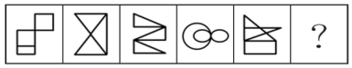
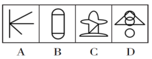

# 9月

## 9月1日

1.下列关于“讲政治”的表述不准确的是（ ）。

A.不忘初心，牢记使命是讲政治最本质的要求

B.必须提高政治识别力、政治领悟力、政治执行力

C.讲政治，概括起来说就是从政治上观察和处理问题

D.党领导人民治国理政，最重要的就是坚持正确政治方向，始终保持我们党的政治本色，始终沿着中国特色社会主义道路前进

2.党的十九届五中全会审议通过的《中共中央关于制定国民经济和社会发展第十四个五年规划和二〇三五年远景目标的建议》，明确提出到2035年建成社会主义文化强国的远景目标。关于社会主义文化强国建设目标任务，下列表述正确的有几项？（ ）

①提高社会文明程度 

②提升公共文化服务水平

③健全现代文化产业体系 

④加强对外文化交流和多层次文明对话

A.1项 

B.2项 

C.3项 

D.4项

3.国务院部署推动县域创新驱动发展工作，支持县域开展以科技创新为核心的全面创新，发挥科技创新在县域供给侧结构性改革中的支撑和引领作用。下列选项中，不符合县域创新驱动发展精神的是（ ）。

A.集聚创新创业人才，激发各类人才的创新创业活力

B.对缺乏市场竞争力的地方传统产业加大政策资金补贴力度

C.培育壮大创新型企业，支持符合条件的高成长性科技企业上市

D.加快产业转型升级，促进县域特色主导产业绿色化、品牌化、高端化、集群化发展

4.坐在火车里透过车窗观察远处的景物，下列说法正确的是（ ）。

①远处景物朝火车前进的方向旋转

②远处景物朝背离火车前进的方向旋转

③远处景物相对观察者移动快 

④远处景物相对观察者移动慢

A. ①④ 

B. ①③ 

C. ②③ 

D. ②④

5.关于农谚“小雪雪满天，来岁必丰年”涉及到的原理，下列说法错误的是（ ）。

A.新雪孔隙度高、空气多，对土壤有防冻保温作用

B.雪融化时吸收土壤内部热量，越冬虫卵不易存活

C.雪中含有大量磷化物，融化后可为土壤提供肥料

D.雪融化时进入土壤，提高土壤含水量，缓解春旱

6.风能︰核能︰资源

A.听筒︰话筒︰音乐 

B.保姆︰保安︰家政 

C.木柴︰木炭︰燃料 

D.包子︰粽子︰节庆

7.少壮不努力︰老大徒伤悲

A.不入虎穴︰焉得虎子 

B.己所不欲︰勿施于人

C.不忘初心︰方得始终 

D.若要人不知︰除非己莫为

8.把下面的六个图形分为两类，使每一类图形都有各自的共同特征或规律，分类正确的一项是（ ）。

A. ①②④，③⑤⑥ 

B. ①③⑥，②④⑤ 

C. ①②⑤，③④⑥ 

D. ①⑤⑥，②③④

9.从所给的四个选项中，选择最合适的一个填入问号处，使之呈现一定的规律性。

10.从所给的四个选项中，选择最合适的一个填入问号处，使之呈现一定的规律性。

11.10.1， 18.2， 29.4， 43.7， 58.9， （ ）

A.67.3 

B.76.11 

C.84.27 

D.105.24

12.0.2， 4.04， 20.008， （ ）

A.48.0032 

B.40.0032 

C.54.0016 

D.61.0214

13.一个工程的实施有甲、乙、丙和丁四个工程队供选择。已知甲、乙、丙的效率比为5:4:3，如果由丁单独实施，比由甲单独实施用时长4天，比由乙单独实施用时短5天。问四个队共同实施，多少天可以完成（不足1天的部分算1天）？（ ）

A.10 

B.11 

C.12 

D.13

14.100亩实验田中种植了A、B、C三种作物，三种作物亩产量分别为300、500和600千克，总产量为45吨。已知A作物的种植面积是B作物的3倍，问C作物的种植面积是B作物的多少倍？（ ）

A.2

B.2.5

C.$\frac{7}{3}$

D.$\frac{8}{3}$

15.我国一支工兵部队在非洲某国执行维和任务，负责道路抢修工作。某天，该部队负责的道路被炮弹炸出一个球面形状的大坑。经测量，弹坑直径16m，深4m，现需用车辆运送混凝土填充弹坑，铺平道路，假设每车次可运输10m3的混凝土，问抢修道路至少需要出动运输车多少车次？（ ）（球缺体积计算公式为V=，其中r为球半径，h为球缺高，V为球缺体积）

A.65 

B.66 

C.67 

D.68

16.某单位本科、研究生学历的职工人数之比为7:5。上半年公开招聘本科毕业生若干人后，本科与研究生之比为3:1；下半年通过引才计划引入研究生若干人后，本科与研究生之比为15:8。已知该年度引进的本科生比研究生多10人，则该单位原有本科与研究生学历的职工共（ ）人。

A.12 

B.24 

C.36 

D.48

17.老李家的草莓园开展采摘活动，每位游客进园可以免费吃，并且带走2斤草莓。每位游客在采摘过程中平均吃1斤草莓。目前老李家的草莓园估计有成熟草莓2000斤，并且每天还会有40斤草莓成熟，为保证采摘活动至少可以持续20天，那么平均每天最多接待（ ）位游客。

A.36 

B.46 

C.56 

D.66

18.已知易拉罐的直径为8cm，现将7个易拉罐如图捆扎在一起，那么需要（ ）cm长的绳子。（仅计算一圈的绳长）

A.4π+24 

B.4π+48 

C.8π+24 

D.8π+48
19.有若干个相同的小正方体木块，按图（1）、（2）、（3）的叠放规律摆放，则到第七个图时，第七个图中小正方体木块总数应为（ ）个。

A.25 

B.66 

C.91 

D.120

20.某公司需要将A、B两地的同一产品运往甲、乙两个工厂。已知A、B两地分别有该产品500吨和700吨，甲、乙两个工厂对该产品的需求量均为600吨，若从A地出发运往甲、乙两个工厂的运价分别为150元/吨和130元/吨，从B地出发的运价分别为160元/吨和145元/吨，则完成此项运输任务的运费最少是（ ）。

A.174000元 

B.174500元 

C.175000元 

D.175500元

## 9月2日

1.关于我国台湾，下列说法不正确的是（ ）。

A.台湾属于热带、亚热带气候

B.台湾设省后，首任巡抚是刘铭传

C.民族英雄郑成功从西班牙殖民者手中收回台湾

D.元代澎湖巡检司的设立，标志着中央政府对台湾、澎湖开始进行有效统治

2.下列关于我国科技自主可控的说法错误的是（ ）。

A.基础性技术创新关乎科技自主可控的根本

B.国产替代是我国近期和未来科技进步和工业发展的主要途径

C.当前我国科技发展的主要问题表现为“缺芯少魂”“缺芯少屏”

D.实现科技自主可控，要着力引进技术，引领关键核心领域科技崛起

3.关于目前金砖国家的基本情况，下列说法不正确的是（ ）。

A.人口占世界总人口的60%以上 

B.对世界经济增长的贡献率超过50%

C.国内生产总值约占全球总量的20% 

D.国土面积约占世界领土总面积的30%

4.一国货币升值对其进出口业务产生的影响是（ ）。

A.出口增加，进口减少 

B.出口减少，进口增加

C.出口增加，进口增加 

D.出口减少，进口减少

5.古人常用“煎茶”的方法品茶，下列诗句中，和该风俗无关的是（ ）。

A.雪乳已翻煎处脚，松风忽作泻时声 

B.汤添勺水煎鱼眼，末下刀圭搅麹尘

C.西崦人家应最乐，煮芹烧笋饷春耕 

D.新芽连拳半未舒，自摘至煎俄顷馀

6.1935年遵义会议，确定了毛泽东同志为主要代表的马克思主义正确路线在中共中央的领导地位；1945年中共七大，确立毛泽东思想为党的指导思想；1978年十一届三中全会，把党的工作重点和全国人民的注意力转移到社会主义现代化建设上来。如果为“遵义会议、中共七大、十一届三中全会”确定一个研究主题，应是（ ）。

A. 革命道路的开拓 

B. 政治体制的创建 

C. 关键时刻的抉择 

D. 建国纲领的制定

7.从所给的四个选项中，选择最合适的一个填入问号处，使之呈现一定的规律性。

8.下列选项中，符合所给图形的变化规律的是（ ）。

9.握瑜︰怀瑾︰美玉

A.南辕︰北辙︰马车 

B.金戈︰铁马︰战争 

C.敲金︰击石︰乐器 

D.锦衣︰玉食︰珍馐

10.超声波︰次声波︰军事

A.处女作︰代表作︰文学 

B.路由器︰隔离卡︰网络

C.潜水艇︰核潜艇︰科技 

D.北极星︰北斗星︰星辰

11.老师∶学生∶知识

A.父母∶子女∶家庭 

B.青蛙∶害虫∶庄稼 

C.园丁∶农田∶花朵 

D.医生∶病人∶疾病

12.

A.9 

B.18 

C.28 

D.32

13.2.5， 2， 3， 4， 10， 38， （ ）

A.92 

B.134 

C.256 

D.378

14.-1， 2， 0， 4， 4， 12，（ ）

A.4 

B.8 

C.12 

D.20

15.某公司张、王、刘、李和陈5名销售员去年共完成24个项目的销售。已知每个项目只有1人负责销售，每人都至少完成了1个项目且完成的项目数量彼此不同。张完成的项目比刘少5个，李完成的项目比陈多6个不是5人中最多的，王完成的项目最少，问张和李共完成几个项目？（ ）

A.10 

B.11 

C.12 

D.13

16.一个正方形跑道如下图所示。甲从A出发沿顺时针方向匀速跑步，其到达AB中点时，之前一直在A保持静止状态的乙也出发，沿顺时针方向以与甲相同的速度跑步。问以下哪个坐标图最能准确地描述跑步时间（横轴T值）和甲、乙之间直线距离（纵轴L值）之间的关系？（ ）

A.

B.

C.

D.

17.某企业在“十二五”期间第一年的营业额比上一年增长了1.5亿元，且往后每年的营业额增量都保持1.5亿元不变。已知该企业在“十四五”期间的营业额将是“十二五”和“十三五”期间营业额之和的80%。问该企业在“十二五”到“十四五”期间的总营业额在以下哪个范围内？（ ）

A.不到300亿元 

B.300～330亿元 

C.330～360亿元 

D.超过360亿元

18.AB两地间有县道连接，BC两地间有高速公路连接，且AB间路程是BC间路程的。郭某从A地开车匀速前往B地，到B地后以AB间2倍的速度开往C地，共用时2小时30分。由C地返回A地时高速公路行驶速度不变，县道行驶速度比去程降低，则返程用时为（ ）。

A.2小时45分 

B.2小时50分 

C.3小时10分

D.3小时15分

19.A、B两地医院分别有库存呼吸设备10台和6台，现需要支援C地医院9台、D地医院7台。已知从A地调运一台设备到C地和D地的运费分别为400元和600元，从B地调运一台设备到C地和D地的运费分别为300元和700元。如果总运费不能超过7800元，共有多少种调运方案？（ ）

A.3 

B.4 

C.5 

D.6

20.小李有一张银行卡，他忘记了密码的后3位，只记得这3个数全是奇数且有2个相同。问他尝试不超过两次就输入正确密码的概率为多少？（ ）

A.$\frac{1}{30}$

B.$\frac{1}{50}$

C.$\frac{2}{59}$

D.$\frac{2}{57}$

## 9月3日

1.下列变化过程包含化学反应的有（ ）。

①鬼火 ②光合作用 ③水垢形成 ④高粱酿酒 ⑤舞台云雾的生成

A. ②③④⑤ 

B. ①②④⑤ 

C. ①③④⑤ 

D. ①②③④

2.下列鉴别物质的方法错误的是（ ）。

A.用肥皂水鉴别硬水与软水 

B.用稀硫酸鉴别锌片与铜片

C.用酚酞试液鉴别纯碱与烧碱 

D.用燃着的木条鉴别氧气与二氧化碳

3.生活富裕是乡村振兴的主要目的，为此应当建立促进农民增收的长效机制真正让农民的钱袋子鼓起来。下列做法属于建立农民增收长效机制的是（ ）。

A.甲乡向贫困家庭增发生活补贴 

B.乙乡保持粮食种植面积的稳定

C.丙乡加快推进“合村并居”的工作

D.丁乡邀请专家指导专业户解决技术难题

4.“朝辞白帝彩云间，千里江陵一日还。”李白在诗句里描述自己的行程是从现在的（ ）到（ ）。

A.重庆 湖北 

B.湖南 四川

C.重庆 江苏 

D.湖南 江苏

5.下列与丝绸之路无关的名胜古迹是（ ）。

A. 敦煌莫高窟 

B. 克孜尔千佛洞 

C. 洛阳白马寺 

D. 云冈石窟

6.某大学研究人员首次用嗜黏蛋白阿克曼氏菌进行小规模人体试验。32名超重或肥胖的志愿者被分为3组，分别每天口服活的嗜黏蛋白阿克曼氏菌、经过巴氏消毒法灭活的这种细菌和安慰剂，同时不改变饮食和运动习惯。结果显示，3个月后服用灭活细菌的志愿者对胰岛素敏感性提高，血浆总胆固醇水平降低。服用安慰剂的志愿者体内上述指标继续恶化。

由此可以推出（ ）。

A.服用该灭活菌能改善人体的代谢状况

B.该菌灭活后降低糖尿病的效果甚至好于活细菌

C.服用该菌能够降低罹患心血管疾病和糖尿病的风险

D.肥胖者可以将该灭活菌作为膳食补充剂达到减肥的目的

7.铭心刻骨︰记忆

A.冥思苦想︰思想 

B.繁花似锦︰繁华 

C.闭月羞花︰容貌 

D.冷若冰霜︰冷漠

8.从所给的四个选项中，选择最合适的一个填入问号处，使之呈现一定的规律性。

9.塑料∶容器

A.石灰∶水泥 

B.陶瓷∶餐具 

C.桥墩∶桥梁 

D.木材∶木头

10.蚍蜉∶大树

A.石头∶鸡蛋 

B.狮子∶兔子 

C.鱼肉∶刀俎 

D.螳螂∶马

11.23， 14， 37， 55， 78， （ ）

A.53 

B.69 

C.81 

D.93

12.$2,2,\frac{3}{2},1,\frac{5}{8},(\space\space)$

A.$\frac{3}{8}$

B.0

C.$\frac{7}{16}$

D.$\frac{3}{4}$

13.小张和小李负责生产1200个零件，小张每天均生产20个。小李第一天生产10个，往后除最后一天外，每一天的产量都比前一天多1个。问整个任务中小张生产的个数比小李（ ）。

A.多40个 

B.多80个 

C.少40个 

D.少80个

14.一车救灾物资从早上8点起开始运往1900公里外的某地，白天平均车速80公里/小时，夜间60公里/小时（假定8:00到18:00为白天，其他时段为夜间），司机每驾驶2小时必须休息20分钟，且每名司机每天驾驶时间不能超过8小时（00:00后即为新的一天）。问车上至少应配备几名司机且至少要用多长时间才能抵达该地？（ ）

A.3名；27小时15分 

B.3名；27小时25分 

C.4名；33小时30分 

D.4名；33小时40分

15.一辆垃圾转运车和一辆小汽车在一段狭窄的道路上相遇，必须其中一辆车倒车让道才能通过。已知小汽车倒车的距离是转运车的9倍，小汽车的正常行驶速度是转运车的3倍，如果小汽车倒车速度是其正常速度的六分之一，垃圾转运车倒车速度是正常速度的五分之一，问应该由哪辆车倒车才能使两车尽快通过？（ ）

A.小汽车 

B.垃圾转运车 

C.两车均可 

D.无法计算

16.某公园鸟语林共饲养180只鸟。为养护方便，园方将鸟语林分为A、B、C三个区。某日，A区的一部分鸟飞至B、C两区，清点时B、C两区鸟的数量都增加一倍。次日，一些鸟又从B区飞至A、C两区，清点时A、C两区鸟的数量也都增加一倍。第三日，一部分鸟又从C区飞至A、B两区，清点时A、B两区鸟的数量同样增加一倍，而此时C区剩余鸟的数量恰好是A区的。那么，最初A区有多少只鸟？（ ）

A.103 

B.104 

C.105 

D.106

17.某市江滨有一处边长为50米的等边三角形广场。广场里设计有三个大小相等的圆环鹅卵石道路供市民散步。如右图所示，各圆相切，各圆与三角形也相切，问沿三个圆环外围石道（不含圆切点之间的弧）散步一圈约为多少米？（ ）

A.95 

B.105 

C.115 

D.125

18.大江两岸有两个正面相对的码头，可供客轮往返。如下图所示，根据河流水文情况，“幸福号”客轮星期一沿着河岸60度夹角方向前行，刚好到达对岸码头；星期二“幸福号”准备返回时，发现河流水文情况发生变化，船长调整航向，沿河岸30度夹角方向返回，顺利到达码头。假设客轮往返速度是V千米/小时，且行驶过程中河水流速是恒定的，问返程时河水流速是去程时的多少倍？（ ）

A.$\sqrt3$

B.$\frac{\sqrt3}{3}$

C.$\frac{1}{2}$

D.2

19.某商场为了促销，进行掷飞镖游戏。每位参与人员投掷一次，假设掷出的飞镖均扎在飞镖板上且位置完全随机，扎中阴影部分区域（含边线）即为中奖。该商场预设中奖概率为60%，仅考虑中奖概率的前提下，以下四幅图形（图中的正三角形和正方形均与圆外切或内接）最适合作为飞镖板的是（ ）。

A.

B.

C.

D.

20.从正九边形的顶点中任选3个作为顶点绘制三角形，问其中等腰三角形占全部可画出三角形的比例在以下哪个范围内？（ ）

A. 低于28% 

B. 在28%到33%之间 

C. 在33%到40%之间 

D. 高于40%

## 9月6日

1.长征是宣言书，长征是宣传队，长征是播种机，下列《长征组歌》中的诗句，按所反映事件发生的先后顺序排列正确的是（ ）。

①六盘山上红旗展，势如破竹扫敌骑

②昼夜兼程二百四，猛打穷追夺泸定

③雪山低头迎远客，草毯泥毡扎营盘 

④战士双脚走天下，四渡赤水出奇兵

A. ③①④② 

B. ③④②① 

C. ④③①② 

D. ④②③①

2.下列先烈的书信，按时间先后排序正确的是（ ）。

①“看最近之情况，敌人或要再来碰一下钉子。只要敌来犯，兄即到河东与弟等共同去牺牲。……更相信，只要我等能本此决心，我们的国家及我五千年历史之民族，决不致于亡于区区三岛倭奴之手。”

②“志兰！亲爱的，别时容易见时难，分离二十一个月了，何日相聚？愿在党的整顿之风下各自努力，力求进步吧！以进步来安慰自己，以进步来酬报别后衷情。”

③“母亲因为坚决地做了反满抗日的斗争，今天已经到了牺牲的前夕了。……母亲不用千言万语来教育你，就用实行来教育你。在你长大成人之后，希望不要忘记你的母亲是为国而牺牲的！”

④“山东交涉及北京学界之举动，迪纯兄归，当知原委。……现每日有游行演讲，有救国日刊，各举动积极进行，但取不越轨范以外，以稳健二字为宗旨。”

A. ③④②① 

B. ④②①③ 

C. ③④①② 

D. ④③①②

3.下列谚语不涉及二十四节气的是（ ）。

A.花木管时令，鸟鸣报农时 

B.白露身不露，寒露脚不露

C.日晕三更雨，月晕午时风 

D.秋分早霜降迟，寒露种麦正当时

4.迁徙是鸟类遵循大自然环境的一种生存本能反应，每年全世界都有数以亿计的候鸟在相隔成千上万公里的繁殖地和越冬地之间往返迁徙。在我国古代常有读书人对此种震撼的自然景象进行描述，以下诗句不是描述候鸟迁徙的是（ ）。

A.木落雁南度，北风江上寒 

B.洞庭一夜无穷雁，不待天明尽北飞

C.征蓬出汉塞，归雁入胡天 

D.鸿雁于飞，肃肃其羽

5.下列与生物灾害有关的说法错误的是（ ）。

A.中国蝗灾最严重的地区是两湖地区 

B.稻飞虱的天敌有蜘蛛、青蛙

C.松毛虫在高温干旱环境下更易繁殖 

D.鼠类会啃食庄稼的茎、叶、根和种子

6.要想使右侧图形在不旋转的情况下拼合成左侧的正方体造型，还需在问号处添加的图形是（ ）。

7.下列选项中，符合所给图形变化规律的是（ )。

8.紫外线∶红外线∶阳光

A.氦气∶惰性气体∶空气 

B.红细胞∶白细胞∶血液

C.月亮∶地球∶太阳系 

D.油料作物∶饲料作物∶庄稼

9.讷言敏行∶《论语》

A.草木皆兵∶《三国演义》 

B.运筹帷幄∶《左传》

C.食言而肥∶《史记》 

D.饮鸩止渴∶《后汉书》

10.请从所给的四个选项中，选择最合适的一个填在问号处，使之呈现一定的规律性。

8GG8EG ？

A.7KK4HK 

B.4DD4WD 

C.6EE6EG 

D.8UUU8Y

11.

| 4    | 5    | 7    |
| ---- | ---- | ---- |
| 8    | 8    | 16   |
| 12   | 9    | 27   |
| 16   | 10   | ?    |

A.16 

B.27 

C.38 

D.49

12.1， 2， 9， 64， 625， （ ）

A.1728 

B.345 

C.5184 

D.7776

13.实验室有A、B、C三个实验试管，分别装有10克、15克、20克的水，小明把含有一定浓度的10克药水倒进A试管中，混合后取出10克倒入B试管中，再次混合后，从B试管中取出10克倒入C试管中，最后用化学仪器检测出C试管中药水浓度为2%。试计算刚开始倒入A试管中药水的浓度是多少？（ ）

A.10% 

B.20% 

C.30% 

D.40%

14.小李带女儿在健身步道上比赛，他让女儿先跑24步，然后他出发去追她，已知女儿跑12步的距离等于小李跑8步的距离，女儿跑4步的时间小李只能跑3步，则小李要跑（ ）步才能追上女儿。

A.18 

B.36 

C.72 

D.144

15.某新型建材生产车间计划生产480个建材，当生产任务完成一半时，暂时停止生产，对器械进行维修清理，用时20分钟。恢复生产后工作效率提高了三分之一，结果完成任务时间比原计划提前了40分钟，问对器械进行维修清理后每小时生产多少个建材？（ ）

A.80 

B.87 

C.94 

D.102

16.五年级一班共有55个学生，在暑假期间都参加了特长培训班，35人参加书法班，28人参加美术班，31人参加舞蹈班，其中以上三种特长培训班都参加的有6人，则有多少人只参加了一种特长培训班？（ ）

A.45 

B.33 

C.29 

D.22

17.甲到飞机场坐飞机，飞机场的十二个登机口排成一条直线，相邻两个登机口之间相距50米。甲在登机口等待时被告知登机口更改了，那么甲走到新登机口的距离不超过200米的概率是（ ）。

A.$\frac{1}{2}$

B.$\frac{4}{11}$

C.$\frac{8}{11}$

D.$\frac{19}{33}$

18.某企业选拔170多名优秀人才平均分配为7组参加培训。在选拔出的人才中，党员人数比非党员多3倍，接受培训的党员中的10%在培训结束后被随机派往甲单位等12个基层单位进一步锻炼。已知每个基层单位至少分配1人，问甲单位分配人数多于1的概率在以下哪个范围内？（ ）

A.不到14% 

B.14%～17%之间 

C.17%～20%之间 

D.超过20%

19.一种设备打九折出售，销售12件与原价出售销售10件时获利相同。已知这种设备的进价为50元/件，其他成本为10元/件。问如打八折出售，1万元最多可以买多少件？（ ）

A.80 

B.83 

C.86 

D.90

20.某商业街复工复产之后，向消费者发放满50元减10元、满100元减30元的电子优惠券各若干张，并规定消费者在商户处完成交易并核销电子优惠券后，商户可以免除等同于核销优惠券减免金额75%的店面租金。促销期内，商户共核销优惠券15.6万张，通过核销优惠券方式减免租金219万元。问该次促销中，消费者实际支付金额可能的最低值在以下哪个范围内？（ ）

A.不到750万元 

B.750～800万元之间

C.800～850万元之间 

D.超过850万元

## 9月7日

1.喜欢旅游的赵某准备在今年夏天去爬三座名山，计划从黄河或者长江发源地出发，沿黄河或长江其中一条干流流经省份由西向东走，下列肯定不是其规划路线的是（ ）。

A.华山—五台山—泰山 

B.昆仑山—青城山—黄山

C.峨眉山—衡山—庐山 

D.井冈山—武当山—嵩山

2.下列有关我国2020年科技成就的说法正确的是（ ）。

A.2020年12月，嫦娥五号返回器成功着陆，这是我国首次完成月球采样返回任务

B.我国研制的“奋斗者”号载人潜水器于2020年11月坐底菲律宾海沟，创造了我国载人深潜新纪录

C.中国环流器二号M装置于2020年底建成并实现首次放电，为我国核裂变堆的设计建造打下了坚实基础

D.2020年7月，北斗三号全球卫星导航系统全面建成并开通服务，我国成为第四个独立拥有全国卫星导航系统的国家

3.下列关于第七次全国人口普查工作有关表述不正确的是（ ）。

A.本次普查首次采集普查对象身份证号，以实现与公安、卫健等部门行政记录的比对核查

B.本次普查采用全面调查的方法，以人为单位进行登记，普查对象可通过互联网自助填报

C.普查短表包括反映人口基本状况的项目，由全部住户（不含港澳台居民的外籍人员）填报

D.根据《全国人口普查条例》，人口普查工作每10年进行一次，尾数逢0的年份为普查年度

4.下列关于我国生态环境保护方面的说法不准确的是（ ）。

A.第二次全国污染源普查结果显示，我国主要污染物排放量大幅下降

B.我国生态环境保护三大保卫战指的是蓝天保卫战、碧水保卫战和净土保卫战

C.“无废城市”是一种先进的城市管理理念，实现了固体废物的完全资源化利用

D.新修订的《中华人民共和国森林法》自2020年7月1日起施行，此次修订将森林生态效益补偿写入了法律

5.政策议程，即提上政府议事日程，纳入政府决策的过程，本质上是社会各阶层、各利益团体和人民群众反映和表达自己的愿望和要求，促使政策制定者制定政策予以满足的过程。政策议程建立的关键在于（ ）。

A.政策方案选择 

B.将社会问题转化为政策问题 

C.政策执行 

D.政策制定

6.从所给的四个选项中，选择最合适的一个填入问号处，使之呈现一定的规律性。

7.从所给的四个选项中，选择最合适的一个填入问号处，使之呈现一定的规律性。

8.巴蜀︰燕赵

A. 京津︰淮海 

B. 闽越︰荆湘 

C. 齐鲁︰秦晋 

D. 殷商︰云贵

9.能源︰核能︰核武器

A.材料︰木材︰家具 

B.运动︰游泳︰泳衣 

C.网络︰网站︰网友 

D.手机︰计时器︰闹钟

10.老鹰∶树枝∶天空

A.蜜蜂∶蜂箱∶花丛 

B.蟒蛇∶山涧∶森林 

C.蚊子∶沟渠∶野外 

D.鲈鱼∶江河∶海洋

11.2， 12， 28， 56， 102， 172， （ ）

A.202 

B.214 

C.242 

D.272

12.40， 56， 78， 106， 122， （ ）， 172

A.137 

B.144 

C.148 

D.166

13.老张7月份出差回来后，将办公室的日历连续翻了10张，这些日历的日期之和为265。老张几号上班？（ ）

A.20 

B.4 

C.2 

D.1

14.一个容器内有一定量盐水，第一次加入适量水后，容器内盐水浓度为3%，第二次再加入同样多水后，容器内盐水浓度为2%，则第三次加入同样多的水后盐水浓度为（ ）。

A.0.5% 

B.1% 

C.1.2% 

D.1.5%

15.某蔬菜种植基地有甲、乙两个圆柱形蓄水池，它们的底面积之比为4:3，甲池中水深8m，乙池中水深5m，再往两个蓄水池注入同样多的水，直到两个蓄水池水深相等，则甲蓄水池的水面上升（ ）。

A.12m 

B.18m 

C.9m 

D.6m

16.某单位发当月的工资，已知甲的工资为4500元，若甲取出工资的75%，乙取出工资的，则甲的工资余额是乙的工资余额一半，那么乙当月的工资是多少元？（ ）

A.1125 

B.3375 

C.4500 

D.6000

17.一直角三角形的两直角边的长度之和为14，假如这个三角形的周长与面积数值相等，那么该三角形的面积为（ ）。

A.20 

B.22.5 

C.24 

D.24.5

18.某通讯公司对3542个上网客户的上网方式进行调查，其中1258个客户使用手机上网，1852个客户使用有线网络上网，932个客户使用无线网络上网。如果使用不只一种上网方式的有352个客户，那么三种上网方式都使用的客户有多少个？（ ）

A.148 

B.248 

C.350 

D.500

19.某乡镇对集贸市场36种食品进行检查，发现超过保质期的7种，防腐添加剂不合格的9种，产品外包装标识不规范的6种。其中，两项同时不合格的5种，三项同时不合格的2种。问三项全部合格的食品有多少种？（ ）

A.14 

B.21 

C.23 

D.32

20.要把21棵桃树栽到街心公园里5处面积不同的草坪上，如果要求每块草坪必须有树且所栽棵数要依据面积大小各不相同，面积最大的草坪上至少要栽几棵？（ ）

A.7 

B.8 

C.10 

D.11

## 9月8日

1.战国时期各国纷纷变法图强，对社会生产显著影响。下列事件最不可能发生的是（ ）。

A.楚国某没落贵族被取消爵禄

B.燕国某人因无地来到秦国，秦国划给他一块荒地

C.秦国某人因将自己的三亩良田卖予他人，被处以刖刑

D.魏国某人粮食大丰收，官府派人来平价收购了他的余粮

2.下列有关我国抗美援朝战争的说法正确的是（ ）。

A.志愿军与美军第一次交锋，是在仁川登陆战

B.抗美援朝战争中，中国人民志愿军的司令员是粟裕

C.中国人民志愿军在战争中涌现出一大批英雄官兵，杨根思、黄继光、解秀梅是其中的优秀代表

D.2020年是抗美援朝出国作战70周年，我国拍摄了《金刚川》《芳华》等一系列影视作品展现志愿军英勇无畏的优秀品质

3.下列情形不可能发生的是（ ）。

A.唐代安史之乱导致北方农业受损失，农民不得不以红薯为主食

B.明末英国瓷器商人评论曾看过的《牡丹亭》《罗密欧与朱丽叶》

C.明代随郑和访问斯里兰卡的水手，听说东晋法显曾在当地游学

D.清代随隐元禅师到日本的僧人，到奈良唐招提寺瞻仰鉴真塑像

4.下列关于历代正式行政区划的描述正确的是（ ）。

A.秦代：郡—县 

B.唐代：道—州、府—县 

C.汉代：州—郡—县 

D.宋代：路—军、州—县

5.在铅笔上，常常印着“6B”“4H”或者“HB”的字样，这些字样代表着铅笔的软硬。“B”代表软，“H”代表硬，前边的阿拉伯数字代表软硬的程度，“HB”则代表软硬适中。如果你要选择铅笔分别用来画画、写字、制图，相应选择的铅笔类型分别为（ ）。

A.6H 4B HB 

B.HB 6H 4B

C.4B HB 6H 

D.HB 4B 6H

6.从所给的四个选项中，选择最合适的一个填入问号处，使之呈现一定的规律性。

7.从所给的四个选项中，选择最合适的一个填入问号处，使之呈现一定的规律。

8.锦上添花∶雪上加霜

A.美不胜收∶目不暇接 

B.耀武扬威∶弃甲曳兵

C.水滴石穿∶磨杵成针 

D.雨后春笋∶每况愈下

9.锁具∶保安员∶安全

A.日月∶星辰∶光明 

B.航母∶导弹∶战争

C.手镯∶项链∶美观 

D.画框∶纽扣∶装饰

10.侦探∶线索∶结论

A.医生∶病情∶诊断 

B.交警∶违章∶罚单

C.裁缝∶针线∶衣服 

D.学生∶复习∶成绩

11.数列：（3，4），（6，8），（13，15），（27，29），（ ）

A.（53，55） 

B.（54，55） 

C.（55，57） 

D.（56，58）

12.木工师傅为下图所示的3层模具刷漆，每层模具分别由1、3、6个边长1米的正方形组成。如果用一公斤漆可以刷20平方米的面积。那么为这个3层模具的所有外表面上色，需要几公斤漆？（ ）

A.1.8 

B.1.6 

C.1.5 

D.1.2

13.某公司的6名员工一起去用餐，他们各自购买了三种不同食品中的一种，且每人只购买了一份。已知盖饭15元一份，水饺7元一份，面条9元一份，他们一共花费了60元。问他们中最多有几人买了水饺？（ ）

B.2 

A.1 

C.3 

D.4

14.有两个三口之家一起出行去旅游，他们被安排坐在两排相对的座位上，其中一排有3个座位，另一排有4个座位。如果同一个家庭成员只能被安排在同一排座位相邻而坐，那么共有多少种不同的安排方法？（ ）

A.36 

B.72 

C.144 

D.288

15.甲从A地到B地需要30分钟，乙从B地到A地需要45分钟，甲乙两人同时从A、B两地相向而行，中间甲休息了20分钟，乙也休息了一段时间，最后两人在出发40分钟后相遇。问乙休息了多长时间？（ ）

A.25 

B.20 

C.15 

D.10

16.某篮球比赛14:00开始，13:30允许观众入场，但早有人来排队等候入场，假设从第一个观众来到时起，每分钟来的观众人数一样多，如果开3个入场口，13:45时就不再有人排队；如果开4个入场口，13:40就没有人排队，那么第一个观众到达的时间是（ ）。

A.13:00 

B.13:05 

C.13:10 

D.13:15

17.某蓄水池有一进水口A和一出水口B，池中无水时，打开A口关闭B口，加满整个蓄水池需2小时；池中满水时，打开B口关闭A口，放干池中水需1小时30分钟。现池中有占总容量的水，问同时打开A、B口，需多长时间才能把蓄水池放干？（ ）

A.90分钟 

B.100分钟 

C.110分钟 

D.120分钟

18.某单位依据笔试成绩招录员工，应聘者中只有被录取。被录取的应聘者平均分比录取分数线高6分，没有被录取的应聘者平均分比录取分数线低10分，所有应聘者的平均分是73分。问录取分数线是多少分？（ ）

A.80 

B.79 

C.78 

D.77

19.公司安排6位新员工共同参加一次为期两天的活动，6个人围成一个圆桌进行交流。为促进新员工间的互动，如果要求第二天每个人身边坐着的两个人都与第一天不同，则新员工们有多少种座位安排方式？（ ）

A.5 

B.6 

C.7 

D.8

20.甲公司的马经理从本公司坐车到乙公司洽谈，以30千米/时的速度出发20分钟后，马经理发现文件忘带了，便让司机以原来1.5倍的速度回甲公司拿，而他自己则以5千米/时的速度步行到乙公司。结果司机和马经理同时到达乙公司。甲乙两公司的距离是多少千米？（ ）

A.12.5 

B.13 

C.13.5 

D.14

## 9月9日

1.下列哪一诗句的主题与其他三项不同？（ ）

A.南有乔木，不可休思。汉有游女，不可求思

B.呦呦鹿鸣，食野之苹。我有嘉宾，鼓瑟吹笙

C.野有蔓草，零露漙兮。有美一人，清扬婉兮

D.风雨如晦，鸡鸣不已。既见君子，云胡不喜

2.一个生活在“文景之治”时期的读书人，不可能看到的书籍是（ ）。

A.《吕氏春秋》 

B.《孙子兵法》 

C.《世说新语》 

D.《诗经》

3.习近平总书记2020年11月在江都水利枢纽展览馆参观时指出：“南水北调工程这是国之大事、世纪工程，民心工程。同三峡工程是等量齐观的”。关于南水北调，下列说法不正确的是（ ）。

A.南水北调东线工程的源头是江苏扬州的江都水利枢纽

B.南水北调工程连接了长江、黄河、淮河、松花江四大流域

C.南水北调工程把秦岭－淮河一线以南的水调入以北的干旱地区

D.南水北调工程沿线需要修建大量翻水泵站是因为南北水位落差大

4.“一骑红尘妃子笑，无人知是荔枝来”讲的是唐玄宗为取悦杨贵妃而不惜命人从现在的广东和（ ）乘驿马兼程运送新鲜荔枝。

A.浙江 

B.四川 

C.海南 

D.福建

5.下列行为当事人不服可以申请行政复议的是（ ）。

A.公安交警对违章停车的王某作出罚款处罚

B.县法院对不履行生效判决的李某进行拘留

C.物业公司通知业主郑某缴纳逾期一年的物业服务费及其利息

D.高速交警总队在高速公路电子显示屏上提示“超速驾驶一律处罚”

6.下列选项中，可以由下图折叠而成的立体图是（ ）。

7.从所给的四个选项中，选择最合适的一个填入问号处，使之呈现一定的规律性。

8.失眠∶睡意

A.饥饿∶食欲 

B.营养∶干枯 

C.窒息∶氧气 

D.麻木∶悲伤

9.胃口∶兴趣

A.心腹∶器官 

B.黑马∶比赛 

C.桃李∶学生 

D.亲人∶骨肉

10.先礼∶后兵

A.居安∶思危 

B.头重∶脚轻 

C.鞍前∶马后 

D.生离∶死别

11.4， 11， 27， 61， （ ）

A.106 

B.117 

C.131 

D.163

12.10， 12， 15， 20， 30， （ ）

A.35 

B.45 

C.60 

D.76

13.一个不计厚度的圆柱型无盖透明塑料桶，桶高2.5分米，底面周长为24分米，AB为底面直径。在塑料桶内壁桶底的B处有一只蚊子，此时，一只壁虎正好在塑料桶外壁的A处，则壁虎从外壁A处爬到内壁B处吃到蚊子所爬过的最短路径长约为（ ）。

A.10分米 

B.12.25分米 

C.12.64分米 

D.13分米

14.某县政府组织干部职工开展党建知识竞赛，其中甲、乙两镇参赛人数之比为4:3，甲镇有8人、乙镇有24人没有参加竞赛。已知甲、乙两镇干部职工人数之比为5:6，则乙镇的干部职工比甲镇多（ ）人。

A.8 

B.7 

C.6 

D.5

15.某通信信道可以传输的信号由1、2、3、4四个数字组成，每组信号包含4个数字（可重复），且前两个数字必须为奇数。某次传输过程中共传输了250组信号，其中传输次数最多的信号传输了x次。问x的最小值为（ ）。

A.2 

B.3 

C.4 

D.5

16.甲、乙两家公司共同实施某个项目，甲公司的实际出资额比乙公司高60万元，投入人力是乙公司的一半，如将人力折算为出资额，则最终两家公司分得的利润相同。问两家公司投入的人力之和折算为多少万元的出资额？（ ）

A.240 

B.180 

C.120 

D.60

17.假设三颗小行星绕着一颗恒星运动，它们的运行轨道都是圆形，每条轨道的圆心都是该恒星。且三条轨道都在同一平面内。若这三颗小行星同向旋转，且绕轨道运行一周的时间分别是60年、84年、140年。现在三颗小行星和恒星在同一直线上且三颗小行星都在恒星的同侧，那么至少（ ）年后他们再次在同一直线上且三颗小行星都在恒星的同侧。

A.210 

B.315 

C.420 

D.630

18.安排4名护士护理3个病房，每个病房至少一名护士，每名护士固定护理一个病房，则共有（ ）种安排方法。

A.24 

B.36 

C.48 

D.72

19.某三甲医院派甲、乙、丙、丁四名医生到A、B、C、D四个社区义诊，每个医生只负责一个社区。已知甲不去A社区，且如果丙去C社区，那么丁去D社区，则不同的派法共有（ ）。

A.15种 

B.18种 

C.21种 

D.24种

20.超市销售某种水果，第一天按原价售出总量的60%，第二天原价打8折售出剩下的一半，第三天按成本价全部售出。若销售全部该水果的利润率为34%，则该水果按原价销售的利润率为（ ）。

A.68% 

B.51% 

C.50% 

D.36%

## 9月10日

1.《首都功能核心区控制性详细规划（街区层面）（2018年～2035年）》提出，要全面强化老城空间的整体性，加强九坛八庙保护。关于九坛八庙，下列说法中错误的是（ ）。

A.天坛为明清两代帝王祭天的场所 

B.明清两代帝王每年秋分时在日坛祭日

C.太庙是明清两代皇帝祭奠祖先的家庙 

D.雍和宫先为雍亲王府，后成为藏传佛教寺庙

2.下列古代建筑工程按照建造时间先后顺序排列正确的一项是（ ）。

A.都江堰 秦始皇陵 未央宫 大明宫

B.秦始皇陵 都江堰 大明宫 未央宫

C.未央宫 秦始皇陵 都江堰 大明宫

D.大明宫 都江堰 秦始皇陵 未央宫

3.以下城市夏季的白昼时间由长到短排列的是（ ）。

A.长沙—郑州—天津—沈阳 

B.杭州—西安—武汉—合肥

C.海口—兰州—上海—太原 

D.长春—北京—南京—广州

4.关于中东国家，下列说法不正确的是（ ）。

A.伊朗是阿拉伯国家 

B.叙利亚是伊斯兰国家

C.以色列大多数人信仰犹太教 

D.埃及是第一个与我国建交的中东国家

5.2020年10月28日，某地24名居民网购了进口冷链食品，后该批食品新冠病毒核酸检测结果呈阳性，24名居民被公安机关罚款200元。12月11日，该地疫情防控指挥部通报承认处理不当，罚款由原行政处罚机关撤销。这起事件中，公安机关的罚款行为主要违反了行政处罚法的哪一项原则？（ ）

A. 处罚法定原则 

B. 保障相对人权利原则 

C. 一事不再罚原则 

D. 处罚与教育相结合原则

6.下图给定的是由18个相同大小的正方体组合成的多面体，这个多面体可以切割为3个完全相同的小多面体，问切割成的小多面体是（ ）。

7.从所给的四个选项中，选择最合适的一个填入问号处，使之呈现一定的规律性。

8.道教∶基督教∶基督新教

A.软件∶程序∶游戏 

B.怀表∶手表∶电子表

C.淡水湖∶咸水湖∶死海 

D.含羞草∶茉莉花∶玫瑰花

9.亏损率∶收益率

A.就业率∶失业率 

B.死亡率∶出生率 

C.升学率∶辍学率 

D.月利率∶年利率

10.大米∶大米粥

A.蜘蛛∶蜘蛛网 

B.玻璃∶玻璃水 

C.马尾∶马尾辫 

D.图书∶图书馆

11.2， 3， 7， （ ）， 121， 721

A.11 

B.17 

C.19 

D.25

12.2， 7， 28， 63， 126， （ ）

A.215 

B.150 

C.119 

D.178

13.将5个相同的圆锥体零件表面涂上红、黄、蓝三种颜色。要求同一个零件的底面只能用一种颜色，同一个零件的斜面也只能用一种颜色，且5个零件的颜色彼此不完全相同，问总共有多少种不同的涂色方式？（ ）

A.84 

B.126 

C.172 

D.180

14.将15名实习生名额随机分配给12个部门，每个部门至少分配1人。问有部门获取的名额是3的概率是有部门获取的名额是4的概率的多少倍？（ ）

A.5.5 

B.6 

C.11 

D.1

15.商场有大、小两种果篮销售，每个小号果篮由500克火龙果、300克葡萄和700克橙子组成，每个大号果篮由700克火龙果、1300克葡萄和1000克橙子组成。某日通过果篮方式销售水果超过300千克，其中是葡萄。问当日至少销售了多少千克火龙果？（ ）

A.不到85千克 

B.85～87千克 

C.87～89千克 

D.超过89千克

16.为响应党中央“绿水青山就是金山银山”号召，某地投入500万元用于植树造林、河流治理和野生动物保护三项工作。已知植树造林投资比河流治理投资的1.2倍少56万元，野生动物保护投资比投资额最高项目的投资少68万元。问投资额第二高的项目投入了多少万元？（ ）

A.178 

B.180 

C.182 

D.184

17.小王从甲公司跳槽到乙公司，年工资总额增长25%，乙公司的工资总额包括现金部分和股票部分，现金总额和股票价值总额比例为3:1，股票价值按照签订合同当日股票收盘价计算。一年后公司由于重大变动股价比小王入职时下跌48%，如果按此时股价计算，小王在乙公司工作一年获得的实际工资总额与在甲公司相比（ ）。

A.下降10% 

B.下降15% 

C.增长10% 

D.增长15%

18.一本书每页的每一面都有页码，页码1出现在右手页，且最后一页的页码为242。己知该书中有1页缺失，缺失页不是第一页也不是最后一页，且剩余部分的页码之和正好是缺失页两面页码之和的整数倍。问满足条件的缺失页有多少种不同的可能性？（ ）

A.5 

B.6 

C.7 

D.8

19.为实现精准扶贫，某县政府工作人员对辖区内所有贫困户进行走访。已知第一周走访的户数为贫困户总户数的46%，第二周走访的户数是两周后剩余未走访户数的1.2倍。问两周后最少还有多少户贫困户未走访？（ ）

A.45 

B.90 

C.135 

D.180

20.某围场的形状为边长100米的等边三角形，在场地正中修建一座信号塔，塔顶安装有效覆盖半径为米的信号发射器。如要信号覆盖整个围场的地面，则信号塔的高度最高为多少米？（ ）

A.$15\sqrt5$

B.$10\sqrt7$

C.$5\sqrt21$

D.$11\sqrt21$

## 9月11日

1.2020年11月，习近平总书记在江苏考察期间，专程前往南通参观张謇生平介绍展陈，称赞张謇是我国民族企业家的楷模。下列关于张謇的说法与史实不符的是（ ）。

A. 张謇是我国棉纺织业的早期开拓者 

B. 张謇是我国民办师范教育的开放开创者

C. 张謇是我国造船和海运业的奠基者 

D. 张謇是我国首座公共博物馆的创办者

2.抗美援朝战争的胜利使得新中国真正站稳了脚跟，可谓“打得一拳开，免得百拳来”。对于这一论断，下列理解最准确的是（ ）。

A.抗美援朝战争粉碎了侵略者陈兵国门，进而将新中国扼杀在摇篮之中的图谋

B.抗美援朝战争深刻塑造了第二次世界大战结束以后亚洲乃至世界的格局

C.抗美援朝战争奠定了新中国在国际事务中的重要地位，彰显了新中国大国地位

D.抗美援朝战争使人民军队取得了重要军事经验，极大促进了国防和军队现代化

3.下列哪一项不是新疆出土的文物？（ ）

A.阿斯塔那伏羲女娲图 

B.司禾府印

C.透雕人鸟兽玉饰件 

D.“五星出东方利中国”

4.下列四个节日中，杭州市白昼最长的是（ ）。

A.元旦 

B.劳动节 

C.儿童节 

D.国庆节

5.按照我国法律的相关规定，高级人民法院院长由（ ）选举。

A.自治区、设区的市的人民代表大会常务委员会

B.省（自治区、直辖市）的人民代表大会常务委员会

C.自治区、设区的市的人民代表大会

D.省（自治区、直辖市）的人民代表大会

6.把下面的六个图形分为两类，使每一类图形都有各自的共同特征或规律，分类正确的一项是（ ）。

A. ①③④，②⑤⑥ 

B. ①③⑤，②④⑥

C. ①②⑥，③④⑤ 

D. ①④⑥，②③⑤

7.把下面的六个图形分为两类，使每一类图形都有各自的共同特征或规律，分类正确的一项是（ ）。

A. ①②④，③⑤⑥ 

B. ①③⑤，②④⑥

C. ①③⑥，②④⑤ 

D. ①⑤⑥，②③④

8.水生动物∶卵生动物

A.腔肠动物∶软体动物 

B.甲壳纲动物∶节肢动物

C.飞行动物∶哺乳动物 

D.脊椎动物∶无脊椎动物

9.桂∶广西

A.皖∶江西 

B.杜鹃花∶映山红 

C.河流∶湖泊 

D.西红柿∶圣女果

10.被告人∶法庭∶罪犯

A.江水∶水电站∶交流电 

B.投资者∶市场∶消费者

C.高中生∶学习∶大学生 

D.种子∶试验田∶农作物

11.1， 6， 5， 7， 2， 8， 6， 9， （ ）

A.1 

B.2 

C.3 

D.4

12.243， 162， 108， 72， 48，（ ）

A.26 

B.28 

C.30 

D.32

13.某工厂的工号为5位数字。甲乙两个工人工号五位数字连乘之积都等于1764，但是甲的工号五位连加之和比乙的大4。问乙的工号为？（ ）

A.13677 

B.22779 

C.23677 

D.33477

14.进入某比赛四强的选手通过抽签方式随机分成2组进行半决赛，已知小王在面对任何对手时获胜的概率都是60%，小张在面对任何对手时获胜的概率都是40%。问小王和小张均在半决赛中获胜的概率为？（ ）

A.$\frac{2}{15}$

B.$\frac{4}{15}$

C.$\frac{3}{25}$

D.$\frac{4}{25}$

15.甲、乙、丙三人投资成立一家公司，初期共投入700万元。公司估值上涨50%时三人进行了二期投资，甲投入了与其初期投资相同的金额，乙投入了其初期投资金额的2倍，丙投入了其初期投资金额的$\frac{1}{2}$，二期总投入刚好也是700万元，此时甲、乙、丙三人的持股比例为5:14:16，那么初期投资乙比甲投入（ ）。

A.多100万元 

B.多50万元 

C.少100万元 

D.少50万元

16.商店销售某款橡皮，有每盒3块、每盒5块和每盒10块三种不同的包装，且只能整盒出售而不能拆散。某日卖出这款橡皮不到50盒，且当日任意2名顾客购买的橡皮块数都不相同。问当天最多有多少名顾客购买了这款橡皮？（ ）

A.17 

B.18 

C.19 

D.20

17.一块长方形土地的周长为260米，面积为3600平方米。将该土地划分成边长10米的小正方形土地。现从中选取3块，使得任意两块既不同行也不同列。问有多少种不同的选取方式？（ ）

A. 不到200种 

B. 200～400种 

C. 400～800种 

D. 超过800种

18.甲、乙、丙从长360米的圆形跑道上的不同点同时出发，沿顺时针方向匀速跑步。3分钟后甲追上乙，又过1分30秒后丙也追上乙，又过3分30秒后丙追上甲，又过5分30秒后丙第二次追上乙。问出发时甲在乙身后多少米？（ ）

A.48 

B.84 

C.108 

D.144

19.由于采用了新的种植技术，某种农产品的产量和品质都得到了提升。在平均每亩增产25%的同时，每千克售价也增加了20%。尽管每亩生产成本增加了35%，但每亩利润也增加了100%。问采用新种植技术后，每亩利润占每亩销售收入的比例在以下哪个范围内？（ ）

A.不到25% 

B.25%～35% 

C.35%～45% 

D.超过45%

20.研究人员在A、B、C、D、E五块试验田中种植甲、乙、丙、丁、戊五种作物，每块试验田只种一种作物，每年都在所有的安排中随机挑选一种进行种植。问在连续的3年中，A试验田至少2年种植同一种作物的概率为（ ）。

A.36% 

B.48% 

C.52% 

D.64%

## 9月12日

1.很多伟大科学家的墓志铭简练而富有诗意，是了解其一生成就的窗口。下列墓志铭与科学家对应错误的是（ ）。

A.我曾测量天空，现在测量幽冥。灵魂飞向天国，肉体安息土中——爱因斯坦

B.他把世界翻了一个个儿，虽然并不完全——达尔文

C.他从苍天处取得闪电，从暴君处取得民权——富兰克林

D.他失明了，因为自然界已经没有剩下什么他没有看见过的东西了——伽利略

2.下列我国科技成就，按照时间先后顺序排列正确是（ ）。

①屠呦呦获诺贝尔生理学或医学奖 

②汉字激光照相排版系统研究成功

③袁隆平成功培育出籼型杂交水稻

④超级计算机“天河一号”研制成功

⑤北斗三号全球卫星导航系统正式开通

A. ③②④①⑤ 

B. ②③⑤④① 

C. ③⑤②④① 

D. ②④③①⑤

3.下列有关天文知识的表述不正确的是（ ）。

A.太阳系中卫星最多的行星是土星 

B.牛郎织女传说中的织女星位于天琴座

C.北斗七星的勺柄方向的变化反映了四季的更替 

D.日食一般都发生在农历十五

4.下列地理分界线的叙述，正确的是（ ）。

A.马六甲海峡是太平洋与大西洋的分界线 

B.黑河—腾冲线是我国人口密度分界线

C.德雷克海峡是南美洲和北美洲的分界线 

D.直布罗陀海峡是太平洋和北冰洋的分界线

5.从长远战略角度出发，我国要加快发展现代产业体系，推进产业基础现代化，关于产业基础高级化、产业链现代化的内容及其关系，下列说法不正确的是（ ）。

A.产业基础高级化是产业链现代化的前提，产业链现代化是产业基础高级化的最终体现

B.工业体系门类齐全，是一国实现产业基础高级化、产业链现代化的重要标志和核心要素

C.产业链的自主建设能力、向上游攀升能力和领导控制能力是产业链现代化的根本保证

D.基础零部件、原材料、工艺、技术等的供给和保障能力是产业基础高级化的重要内容

6.左图给定的是由相同正方体堆叠成的多面体的正视图和后视图。该多面体可以由①、②和③三个多面体组合而成，问以下哪一项能填入问号处？（ ）

7.下图是给定的立体图形，下列哪个选项是该立体图形的外表面展开图？（ ）

8.钢琴∶演奏

A.艺术∶写生 

B.书法∶展览 

C.画笔∶绘画 

D.二胡∶配音

9.食品∶蔬菜∶绿色食品

A.电影∶历史片∶科幻片 

B.中国∶海口市∶海南省

C.地图∶交通图∶单色地图 

D.孔雀∶绿孔雀∶蓝孔雀

10.诗∶赋∶词

A.纸∶丝绸∶竹简 

B.昆曲∶戏剧∶京剧 

C.油画∶水墨画∶工笔画 

D.甲骨文∶隶书∶楷书

11.

A.24 

B.36 

C.54 

D.108

12.$\frac{1}{3},1,1,\frac{13}{17},(\space\space\space\space),\frac{21}{65}$

A.$\frac{17}{33}$

B.$\frac{15}{33}$

C.$\frac{17}{53}$

D.1

13.过年要写春联，小李拿来一张长宽分别为85厘米和75厘米的红纸，打算裁开使用。已知春联每联7个字，一副春联上下两联，再加一个4字横批，每个字长宽都是10厘米，则这张红纸最多可以制作（ ）副春联。

A.2 

B.3 

C.4 

D.5

14.某货运公司现有100辆货车，需招聘若干司机，条件是每工作五天后休息两天。公司希望司机休息时货车不休息，则至少要招聘（ ）名司机。

A.128 

B.136 

C.140 

D.144

15.根据下图规律，“？”处图形有（ ）个白色小正方形。

A.18 

B.20 

C.22 

D.24

16.一个人工湖的湖面上有一个露出水面3米的圆锥体人工景观（底面朝下）。如人工湖水深减少20%，则该景观露出水面部分的体积将增加，问原来的人工湖水深为多少米？（ ）

A.3.5 

B.3.75 

C.4.25 

D.4.5

17.某单位为定点帮扶村捐建一个乡村图书馆。已知完工时基建支出为总预算的40%，图书购买支出比基建支出低25%，比信息化支出高25%，其他支出之和为4.5万元，最终项目的总支出比总预算结余了3000元。已知图书来源为购买和捐赠，平均每购买1本图书的支出为25元，且购买的图书比接受外来捐赠的图书多20%。问该乡村图书馆最终拥有的图书数量在以下哪个范围内？（ ）

A.不到1.1万本 

B.1.1～1.4万本之间

C.1.4～1.7万本之间 

D.超过1.7万本

18.某企业将一批防疫物资赠送给“一带一路”沿线国家的若干家医院。如果向每家医院赠送10箱口罩和7箱防护服，则剩余的口罩比防护服多20箱。如果向每家医院赠送12箱和8箱防护服，则还缺8箱口罩和11箱防护服。如该企业决定额外采购物资，口罩和防护服按2:1的比例向每家医院捐赠相同数量的物资，且捐完后没有剩余，问口罩和防护服总计至少还要采购多少箱？（ ）

A.54 

B.63 

C.75 

D.87

19.甲、乙两个单位周末分别安排60%和75%的职工下沉社区帮助困难群众，其中甲单位派出的职工比乙单位少3人，后两单位又在剩下的职工中，分别抽调40%和75%的职工，共计24人参加周末的业务培训。问甲单位职工人数比乙单位（ ）。

A.少3人 

B.少11人 

C.多3人 

D.多11人

20.某水果店销售一批水果，按原价出售，利润率为25%。后来按原价的九折销售，结果每天的销量比降价前增加了1.5倍。则打折后每天销售这批水果的利润比打折前增加了（ ）。

A.15% 

B.20% 

C.25% 

D.30%

## 9月13日

1.下列行为属于行政处罚的范围是（ ）。

A.某食品药品监督局责令某食品厂召回其不符合食品安全标准的上市食品

B.某工商局对一企业有效期届满未申请延续的营业执照予以注销

C.某卫生局对流行性传染病患者强制隔离

D.某公安交管局暂扣违章驾车张某的驾驶执照六个月

2.行政法规是国务院为领导和管理国家各项行政工作，根据宪法和法律，并且按照《行政法规制定程序条例》的规定而制定的各类法规的总称。我国行政法规的名称中，“规定”是指（ ）。

A.用于针对特定事件而采取的特定处置办法

B.用于对某一方面的行政工作进行比较全面系统的规定

C.用于对某一方面的行政工作进行部分的规定

D.用于对某一项行政工作进行部分的规定

3.按今年中央1号文件中明确的“持续加大财政用于‘三农’的支出”，“十二五”期间中央财政对“三农”的支持将在去年1万亿元的基础上逐年递增，而投入的方向除了重点加大对种粮农民的“四补贴”之外，新增补贴将向包括粮食在内的主要农产品重点大县、农业产业化龙头企业、种养大户和农民专业合作组织倾斜。从政治常识角度，这体现了（ ）。

A.外因是事物发展不可忽视的条件 

B.农业基础地位不可动摇

C.国家的经济职能 

D.财政的作用

4.2019年3月，甲与某村村委会签订土地承包合同，村委会将16亩土地发包给甲，承包期限10年。该村的S村民小组认为该地块为本组所有，于同年6月向县人民政府提出争议土地的确权申请。同年12月，县政府确认争议土地属于S村民小组所有，甲不服该确认，欲提起行政复议。关于本案，下列说法正确的是（ ）。

A. 县政府在确权过程中可以追加甲参与 

B. 甲对争议土地的确认享有独立请求权

C. 县政府的确权决定侵犯甲的合法权益 

D. 甲可对土地归属的确认提起行政复议

5.下表为某市政务服务大厅公共服务事项清单上列明的部分内容。表中①②③依次代表的内容应该是（ ）。

A. 服务类型、设定依据、常见问题 

B. 承办单位、收费标准、承诺时限

C. 事项类别、服务标准、咨询电话 

D. 政策规定、收费方式、评价统计

6.下列选项中，符合所给图形变化规律的是（ ）。

7.下边四个图形中，只有一个是由上边的四个图形拼合（只能通过上、下、左、右平移）而成的，请把它找出来。

8.从所给的四个选项中，选择最合适的一个填入问号处，使之呈现一定的规律性。

9.檀香∶麝香∶香料

A.木材∶钢筋∶建材 

B.日光∶月光∶光明

C.薯条∶粉条∶食物 

D.鲸鱼∶鲍鱼∶海鱼

10.学生∶军训∶体能

A.患者∶治疗∶健康 

B.农民∶增产∶粮食

C.干群∶发展∶国家 

D.制度∶改变∶和谐

11.1， 2， 4， 4， 7， 6， （ ）， 8

A.7 

B.8 

C.9 

D.10

12.4.5， 8， 10.5， （ ）

A.11 

B.14 

C.14.5 

D.16.5

13.某工程队计划每天修路560米，恰好可按期完成任务。如每天比计划多修80米，则可以提前2天完成，且最后1天只需修320米。问如果要提前6天完成，每天要比计划多修多少米？（ ）

A.160 

B.240 

C.320 

D.400

14.某货运公司承运一批工艺品，每件运费20元。如果运输途中出现破损，那么每件破损的工艺品不仅收不到运费，还要赔偿30元。运输完成后发现，工艺品的破损率为6.4%，最终货运公司收到了16800元运费，则运输途中破损的工艺品有（ ）件。

A.64 

B.96 

C.128 

D.156

15.某帮扶项目以每公斤9元的价格从农民手中收购了一批苹果，并以每公斤12元（包邮）的价格在网上销售。售出总量的80%后，价格下调为每公斤10元（包邮）。运费成本为每公斤0.1元。全部售完后，扣除收购成本和运费的总收益为2.5万元，则这批苹果为（ ）吨。

A.5 

B.10 

C.15 

D.20

16.某科技公司向银行申请甲、乙两种一年期的贷款总计5000万元，两种贷款的年利率分别为5.6%和
6.2%。若该公司向银行支付的总贷款利息为295.6万元，则甲种贷款的金额是（ ）。

A.2250万元 

B.2400万元 

C.2650万元 

D.2800万元

17.有120个棱长为30cm的正方体包装盒，按图示规律堆放在长方体库房的一角，恰好全部堆在一起，且最高的3层形状和图中一致，则该库房的高至少为（ ）。

A.2.4m 

B.2.7m 

C.3.0m 

D.3.3m

18.某市举办足球邀请赛，共有9个球队报名参加，其中包含上届比赛的前3名球队。现将这9个球队通过抽签的方式平均分成3组进行单循环比赛，则上届比赛的前3名球队被分在同一组的概率是（ ）。

A.$\frac{1}{21}$

B.$\frac{1}{28}$

C.$\frac{1}{63}$

D.$\frac{1}{84}$

19.如图，在△ABC中，点D是AC的中点，点E是BC的三等分点，连接AE和BD交于点F，连接DE，若△ABC面积为36，则下列说法正确的是（ ）。

A. △DEF的面积小于3 
B. △CDE的面积大于6
C. △BAF的面积等于△BDE的面积
D. △ABF的面积等于△ACE的面积

20.某地举行募捐抽奖活动。每位捐赠者均有一次抽奖机会。活动设一二三等奖，获奖规则如下：抽奖时捐赠人在0到9这10个数中一次随机抽取4个不同的数字，若与主办方开奖时随机抽取的4个不同数字完全相同，则获一等奖；若恰有3个相同，则获二等奖；若恰有2个相同则获三等奖。则捐赠者获奖的概率是（ ）。

A.$\frac{13}{25}$

B.$\frac{14}{27}$

C.$\frac{16}{35}$

D.$\frac{23}{42}$

## 9月14日

1.下列物理学家与其公认称号之间的对应关系错误的是（ ）。

A.阿基米德——“力学之父” 

B.开尔文——“热力学之父”

C.安培——“电学之父” 

D.卢瑟福——“原子物理学之父”

2.中华传统美德是中华文化精髓，蕴含着丰富的思想道德资源，凝聚着数千年来中华民族关于个人品德修养和行为规范的思考和表达。下列关于中华传统美德的表述正确的有几项？（ ）

①天行健，君子以自强不息 

②天下兴亡，匹夫有责

③美德即知识 

④仁者爱人

A.1项 

B.2项 

C.3项 

D.4项

3.下列关于我国金融常识的说法正确的是（ ）。

A.自然人之间借贷如未约定利息，出借人欲主张借款人支付出借期内的利息，法院不予支持

B.如果实际通货膨胀率高于预期的水平，则债务人受损，债权人受益

C.理财产品合同中的预期收益率是理财产品实际到期收益率

D.国债、股票、公司债券的投资风险依次递增

4.党的十九届四中全会首次提出要“重视发挥第三次分配作用，发展慈善等社会公益事业”。以下属于第三次分配的是（ ）。

A.企业员工获取加班劳动报酬 

B.政府向困难家庭发放低保

C.银行为家庭困难学生办理助学贷款 

D.中国红十字会出资救助患病儿童

5.下列产品或劳务应计入当年GDP的是（ ）。

A.某企业当年生产的库存品 

B.某人购买的一套二手房

C.某人持有国债的利息收入 

D.某人在家从事家务劳动

6.把下面的六个图形分为两类，使每一类图形都有各自的共同特征或规律，分类正确的一项是（ ）。

A. ①②⑤，③④⑥ 

B. ①③④，②⑤⑥ 

C. ①④⑥，②③⑤ 

D. ①④⑤，②③⑥

7.对照左边的图形，不能由它分割成的是（ ）。

8.请从所给的四个选项中，选择最合适的一个填入问号处，使之呈现一定的规律性。

9.眼镜∶镜片

A.饮水机∶桶装水 

B.汽车∶轮胎

C.墙体∶开关 

D.公园∶园丁

10.共产党员∶模范

A.矛盾∶统一 

B.文凭∶智商

C.企业家∶MBA 

D.新陈代谢∶生命

11.1， 3， 6， 9， 9， （ ）

A.0 

B.6 

C.9 

D.18

12.

A.11 

B.12 

C.13 

D.14

13.如图所示，当某航天器飞过地球北极正上方S处时，恰好能够观测到北纬45度以内的区域。假定地球是半径为R的球体，则点S到地球北极点的距离是（ ）。

A.$\frac{\sqrt2-1}{2}R$

B.$\frac{2-\sqrt2}{2}R$

C.${\sqrt2-1}R$

D.$2-\sqrt2R$

14.蓄水池有两个进水口，正常情况下，单独开甲进水口，5小时可以将蓄水池注满；单独开乙进水口，3小时可以注满。现由于出水口出现渗水，同时开甲、乙两个进水口，2小时才能注满。假定渗水速度恒定，如果单独开甲进水口，需要多少分钟才能将蓄水池注满？（ ）

A.300 

B.360 

C.400 

D.480

15.邮递员骑自行车从邮局到渔村送邮件，平常需要1小时。某天在距离渔村2公里处，自行车出现故障，邮递员只好推车步行至渔村，步行速度只有骑车的，结果比平时多用22.5分钟。问邮局到渔村的距离是多少公里？（ ）

A.15 

B.16 

C.18 

D.20

16.某影院有四个演播大厅，A厅可容纳人数占影院可容纳总人数的，B厅的容量是A厅的。C厅可容纳人数是A厅、B厅总和的，D厅比C厅可多容纳40人。按照规定，一部影片最多只能在三个演播厅同时上映。问这个影院每次最多有多少观众能同时观看一部影片？（ ）

A.1080 

B.1200 

C.1240 

D.1560

17.某次射击比赛共有52人参加，第1、2、3、4、5靶未命中的人数分别为4、6、10、20、39。5靶中如每人至少射中1靶，只中1靶的有7人，5靶全中的有6人，中2靶的人数与中3靶的一样多。问中4靶的有几人？（ ）

A.20 

B.25 

C.29 

D.31

18.某商品的成本比原来增加10%，但是仍保持原售价，致使商品的成本占售价的百分比高达82.5%,那么该商品的利润下降了多少？（ ）

A.20% 

B.25% 

C.30% 

D.35%

19.甲、乙两名运动员参加射箭比赛，每一箭的环数是不超过10的自然数，甲、乙两名运动员各射了5箭，每人5箭的环数乘积均为1764，但乙的总环数比甲的少4环，则甲、乙两名运动员的总环数各是多少？（ ）

A.26、22 

B.27、23 

C.28、24 

D.32、28

20.56人参加户外拓展训练，将22人安排在A营地，34人安排在B营地。从12:01开始，每逢整点A营地派出12人前往B营地，B营地派出8人前往A营地。已知两个营地之间的单程用时为30分钟，问在以下哪个时间点，位于B营地的人数正好是A营地的3倍？（ ）

A.13:20 

B.13:40 

C.14:20 

D.14:40

## 9月15日

1.（ ）指出：在一个家庭或在一个国家中，食物支出在收入中所占的比例随着收入的增加而减少。

A.恩格尔定律 

B.科斯定理 

C.凯恩斯主义 

D.相对收入消费理论

2.以下哪项最不可能是政府实施最低价控制的原因？（ ）

A.避免价格上的恶性竞争 

B.保护某行业的收入

C.避免某些商品出现短缺 

D.防止垄断行业索取高额利润

3.5世纪前后，新航路的开辟拓展了人类的活动空间和范围，是人类挑战自然的壮举之一。新航路开辟的一个重要原因是当时通往东方的陆地重要商路被（ ）占领。

A. 波斯帝国 

B. 拜占庭帝国 

C. 阿拉伯帝国 

D. 奥斯曼土耳其帝国

4.下列与农业有关的说法符合历史事实的是（ ）。

A.隋唐时期，我国农民种植番薯 

B.汉朝农民使用曲辕犁在水田耕作

C.河姆渡先民广泛使用彩陶来储存稻米 

D.宋朝时期，贫困农民可以出卖自己的土地

5.法国启蒙思想家伏尔泰在《论孔子》一书中写道：“没有任何立法者比孔夫子曾对世界宣布了更有用的真理。”在伏尔泰等一大批思想家的推动下，“己所不欲，勿施于人”被写进了《法兰西共和国宪法》。这从本质上说明了（ ）。

A.伏尔泰的思想和孔子思想一脉相承 

B.中国传统儒家思想对法国大革命产生了根本性影响

C.启蒙思想家借用孔子思想宣传资产阶级思想

D.法国大革命时期中法之间文化交流频繁

6.从所给四个选项中，选择最合适的一个填入问号处，使之呈现一定的规律性。

7.从所给四个选项中，选择最合适的一个填入问号处，使之呈现一定的规律性。

8.把下面的六个图形分为两类，使每一类图形都有各自的共同特征或规律，分类正确的一项是（ ）。

A. ①②③，④⑤⑥ 

B. ①③⑤，②④⑥ 

C. ①④⑥，②③⑤ 

D. ①④⑤，②③⑥

9.恐慌∶地震

A.税收∶差距 

B.落后∶封闭 

C.天灾∶人祸 

D.自卑∶歧视

10.文明∶野蛮

A.拥护∶反抗 

B.聪慧∶愚钝

C.愚昧∶贫困 

D.强调∶判断

11.$7,11,\frac{59}{4},\frac{74}{5},(\space\space\space)$

A.$\frac{89}{6}$

B.$\frac{91}{6}$

C.$\frac{89}{8}$

D.$\frac{91}{8}$

12.4， 9， 8， 11， 12， （ ）

A.13 

B.14 

C.17 

D.19

13.某美术馆计划展出12幅不同的画，其中有3幅油画、4幅国画、5幅水彩画，排成一行陈列，要求同一种类的画必须连在一起，并且油画不放在两端，问有多少种不同的陈列方式？（ ）

A.不到1万种 

B.1万～2万种之间

C.2万～3万种之间 

D.超过3万种

14.某阶梯会议室有16排座位，后一排比前一排多2个，最后一排有40个座位。这个阶梯会议室共有多少个座位？（ ）

A.300 

B.350 

C.400 

D.440

15.物业派出小王、小曾、小郭三名工作人员负责修剪小区内的6棵树，每名工作人员至少修剪1棵（只考虑修剪的棵数），问小王至少修剪3棵的概率为（ ）。

A.$\frac{3}{10}$

B.$\frac{3}{7}$

C.$\frac{1}{4}$

D.$\frac{3}{5}$

16.某手机厂商生产甲、乙、丙三种机型，其中甲产量的2倍与乙产量的5倍之和等于丙产量的4倍，丙产量与甲产量的2倍之和等于乙产量的5倍。甲、乙、丙产量之比为（ ）。

A.2:1:3 

B.2:3:4 

C.3:2:1 

D.3:2:4

17.某工厂先从边长为1米的正方形铁皮切割掉一个半径1米、圆心角为直角的扇形，再用剩余材料切割正方形。为充分利用原材料，希望所得正方形越大越好。若不考虑切割损耗，问所切最大的正方形边长约为多少厘米？（ ）

A.22.6 

B.25.6 

C.27.6 

D.31.6

18.某单位将18个参加出国旅游的机会分配给3个部门，要求每个部门至少有1个名额且各部门分配的名额互不相等，则共有（ ）种不同的分配方式。

A.96 

B.114 

C.128 

D.136

19.某单位开展“我身边的榜样”评选活动，现对3名候选人甲、乙、丙进行不记名投票，投票要求详见选票。这3名候选人的得票数（不考虑是否有效）分别为总票数的88%、70%、46%，则本次投票的有效率（有效票数与总票数的比值）最高可能为（ ）。

A.68% 

B.88% 

C.96% 

D.98%

20.春节期间，省图书馆邀请多位书法老师免费为读者书写春联。现场书写的春联中有188幅不是A老师书写的，有219幅不是B老师书写的，A、B两位老师今年一共书写了311幅春联。问B老师今年一共书写了多少幅春联？（ ）

A.208 

B.171 

C.140 

D.126

## 9月16日

1.下列关于我国国家发展重大战略或推动区域发展的重大举措，前后关系对应正确的是（ ）。

A.粤港澳大湾区建设——推动成渝地区双城经济圈建设

B.黄河流域生态保护和高质量发展——坚持山水林田湖草综合治理、系统治理、源头治理

C.京津冀协同发展——在维护好国家粮食安全的前提下促进人口向中心城市聚集

D.长江经济带发展——打造中国最大的工业密集区

2.2020年10月26日至29日，中国共产党第十九届中央委员会第五次全体会议在北京召开。根据本次全会的精神，下列属于我国十四五时期经济社会发展指导思想和必须遵循的原则有（ ）。

①将开启全面建设小康社会新征程

②贯彻创新、协调、绿色、开放、共享的新发展理念

③经济社会发展要以推动高速增长为主题

④以深化供给侧结构性改革为主线

A. ①② 

B. ①③ 

C. ②③ 

D. ②④

3.关于古今通讯方式，下列说法中错误的是（ ）。

A.手机在使用过程中，电池将化学能转换为电能

B.电报通过交换线路以电信号的方式发送信息

C.“玉门山嶂几千重，山北山南总是烽”中的“烽”指烽火台

D.飞鸽传书是古代中国特有的一种信息传递方式

4.遇到下列情况时，做法错误的是（ ）。

A.雷雨天气时，待在车内避雨

B.发现室内煤气泄漏后立刻打电话寻求帮助

C.遇到地震引起的有毒气体污染，及时向上风方向撤离

D.发生触电，立即切断电源并将触电者移至通风干燥处仰卧

5.下列文献最可能反映夏代历史文化的是（ ）。

A.《长沙马王堆墓葬报告》 

B.《偃师二里头遗址研究》

C.《安阳殷墟小屯建筑遗存》 

D.《南昌海昏侯国考古成果》

6.把下面六个图形分为两类，使每一类图形都有各自的共同特征或规律，分类正确的一项是（ ）。

A.①②④，③⑤⑥ 

B.①③④，②⑤⑥ 

C.①③⑥，②④⑤ 

D.①④⑤，②③⑥

7.从所给的四个选项中，选择最合适的一个填入问号处，使之呈现一定的规律性。

8.从所给的四个选项中，选择最合适的一个填入问号处，使之呈现一定的规律性。

9.筚路蓝缕∶艰辛

A.焦金流石∶干燥 

B.伏虎降龙∶强大 

C.毕雨箕风∶简陋 

D.集萤映雪∶夏夜

10.内核∶硬核

A.声波∶光波 

B.价值∶价格 

C.水波∶秋波 

D.症结∶原因

11.36， 81， 131， （ ）

A.144 

B.169 

C.171 

D.186

12.8， 80， 44， 62， （ ）

A.54 

B.53 

C.55 

D.52.5

13.一个底面半径为10厘米，体积为V的实心正圆锥体模具水平放置在台面上，并用一个钻孔半径为2厘米的钻头在模具上钻出一个垂直于底面的洞直达底部。那么模具剩余部分的体积至少为（ ）。

A.0.868V 

B.0.876V 

C.0.892V 

D.0.896V

14.甲单位职工人数是乙单位的2倍，两个单位所有职工中正好有一半是党员。其中甲单位职工中党员占比比乙单位高15个百分点，且甲单位的职工中群众人数比乙单位多18人。问甲单位职工中，党员比群众多多少人？（ ）

A.6 

B.8 

C.10 

D.12

15.受新冠疫情影响，某高校某专业开展在线教育，在同一上课时间开设3门选修课A、B和C，每个学生可任选其中1门，但每门课程限选30人。已知该专业共有90人，问该专业学生小李能选中课程A的概率是（ ）。

A.$\frac{1}{9}$

B.$\frac{1}{6}$

C.$\frac{1}{3}$

D.$\frac{2}{3}$

16.甲、乙、丙三人进入长为500米、宽为250米的长方形场地，三人的速度之比为2:1:3。当甲进入场地时乙已跑完$\frac{1}{3}$圈，丙到场地时已落后甲100米。问当乙跑完2圈时，甲与丙的位置关系如何？（ ）

A.丙领先甲3000米 

B.丙领先甲2900米 

C.丙领先甲2450米 

D.丙领先甲2350米

17.一条直线将一个平面分成2个部分，两条直线最多将一个平面分成4个部分，那么6条直线最多将一个平面分成的部分数为（ ）个。

A.20 

B.21 

C.22 

D.23

18.红星中学高二年级在本次期末考试中竞争激烈，年级前7名的三科（语文、数学、英语）平均成绩构成公差为1的等差数列；第7、8、9名的平均成绩既构成等差数列，又构成等比数列。张龙位列第10，与第9名相差1分；张龙的英语成绩为121分，但老师登记为112分。问张龙本应排在第几名？（ ）

A.4 

B.5 

C.7 

D.8

19.村民陶某承包一块长方形种植地，他将地分割成如图所示的4个小长方形，在A、B、C、D四块长方形土地上分别种植西瓜、花生、地瓜、水稻。其中长方形A、B、C的周长分别是20米、24米、28米，那么长方形D的最大面积是（ ）。

A.42平方米 

B.49平方米 

C.64平方米 

D.81平方米

20.某公司职员预约某快递员上午9点30分到10点在公司大楼前取件，假设两人均在这段时间内到达，且在这段时间到达的概率相等。约定先到者等后到者10分钟，过时交易取消，则快递员取件成功的概率为（ ）。

A.$\frac{1}{3}$

B.$\frac{2}{3}$

C.$\frac{5}{9}$

D.$\frac{7}{9}$

## 9月17日

1.2020年10月14日，深圳经济特区建立40周年庆祝大会在广东省深圳市隆重举行。习近平总书记在会上发表重要讲话指出，深圳要建设好（ ），创建社会主义现代化强国的城市范例，提高贯彻落实新发展理念能力和水平。

A. 社会主义市场经济改革试点区 

B. 中国特色社会主义改革试点区

C. 社会主义市场经济先行示范区 

D. 中国特色社会主义先行示范区

2.面向未来，要战胜前进道路上的种种风险挑战，顺利实现中共十九大描绘的宏伟蓝图，必须紧紧依靠人民。正所谓“大鹏之动，非一羽之轻也；骐骥之速，非一足之力也”。中国要飞得高、跑得快，就得汇集和激发近14亿人民的磅礴力量。这是因为，人民群众是（ ）。

A.第一生产力 

B.社会实践的主体 

C.社会存在和发展的基础 

D.事物发展的内在动力

3.国家最高科学技术奖自设立以来，已有33位杰出科学工作者获得该奖。下列国家最高科学技术奖得主与其主要贡献对应正确的是（ ）。

A.李振声——中国现代预警机事业的开拓者和奠基人，被誉为“中国预警机之父”

B.闵恩泽——从事石油炼制催化剂制造技术领域研究，被誉为“中国催化剂之父”

C.侯云德——从事医学病毒学、新发传染病控制研究，被誉为“中国传染病学之父”

D.曾庆存——为中国核潜艇事业的发展做出重要贡献，被誉为“中国核潜艇之父”

4.关于物体的运动，下列说法正确的是（ ）。

A.物体从高空中下落其速度变得越来越快是因其具有惯性

B.跳伞运动员在匀速下降的过程中其机械能逐渐减小

C.当物体受到力的作用后其运动速度必然发生改变

D.足球在空中飞行时受到的空气阻力保持不变

5.下列关于战争题材的诗文与战役对应不正确的是（ ）。

A.万骑临江貔虎噪，千艘列炬鱼龙怒——长平之战

B.力拔山兮气盖世，时不利兮骓不逝——垓下之战

C.东渡黄河第一战，威扫敌倭青史流——平型关战役

D.昆战之战，屠百万于斯须，旷千古而一快——昆阳之战

6.从所给的四个选项中，选择最合适的一个填入问号处，使之呈现一定的规律性。

7.从所给的四个选项中，选择最合适的一个填入问号处，使之呈现一定的规律性。

8.了如指掌 对于 （ ） 相当于 （ ） 对于 坚固

A.知道 铁板一块 

B.明白 坚不可摧

C.理解 铜墙铁壁 

D.了解 固若金汤

9.（ ） 对于 探月 相当于 北斗三号 对于 （ ）

A.玉兔二号 通信 

B.嫦娥四号 导航

C.长征五号 短信 

D.绕月卫星 授时

10.大豆∶豆油∶压榨

A.茶叶∶茶水∶冲泡 

B.水泥∶房屋∶建造 

C.布料∶成衣∶缝制 

D.太阳∶阳光∶辐射

11.71， 63， 59， 41， 35， （ ）

A.20 

B.31 

C.32 

D.33

12.$1， 2-lg2， 1+2lg5， 1+3lg5， 5-4lg2， （ \space\space\space）$
A.$1+5lg5 $

B.$2-4lg5 $

C.$2+4lg2 $

D.$lg35250$

13.小王在荡秋千，当秋千摆角为30°时，它摆到最高位置与最低位置的高度差为0.45米。小王为寻求更大的刺激感，将秋千摆角增加15°，则秋千能摆到的最高位置约上升了多少米？$（\sqrt2=1.4，\sqrt3=1.7）$（ ）

A.0.15米 

B.0.24米 

C.0.37米 

D.0.41米

14.在屋内墙角处堆放稻谷（如图，谷堆为一个圆锥的四分之一），谷堆底部的弧长为6米，高为2米，经过一夜发现谷堆在重力作用下底部的弧长变为8米，若谷堆的谷量不变，那么此时谷堆的高为（ ）米。

A.$\frac{9}{8}$

B.$\frac{8}{9}$

C.$\frac{9}{16}$

D.$\frac{4}{9}$

15.甲、乙、丙、丁四人通过手机的位置共享，发现乙在甲正南方向2公里处，丙在乙北偏西60°方向2公里处，丁在甲北偏西75°方向。若丁与甲、丙的距离相等，则该距离为（ ）公里。

A.1

B.$\sqrt2$

C.$\sqrt3$

D.2

16.某学校要将全体运动员排成方阵，老师按人数粗略估计进行第一次排列，发现多出99人，于是又将每行和每列多加了4人进行排列，发现缺少37人。问学校共有运动员多少人？（ ）

A.256 

B.289 

C.324 

D.361

17.火车站售票窗口一开始有若干乘客排队购票，且之后每分钟增加排队购票的乘客人数相同。从开始办理购票手续到没有乘客排队，若开放3个窗口，需耗时90分钟，若开放5个窗口，则需耗时45分钟。问如果开放6个窗口，需耗时多少分钟？（ ）

A.36 

B.38 

C.40 

D.42

18.分别写着1～9数字的9张卡片中选出4张并排列为一个四位数，其结果能被75整除的数字（ ）。

A.不到15个 

B.15～20个 

C.21～25个 

D.超过25个

19.超市销售某种圆珠笔，单盒装的售价10元，5盒装的售价40元，10盒装的售价70元，20盒装的售价120元。现有两家企业来采购这种圆珠笔，甲企业的预算最多正好买92盒，乙企业的预算最多正好买103盒。问两家企业如果合买，最多比分开买多采购多少盒？（ ）

A.3 

B.5 

C.8 

D.10

20.某公司对10个创新项目进行评选，选出最优秀的3个项目投入运行。小张随机预测3个项目将会入选。问他至少猜对1个入选项目的概率在以下哪个范围内？（ ）

A.不到50% 

B.50%～60% 

C.60%～70% 

D.超过70%

## 9月18日

1.2020年7月，中共中央印发了《中国共产党基层组织选举工作条例》。《条例》的制定和实施，对于发扬党内民主、尊重和保障党员民主权利、规范基层党组织选举，增强基层党组织政治功能和（ ），把基层党组织建设成为宣传党的主张、贯彻党的决定、领导基层治理、团结动员群众、推动改革发展的坚强战斗堡垒，巩固党长期执政的组织基础，具有重要意义。

A. 社会功能 

B. 领导力 

C. 经济功能 

D. 组织力

2.党的十九届五中全会于2020年10月26至29日在北京举行。全会提出，坚持把发展经济着力点放在（ ）上，坚定不移建设制造强国、质量强国、网络强国、数字中国，推进产业基础高级化、产业链现代化，提高经济质量效益和核心竞争力。

A.知识经济 

B.数字经济 

C.产业经济 

D.实体经济

3.2019年，亚马逊雨林和澳大利亚东部丛林分别发生了严重的山火，对生态环境造成多方面影响。下列影响属于不可逆的是（ ）。

A.当地生物种群数量的降低 

B.植物燃烧留下的有毒物质

C.生物遗传多样性的丧失 

D.森林植被的破坏

4.随着地球环境的变迁，地球上的生物也随之相应不断演化，下列关于生物进化的表述正确的是（ ）。

A.个体是生物进化的基本单位 

B.地理隔离是物种形成和进化的必要条件

C.种群变异是生物进化的基础 

D.在生物进化中自然选择的作用是不定向的

5.下列关于生活中数学现象的表述错误的是（ ）。

A.用瓷砖铺地，只有用正三角、四角、六角、八角这四种正多角砖才能刚好将地铺满

B.世界上只有五种正多面体，即正四、六、八、十二、二十面体

C.圆形的井盖是利用了直径相等原理，这样不论怎么移动井盖，盖子都不会掉下去

D.每个平面地图都可以只用四种颜色来染色，而且没有两个邻接的区域颜色相同

6.下列选项中，能与所给图形组合成立方体的是（ ）。

7.从所给的四个选项中，选择最合适的一个填入问号处，使之呈现一定的规律性（ ）。

8.（ ） 对于 裁判 相当于 案件 对于 （ ）

A.球员 法院 

B.黑哨 上诉

C.比赛 法官 

D.比分 律师

9.和衷共济∶和合共生

A.如临深渊∶如履薄冰

B.或为玉碎∶或为瓦全

C.不入虎穴∶焉得虎子

D.锲而不舍∶金石可镂

10.蛛丝马迹∶鸟迹虫丝

A.寒酸落魄∶寒心酸鼻

B.堆玉积金∶屯粮积草

C.冰肌玉骨∶劲骨丰肌 

D.挨冻受饿∶担饿受冻

11.$1,\frac{1}{3},2,\frac{1}{2},\frac{8}{3},(\space\space\space\space)$

A.3

B.$\frac{8}{3}

C.4

D.$\frac{5}{8}$

12.2， 3， -1， 4， -5， （ ）

A.-8 

B.-9 

C.8 

D.9

13.一辆汽车第一天和第二天的行驶时间之比为3:4，第二天与第三天行驶路程相同，第三天行驶5小时，第一天行驶400千米，三天全程的平均速度为80千米/小时。问第二天的平均速度是多少千米/小时？（ ）

A.70 

B.75 

C.80 

D.85

14.一套试卷有若干道题，每题答对得10分，答错扣5分，不答扣3分。小郑答对、答错、不答的题目数刚好依次成等差数列，最后总分为95分。问这套试卷最少有多少道题？（ ）

A.15 

B.30 

C.36 

D.45

15.有2张1×1的正方形红纸，3张1×1的正方形黄纸，2张1×2的长方形绿纸，所有的纸均颜色均匀。现在将这些纸全部不重叠地贴到一张3×3的正方形白纸上，要求最后的图案为轴对称图形。问总共能贴出多少种满足要求的图案（旋转后重合的图案视为同一种）？（ ）

A.11 

B.10 

C.5 

D.4

16.一个半圆形拱门的宽和高分别为8米和4米，一辆货车拉着宽4.8米、每层高20厘米的泡沫板通过该拱门。如果车斗底部与地面的垂直距离为1.1米，问要通过拱门，每次最多可以装载几层泡沫板？（ ）

A.9 

B.10 

C.11 

D.12

17.由于改良了种植技术，农场2017年种植的A和B两种作物，产量分别增加了10%和25%。已知2017年两种作物总产量增加了18%，问2017年A和B两种作物的产量比为（ ）。

A.7:8 

B.8:7 

C.176:175 

D.77:100

18.马拉松组委会在赛道中设置18个水站，将赛道平均分为19段。送水车下午14:00从起点出发匀速行驶，每到一个站点停1分钟时间卸下瓶装水，到达终点之后原速返回起点且不再停站。已知14:27，送水车卸完第9个站的瓶装水，问如果其到达终点后立刻返回，什么时间能重新回到起点？（ ）

A.15:30 

B.15:32 

C.15:34 

D.15:36

19.企业对25名应聘者进行面试。已知所有应聘者的能力都不相同，面试采取5人一组的无领导小组讨论形式，每次面试都能对小组内5个人的能力进行排名。问至少要进行多少次面试才能保证选出能力最强的4个人？（ ）

A.7 

B.8 

C.9 

D.10

20.有两排各6个连续的空车位，包含甲车、乙车在内的6辆车随机停入这12个车位中，则以下哪种情况发生的概率最低？（ ）

A.有一排正好停了2辆车 

B.甲车和乙车停在同一排的不相邻车位

C.甲车停在某一排的中间两个车位之一 

D.甲车和乙车中至少有1辆停在靠边的车位

## 9月19日

1.下列有关生活常识的叙述，不正确的是（ ）。

A.不慎扭伤关节，不应立即揉搓按摩

B.洪水来袭，如来不及逃生可向高处转移等候营救

C.火灾逃生时，应用湿毛巾或口罩蒙鼻，匍匐着撤离

D.电热毯折叠加热，升温快，且便于热量保存

2.下列网络技术中，不属于数据安全技术的是（ ）。

A.网络防火墙 

B.数字媒体技术 

C.数字签名技术 

D.数字水印技术

3.光学树常用于制作镜片，它是一种有机材料，其分子间结构相对松弛，光线可通过率为84%～90%。下列关于光学树脂镜片的表达错误的是（ ）。

A.树脂镜片和普通玻璃镜片的透光率不相上下

B.树脂镜片的抗撞击力比普通玻璃镜片更强

C.和同样大小的普通玻璃镜片相比，树脂镜片要轻得多

D.和普通玻璃镜片相比，树脂镜片更加耐磨

4.建国以来曾出现过不少脍炙人口、传唱至今的经典歌曲:

①《歌唱祖国》 ②《我们走在大路上》③《在希望的田野上》④《春天的故事》

上述歌曲按诞生时间排列正确的是（ ）。

A.①②③④ 

B.①②④③ 

C.②①③④ 

D.②①④③

5.下列影视剧情景设计符合历史常识的是（ ）。

A.燕太子丹与荆轲分坐八仙桌两侧，秉烛夜谈，谋划赴咸阳刺杀秦王计划

B.毛泽东与李宗仁幽默地说：德邻先生，你这次归国，是误上了贼船啊

C.魏征劝谏李世民时，说道：陛下当先天下之忧而忧，后天下之乐而乐

D.越王勾践兵败后给吴王夫差当奴仆，以红薯充饥，每晚则睡在柴垛上

6.每道题包含问题图形和可供选择的四个图形，请选出最合适的一项。

7.每道题包含问题图形和可供选择的四个图形，请选出最合适的一项。

8.请选择最适合的一项填入问号处，使之符合整个图形的变化规律。

9.狗、猪、鸡∶窝、圈、舍

A.父、母、子∶爸、妈、儿 

B.色、声、味∶眼、耳、鼻

C.鱼、虾、蟹∶湖、海、河 

D.楼、房、屋∶顶、梁、帐

10.茶杯∶咖啡∶植物

A.书包∶文件∶组织 

B.农具∶禾苗∶田野 

C.机关∶职员∶员工 

D.医院∶病人∶公民

11.$\frac{1}{2},1,\frac{7}{6},\frac{5}{4},\frac{13}{10},(\space\space\space\space)$

A.$\frac{4}{3}$

B.$\frac{3}{4}$

C.$\frac{11}{14}$

D.$\frac{17}{18}$

12.4， 6， 10， 14， 22， （ ）

A.24 

B.26 

C.32 

D.38

13.某单位有不到100人参加远足活动，如将该单位人员平均分成N组（N＞1且每组人数＞1），则每组的人数有且仅有6种不同的可能性。则该单位参加活动的人数可能的最小值和最大值之间相差多少人？（ ）

A.32 

B.48 

C.56 

D.64

14.某网络运营商的工作人员要对某小区的网线进行更换，现手头有一根31米的电线，现在要裁剪成若干段，且每段的长度不少于2米。为作区分，每段网线长度不同且均为整数米，一个用户仅需更新一根网线。现要保证裁剪之后的电线，任意三小段都不能构成三角形，那么，最多可以为多少用户更新网线？（ ）

A.4 

B.5 

C.6 

D.7

15.某跑步团的3位队员A、B、C在一环形湿地公园晨跑，三人同时从同一地点出发，A、B按逆时针奔跑，C按顺时针方向奔跑。A、B两人晨跑速度之比为16:13，且他俩的速度（以米/分计）均为整数并能被5整除，其中B的速度小于70米/分，C在出发20分钟后与A相遇，2分钟之后又遇到了B。那么，这个湿地公园周长为（ ）。

A.3300米 

B.3360米 

C.3500米 

D.3900米

16.甲工人每小时可加工A零件3个或B零件6个，乙工人每小时可加工A零件2个或B零件7个。甲、乙两工人一天8小时共加工零件59个，甲、乙加工A零件分别用时为x小时、y小时，且x、y皆为整数，两名工人一天加工的零件总数相差（ ）。

A.6个 

B.7个 

C.4个 

D.5个

17.某停车场按以下方法收费：每4小时收5元，不足4小时按5元收取，每晚超过零时加收5元，并且每天早上8点开始重新计时，某天下午15时小王将车停入停车场，取车时缴纳停车费65元，小王停车时间t的范围是（ ）。

A.41＜t≤44小时 

B.44＜t≤48小时 

C.32＜t≤36小时 

D.37＜t≤41小时

18.用直线切割一个有限平面，后一条直线与此前每条直线都要产生新的交点，第1条直线将平面分成2块，第2条直线将平面分成4块。第3条直线将平面分成7块，按此规律将平面分为22块需（ ）。

A.7条直线 

B.8条直线 

C.9条直线 

D.6条直线

19.某单位对员工进行年度考评，业务考评优秀的人数占总人数的五分之二，比当年全勤的人数多4人，比业务考评中非优秀同时有缺勤情况的多1人。在业务考评优秀的人中，当年全勤人数是有缺勤情况人数的五分之三，问该单位全勤的有多少人？（ ）

A.32 

B.36 

C.40 

D.48

20.50个数字，2，3，4，3，4，5，4，5，6，5，6，7，6，7，8，……之和是（ ）。

A.497 

B.523 

C.541 

D.568

## 9月20日

1.下列有关医药常识不正确的是（ ）。

A.脾脏是人体的消化器官之一 

B.腮腺炎是呼吸道传染病

C.河豚的毒素在其内脏中含量最高 

D.很多矿物质可以作为中药材使用

2.下列有关新陈代谢的表述不正确的是（ ）。

A.光合作用属于绿色植物新陈代谢的过程

B.生物的新陈代谢过程都需要氧气的参与

C.新陈代谢既有能量交换又有物质转化

D.能否进行新陈代谢是区分生物与非生物的标准之一

3.下列关于我国古代监察制度说法错误的是（ ）。

A.秦朝设置了御史府作为中央最高监察机关 

B.监察制度的主要目的是防止官员侵害百姓

C.监察体系相对独立，确保监察权独立运作 

D.监察权来源于皇权，代表君主个人的意志

4.下列电影与其历史背景对应错误的是（ ）。

A.《铁道游击队》——抗日战争 

B.《圣女贞德》——英法百年战争

C.《高山下的花环》——朝鲜战争 

D.《战争与和平》——1812年法俄战争

5.下列表述错误的是（ ）。

A.我国唐代经广州港进口阿拉伯药材 

B.我国宋代经宁波港进口日本的木材

C.我国元代经登州港向大夏出口蜀布 

D.我国明代经泉州港向非洲出口瓷器

6.从以下图形序列中将哪一个去掉后，剩下的图形可以呈现出一定的规律性？（ ）

7.请从所给的四个选项中，选择最合适的一个填入问号处，使之呈现一定的规律性。

8.请从所给的四个选项中，选择最合适的一项填写在问号处，使之呈现一定的规律性。

9.堵车 对于 （ ） 相当于 （ ) 对于 寒流

A.迟到 降温 

B.交通 对流

C.车流 寒潮 

D.红灯 冬季

10.萧条∶欣欣向荣

A.激进∶墨守成规 

B.全面∶以偏概全 

C.默契∶心照不宣 

D.统一∶众叛亲离

11.$\sqrt2,2,2\sqrt2,4,4\sqrt2,(\space \space\space\space)$

A.8

B.3

C.$4\sqrt2$

D.$3\sqrt2$

12.

A.1 

B.8 

C.10 

D.36

13.小张从华兴园到软件公司上班要经过多条街道（软件公司在华兴园的东北方）。假如他只能向东或者向北行走，则他上班不同走法共有（ ）。

A.12种 

B.15种 

C.20种 

D.10种

14.3颗气象卫星与地心距离相等，并可同时覆盖全球地表，现假设地球半径为R，则3颗卫星距地球最短距离为（ ）。

A.R

B.2R

C.$\frac{R}{2}

D.$\frac{2R}{3}$

15.甲、乙两个水池中分别有一定量的水，两个水龙头以相同的速度往两个水池中放水。1小时后，甲水池中的水是乙水池的4倍，又过了一个小时后，甲水池中的水是乙水池的3倍。此时如关闭甲水池上的水龙头，那么，再经过多少小时后，甲、乙两个水池中的水相等？（ ）

A.4 

B.3 

C.8 

D.6

16.某公司要在长、宽、高分别为50米、40米、30米的长方体建筑的表面架设专用电路管道连接建筑物内最远两点，预设的最短管道长度介于（ ）。

A.70～80米之间 

B.60～70米之间 

C.90～100米之间 

D.80～90米之间

17.某军训部队到打靶场进行射击训练，队员甲每次射击的命中率为50%，队员乙每次射击的命中率为80%。教练规定今天的训练规则是，每个队员射击直到未中一靶一次则停止射击，则队员甲今天平均射击次数为（ ）。

A.2次 

B.1.23次 

C.2.5次 

D.1.5次

18.某彩票设有一等奖和二等奖，其玩法为从10个数字中选出4个，如果当期开奖的4个数字组合与所选数字有3个相同则为二等奖，奖金为投注金额的3倍，4个数字完全相同则为一等奖。为了保证彩票理论中奖金额与投注金额之比符合国家50%的规定，则一等奖的奖金应为二等奖的多少倍？（ ）

A.8 

B.9 

C.10 

D.11

19.如下图所示，在一个边长为8米的正方形与一个直径为8米的半圆形组成的花坛中，阴影部分栽种了新引进的郁金香，则郁金香的栽种面积为多少平方米？（ ）

A.4+4π 

B.4+8π 

C.8+8π 

D.16+8π

20.一列火车出发1小时后因故障停车0.5小时，然后以原速度的行驶，到达目的地晚点1.5小时，若出发1小时后又行驶120公里再停车0.5小时，然后同样以原速度的行驶，则到达目的地晚点1小时，从起点到目的地的距离为？（ ）

A.240 

B.300 

C.320 

D.360

## 9月21日

1.下列关于电影的说法不正确的是（ ）。

A.最早的电影只有画面，没有声音 

B.电影蒙太奇是一种镜头剪接技术

C.《摩登时代》是卓别林的经典作品 

D.长镜头是指在拍摄中使用焦距很长的镜头

2.牙膏中最重要的成分是摩擦剂、洗涤剂与香料，其中洗涤剂的主要成分通常与（ ）的主要成分相同。

A.漂白粉 

B.洗衣粉 

C.肥皂 

D.碳酸钙

3.下列有关文学常识的表述，正确的是（ ）。

A.我国“五四”新文化运动主将鲁迅先生的小说集《呐喊》、《彷徨》、神话集《故事新编》、散文集《野草》、散文诗集《朝花夕拾》等，被译成多国文字，在世界各地拥有广大的读者

B.《左传》是我国第一部叙事详备的编年体史书，保存了春秋战国时的大量史料，记载了许多历史故事，文字优美，文学性强

C.世界名著《人间喜剧》《死魂灵》《战争与和平》《悲惨世界》的作者依次是巴尔扎克、果戈理、托尔斯泰、莫泊桑

D.我国古代的诗歌有古体诗和近体诗的分别。近体诗有绝句和律诗两种，绝句分五言绝句和七言绝句，律诗有五言律诗和七言律诗

4.下列诗句未涉及秋天的是（ ）。

A.相逢不用忙归去，明日黄花蝶也愁 

B.寒菊已枯分正色，春兰未秀借幽香

C.山明水净夜来霜，数树深红出浅黄 

D.多少绿荷相倚恨，一时回首背西风

5.古人出于礼貌和尊敬，对平辈或尊辈会称字。下列属于这种做法的是（ ）。

A.称屈平为屈原 

B.称白居易为香山居士 

C.称汤显祖为汤临川 

D.称梁启超为饮冰室主人

6.请选择最适合的一项填入问号处，使之符合整个图形的变化规律。

7.请选择最适合的一项填入问号处，使右边图形的变化规律与左边图形一致。

8.请从所给的四个选项中，选择最合适的一个填入问号处，使之呈现一定的规律性。

9.细胞∶病毒

A.海选∶面试 

B.甘蔗∶蔗糖 

C.健康∶感冒 

D.软件∶病毒

10.臭氧层∶天气变暖

A.偷猎∶物种灭绝 

B.森林∶水土流失 

C.干旱∶土地沙化 

D.酸雨∶水源污染

11.2， 4， 4， 12， 36， （ ）

A.264 

B.396 

C.480 

D.600

12.2， 13， 5， 9， 8， 5， 11， （ ）

A.13 

B.15 

C.3 

D.1

13.某单位举办趣味体育比赛，共组织了甲、乙、丙、丁4个队，比赛共5项，每项第一名得3分，第二名得2分，第三名得1分，第四名不得分。已知甲队获得了3次第一名，乙队获得了3次第二名，那么得分最少的队的分数不可能超过多少分？（ ）

A.5 

B.6 

C.7 

D.8

14.有绿、白两种颜色且尺寸相同的正方形瓷砖共400块，将这些瓷砖铺在一块正方形的地面上：最外面的一周用绿色瓷砖铺，从外往里数的第二周用白色瓷砖铺，第三周用绿色瓷砖，第四周用白色瓷砖……这样依次交替铺下去，恰好将所有瓷砖用完。这块正方形地面上的绿色瓷砖共有多少块？（ ）

A.180 

B.196 

C.210 

D.220

15.甲、乙二人在环湖小路上匀速步行，且绕行方向不变。19时，甲从A点、乙从B点同时出发相向而行。19时25分，两人相遇；19时45分，甲到达B点；20时5分，两人再次相遇。乙环湖一周需要多少分钟？（ ）

A.72 

B.81 

C.90 

D.100

16.甲公司的一分厂制造了10台机床，二分厂制造了8台。乙公司向甲公司购买6台机床，丙公司向甲公司购买12台机床。每台机床的运费因运输距离的不同而有差异，具体情况如下表所示。乙、丙两公司购买机床的运费总和最低为多少元？（ )

A.12000 

B.13500 

C.15000 

D.16000

17.下列可以分解为三个质数相乘的最小的三位数是（ ）。

A.100 

B.102 

C.104 

D.105

18.在空间中最多能放置多少个正方体，使得任意两个正方体都有一部分表面相接触？（ ）

A.4 

B.5 

C.6 

D.7

19.一小偷藏匿于某商场，三名保安甲、乙、丙分头行动搜查商场的100家商铺。已知甲检查过80家，乙检查过70家，丙检查过60家，则三人都检查过的商铺至少有多少家？（ ）

A.5 

B.10 

C.20 

D.30

20.甲、乙两仓库各放有集装箱若干个，第一天从甲仓库移出和乙仓库集装箱总数同样多的集装箱到乙仓库，第二天从乙仓库移出和甲仓库集装箱总数同样多的集装箱到甲仓库，如此循环，则到第四天后，甲、乙两仓库集装箱总数都是48个，问甲仓库原来有多少个集装箱？（ ）

A.33 

B.36 

C.60 

D.63

## 9月22日

1.浴室的玻璃门在使用一段时间之后，淋水的一面总会结下一些白色的物质，难以清洗。以下清洗方法能较好去除这些物质的是（ ）。

A.将食用碱洒在微湿抹布上擦洗 

B.将酒精浇在抹布上擦洗

C.用钢丝球擦洗 

D.在白醋中加入食盐用抹布擦洗

2.苋菜的细胞液中有一些红色物质，无论用普通清水怎么冲洗，红色物质不会溶出。但如果把苋菜放在沸水中一烫，水立即变成红色。这是因为（ ）。

A.沸水使细胞膜失去选择透过性 

B.在清水中细胞膜没有选择透过性

C.沸水中色素分解成小分子物质 

D.在清水中没有物质出入

3.下列诗句与所描写的活动对应错误的是（ ）。

A.素练风霜起，苍鹰画作殊——画画 

B.干雹声中闻子响，不知还许采樵观——下棋

C.寸心只在所投中，出手何曾一箭空——射箭

D.雪乳已翻煎处脚，松风忽作泻时声——煎茶

4.费孝通《乡土中国》2019年被教育部列为高中语文教学内容，下列与之相关的说法错误的是（ ）。

A.《乡土中国》是经济学领域的经典作品 

B.作者在书中提出了“差序格局”的概念

C.从亲属与地缘角度观察中国乡土社会 

D.与古代儒家对伦常关系的理解最接近

5.博物馆收藏了一幅十八世纪末的世界地图，这张地图上不可能出现（ ）。

A.太平洋 

B.西班牙 

C.澳大利亚 

D.南极洲

6.下图是给定的立体图形，将其从任一面剖开，立体截面可能是（ ）。

7.从所给的四个选项中，选择最合适的一个填入问号处，使之呈现一定的规律性。

8.从所给的四个选项中，选择最合适的一个填入问号处，使之呈现一定的规律性。

9.售后︰品控

A.数据︰科学 

B.融资︰风投 

C.龙骨︰地板 

D.听证︰监管

10.十年寒窗∶悬梁刺股∶囊萤映雪

A.七月流火∶以荻画地∶临池学书

B.三月肉味∶蓝田种玉∶程门立雪

C.一寸光阴∶凿壁偷光∶闻鸡起舞

D.一日三秋∶卧薪尝胆∶铁杵磨针

11.1， 6， 5， 7， 2， 8， 6， 9， （ ）

A.1 

B.2 

C.3 

D.4

12.243， 162， 108， 72， 48，（ ）

A.26 

B.28 

C.30

D.32

13.A、B两地有一座桥，甲、乙两人分别从A、B两地同时出发，3小时在桥中间相遇。如果甲加快速度，每小时多行2千米，而乙提前0.5小时出发，则仍旧在桥中间相遇；如果甲延迟0.5小时出发，乙每小时少走2千米，还会在桥中间相遇，则A、B两地相距多少千米？（ ）

A.60 

B.64 

C.72 

D.80

14.A、B、C三辆卡车一起运输1次，正好能运完1集装箱的某种货物。现三辆卡车一起执行该种货物共40集装箱的运输任务，A运7次、B运5次、C运4次，正好运完5集装箱的量。此时C车休息，而A、B车各运了21次，又完成了12集装箱的量。问如果此后换为A、C两车同时运输，至少还需要各运多少次才能运完剩余的该种货物？（ ）

A.30 

B.32 

C.34 

D.36

15.为保证一重大项目机械产品的可靠性，试验小组需要对其进行连续测试。测试人员每隔5小时观察一次，当观察第120次时，手表的时针正好指向10。问观察第几次时，手表的时针第一次与分针呈60度角？（ ）

A.2 

B.4 

C.6 

D.8

16.现有3个箱子，依次放入1、2、3个球，然后将3个箱子随机编号为甲、乙、丙，接着在甲、乙、丙3个箱子里分别放入其箱内球数的2、3、4倍。两次共放了22个球。最终甲箱中球比乙箱（ ）。

A.多1个 

B.少1个 

C.多2个 

D.少2个

17.甲购买了A、B、C三种书籍各若干本捐赠给希望小学。其中B书籍比C书籍少了3本，比A书籍多2本；B书籍的单价比A书籍低4元，比C书籍高4元。其购买B书籍的总开销与C书籍相当，比A书籍少4元。问甲购买三种书籍一共用了多少元？（ ）

A.724 

B.772 

C.940 

D.1084

18.中午12点，甲驾驶汽车从A地到B地办事，行驶1小时，走了总路程的15%。此后甲的速度增加了15公里/小时，又行驶了30分钟，距离B地还有的路程。此后甲的速度如果再增加15公里/小时，问几点能到B地？（ ）

A.16:00 

B.16:30 

C.17:00 

D.17:30

19.商场计划拨款9万元，从厂家购进50台电视机，已知该厂家生产三种不同型号的电视机，出厂价分别为：甲型电视机1500元，乙型电视机2100元，丙型电视机2500元，若商场销售一台甲型电视机可获利150元，销售一台乙型电视机可获利200元，销售一台丙型电视机可获利250元，在同时购进两种不同型号电视机的方案中，要使得获利最多得选择哪种进货方式？（ ）

A.甲：25台 乙：25台 

B.甲：35台 丙：15台

C.乙：20台 丙：30台 

D.甲：30台 丙：20台

20.一次2小时的在线会议，会议结束前半小时才有人开始退出且每分钟退出会议人数满足4+（-1）n，（n=1，2，3，……，30）。若会议开始后加入会议人数是退出人数的1.5倍，且会议结束时还有100人在线，问会议开始时可能有多少人在线？（ ）

A.40 

B.50 

C.60 

D.70

## 9月23日

1.传统中药柜常设有“匣”“斗”“瓶”“暗柜”几种容器。以下药品适合在“暗柜”中存放的是（ ）。

A.质轻量大的药物

B.容易挥发的药物

C.粉面类的药物

D.毒性强的药物

2.当一种动物对所生存的环境、所食用的食物有着特定的要求时，这种动物往往被认为是脆弱的、容易消亡的。以下动物属于这一类的是（ ）。

A.海鸥

B.野猪

C.华南虎

D.眼镜蛇

3.延安时期，中国共产党逐步形成了一个“稳定的成熟的领导集体”，这个领导集体成员包括（ ）。

A.毛泽东、朱德、刘少奇、周恩来、邓小平

B.毛泽东、朱德、刘少奇、周恩来、任弼时

C.毛泽东、朱德、刘少奇、周恩来、陈云

D.毛泽东、朱德、刘少奇、周恩来、彭德怀

4.蔡襄是北宋著名书法家、文学家、茶学家。下列关于蔡襄说法错误的是（ ）。

A.他的书法浑厚端庄，淳淡婉美

B.他主持建造了泉州万安桥（洛阳桥）

C.他所著的《大观茶论》是重要的茶学专著和书法杰作

D.他所著的《荔枝谱》被称为“世界上第一部果树分类学著作”

5.下列诗词所反映的历史时期按时间先后顺序排列正确的是（ ）。

①风云突变，军阀重开战。洒向人间都是怨，一枕黄粱再现

②外侮需人御，将军赋采薇。师称机械化，勇夺虎罴威

③宜将剩勇追穷寇，不可沽名学霸王。天若有情天亦老，人间正道是沧桑

④山高路远坑深，大军纵横驰奔。谁敢横刀立马，唯我彭大将军

A.①②③④

B.①②④③

C.①④②③

D.②③①④

6.从下列四个图形中，找出一个和其他三个具有不同规律的图形。

A.

B.

C.

D.

7.下列选项中最符合所给图形规律的是（ )。

A.

B.

C.

D.

8.请从所给的四个选项中，选择最合适的一个填在问号处，使之呈现一定的规律性。

9.花︰牡丹︰玫瑰

A.茶︰红茶︰绿茶

B.草︰艾草︰蓼草

C.球︰足球︰绒球

D.车︰轿车︰客车

10.牵牛花︰喇叭花

A.乞巧节︰七夕节

B.七巧板︰橡皮泥

C.人行道︰车行道

D.防腐剂︰添加剂

11.$\frac{1}{4},\frac{3}{4},1,\frac{7}{6},\frac{31}{24},\frac{167}{120},(\space\space\space\space)$

A.$\frac{59}{40}$

B.$\frac{271}{180}$

C.$\frac{1087}{720}$

D.$\frac{1337}{960}$

12.2， 4， 3， 7， 16， 107， （ ）

A.1594

B.1684

C.1707

D.1856

13.从1 ， 2 ， 3 ， 4 ，…， 2019 中取 N 个不同的数，如果取出的数中任意三个数的和都能被15 整除，N最大为多少？（ ）

A.133

B.134

C.135

D.137

14.56人参加户外拓展训练，将22人安排在A营地，34人安排在B营地。从12:01开始，每逢整点A营地派出12人前往B营地，B营地派出8人前往A营地。已知两个营地之间的单程用时为30分钟，问在以下哪个时间点，位于B营地的人数正好是A营地的3倍？（ ）

A.13:20

B.13:40

C.14:20

D.14:40

15.甲、乙两个工程队共同完成某项工程需要12天，其中甲单独完成需要20天。现8月15日开始施工，由甲工程队先单独做5天，然后甲、乙两个工程队合作3天，剩下的由乙工程队单独完成，问工程完成的日期是（ ）。

A.9月5日

B.9月6日

C.9月7日

D.9月8日

16.用红、黄两色鲜花组成的实心方阵（所有花盆大小完全相同），最外层是红花，从外往内每层按红花、黄花相间摆放。如果最外一圈的正方形有红花44盆，那么完成造型共需黄花（ ）。

A.48盆

B.60盆

C.72盆

D.84盆

17.气象台测得在S岛正东方向80千米处，一台风中心正以20千米/小时的速度沿北偏西60度的方向匀速移动。若台风中心50千米范围内为影响区域，台风中心移动方向不变、强度不变，该台风对S岛的影响时间约持续（ ）。

A.2小时

B.3小时

C.4小时

D.5小时

18.有A、B两个水壶，分别装有a、b升水。现将B壶中的一半水倒入A壶中，再将A壶中的一半水倒回B壶中。将上述过程记为一次操作，那么两次操作后A、B两壶中的水又回到初始状态，那么$\frac{a}{b}$=（ ）。

A.$\frac{1}{2}$​

B.$\frac{2}{3}$

C.$\frac{3}{4}$

D.$\frac{4}{5}$​

19.某单位要求职工参加20课时线上教育课程，其中政治理论10课时，专业技能10课时。可供选择的政治理论课共8门，每门2课时；可供选择的专业技能课共10门，其中2课时的有5门，1课时的有5门。问可选择的课程组合共有多少种？（ ）

A.616

B.1848

C.5656

D.5600

20.甲乙两部参加军事演习。甲部从大本营以60千米/小时的速度往西行进，乙部晚半小时由大本营往东行进，速度比甲部慢。两部同时接到军令紧急集合，集合地位于大本营正北某处。此时两部所在位置与集合地恰好构成有一角为30°的直角三角形。若两部同时调整方向往集合地行军，且保持速度不变，则可同时到达集合地。问集合地与大本营的距离约为多少千米？（ ）

A.38

B.41

C.44

D.48

## 9月24日

1.下列哪一事件与其他事件不在同一世纪？（ ）

A.伦琴发现X射线

B.达尔文提出进化论

C.第一台蒸汽机诞生

D.第一张元素周期表发表

2.下列有关医学常识不正确的是（ ）。

A.霉变甘蔗中的致毒物质主要是真菌

B.维生素C缺乏容易导致小儿佝偻病

C.缺铁性贫血是我国常见的营养缺乏病

D.合理控制能量摄入是糖尿病营养治疗的首要原则

3.已知物体表面颜色越浅，反射热辐射的能力越强，进行热辐射的能力越差；物体表面颜色越深，反射热辐射的能力越差，进行热辐射的能力越强。据此，下列关于石油液化气罐和电力变压器表面颜色的判断，说法正确的是（ ）。

A.均应漆成银白色

B.均应漆成灰黑色

C.前者漆成灰黑色，后者漆成银白色

D.前者漆成银白色，后者漆成灰黑色

4.摄影作品先后顺序（ ）。

①海浪中的脸 

②胜利旗帜插到帝国国会大厦

③南京大屠杀 

④希特勒在巴黎

A.③④①②

B.②③④①

C.④①③②

D.①②④③

5.儒释道是影响我国传统文化的主要思想，下列与之相关的说法错误的是（ ）。

A.佛教传入中国后曾被称为“浮屠教”

B.山西悬空寺是一座儒释道三教合一的寺院

C.宋代将四书五经确定为唯一的科举考试内容

D.北魏拓跋焘确立了儒学的主体地位

6.选项的四个图形中，只有一个是由题干中的四个图形拼合（只能上、下、左、右平移）而成的，请把它找出来。

7.选项的四个图形中，只有一个是由题干中的四个图形拼合（只能上、下、左、右平移）而成的，请把它找出来。

8.选项的四个图形中，只有一个是由题干中的四个图形拼合（只能上、下、左、右平移）而成的，请把它找出来。

9.成本∶价格

A.油耗∶功率

B.产量∶需求

C.工艺∶质量

D.成绩∶培训

10.空运︰海运︰运输

A.平装︰精装︰装帧

B.货轮︰客轮︰邮轮

C.晚会︰聚会︰集会

D.试飞︰试航︰航天

11.

A.24

B.36

C.54

D.108

12.13， 16， 20， 34， 92， （ ）

A.1124

B.906

C.1316

D.832

13.将一个表面积为18平方厘米的正方体沿对角线切成两块对称的三棱柱（见下图），并将这两块三棱柱重新拼接成一个大的三棱柱。则这个大三棱柱的表面积最大为多少平方厘米？（ ）

A.$12+2\sqrt3$

B.$12+6\sqrt3$​

C.$15+2\sqrt3$​

D.$15+6\sqrt3$​

14.将5个大小相同的正方形按右图的方式叠放，两个正方形重叠的位置刚好为边的中点。如果正方形的边长为8厘米，则这个组合图形的外周（下图粗线条）长度为（ ）。

A.72厘米

B.80厘米

C.88厘米

D.96厘米

15.6只动物分别养在并排的6个笼子内，相邻的笼子喂食口之间的距离均为10米。所有动物的食物都放在第一间笼子的门口，饲养员每次最多只能拿两只动物的食物，分别喂给它们。问饲养员至少要走多少米路才能喂完所有动物？（ ）

A.110

B.130

C.150

D.170

16.某电影院房间共12排，座位数从少到多呈等差数列，已知第二排座位数的两倍与第五排座位数的3倍之和为100人，某天该电影院上座率为40%，已知每排的人数各不相同，则人数最多的一排最少有多少人？（ ）

A.13

B.14

C.15

D.16

17.在400米的环行跑道上，A，B两点相距80米。甲、乙两人分别从A，B两点同时出发，按同一方向跑步，且出发时甲在乙背后80米处。甲的速度为5米/秒，乙速度为4米/秒，每人每跑100米，都要停10秒钟。那么甲和乙第二次相遇需要的时间是（ ）秒。

A.136

B.148

C.150

D.156

18.小童每工作4天休息1天，已知2019年11月她的第一个休息日为11月1日星期五，则这一年的12月她的最后一个休息日是（ ）。

A.星期一

B.星期二

C.星期三

D.星期四

19.某次射击比赛共有52人参加，第1、2、3、4、5靶未命中的人数分别为4、6、10、20、39。5靶中如每人至少射中1靶，只中1靶的有7人，5靶全中的有6人，中2靶的人数与中3靶的一样多。问中4靶的有几人？（ ）

A.20

B.25

C.29

D.31

20.Z国女排参加世界锦标赛，本次锦标赛共12支国家队，并采用单循环赛制，每场比赛为五局三胜制。每赢得一场比赛可获得3个积分，但各场次比赛中每输一局则要扣0.5分。最终Z国女排以全胜的战绩获得冠军，问Z国女排夺冠的可能积分中，最低积分与第五高积分的差是（ ）分。

A.5

B.7.5

C.9

D.11.5

## 9月25日

1.下列表述正确的是（ ）。

A.房顶被风掀翻是由于屋内的大气压力高于室外的大气压力

B.用手动打气筒给轮胎打气，气筒内气压始终高于胎内气压

C.高海拔地区气压低于平原地区是由于氧浓度变化造成的

D.轮胎充气后，内胎气压升高、摩擦力增大，起到了缓冲作用

2.下列说法正确的是（ ）。

A.广谱抗生素是非处方药可自行购买

B.广谱抗生素的效果优于窄谱抗生素

C.使用广谱抗生素不容易产生抗药性

D.致病菌未知应优先选择广谱抗生素

3.关于突发公共卫生事件下列表述正确的是（ ）。

A.突发公共卫生事件报告的时限为24～48小时

B.出现跨省份群体性、不明流行疾病应发布黄色预警

C.出现毒物外泄时，应封存所有可疑物品并留存样品

D.确诊属于食物中毒引起呕吐的，应立即为病人止吐

4.北极气候恶劣，冰雪无边，室外最低气温能达到零下59摄氏度，但冰屋却给那里的居民提供了温暖的住所。下列关于冰屋的说法，不正确的是（ ）。

A.冰屋能够保留其内部空间的热量，因为冰墙是热的不良导体

B.为了避免冷空气的进入，冰屋顶部应该被设计成密封圆拱形

C.冰屋一半陷入地下，通过冷暖空气对流来保证冰屋内部气温

D.冰屋的内壁较为光亮，可以通过辐射防止内部热量向外扩散

5.下列说法错误的是（ ）。

A.高浓度糖液破坏微生物的细胞结构，可延长食品保存期

B.山梨酸钾是一种食品添加剂，可用于增加食品的风味

C.茶多酚能够抑制自由基的活性，可以作为食品防腐剂

D.β-胡萝卜素可以作为食用性色素，可以用于食品调色

6.请选择最合适的一项填入问号处，使之符合之前四个图形的变化规律。

7.请选择最合适的一项填入问号处，使之符合之前四个图形的变化规律。

8.从所给的四个选项中，选择最合适的一个填入问号处，使之呈现一定的规律性。

9.油田∶汽油

A.伐木场∶家具

B.商场∶服装

C.农田∶稻谷

D.水库∶水

10.东西∶南北∶方向

A.东方∶西方∶北方

B.南极∶北极∶地球

C.经线∶纬线∶坐标

D.喜欢∶讨厌∶感受

11.1， 5， 18， 67， （ ）

A.258

B.259

C.260

D.261

12.2， 2， 3， 4， 8， 24， （ ）

A.160

B.176

C.192

D.256

13.南部某战区一个10人小分队里有6人是特种兵，某次突击任务需派出5人参战，若抽到3名或3名以上特种兵可成功完成突击任务，那么成功完成突击任务的概率有多大？（ ）

A.$\frac{3}{5}$

B.$\frac{2}{3}$​

C.$\frac{29}{42}$​

D.$\frac{31}{42}$

14.某网店连续3次下调某款手机的零售价格，每次下调幅度分别为：2.7%、5.5%和4.6%。经过3次调价，该款手机零售价较下调前大约下降了（ ）。

A.12.3%

B.12.8%

C.13.3%

D.13.8%

15.小王等6名学生参与了某展览会志愿者活动。他们被安排到两个不同的会场服务。如果要求每个会场都至少有2名志愿者，则对小王等人共有（ ）种不同的安排方式。

A.20

B.30

C.50

D.360

16.天气预报预测未来2天的天气情况如下，第一天晴天50%、下雨20%、下雪30%；第二天晴天80%、下雨10%、下雪10%，则未来两天天气状况不同的概率为（ ）。

A.45%

B.50%

C.55%

D.60%

17.甲、乙、丙、丁四人一起去踏青，甲带的钱是另外三个人总和的一半，乙带的钱是另外三个人的三分之一，丙带的钱是另外三个人的四分之一，丁带了91元，他们一共带了（ ）元。

A.364

B.380

C.420

D.495

18.丙地为甲、乙两地之间高速公路上的一个测速点，其与甲地之间的距离是与乙地之间距离的一半。A、B两车分别从甲地和乙地同时出发匀速相向而行，第一次迎面相遇的位置距离丙地500米。两车到达对方出发地后立刻原路返回，第二次两车相遇也为迎面相遇，问第二次相遇的位置一定（ ）。

A.距离甲地1500米

B.距离乙地1500米

C.距离丙地1500米

D.距离乙、丙中点1500米

19.某种产品每箱48个，小李制作这种产品，第1天制作了1个，以后每天都比前一天多制作1个。X天后总共制作了整数箱产品。问X的最小值在以下哪个范围内？（ ）

A.不到20

B.在20～40之间

C.在41～60之间

D.超过60

20.有绿、白两种颜色且尺寸相同的正方形瓷砖共400块，将这些瓷砖铺在一块正方形的地面上：最外面的一周用绿色瓷砖铺，从外往里数的第二周用白色瓷砖铺，第三周用绿色瓷砖，第四周用白色瓷砖……这样依次交替铺下去，恰好将所有瓷砖用完。这块正方形地面上的绿色瓷砖共有多少块？（ ）

A.180

B.196

C.210

D.220

## 9月26日

1.当今世界不稳定不确定因素明显增加，我们要坚持底线思维，居安思危、未雨绸缪，做好应付最坏局面的思想准备。下列表述体现了坚持底线思维的是（ ）。

A.政治建设方面绝不能犯颠覆性错误

B.经济建设方面努力实现高质量发展

C.文化建设方面要繁荣社会主义文艺

D.外交战略方面构建人类命运共同体

2.在相同的条件下，下列各组金属的耐腐蚀性由强到弱排序正确的是（ ）。

A.金，钛，铁，铜

B.钛，金，铁，铜

C.金，钛，铜，铁

D.钛，铜，铁，金

3.以下说法中，不正确的是（ ）。

A.在加油站停车加油时，不能拨打手机

B.室内装修应尽可能选择在冬季进行

C.受到核辐射的人应适当服用稳定碘

D.家用电冰箱的制冷剂氟利昂会破坏空气中的臭氧

4.关于中医，下列说法中不正确的是（ ）。

A.《神农本草经》中，将药物分为上、中、下三品

B.《黄帝内经》是黄帝所著的中国最早的医学理论典籍

C.中医四诊是指望、闻、问、切

D.针灸是两种不同治疗疾病方法的合称

5.下列说法错误的一项是（ ）。

A.绿色食品是指安全无污染且富有营养的蔬菜水果

B.人们空腹喝牛奶不利于营养成分的吸收

C.香蕉是热带水果，不适宜放在冰箱中冷藏

D.摄入过多食品添加剂会危害人体健康

6.从所给四个选项中，选择最合适的一个填入问号处，使之呈现一定的规律性。

7.从所给四个选项中，选择最合适的一个填入问号处，使之呈现一定的规律性。

8.以下是给定纸盒的外表面，下列哪一个纸盒能由以下表面折叠而成？（ ）

9.姚明∶中国∶篮球

A.梅西∶巴西∶足球

B.伍兹∶美国∶棒球

C.费德勒∶西班牙∶网球

D.瓦尔德内尔∶瑞典∶乒乓球

10.岩石∶宝石

A.农民∶民工

B.河水∶泉水

C.耕地∶山地

D.果汁∶饮料

11.3， 4， 6， 8， （ ）， 14

A.10

B.11

C.12

D.13

12.2， 6， 16， 44， （ ）， 328

A.104

B.108

C.112

D.120

13.一条东西向的河流，水流自西向东，速度为10公里/小时，现有摆渡船从南岸的A点出发，要开往正北方向的位于北岸的B点。已知船速为20公里/小时，则摆渡船往（ ）方向行驶，可以保证船能够向正北方向航行。

A.北偏西30度

B.西偏北45度

C.东偏北30度

D.北偏东45度

14.有甲、乙两个瓶子，甲瓶里装了200毫升清水，乙瓶里装了200毫升纯酒精。第一次把20毫升纯酒精由乙瓶倒入甲瓶，第二次把甲瓶中20毫升溶液倒回乙瓶，此时甲瓶里含有纯酒精的量（ ）乙瓶里含水的量。

A.大于

B.小于

C.等于

D.不能确定

15.两条公路成十字交叉，甲从十字路口南1200米处向北直行，乙从十字路口处向东直行。甲、乙同时出发10分钟，两人与十字路口的距离相等，出发后100分钟，两人与十字路口的距离再次相等，此时他们距离十字路口（ ）米。

A.6600

B.6000

C.5600

D.5400

16.某小微企业接到三个相同的订单，赵、钱、孙、李四位师博单独完成一个，分别需20小时、20小时、15小时和12小时。现钱、孙、李各负责一个订单，赵根据需要协助他们完成任务。若要三个订单同时完工且用时最短，则赵协助钱的时间是（ ）。

A.8小时

B.7小时

C.6小时

D.9小时

17.甲、乙两船分别从上游的A地和下游的B地同时出发相向匀速行驶。甲船2小时后到达B地，随后立刻返航以原功率行驶，在3小时后与乙船同时到达A地。则两船如果同时从A地出发前往B地，甲船比乙船提前到达的时间在以下哪个范围内？（ ）

A.低于半小时

B.半小时～1小时之间

C.1小时～1个半小时之间

D.高于1个半小时

18.一辆汽车在高速公路上以60公里/小时的速度匀速行驶，此时司机开始以固定的加速度进行加速，加速后50秒内，汽车行驶了1公里。则汽车从开始加速，到加速至高速公路的速度上限120公里/小时需要多长时间？（ ）

A.100秒

B.125秒

C.150秒

D.180秒

19.某区财政局年度考核，办公室与国库科平均得分90分，预算科与政府采购科平均得分84分，办公室与政府采购科平均得分86分，政府采购科比预算科多10分，国库科的得分比综合科多5分，那么办公室、预算科、国库科、政府采购科、综合科的平均得分是（ ）。

A.84分

B.86分

C.88分

D.90分

20.甲去北京出差，去时坐飞机，返回时坐高铁，若飞机的速度比高铁快3倍，且往返平均速度为480千米/小时，问甲乘坐的飞机速度为多少千米/小时？（ ）

A.720

B.768

C.960

D.1200

## 9月27日

1.下列说法正确的一项是（ ）。

A.大气中二氧化碳浓度的增加导致全球变暖，也不利于植物的光合作用

B.树桩上年轮较稀疏的一边是南方，年轮较紧的一边是北方

C.在寒冷的冬季用手直接触摸金属门把手会感觉很冷，这是因为门把手将寒气传递给了手掌

D.日环食的出现是由于月球在太阳和地球之间时距地球较近，不能完全遮住太阳形成的

2.小船匀速横渡一条河流，若船行驶到河中央时，水流速度突然变快，则（ ）。

A.小船渡河时间减少

B.小船渡河时间增加

C.小船渡河时间不变

D.小船无法到达对岸

3.下列说法不正确的是（ ）。

A.同一艘轮船从河里驶入海中，浮力不变

B.人在电梯上升和下降时所受的重力相同

C.飞机在起飞和降落过程所受的空气阻力大小相等

D.在同一个斜坡上，汽车匀速上坡和匀速下坡时所受的地面摩擦力大小相等

4.下列关于自然现象的说法，不正确的是（ ）。

A.在太阳系中离太阳最近的行星是水星

B.赤潮是因为海洋中的浮游生物爆发性急剧繁殖造成海水颜色异常的现象

C.极光只发生在地球南北极的高纬度地区

D.月食是指月球被地影遮掩而发生的现象

5.下列关于债券与股票的比较，不正确的是（ ）。

A.股票和债券都属于有价证券

B.股票和债券都是筹资手段，因而都属于负债

C.普通股的股票所有者可以参与公司决策，债券持有者通常没有这个权利

D.股票不具有偿还性，而债券到期时发行人必须偿还债券的本金和利息

6.从所给的四个选项中，选择最合适的一个填到问号处，使之呈现一定的规律性。

7.从所给四个选项中，选择最合适的一个填入问号处，使之呈现一定的规律性。

8.从所给四个选项中，选择最合适的一个填入问号处，使之呈现一定的规律性。

9.风俗∶习惯

A.男人∶大人

B.吃饭∶生活

C.电力∶能源

D.爱好∶特长

10.太师∶太傅∶太保

A.状元∶榜眼∶探花

B.司马∶司徒∶司空

C.京剧∶中医∶国画

D.立德∶立功∶立言

11.16， 12， 20， 26， （ ）， 49

A.36

B.37

C.38

D.40

12.8， 4， 6， 15， 52， （ ）

A.$233\frac{1}{4}$​

B.$236\frac{1}{4}$

C.$239\frac{1}{2}$

D.$241\frac{1}{2}$

13.劳务费计税方式为：总额不高于4000元时，应纳税额=（总额-800）×20％；高于4000元时，应纳税额=（总额-总额×20％）×20％。某单位甲、乙两部门在同一月份要为某专家发放劳务费，金额均不超过4000元，如果两笔劳务费分别计税，应纳税额之和为780元，但按照规定，两笔劳务费应合并计税，则该专家实际应纳税额为（ ）。

A.780元

B.815元

C.880元

D.940元

14.使用浓度为60%的硫酸溶液50克和浓度为90%的硫酸溶液若干克，配制浓度为66%的硫酸溶液100克，需要加水的质量是（ ）。

A.10克

B.12克

C.15克

D.18克

15.现有装有相等重量纯水的红白蓝三个桶和装有不知浓度与重量的酒精溶液的黑桶，将红桶中水全部倒入黑桶，此时酒精浓度变为22.5%；再将白桶的水全部倒入黑桶，此时酒精浓度变为18%；再将蓝桶的水全部倒入黑桶，此时酒精浓度变为（ ）。

A.13.5%

B.15.0%

C.15.5%

D.16.0%

16.现有60枚1元硬币，若把它们在平面上紧密排列成正三角形，要使剩下的硬币尽可能少，则三角形的最大边长是（ ）。

A.11

B.10

C.8

D.6

17.一张纸上画了5排共30个格子，每排格子数相同。小王将1个红色和1个绿色棋子随机放入任意一个格子（2个棋子不在同一格子），则2个棋子在同一排的概率（ ）。

A.不高于15%

B.高于15%但低于20%

C.正好为20%

D.高于20%

18.某果品公司计划安排6辆汽车运载A、B、C三种水果共32吨进入某市销售，要求每辆车只装同一种水果且必须装满。根据下表提供的信息，则有（ ）种安排车辆方案。

A.1

B.2

C.3

D.4

19.下图为某市一段地下水管道的分布图，箭线表示管道中水的流向，数值表示箭线的长度（单位：千米）。水从S点流到T点最短的距离是（ ）。

A.20千米

B.22千米

C.23千米

D.24千米

20.某单位要抽调若干人员下乡扶贫，小王、小李、小张都报了名，但因工作需要，若选小李或小张，就不能选小王。已知三人入选的概率都是0.2，但小李、小张同时入选的概率是0.1，则三人中有人入选的概率是（ ）。

A.0.3

B.0.4

C.0.5

D.0.6

## 9月28日

1.不是生物多样性的组成部分之一的是（ ）。

A.遗传多样性

B.物种多样性

C.环境多样性

D.生态系统多样性

2.植物的六大器官，根、茎、叶、花、果实和种子都可以成为人类的食物，但不同植物被取食的器官各有不同。下列植物与被取食的器官对应关系，错误的是（ ）。

A.萝卜—根

B.白菜—叶

C.竹笋—茎

D.西兰花—果实

3.边缘计算指的是在网络边缘结点来处理、分析数据。边缘结点指的就是在数据产生源头和云中心之间任一具有计算资源和网络资源的结点。根据上述信息判断，下列关于边缘计算的说法不正确的是（ ）。

A.手机可以看作人与云中心之间的边缘结点

B.采用边缘计算会增加网络数据流量

C.采用边缘计算可以减少能源的消耗

D.采用边缘计算可以减少响应时间

4.体检报告中的指标值往往反映了人体的健康状况，下列说法正确的有（ ）。

A.血小板减少意味着出血的危险性增加

B.高密度胆固醇升高会增加患冠心病的风险

C.血红蛋白是判断贫血的重要指标之一

D.谷丙转氨酶和谷草转氨酶同时升高可能是肝细胞受损

5.下列选项中，涉及植物呼吸活动的有（ ）。

A.大棚水果栽培中夜间适当降温

B.适当延长光照时间提高蔬菜产量

C.通过立体栽培提高土地利用率

D.给土壤松土以促进植物根部生长

6.把下面的六个图形分为两类，使每一类图形都有各自的共同特征或规律，分类正确的一项是（ ）。

A.①②⑤，③④⑥

B.①③⑤，②④⑥

C.①③④，②⑤⑥

D.①④⑥，②③⑤

7.从所给四个选项中，选择最合适的一个填入问号处，使之呈现一定的规律性。

8.从所给四个选项中，选择最合适的一个填入问号处，使之呈现一定的规律性。

9.旗舰店∶商店

A.黄金水道∶航线

B.劳力士∶钟表

C.总统套房∶标间

D.金刚钻∶瓷器

10.竞争∶共赢

A.博弈∶和棋

B.买卖∶互惠

C.判决∶和解

D.球赛∶平局

11.30， 15， 1002， 57， （ ）

A.59

B.58

C.69

D.68

12.$0， 1，\frac{3}{2}，\frac{11}{6}，\frac{25}{12} $,（ ）

A.$\frac{137}{30}$

B.$\frac{137}{60}$​

C.$\frac{137}{72}$​

D.$\frac{137}{90}$​

13.13.今年是鸡年，公历年数为2017。小王发现，在未来十年内的某一年，他年龄的平方数正好是那年的公历年数，则小王的属相为（ ）

A.牛

B.虎

C.兔

D.龙

E.蛇

F.马

G.羊

H.猴

14.在一项课题研究中，数据搜集方式有问卷调研、当面访谈与电话访谈三种。参加问卷调研的有27人，参加电话访谈的有21人。参加了三种数据搜集方式的有5人，既参加问卷调研又参加当面访谈的有9人，既参加问卷调研又参加电话访谈的有12人，既参加当面访谈又参加电话访谈的有7人。已知只参加当面访谈的人数占数据搜集人员总数的20%，则数据搜集人员共有多少人？（ ）

A.45

B.50

C.55

D.60

E.65

F.70

G.75

H.80

15.球员小王与球队签订工作合同，有1年期、3年期和5年期三种合同可供选择。如果签3年期合同，月薪比5年期合同低1万元，比1年期高5000元，而5年期合同能获得的总薪水是3年期合同的2.5倍。问小王如果签1年期合同，能获得的总薪水为多少万元？（ ）

A.12

B.18

C.24

D.30

16.某单位从理工大学、政法大学和财经大学总计招聘应届毕业生三百多人。其中从理工大学招聘人数是政法大学和财经大学之和的80%，从政法大学招聘的人数比财经大学多60%。问该单位至少再多招聘多少人，就能将从这三所大学招聘的应届生平均分配到7个部门？（ ）

A.6

B.5

C.4

D.3

17.环保局某科室需要对四种水样进行检测，四种水样依次有5、3、2、4份。检测设备完成四种水样每一份的检测时间依次为8分钟、4分钟、6分钟、7分钟。已知该科室本日最多可使用检测设备38分钟，如今天之内要完成尽可能多数量样本的检测，问有多少种不同的检测组合方式？（ ）

A.6

B.10

C.16

D.20

18.甲、乙、丙三个农户种植龙稻、徽稻两种水稻，已知乙和丙水稻总产量是甲的，且龙稻产量分别占甲、乙、丙水稻总产量的、和，乙和丙的龙稻产量之和等于甲龙稻产量，则甲、乙、丙水稻产量比为（ ）。

A.5:3:1

B.10:7:1

C.15:11:1

D.20:15:1

19.有甲、乙两个水池，其中甲水池中一直有水注入，如果分别用8台抽水机去抽空甲和乙水池，分别需要16小时和4小时，如给甲水池加5台，提前10小时抽完。若共安排20台抽水机，则为了保证两个水池能同时抽空，在甲水池的抽水机比乙水池多多少台？（ ）

A.4

B.6

C.8

D.10

20.已知三角形一边长为a。甲说：“剩下的两条边只要有一条变长，则三角形面积一定变大。”乙反对说：“不对，必须要剩下的两条边同时变长，三角形的面积才一定变大。”

下列判断正确的是（ ）。

A.甲正确，乙错误

B.甲错误，乙正确

C.甲、乙都正确

D.甲、乙都错误

## 9月29日

1.下列选项中，导热性最好的是（ ），它比大多数气体的导热系数高出10倍，在能源工业中是极好的传热导体。

A.氢气

B.氧气

C.氮气

D.氦气

2.结合生活知识，下列不同材料制成的餐具对人体健康最适宜的是（ ）。

A.铝制餐具，无毒，轻巧耐用，不容易锈蚀

B.瓷器餐具，色彩明亮，细腻光滑，便于清洗

C.不锈钢餐具，不锈钢金属性能良好，比其他金属耐锈蚀

D.银质餐具，材质是银或表面镀银，性质稳定，可杀菌消毒

3.下列关于体育比赛规则的说法正确的是（ ）。

A.田径跳远比赛中裁判举白旗表示运动员试跳失败

B.排球比赛中每方的六名球员按逆时针方向轮流发球

C.国际田径赛事中所有800米或以下的竞赛项目必须采用蹲踞式起跑

D.奥运会4×100米混合泳接力的顺序依次为仰泳、蛙泳、蝶泳、自由泳

4.下列每组现象包含的物理学原理不同的是（ ）。

A.高压锅蒸煮食物——火星上水的沸点降低

B.饮料从摔碎的瓶子中溅出——大质量恒星末期爆炸

C.烤箱中葡萄干面包膨胀，葡萄干远移——宇宙扩张，星系远移

D.用LED手电直射滴入1滴牛奶的水杯，末端呈黄色——傍晚天边呈橘红色

5.能源按转换传递过程可分为“一次能源”和“二次能源”，下列属于“二次能源”的一组是（ ）。

A.沼气、焦炭、核电

B.煤、石油、天然气

C.煤、核能、海洋能

D.水能、风能、核能

6.从所给的四个选项中，选择最合适的一个，使之与前四幅图呈现一定的规律性。

7.请从所给的四个选项中，选择最合适的一个填入问号处，使之符合已呈现的规律性。

8.支援∶雪中送炭

A.了解∶洞若观火

B.打击∶祸起萧墙

C.打扮∶天生丽质

D.配合∶锦上添花

9.计划经济∶市场经济

A.社会主义∶资本主义

B.民主集中制∶首长负责制

C.宏观调控∶自主经营

D.人民代表大会制∶议会制

10.高楼∶庭院

A.骏马∶宠物

B.时装∶布衣

C.都市∶乡村

D.豪宅∶斗室

11.ln4-ln3， ln8-ln8， ln16-ln15， ln32-ln24， （ ）， ln128-ln48

A.ln64-ln35

B.ln32-ln35

C.ln64-ln36

D.ln64-ln36

12.1 2 6 16 44 120 （ ）

A.164

B.176

C.240

D.328

13.某试验田为长20米，宽1米的长条形地块，将其分割为3个宽为1米，长为6米的长方形地块，以及2个边长为1米的正方形地块。种植A、B、C三种药材。每种药材至少种一个小地块。相邻地块种植不同药材。A、B、C三种药材每平方米的产量分别为1.2公斤、0.9公斤、2.5公斤。该试验田最多可产出多少公斤药材？（ ）

A.27.6

B.37.8

C.39.0

D.47.1

14.某档案馆将从001开始编号的档案按顺序放入不同的文件箱，每份档案编号唯一且每个文件箱所装档案数量相同，已知185号档案位于第3箱，406号档案位于第5箱。问每箱装有的档案份数有多少种可能性？（ ）

A.1种

B.2～5种之间

C.6～10种之间

D.超过10种

15.如图，已知一个四边形中边AD长为3cm，边BC长7cm；∠DAB＝135°，∠ABC=∠ADC=90°，那么这个四边形的面积是（ ）cm2。

A.$\frac{49}{4}$

B.21

C.$70\sqrt2$​

D.20

16.甲、乙二人沿环形跑道从同一地点同时背向开始跑步，35秒后两人相遇。已知甲跑一圈需要60秒，乙跑一圈需要多少秒？（ ）

A.77

B.84

C.91

D.96

17.小贾骑行从起点出发向东骑行3公里后，折向南骑行7公里，又向东骑行5公里后，再向北骑行1公里。现在，小贾距离起点的直线距离是多少公里？（ ）

A.6

B.8

C.10

D.16

18.某种福利彩票有两处刮奖区，刮开刮奖区会显示数字1、2、3、4、5、6、7、8、9、0中的一个。当两处刮奖区所显示数字之和等于8时才为中奖，则这种福利彩票的中奖概率为（ ）。

A.$\frac{1}{10}$​

B.$\frac{9}{100}$

C.$\frac{2}{25}$

D.$\frac{11}{100}$

19.用印有“1”“5”“6”的三张卡片，可以组成许多不同的三位数，所有这些三位数的和为（ ）。

A.5992

B.5993

C.5985

D.5994

20.五个各不相等的自然数分别两两相加，10种相加组合共得到8个不同的结果，分别是17、22、25、28、31、33、36与39，则五个数中最大的数与最小的数之和为（ ）。

A.25

B.28

C.31

D.33

## 9月30日

1.关于天文现象，下列说法错误的是（ ）。

A.反气旋过境时，常会带来晴朗、干燥的天气

B.“日中无影”现象常出现在南北回归线之间

C.火星地表土为一种酸性土壤，因此呈橘红色

D.大气层中平流层的温度会随高度增加而增高

2.关于生命的起源与进化，下列说法正确的是（ ）。

A.越古老的地层中的生物结构越复杂

B.原始哺乳类是由某些古代鸟类进化而来

C.新生代中占优势的陆地植物是裸子植物

D.澄江生物群为寒武纪生命大爆发提供了证据

3.关于生活常识，下列说法错误的是（ ）。

A.胆囊B超、尿常规检查均需空腹进行

B.装修时使用铜线成本高，但电损耗低

C.复方甘草片中含有容易使人成瘾的成分

D.葡萄表面附着的白霜是一种糖醇类物质

4.2015年6月，台湾某水上乐园在举行派对时向天空喷洒彩色粉末，引起粉尘爆炸。粉尘爆炸是一种气固两相的爆轰现象，当粉尘在空气中达到临界浓度时，就会存在爆炸的危险。下列关于粉尘爆炸的说法，正确的是（ ）。

A.容易产生二次爆炸是粉尘爆炸的特点之一

B.一般而言，粉尘颗粒越大，越易引起爆炸

C.粉尘爆炸造成的危害小于气体爆炸

D.面粉属于可燃性粉尘，能够引起粉尘爆炸

5.下列说法中，正确的是（ ）。

A.按照活动性，火山可分为活火山、睡眠火山、死火山三大类

B.花生原产地在亚洲的印度，尼泊尔一带

C.“比亚迪唐”是新能源汽车

D.乔布斯创立的苹果公司总部位于美国佛罗里达州的奥兰多

6.下图中塔尖所缺的是（ ）图形。

7.下列选项中，符合所给一组图形的变化规律的是（ ）。

8.把下面六个图形分为具有各自共同性或规律的两类，分类正确的一项是（ ）。

A.②③⑤，①④⑥

B.①③④，②⑤⑥

C.②③④，①⑤⑥

D.①②④，③⑤⑥

9.细胞∶病毒

A.海选∶面试

B.甘蔗∶蔗糖

C.健康∶感冒

D.软件∶病毒

10.农民∶农药∶庄稼

A.医生∶药物∶疾病

B.学生∶知识∶成绩

C.原告∶法律∶权益

D.司机∶汽油∶汽车

11.2， 6， 15， 28， 55， （ ）

A.72

B.78

C.86

D.160

12.$e^{0.1}，e^{-1.3}， （ \space\space\space\space），e^{-3.7}， （ \space\space\space\space\space），e^{-5.11}$

A.$e^{-2.1}，e^{-4.9}$

B.$e^{2.5}，e^{-4.7}$

C.$e^{-2.5}，e^{4.9}$

D.$$e^{2.5}，e^{4.9}$

13.射击用的靶子是由若干个同心圆组成，最中心的圆代表10环，而10环外圈的一个圆环代表9环。在随机射击时，若要使得击中10环和9环的概率相同，那么10环外圈半径与9环外圈半径的比值为（ ）。

A.1

B.$\sqrt2$

C.$\frac{1}{2}$

D.$\frac{\sqrt2}{2}$

14.赵、钱、孙三人共带1000元钱外出游玩，赵、钱两人平均花了220元，钱、孙平均花了230元，赵、孙平均花了290元，回来后三人想把剩下的钱平分，结果怎样也分不开，赵出了一个主意，三人谁花钱最少就把剩下的钱给谁。则花钱最少的是（ ），他分到了（ ）元。

A.钱，240

B.赵，260

C.孙，260

D.钱，260

15.有一瓶浓度为15%的盐水500克，每次加入34克浓度为60%的盐水，则至少加（ ）次该盐水，使这瓶盐水的浓度超过30%。

A.6

B.7

C.8

D.9

16.一群蚂蚁将食物从A处运往B处，如果它们的速度每分钟增加1米，可提前15分钟到达，如果它们的速度每分钟再增加2米，则又可提前15分钟到达，那么A处到B处之间的路程是（ ）米。

A.120

B.180

C.240

D.270

17.为了缩短就医时间，小张打算在医院网站登录挂号，再以平均40公里/小时的速度驱车前往看病，四家医院到小张家的距离和目前排队人数如下：

为了尽早就医，小张应该选择（ ）医院。（不考虑小张去医院期间新增病人数）

A.甲

B.乙

C.丙

D.丁

18.汽车在平直的公路上运动，它先以速度V行驶了的路程，接着以30km/h的速度驶完余下的路程，若全程平均速度是40km/h，则V是多少？（ ）

A.60km/h

B.70km/h

C.80km/h

D.90km/h

19.某个正方形剧场院子每边的外墙长度都是100米，15点整甲和乙两名保安同时从同一个角出发反向而行，分别以每分钟60米和80米沿着院子的外墙巡逻，问15点9分30秒到15点10分30秒之间，甲和乙之间最短的直线距离应（ ）。

A.小于50米

B.在50～75米之间

C.在75～100米之间

D.大于100米

20.宾馆共三层，60间房一层，房间标号为101～360，那么在所有的房间标号中，数字“1”共出现多少次？（ ）

A.108

B.126

C.148

D.156