# 题目

## 8月5日

1、7月的某一天，小张制定了一个读书计划：从今天开始，在每周的周一至周五晚上读党史系列丛书。如果小张每晚读20页，到7月28日刚好能读完第一卷；如果每天读30页，则到7月20日刚好能读完第一卷。如果7月1日是星期三，则小张是在7月多少日制定的读书计划。

A.2

B.3

C.5

D.7

2、老张7月份出差回来后，将办公室的日历连续翻了10张，这些日历的日期之和为265。老张几号上班？

| A    | B    | C    | D    |
| ---- | ---- | ---- | ---- |
| 20   | 4    | 2    | 1    |

3、今年（2012）3月份的最后一天是星期六，则2013年3月份的最后一天是多少。

| A      | B      | C      | D      |
| ------ | ------ | ------ | ------ |
| 星期日 | 星期四 | 星期五 | 星期六 |

4、2020年老张的年龄是小王年龄的4倍，2021年老李的年龄是小王年龄的3倍，已知老张比老李大12岁，问哪一年三人的年龄之和第一次超过140岁？

| A    | B    | C    | D    |
| ---- | ---- | ---- | ---- |
| 2020 | 2023 | 2026 | 2029 |

5、今年为2013年，女儿年龄是母亲年龄的，40年后女儿的年龄是母亲年龄的。问当女儿年龄是母亲年龄的时是公元多少年？

| A    | B    | C    | D    |
| ---- | ---- | ---- | ---- |
| 2020 | 2023 | 2026 | 2029 |

6、爷爷对小明说：“我现在的年龄是你的7倍，过几年是你的6倍，再过若干年分别是你的5倍、4倍、3倍、2倍。”则爷爷现在的年龄是多少岁。

| A    | B    | C    | D    |
| ---- | ---- | ---- | ---- |
| 63   | 70   | 77   | 84   |

7、某草莓经销商有201箱的草莓要分配给若干个水果店，要求无论选用怎样的分配方式，都要有水果店至少分到8箱，则水果店至多有多少个。

| A    | B    | C    | D    |
| ---- | ---- | ---- | ---- |
| 20   | 21   | 28   | 29   |

8、某路公交车单程共有10个车站，从始发站出发时，车上共有乘客20人，之后中间每站新上5人，且车上所有乘客最多坐3站下车。问最多会有多少名乘客在终点站下车？

| A    | B    | C    | D    |
| ---- | ---- | ---- | ---- |
| 20   | 10   | 5    | 15   |

9、某单位每四年举行一次工会主席选举，每位工会主席每届任期四年，那么在18年期间该单位最多可能有多少位工会主席？

| A    | B    | C    | D    |
| ---- | ---- | ---- | ---- |
| 5    | 6    | 7    | 8    |

10、有一座13.2万人口的城市，需要划分为11个投票区，任何一个区的人口不得超过其他区人口的10%，那么人口最少的地区可能有多少人。

| A    | B     | C     | D     |
| ---- | ----- | ----- | ----- |
| 9800 | 10500 | 10700 | 11000 |

11、要把21棵桃树栽到街心公园里5处面积不同的草坪上，如果要求每块草坪必须有树且所栽棵数要依据面积大小各不相同，面积最大的草坪上至少要栽几棵？

| A    | B    | C    | D    |
| ---- | ---- | ---- | ---- |
| 7    | 8    | 10   | 11   |

12、一个盒子装有标号为1-24的24张卡片，要从盒子里任意抽取卡片，至少要抽出多少张卡片，才能保证抽出的卡片中一定有两张卡片标号之差为4？

| A    | B    | C    | D    |
| ---- | ---- | ---- | ---- |
| 3    | 12   | 13   | 14   |

13、某保险公司业务员在一次市场调查中收回360份问卷，其中70%的调查问卷上填写了被调查人的手机号码。则业务员至少要从这批问卷中随机抽取多少份，才能保证一定能找到两个手机号码后两位相同的被调查人。

| A    | B    | C    | D    |
| ---- | ---- | ---- | ---- |
| 108  | 208  | 209  | 252  |

14、某会展中心布置会场，从花卉市场购买郁金香、月季花、牡丹花三种花卉各20盆，每盆均用纸箱打包好装车运送至会展中心，再由工人搬运至布展区。问至少要搬出多少盆花卉才能保证搬出的鲜花中一定有郁金香？

| A    | B    | C    | D    |
| ---- | ---- | ---- | ---- |
| 20   | 21   | 40   | 41   |

15、学校有300个学生选择参加地理兴趣小组，生物兴趣小组或者两个小组同时参加。如果80%学生参加地理兴趣小组，50%学生参加生物兴趣小组。问同时参加地理和生物兴趣小组的学生人数是多少？

| A    | B    | C    | D    |
| ---- | ---- | ---- | ---- |
| 240  | 150  | 90   | 60   |

16、某班有50位同学参加期末考试，结果英文不及格的有15人，数学不及格的有19人，英文和数学都及格的有21人。那么英文和数学都不及格的有几人？

| A    | B    | C    | D    |
| ---- | ---- | ---- | ---- |
| 4    | 5    | 13   | 17   |

17、某通讯公司对3542个上网客户的上网方式进行调查，其中1258个客户使用手机上网，1852个客户使用有线网络上网，932个客户使用无线网络上网。如果使用不只一种上网方式的有352个客户，那么三种上网方式都使用的客户有多少个？

| A    | B    | C    | D    |
| ---- | ---- | ---- | ---- |
| 148  | 248  | 350  | 500  |

18、一列火车途经两个隧道和一座桥梁，第一个隧道长600米，火车通过用时18秒；第二个隧道长480米，火车通过用时15秒；桥梁长800米，火车通过时速度为原来的一半，则火车通过桥梁所需的时间为多少秒。

| A    | B    | C    | D    |
| ---- | ---- | ---- | ---- |
| 29   | 25   | 40   | 46   |

19、一辆动车组列车和一辆快速列车相向而行，动车组列车的车长是260米，快速列车的车长是455米。坐在动车组列车上的人看快速列车驶过的时间是7秒，那么坐在快速列车上的人看动车组列车驶过的时间是多少。

| A    | B    | C    | D    |
| ---- | ---- | ---- | ---- |
| 3    | 4    | 5    | 6    |

20、上午7点，A、B市干部同时乘车前往省城参观学习，汽车时速均为每小时80公里。但由于突发状况，B市干部在路上停留了2个小时。最终，A市干部于当天上午9点到达省城；B市干部于当天下午3点到达。则如果从A市出发，途经省城到达B市，总路程为多少公里。

| A    | B    | C    | D    |
| ---- | ---- | ---- | ---- |
| 720  | 640  | 320  | 280  |

21、一艘轮船从上游甲地开往下游乙地需要5个小时，以同样的功率从乙地开往甲地需要6个小时。如在甲地放下一无动力竹排，它到达乙地需要多少小时？

| A    | B    | C    | D    |
| ---- | ---- | ---- | ---- |
| 5    | 15   | 30   | 60   |

22、一艘轮船顺流而行，从甲地到乙地需要6天；逆流而行，从乙地到甲地需要8天。若不考虑其他因素，一个漂流瓶从甲地到乙地需要多少天？

| A    | B    | C    | D    |
| ---- | ---- | ---- | ---- |
| 24   | 36   | 48   | 56   |

23、地铁10号线全线共有28站，如果地铁从一站到下一站平均要用2分钟，在每个站停靠时间为1分钟，那么地铁10号线从起点出发，到达终点站共用多少分钟。

| A    | B    | C    | D    |
| ---- | ---- | ---- | ---- |
| 78   | 79   | 80   | 81   |

24、公路上有三辆同向行驶的汽车，其中甲车的时速为63公里，乙、丙两车的时速均为60公里，但由于水箱故障，丙车每连续行驶30分钟后必须停车2分钟。早上10点，三车到达同一位置。问1小时后，甲、丙两车最多相距多少公里？

| A    | B    | C    | D    |
| ---- | ---- | ---- | ---- |
| 5    | 7    | 9    | 11   |

25、有一个四位数，已知其个位数字加1等于其十位数字，十位数字加2等于其百位数字，把这个四位数颠倒次序排列所成的数与原数之和等于11110。问这个四位数除以4的余数是几？

| A    | B    | C    | D    |
| ---- | ---- | ---- | ---- |
| 0    | 1    | 2    | 3    |

26、某工厂生产的零件总数是一个三位数，平均每个车间生产了35个，统计员在记录时粗心地将该三位数的百位数与十位数对调了，结果统计的零件总数比实际总数少270个。问该工厂所生产的零件总数最多可能是多少个？

| A    | B    | C    | D    |
| ---- | ---- | ---- | ---- |
| 525  | 630  | 855  | 960  |

27、有一个三位数，其百位数是个位数的2倍，十位数等于百位数和个位数之和，那么这三位数是多少。

| A    | B    | C    | D    |
| ---- | ---- | ---- | ---- |
| 211  | 432  | 693  | 824  |

28、为响应国家“做好重点群体就业工作”的号召，某企业扩大招聘规模，计划在年内招聘高校毕业生240名，但实际招聘的高校毕业生数量多于计划招聘的数量。已知企业将招聘到的高校毕业生平均分配到7个部门培训，并在培训结束后将他们平均分配到9个分公司工作。问该企业实际招聘的高校毕业生至少比计划招聘数多多少人？　　　　　　

| A    | B    | C    | D    |
| ---- | ---- | ---- | ---- |
| 6    | 12   | 14   | 28   |

29、一个容器内有一定量盐水，第一次加入适量水后，容器内盐水浓度为3%，第二次再加入同样多水后，容器内盐水浓度为2%，则第三次加入同样多的水后盐水浓度为多少。

| A    | B    | C    | D    |
| ---- | ---- | ---- | ---- |
| 0.5% | 1%   | 1.2% | 1.5% |

30、就地保护︰异地保护

| A                  | B              | C                  | D                  |
| ------------------ | -------------- | ------------------ | ------------------ |
| 汽车爆胎︰汽车漏油 | 防洪堤︰绿化带 | 纯种繁育︰杂交繁育 | 销售提成︰股份分红 |

31、恳求∶要求

| A         | B         | C         | D         |
| --------- | --------- | --------- | --------- |
| 复杂∶嘈杂 | 恪守∶遵守 | 动机∶动力 | 妥协∶协调 |

32、优雅︰天鹅

| A          | B          | C          | D          |
| ---------- | ---------- | ---------- | ---------- |
| 风沙︰塞外 | 高洁︰梅花 | 友好︰同窗 | 幽默︰笑话 |

33、cTT33LL6

| A        | B        | C        | D        |
| -------- | -------- | -------- | -------- |
| OMM55NN9 | uVV22KK3 | aDD66BD8 | eKK5JJ77 |

34、不可能所有的人都成为公务员。由此可见（   ）。

| A                    | B                        | C                        | D                        |
| -------------------- | ------------------------ | ------------------------ | ------------------------ |
| 有的人必定成为公务员 | 只有少部分人将成为公务员 | 必定有些人不能成为公务员 | 所有的人都不能成为公务员 |

## 8月6日

1、x千克甲盐水和千克乙盐水中的含盐量相同。将x千克乙盐水与x千克甲盐水混合，并蒸发掉x千克水之后，得到的溶液汗度是乙盐水的Z倍。问乙盐水的浓度是甲盐水的多少倍？
$$
\begin{matrix}
A.\frac{1}{Z+1} &
B.\frac{1}{Z-1}&
C.\frac{1}{Z+\frac{X}{Y}}&
D.\frac{1}{Z+\frac{Y}{X}}
\end{matrix}
$$
2、绵羊  对于 （   ）  相当于  (   ) 对于  高粱

| A          | B          | C          | D          |
| ---------- | ---------- | ---------- | ---------- |
| 麻雀  水稻 | 老鹰  麦子 | 羚羊  玉米 | 山羊  玫瑰 |

3、(   ) 对于  汽车  相当于  (   ) 对于  相机

| A          | B          | C          | D          |
| ---------- | ---------- | ---------- | ---------- |
| 轮胎  手机 | 速度  像素 | 马达  快门 | 单车  单反 |

4、洪涝︰干旱︰防洪抗旱

| A                    | B                    | C                    | D                    |
| -------------------- | -------------------- | -------------------- | -------------------- |
| 地震︰海啸︰抗震救灾 | 滑坡︰雪崩︰道路抢修 | 严寒︰酷热︰防冻消暑 | 风沙︰雾霾︰防沙除霾 |

5、铭心刻骨︰记忆

| A              | B              | C              | D              |
| -------------- | -------------- | -------------- | -------------- |
| 冥思苦想︰思想 | 繁花似锦︰繁华 | 闭月羞花︰容貌 | 冷若冰霜︰冷漠 |

6、区块链  对于 （   ）  相当于  (   ) 对于  核电站

| A              | B              | C              | D              |
| -------------- | -------------- | -------------- | -------------- |
| 密码学  反应堆 | 比特币  放射性 | 云平台  常规岛 | 物联网  原子能 |

7、防爆膜∶防刮花∶抗撞击

| A                    | B                    | C                    | D                    |
| -------------------- | -------------------- | -------------------- | -------------------- |
| 驱蛇粉∶驱动器∶驱逐舰 | 萤火虫∶荧光棒∶荧惑星 | 防晒伞∶超轻便∶抗强风 | 净水器∶除杂质∶去异味 |

8、火箭筒  对于 （   ）  相当于  (   ) 对于  三节棍

| A            | B              | C            | D              |
| ------------ | -------------- | ------------ | -------------- |
| 发射  狼牙棒 | 手榴弹  方天戟 | 爆炸  软器械 | 热动力  锻造术 |

9、巴蜀︰燕赵

| A          | B          | C          | D        |
| ---------- | ---------- | ---------- | -------- |
| 京津︰淮海 | 闽越︰荆湘 | 齐鲁︰秦晋 | 殷商︰云 |

10、二氧化碳︰珊瑚骨骼︰腐蚀

| A                    | B                    | C                    | D                    |
| -------------------- | -------------------- | -------------------- | -------------------- |
| 物种灭绝︰动物︰威胁 | 天灾人祸︰物种︰减少 | 土壤沙化︰空气︰雾霾 | 气候变暖︰冰川︰消融 |

11、钢笔︰书写

| A          | B          | C          | D          |
| ---------- | ---------- | ---------- | ---------- |
| 水瓶︰保温 | 春天︰播种 | 手表︰计时 | 眼睛︰阅读 |

12、老师∶学生∶知识

| A              | B              | C              | D              |
| -------------- | -------------- | -------------- | -------------- |
| 父母∶子女∶家庭 | 青蛙∶害虫∶庄稼 | 园丁∶农田∶花朵 | 医生∶病人∶疾病 |

13、东奔∶西走

| A         | B         | C         | D         |
| --------- | --------- | --------- | --------- |
| 跋山∶涉水 | 完整∶无缺 | 顾此∶失彼 | 大街∶小巷 |

14、恳求∶要求

| A         | B         | C         | D         |
| --------- | --------- | --------- | --------- |
| 复杂∶嘈杂 | 恪守∶遵守 | 动机∶动力 | 妥协∶协调 |

15、和风细雨∶暴风骤雨

| A                 | B                 | C                 | D                 |
| ----------------- | ----------------- | ----------------- | ----------------- |
| 年富力强∶风烛残年 | 如沐春风∶如履薄冰 | 耀武扬威∶扬眉吐气 | 雪中送炭∶落井下石 |

16、暴雨∶冰雹∶天灾

| A              | B              | C              | D              |
| -------------- | -------------- | -------------- | -------------- |
| 汽车∶滑梯∶玩具 | 归纳∶总结∶逻辑 | 舞蹈∶歌剧∶戏剧 | 没收∶罚款∶处罚 |

17、食品∶蔬菜∶绿色食品

| A                  | B                  | C                    | D                  |
| ------------------ | ------------------ | -------------------- | ------------------ |
| 电影∶历史片∶科幻片 | 中国∶海口市∶海南省 | 地图∶交通图∶单色地图 | 孔雀∶绿孔雀∶蓝孔雀 |

18、天然气∶气体∶燃料

| A                | B                | C                | D                |
| ---------------- | ---------------- | ---------------- | ---------------- |
| 读后感∶感想∶散文 | 量角器∶圆规∶文具 | 金银花∶花卉∶中药 | 互联网∶网络∶网站 |

19、老鹰∶树枝∶天空

| A              | B              | C              | D              |
| -------------- | -------------- | -------------- | -------------- |
| 蜜蜂∶蜂箱∶花丛 | 蟒蛇∶山涧∶森林 | 蚊子∶沟渠∶野外 | 鲈鱼∶江河∶海洋 |

20、(   ) 对于  行李箱  相当于  烹饪  对于 （   ）

| A          | B          | C          | D            |
| ---------- | ---------- | ---------- | ------------ |
| 滚轮  勺子 | 旅行  砂锅 | 品牌  厨师 | 保险箱  红烧 |

21、月亮  对于 （   ）  相当于  理发师  对于 （   ）

| A          | B          | C            | D          |
| ---------- | ---------- | ------------ | ---------- |
| 潮汐  剪刀 | 太阳  学徒 | 月光  造型师 | 天体  职业 |

22、失眠∶睡意　　　　　　

| A         | B         | C         | D         |
| --------- | --------- | --------- | --------- |
| 饥饿∶食欲 | 营养∶干枯 | 窒息∶氧气 | 麻木∶悲伤 |

23、胃口∶兴趣

| A         | B         | C         | D         |
| --------- | --------- | --------- | --------- |
| 心腹∶器官 | 黑马∶比赛 | 桃李∶学生 | 亲人∶骨肉 |

24、调查︰求真

| A          | B          | C          | D          |
| ---------- | ---------- | ---------- | ---------- |
| 晨练︰健身 | 施肥︰收割 | 记忆︰怀念 | 备份︰复制 |

25、河长︰河道巡查︰水清岸绿

| A                        | B                        | C                        | D                        |
| ------------------------ | ------------------------ | ------------------------ | ------------------------ |
| 湖长︰污染治理︰波平浪静 | 路长︰道路维修︰车水马龙 | 机长︰客机驾驶︰安全准点 | 村长︰带头致富︰鸟语花香 |

26、风雨如晦  之于  多少  相当于  多少  之于  衣锦还乡

| A                  | B                  | C                  | D                  |
| ------------------ | ------------------ | ------------------ | ------------------ |
| 风雨飘摇  告老还乡 | 风和日丽  背井离乡 | 云淡风轻  落叶归根 | 和风细雨  荣归故里 |

27、大豆  之于  多少  相当于  原木  之于  多少

| A          | B          | C          | D          |
| ---------- | ---------- | ---------- | ---------- |
| 豆豉  木炭 | 豆芽  桐木 | 红豆  檀木 | 豆腐  木桶 |

28、小岗村︰村︰安徽

| A                | B                | C                | D                |
| ---------------- | ---------------- | ---------------- | ---------------- |
| 石家庄︰庄︰河北 | 景德镇︰镇︰江西 | 驻马店︰店︰河南 | 洪泽湖︰湖︰江苏 |

29、江河湖海∶水体

| A             | B             | C             | D             |
| ------------- | ------------- | ------------- | ------------- |
| 鳏寡孤独∶身份 | 油盐酱醋∶调味 | 山珍海味∶美食 | 绫罗绸缎∶面料 |

## 8月9日

1. 某果蔬专业博士生一行8人，深入某贫困山区，为当地3个村的村民传授果树的种植技术，当年3个村的水果产量之比为3：2：5，第2年3个村的水果产量都有不低于20%的增加，且3村水果总产量增加50%，问3个村水果产量的最大增幅可能是多少？
   $$
   \begin{matrix}
   A.80\%&&&&&&&
   B. 120\%&&&&&&&
   C. 150\%&&&&&&&
   D. 170\%&&&&&&&
   \end{matrix}
   $$

2. 小明去某楼盘售楼部咨询售房情况，置业顾问告诉他，如果再卖出50套，则已卖出的数量与未卖出的数量相等；如果再卖出150套，则已卖出的数量比未卖出的数量多一半，问该楼盘目前还剩下多少套房子未卖出？
   $$
   \begin{matrix}
   A. 350套&&&&&&&
   B. 450套&&&&&&&
   C.550套&&&&&&&
   D. 650套&&&&&&&
   \end{matrix}
   $$

3. 某学校组织学生外出学农。如果每间宿舍住6名学生，就会缺7张床位，如果每间宿舍住8名学生，就会空出3床位，则这批学生一共有多少人。
   $$
   \begin{matrix}
   A.50&&&&&&&
   B.45&&&&&&&
   C. 43&&&&&&&
   D. 37&&&&&&&
   \end{matrix}
   $$

4. 某货运公司承运一批工艺品，每件运费20元。如果运输途中出现破损，那么每件破损的工艺品不仅收不到运费，还要偿30元。运输完成后发现，工艺品的破损率为6.4%，最终货运公司收到了16800元运费，则运输途中破损的工艺品有多少件。
   $$
   \begin{matrix}
   A.64&&&&&&&
   B. 96&&&&&&&
   C. 128&&&&&&&
   D. 156&&&&&&&
   \end{matrix}
   $$

5. $(2+1)\times (22+1)\times (24+1) \times (28+1)=$
   $$
   \begin{matrix}
   A.2^{15}-1&&&&&&&
   B. 2^{15}&&&&&&&
   C. 2^{16}-1&&&&&&&
   D.2^{16}&&&&&&&
   \end{matrix}
   $$

6. $\frac{7}{5}\times 600 \times 0.25 +3\times 7\frac{3}{4}+23.25\div \frac{1}{3}=$
   $$
   \begin{matrix}
   A. 117&&&&&&&
   B. 163.5&&&&&&&
   C.256.5&&&&&&&
   D.303&&&&&&&
   \end{matrix}
   $$

7. 设正整数a、b，c，满足a<b<c，且ab+ac+bc=abc，则c的值是多少。
   $$
   \begin{matrix}
   A.4&&&&&&&
   B.5&&&&&&&
   C. 6&&&&&&&
   D. 9&&&&&&&
   \end{matrix}
   $$

8. $(2017\times 2017+2013)-2015 \times 2015=$
   $$
   \begin{matrix}
   A.8064&&&&&&&
   B. 10077&&&&&&&
   C. 4070302&&&&&&&
   D.8130527&&&&&&&
   \end{matrix}
   $$

9. 一个工程的实施有甲、乙、丙和丁四个工程队供选择。已知甲、乙、丙的效率比为5：4：3，如果由丁单独实施，比由甲单独实施用时长4天，比由乙单独实施用时短5天。问四个队共同实施，多少天可以完成（不足1天的部分算1天）？
   $$
   \begin{matrix}
   A.10&&&&&&&
   B. 11&&&&&&&
   C.12&&&&&&&
   D.13&&&&&&&
   \end{matrix}
   $$

10. 为支持“一带一路”建设，某公司派出甲、乙两队工程人员出国参与一个高铁建设项目。如果由甲队单独施工，200天完成该项目；如果由乙队单独施工，则需要300天。甲、乙两队共同施工60天后，甲队被临时调离，由乙队单独完成剩余任务，则完成该项目共需多少天。
    $$
    \begin{matrix}
    A.120&&&&&&&
    B.150&&&&&&&
    C. 180&&&&&&&
    D. 210&&&&&&&
    \end{matrix}
    $$

11. A、B，C共三个进水口，A为主进水口，A水流的速度是B、C水流速度之和的两倍，B单独进水需要50小时将容器装满；B、C同时进水10小时后打开A，还需5小时才能将容器装满，问若a、c同时进水需要几小时将容器装满？
    $$
    \begin{matrix}
    A.5&&&&&&&
    B. 5.5&&&&&&&
    C.9&&&&&&&
    D.10&&&&&&&
    \end{matrix}
    $$

12. 背书品牌指出现在一个产品品牌与服务品牌背后的支持性品牌。背书品牌又叫作父母品牌，被背书的叫子品牌。分两类：一是硬背书品牌，采取企业总品牌子品牌形式。企业总品牌一般是有较长历史、较高知名度及无形资产价值的大品牌，子品牌需借助总品牌吸引消费者。二是软背书品牌，即子品牌前并不直接冠以背书品牌，子品牌是流通的主角，企业总品牌只是为子品牌提供信誉担保。
    根据上述定义，下列属于硬背书品牌的是
    A.别克、欧宝、雪佛菜、凯迪拉克是通用汽车旗下四大主力品牌

    B.某药企的产品都包含有"99"的品牌，如三九胃泰、999感冒灵

    C.浏阳河、京酒、金六福等产品包装上都没标明背书品牌五粮液

    D.无论是潘婷、汰渍，还是舒肤佳，它们都是宝洁公司的产品

13. 人合公司是指以股东的个人信用为公司信用基础的公司；资合公司是指由公司股东分别出资而形成的财产作为信用基础的公司；人资兼合公司则同时具备上述两种性质的信用基础。
    根据上述定义，下列哪个公司属于人合公司？
    A.某公司注册资本为全体股东缴纳股本的总和，股东的出资以现金及财产为限，根据出资对公司负责

    B.某公司的全部股份由公司独立创立者百分百持有，公司聘请多位经验丰富的职业经理人分管不同业务
    C.某公司由于经营不善导致资金链断裂，在申请破产时以全部注册资金作数，股东个人财产并不受影

    D.某公司的资产以股东个人的所有财产为抵押，股东对公司经营负无限责任，并且不能任意地转让股份

14. 生物浓缩，是指生物有机体或处于同一营养级上的许多生物种群，从周围环境中蓄积某种元素或难分解化合物，使生物有机体内该物质的浓度超过环境中该物质浓度的现象。
    根据上述定义，以下涉及到生物浓缩的是
    A.农业上用于杀死昆虫的DDT通过食物链传递到白头鹰体内，导致生下的蛋皆是软壳的，无法孵化

    B.在湖泊、河流等地方出现的藻类及其他浮游生物迅速繁殖，水质恶化，鱼类及其他生物大量死亡的现象

    C.山羊吃多玉米粒之后，一时间难以消化，再加上山羊饮入水后，玉米长时间聚集在胃内，容易引起胃胀
    D.由于严重的白色污染，原本干净清洁的海滩，如今聚集了大量的塑料袋、瓶子等垃圾，以至于无人问津

15. 农业生产周期指在连续不断的农业再生产过程中，从开始生产到获得产品的整个过程所经过的全部时间，在种植业中一般是从整地开始到产品收获所经过的全部时间，在畜牧业中一般是从饲养幼畜开始到获得畜产品的时间。由于作为农业生产对象的动植物有自身的特性，并且受自然环境影响较大，其生产周期一般比工业生产周期长。
    根据上述定义，下列选项涉及农业生产周期的是
    A.小李耕地、播种、打枝、摘棉花、纺线、织布 年复一年，周而复始

    B.小黄办了一家乡镇企业，从原材料购进、生产管理再到产品销售，他都亲力亲为

    C.小刘今年在承包的荒山种植优质苹果树苗，经科学管理，树苗全部成活且长势良好

    D.小王有个养猪场，虽年复一年重复着把猪崽养大的简单枯燥劳动，但始终干劲十足

16. 运动会长跑成绩公布后，小张说："我的排名在前五名，小夏的名次不好，小王是最后过终点的。"小夏说："我的长跑成绩一直都在这个水平，我紧跟着小王的后面跑过终点。”小王说："小张和小夏的成绩都比我好。”三个人中最多一个人说假话。
    据此，可以推出
    A.小张说了假话

    B.小夏说了假话
    C.小王说了假话
    D.三人都没说假话

17. 甲、乙、丙、丁4位中学同学毕业30年后相聚。现在，他们已成为企业家、大学教师、歌手和会计师，且每人只有一种身份，并不重复。他们在中学时代就各人的未来职业有过如下预言：甲：乙不会成为歌手；乙：丙会成为会计师；丙：丁不会成为企业家；丁：乙不会成为大学教师。
    现在看来，他们当中只有会计师的预言是正确的。
    根据上述信息可以推断，甲、乙、丙、丁的职业分别是
    A.企业家、大学教师、歌手、会计师

    B.大学教师、歌手、企业家、会计师

    C.企业家、歌手、会计师、大学教师

    D.会计师、大学教师、歌手、企业家

18. 某慈善组织号召企业向受暴雨袭击的某地区捐赠帐篷。某地区为表谢意向该组织询问是哪些企业进行了捐赠。经调查，了解到以下情况：（1）四家企业都没有捐赠；（2）丁企业没有捐赠；（3）乙企业和丁企业至少有一家企业没有捐赠；
    （4）四家企业中确有企业捐赠。后来得知上述四种情况两种为真，两种为假。
    由此可以推出

    A.甲企业没有进行捐赠 

    B.乙企业进行了捐赠 

    C.丙企业没有进行捐赠

    D.丁企业进行了捐赠

19. 某单位统计上班迟到人数，一部门四人对是否迟到的说法如下：赵：我没有迟到。
    李：王和赵至少有一人没有迟到。
    王：我们中有人迟到。
    张：我们四人都没有迟到。
    已知上述四人中有两人说的是真话，有两人说的是假话，则以下哪项断定为真？
    A.说真话的是赵和张

    B.说真话的是赵和李 

    C.说真话的是李和王

    D.说真话的是李和张

20. 黄烷醇是存在于许多水果、蔬菜和可可中的小分子物质，人们在日常生活中会很容易摄入含有黄烷醇的食物。如果食用富含黄烷醇的食物，将会促进心血管功能。心血管功能改善有助于提高脑血管功能。某种物质有益于脑血管功能，则会对认知功能产生积极影响。
    由此可以推出
    A.如果要改善心血管功能，就要食用富含黄烷醇的食物

    B.如果要改善脑血管功能，就要食用富含黄烷醇的食物
    C.如果要改善认知功能，就要食用富含黄烷酶的食物
    D.如果要食用富含黄烷醇的食物，就对认知功能产生积极影响

21. 越来越多的人已经习惯于在“云端”漫步，享受快速发展带来的成果，却不见：德国正在推进“工业4.0"计划，美国正在呼唤"再工业化”；却不知：没有强大的生产制造能力、创新设计能力，国计民生就没有保障，国家实力就无从谈起，“互联网+”也就只能是空中楼阁；却不想：只醉心于虚拟经济是靠不住的，越是在宏观层面，越要充分认识到互联网的诸多局限性。
    如果以上为真，则以下哪项为真？
    A.“互联网+"使很多人沉迷于虚拟经济

    B.“互联网+"在微观层面的局限性更少
    C.只有国计民生得到保障，才能发展“互联网+"
    D.只有提高生产制造和创新设计能力，才能发展“互联网+"

## 8月10日

1. 一艘轮船从上游甲地开往下游乙地需要5个小时，以同样的功率从乙地开往甲地需要6个小时。如在甲地放下一无动力竹排，它到达乙地需要多长时间？
   A.5小时
   B.15小时
   C.30小时

   D.60小时

2. 一艘船从A地行驶到地需要5天，而该船从B行驶到A地则需要7天。假设船速、水流速度不变，并具备漂流条件，那么船从A地漂流到B地需要多少天？
   A.40

   В.35

   C.12
   D.2

3. 长江上游的A港与下游S港相距270千米，一轮船以恒定速度从港到s港需6.75小时，返回需9小时。如果一只漂流瓶从A港顺水漂流到s港，则需要的时间是多少。
   A.84小时

   B.50小时

   C.54小时

   D.81小时

4. 小张早上起床的时候，发现挂钟电池没电已经停止了，他把挂钟换好电池，但未来得及调整时间就匆忙出门上班了，出门前挂钟显示时间是5点25分。小张赶到单位时，刚好是8点整。中午12点小张从单位返回家中吃饭，12点半进门。假设小张上下班路上花费时间相等，则小张进门时家里挂钟显示时间为多少
   A.9点25分

   B.9点55分

   C.10点25分

   D.10点55分

5. 小张的手表和闹钟走时都不准，手表比标准时间每9小时快3分钟，闹钟比标准时间每6时慢5分钟。一天，小张发现手表指示9点27分钟，闹钟刚好指示9点41分，那么至少要经过多少小时，手表和闹钟才能指示同一时刻？
   A.6

   В.9
   C.12

   D.15

6. （1）农业粗放经营

   （2）现代农业步伐加快

   （3）资源环境约束

   （4）农业增长方式转变

   （5）科技创新驱动

   A.5-1-4-3-2

    B.1-3-5-4-2

   C.2—4-5-1-3

   D.1-5-4-3-2

7. （1）均田制

   （2）班超出使西域

   （3）巨鹿之战

   （4）蔡伦改进造纸术

   （5）两税法实行

   A.2-3-4-5-1

   B.2-4-3-1-5

   C.3-2-1-4-5

   D.3-2-4-1-5

8. 生物浓缩，是指生物有机体或处于同一营养级上的许多生物种群，从周围环境中蓄积某种元素或难分解化合物，使生物有机体内该物质的浓度超过环境中该物质浓度的现象。
   根据上述定义，以下涉及到生物浓缩的是

   A.农业上用于杀死昆虫的DDT通过食物链传递到白头鹰体内，导致生下的蛋皆是软壳的，无法孵化

   B.在湖泊、河流等地方出现的藻类及其他浮游生物迅速繁殖，水质恶化，鱼类及其他生物大量死亡的现象

   C.山羊吃多玉米粒之后，一时间难以消化，再加上山羊饮入水后，玉米长时间聚集在胃内，容易引起胃胀

   D.由于严重的白色污染，原本干净清洁的海滩，如今聚集了大量的塑科袋、瓶子等垃圾，以至于无人问津

9. 色素色是指有机色素通过选择性地吸收、反射和投射特定频率的光线后直观呈现出的颜色。结构色又称物理色，是指通过可见光与物质物理上的微观结构（如物体表面或表层的纹、刻点、沟缝或颗粒等）发生相互作用，这些大量的微观有序结构对不同波长的光散射、衍射或干涉后产生的各种颜色。
   根据上述定义，下列颜色属于色素色的是

   A.用激光束刻录的光盘上的彩色花纹

   B.蝴班翅膀上的鳞片呈现出五颜六色

   C.阳光下肥皂泡泡呈现出缤纷的虹彩色

   D.用乌饭树叶捣汁煮出的颌呈现黑色

10. 植物耐逆性指植物处于不利环境时，通过自身内部代谢反应，迅速阻止、降低或修复由逆境造成的损伤，使其仍保持正常的生理活动。
    根据上述定义，下列体现了植物耐逆性的是

    A.离离原上草，一岁一枯荣；野火烧不尽，春风吹又生

    B.墙角数枝梅，凌寒独自开；遥知不是雪，为有暗香来

    C.尽管戈壁滩的气候异常恶劣，但胡杨树仍然可以很好地生存下去

    D.一些植物在高盐环境下通过改善细胞膜的通透性来阻止大量失水

11. 寥寥无几：屈指可数

    A.巧舌如簧：左右逢源

    B.九牛一毛：微不足道

    C.五花八门：斑驳陆离

    D.车水马龙：门可罗雀

12. 作家之于作品相当于$（\ \ \ \ ）$之于$（\ \ \ \ ）$
    A.蜜蜂$\ \ \ \ $蜂蜜

    B.货币$\ \ \ \ $货物

    C.鸡蛋$\ \ \ \ $母鸡

    D.园丁$\ \ \ \ $园林

13. 钢餐：硫酸钢：$BaSO_4$
    A.干冰：二氧化硫：$SO_2$

    B.纯碱：碳酸钠：$NaCO_3$

    C.石膏：碳酸钙：$CaCO_3$

    D.小苏打：碳酸氢钠：$NaHCO_3$

14. 近海：靠近陆地的海域
    A.充足：多到能满足需要
    c.四季：春夏秋冬的合称
    B.三包：包修包换和包退
    D.忙月：农事繁忙的月份

15. 二氧化碳对于（\ \ \ \ ）相当于（\ \ \ \ ）对于水
    A.碳酸气$\ \ \ \ $氧化氢 

    B.干冰$\ \ \ \ $冰 

    C.氧气$\ \ \ \ $氢元素

     D.温室效应$\ \ \ \ $纯净水

16. 侦探：线索：结论
    A．医生：病情：诊断

    B.交警：违章：罚单

    C.裁缝：针线：衣服

    D.学生：复习：成绩

17. 少壮不努力：老大徒伤悲
    A.不入虎穴：焉得虎子

    B.己所不欲：勿施于人

    C.不忘初心：方得始终

    D．若要人不知：除非已莫为

18. 成本：价格
    A.油耗：功率
    B.产量：需求
    C.工艺：质量
    D.成绩：培训

19. 超速：追尾：处罚
    A.高温：自燃：追责

    B.购票：乘车：出行

    C.谨慎：寡言：冷落 

    D.勤政：声望：爱戴

20. 青蛙：哺乳动物
    A.奇数：自然数
    B.软件：计算机
    C.火星：太阳系
    D.钢琴：铜管乐器

21. 征稿：审校：出版
    A.组装：维修：报废 

    B.送审：开题：毕业 

    C.分离：发射：入轨

    D.绘画：展出：装裱

22. 物必先腐：而后虫生
    A.古木无人径：深山何处钟

    B.水落鱼梁浅：天寒梦泽深

    C.欲投人处宿：隔水问樵夫

    D.少壮不努力：老大徒伤悲

23. 花：鸟：杜鹃
    A.戏：剧：昆曲
    B.钟：表：秒表
    C.草：木：植物
    D.人：畜：黄牛

24. 杠杆$（\ \ \ \ ）$当$（\ \ \ \ ）$对于成语
    A.滑轮$\ \ \ \ $固定短语
    B.力臂$\ \ \ \ $水滴石穿
    C.省力杠杆 $\ \ \ \ $春夏秋冬
    D.简单机械$\ \ \ \ $四字成语

25. 把下面的六个图形分为两类，使每一类图形都有各自的共同特征或规律，分类正确的一项是

    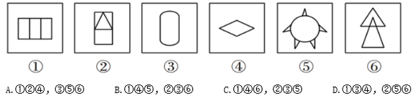

26. 从所给的四个选项中，选择最合适的一个填入问号处，使之呈现一定的规律性。

    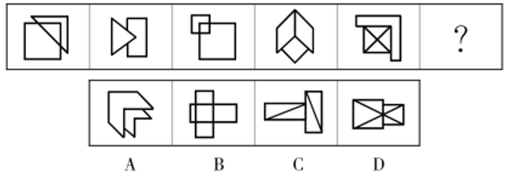

27. 从所给的四个选项中，选择最合适的一个填入问号处，使之呈现一定的规律性。

    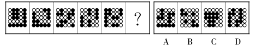

## 8月11日

1. 小李抽盲盒，这类盲盒一共有8款，小李只要其中的1辙，他一次买了两个盲盒，则抽中他想要的那款的概率是多少？
   $$
   \begin{matrix}
   A. \frac{1}{64}&&&&&&&
   B. \frac{7}{32}&&&&&&&
   C. \frac{15}{64}&&&&&&&
   D. \frac{1}{4}&&&&&&&
   \end{matrix}
   $$

2. 研究人员在A、B、C、D、E五块试验田中种植甲、乙、丙、丁、戊五种作物，每块试验田只种一种作物，每年都在所有的安排中随机挑选一种进行种植。问在连续的3年中，A试验田至少2年种植同一种作物的概率为多少？
   $$
   \begin{matrix}
   A. 36\%&&&&&&&
   B. 48\%&&&&&&&
   C. 52\%&&&&&&&
   D. 64\%&&&&&&&
   \end{matrix}
   $$

3. 某单位的一个科室从10名职工中随机挑选2人去听报告，要求女职工人数不得少于1人。已知该科室女职工比男职工多2人，小张和小刘都是该科室的女性职工，则她们同时被选上的概率在以下哪个范围内？
   $$
   \begin{matrix}
   A. 3\%到5\%之间&&&&&&&
   B. 小于2\%&&&&&&&
   C. 2\%到3\%之间&&&&&&&
   D. 大于5\%&&&&&&&
   \end{matrix}
   $$

4. 若某单位从5位优秀毕业生甲、乙、丙、丁、戊中录用三人，这五人被录用的机会均等，则甲乙中至少一人被录用的概率为多少。
   $$
   \begin{matrix}
   A. \frac{2}{3}&&&&&&&
   B. \frac{2}{5}&&&&&&&
   C. \frac{3}{5}&&&&&&&
   D. \frac{9}{10}&&&&&&&
   \end{matrix}
   $$

5. 甲、乙、丙、丁四个车间生产相同的产品，生产效率之比为4:3:2:1，产品不合格率分别为2%、3%、4%、5%。质检人员从这4个车间某小时内生产的所有产品中随机抽取1件，发现该产品不合格，该产品是乙车间生产的概率为多少？
   $$
   \begin{matrix}
   A. 30\%&&&&&&&
   B. 40\%&&&&&&&
   C. 50\%&&&&&&&
   D. 60\%&&&&&&&
   \end{matrix}
   $$

6. A、B、C三个厂家生产同一种乒乓球，不合格率分别为1%、2%和4%。现将三个厂家的产品按6:3:1的比例均匀混合后装入集装箱，从该箱中随机抽出1只乒乓球进行检测，若检测结果为不合格，则该只乒乓球是B厂生产的概率是多少？
   $$
   \begin{matrix}
   A. 0.3&&&&&&&
   B. 0.375&&&&&&&
   C. 0.4&&&&&&&
   D. 0.425&&&&&&&
   \end{matrix}
   $$

7. 根据天气预报，未来4天中每天下雨的概率为0.6，则未来4天中仅有1天下雨的概率p为多少？
   $$
   \begin{matrix}
   A. 0.03＜p＜0.05&&&&&&&
   B. 0.06＜p＜0.09　&&&&&&&
   C. 0.13＜p＜0.16&&&&&&&
   D. 0.16＜p＜0.36&&&&&&&
   \end{matrix}
   $$

8. 某班在筹备联欢会时发现很多同学都会唱歌和乐器演奏，但有部分同学这2种才艺都不会。具体有4种情况：只会唱歌，只会乐器演奏，唱歌和乐器演奏都会，唱歌和乐器演奏都不会。现知会唱歌的有22人，会乐器演奏的有15人，两种都会的人数是两种都不会的5倍。这个班至多有多少人？
   $$
   \begin{matrix}
   A. 27&&&&&&&
   B. 30&&&&&&&
   C. 33&&&&&&&
   D. 36&&&&&&&
   \end{matrix}
   $$

9. 某单位所有员工都参加艺术、科学、人文三类书籍的阅读活动，每名员工至多阅读2种书籍，阅读1种书籍员工人数比阅读2种书籍的人数多一半，阅读艺术类书籍的人数是阅读科学类书籍人数的$\frac{2}{3}$，阅读科学类书籍人数是阅读人文类书籍人数的$\frac{4}{5}$，问该单位至少有多少人？
   $$
   \begin{matrix}
   A. 20&&&&&&&
   B. 25&&&&&&&
   C. 30&&&&&&&
   D. 50&&&&&&&
   \end{matrix}
   $$

10. 某软件公司对旗下甲、乙、丙、丁四款手机软件进行使用情况调查，在接受调查的1000人中，有68%的人使用过甲软件，有87%的人使用过乙软件，有75%的人使用过丙软件，有82%的人使用过丁软件。那么，在这1000人中，使用过全部四款手机软件的至少有多少人。
    $$
    \begin{matrix}
    A. 120&&&&&&&
    B. 250&&&&&&&
    C. 380&&&&&&&
    D. 430&&&&&&&
    \end{matrix}
    $$

11. 阅览室有100本杂志，小赵借阅过其中75本，小王借阅过70本，小刘借阅过60本，则三人共同借阅过的杂志最少有多少本。
    $$
    \begin{matrix}
    A. 5&&&&&&&
    B. 10&&&&&&&
    C. 15&&&&&&&
    D. 30&&&&&&&
    \end{matrix}
    $$

12. 请从所给的四个选项中，选择唯一的一个答案，使之呈现一定的规律性。

    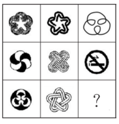

    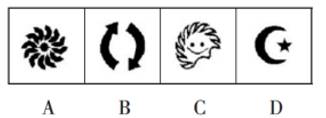

    

13. 把下面六个图形分成两类，使每一类图形都有各自共同的规律或特征，分类正确的一项是?

    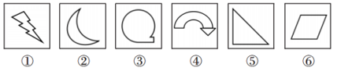

    

14. 道教∶基督教∶基督新教

    A.软件∶程序∶游戏　　

    　　　　　　　　　　　B.怀表∶手表∶电子表

    C.淡水湖∶咸水湖∶死海　　　

    　　　　　 　　D.含羞草∶茉莉花∶玫瑰花

15. 典当︰贷款︰融资

    A.买入︰卖出︰交易　

    B.水运︰空运︰运输

    　C.望诊︰闻诊︰问诊　

    D.起跑︰冲刺︰赛跑

16. 岩石∶宝石
    $$
    \begin{matrix}
    A. 	农民∶民工&&&&&&&
    B. 河水∶泉水&&&&&&&
    C. 耕地∶山地&&&&&&&
    D. 果汁∶饮料&&&&&&&
    \end{matrix}
    $$

17. 内核∶硬核
    $$
    \begin{matrix}
    A. 		声波∶光波&&&&&&&
    B. 价值∶价格&&&&&&&
    C.水波∶秋波&&&&&&&
    D. 症结∶原因&&&&&&&
    \end{matrix}
    $$

18. 春雨︰杏花︰江南
    $$
    \begin{matrix}
    A. 夏荷︰烈日︰江北&&&&&&&
    B. 秋风︰腊梅︰华北&&&&&&&
    C. 秋霜︰枯草︰塞外&&&&&&&
    D. 冬雪︰牡丹︰边疆&&&&&&&
    \end{matrix}
    $$

19. 巾帼 之于 `（  ）` 相当于` （  ） `之于 监狱
    $$
    \begin{matrix}
    A.	须眉 囚犯&&&&&&&
    B. 英雄 犯罪&&&&&&&
    C.女子 铁窗&&&&&&&
    D.头饰 惩罚&&&&&&&
    \end{matrix}
    $$

20. 太师∶太傅∶太保
    $$
    \begin{matrix}
    A. 		状元∶榜眼∶探花　&&&&&&&
    B.司马∶司徒∶司空　&&&&&&&
    C.京剧∶中医∶国画&&&&&&&
    D.立德∶立功∶立言&&&&&&&
    \end{matrix}
    $$

21. 出人头地∶苏轼
    $$
    \begin{matrix}
    A.	东山再起∶谢安&&&&&&&
    B. 多多益善∶项羽&&&&&&&
    C. 投笔从戎∶班固　&&&&&&&
    D. 指鹿为马∶李林甫&&&&&&&
    \end{matrix}
    $$

22. 宁波∶浙江
    $$
    \begin{matrix}
    A.	柳州∶广西　&&&&&&&
    B.大连∶辽宁　　&&&&&&&
    C.南昌∶江西&&&&&&&
    D.韶山∶湖南&&&&&&&
    \end{matrix}
    $$

23. 横看成岭侧成峰∶《题西林壁》∶苏轼

    A.床前明月光∶《静夜思》∶李绅　　　　　

    　　　B.锄禾日当午∶《悯农》∶李白

    C.青春作伴好还乡∶《闻官军收河南河北》∶杜甫　

    D.清明时节雨纷纷∶《清明》∶白居易

24. 税前收入∶税后收入∶税金
    $$
    \begin{matrix}
    A. 	法律规定∶道德规范∶规则&&&&&&&
    B.测量高度∶真实高度∶误差　&&&&&&&
    C.高原地区∶平原地区∶纬度&&&&&&&
    D.生产成本∶出厂价格∶销售价&&&&&&&
    \end{matrix}
    $$

25. 电流∶安培
    $$
    \begin{matrix}
    A.		体积∶立方&&&&&&&
    B. 动能∶焦耳&&&&&&&
    C. 质量∶千克　　&&&&&&&
    D. 电阻∶伏特&&&&&&&
    \end{matrix}
    $$

26. 潮汐现象 对于$ （ \qquad  ） $相当于 $（ \qquad ）$ 对于 自由电子
    $$
    \begin{matrix}
    A. 	自然现象 \quad导电体　&&&&&&&
    B.周期性运动\quad 导电体&&&&&&&
    C.月球和太阳的引力 \quad金属导电&&&&&&&
    D.周期性运动 \quad金属导电&&&&&&&
    \end{matrix}
    $$

## 8月12日

1. 一个三位数的个位数字比十位数字小1，百位数字是十位数字的3倍。若将个位与百位数字对调，所得新三位数比原三位数小693，则原三位数个位、十位、百位的数字之和是

   A.12　

   B.14　　　

   C.13　　　　　　　　　

   D.15

2. 小孟驾驶汽车沿一条笔直公路匀速行驶。某一时刻，小孟先看到路边的第一个里程碑，上面刻的公里数X为两位数。半小时后，他又看到第二个里程碑，上面刻的公里数Y恰好由X的十位数和个位数交换位置所成。又过了半小时，他看到第三个里程碑，上面刻的Z恰好由X的两位数中间添一个0所成。再过一小时，小孟自看到第一个里程碑起共驾驶了多少公里。

   A.120　　　　　　　　

   B.150　　　　　　　　

   C.180　　　　　　　　

   D.200

3. 某区财政局年度考核，办公室与国库科平均得分90分，预算科与政府采购科平均得分84分，办公室与政府采购科平均得分86分，政府采购科比预算科多10分，国库科的得分比综合科多5分，那么办公室、预算科、国库科、政府采购科、综合科的平均得分是

   A.84分　　　　　　　

   B.86分　　　　　　　

   C.88分　　　　　　　

   D.90分

4. 用1，2，3，4，5，6这6个数字组成不同的六位数，所有这些六位数的平均值是

   A.350000　　　　　　

   B.355550　　　　　　

   C.355555.5　　　　　　

   D.388888.5

5. 为实现精准扶贫，某县政府工作人员对辖区内所有贫困户进行走访。已知第一周走访的户数为贫困户总户数的46%，第二周走访的户数是两周后剩余未走访户数的1.2倍。问两周后最少还有多少户贫困户未走访？

   A.45　　　　　　　　

   B.90　　　　　　　　

   C.135　　　　　　　　

   D.180

6. 将从1到11的连续自然数填入下图中的圆圈内，要使每边上的三个数的和都相等，a不可能是

   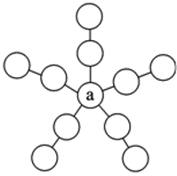

   A.1　　　　　　　　　

   B.6　　　　　　　　　

   C.7　　　　　　　　　

   D.11

7. 某公司举办迎新晚会，参加者每人都领取一个按入场顺序编号的号牌，晚会结束时宣布：从1号开始向后每隔6个号的号码可获得纪念品A，从最后一个号码开始向前每隔8个号的号码可获得纪念品B。最后发现没有人同时获得纪念品A和B，则参加迎新晚会的人数最多有

   A.46人　　　　　　　

   B.48人　　　　　　　

   C.52人　　　　　　　

   D.54人

8. 千禧锻造厂要制造一批一定比例的锡铁金属合金，第一次加入适量的金属铁后，此时金属锡的含量占总重量的4%，第二次加入同样多的金属铁后，金属锡的含量占总重量的3%，如果第三次再加入同样多的金属铁后，此时金属锡的含量占总重量的百分比是多少

   A.2.4%　　　　　　　

   B.2.7%　　　　　　

   C.2.8%　　　　　　　

   D.2.5%

9. 某种溶液的浓度为20%，加入水后溶液的浓度变为15%。如果再加入同样多的水，则溶液浓度变为

   A.3%　　　　　　　

   B.12.5%　　　　　　　

   C.12%　　　　　　　

   D.10%

10. 某文具厂计划每周生产A、B两款文件夹共9000个，其中A款文件夹每个生产成本为1.6元，售价为2.3元，B款文件夹每个生产成本为2元，售价为3元。假设该厂每周在两款文件夹上投入的总生产成本不高于15000元，则要使利润最大，该厂每周应生产A款文件夹（   ）个。

    A.0　　　　　　　　　

    B.6000　　　　　　　　　

    C.7500　　　　　　　　　

    D.9000

11. 某农场有180台收割机，每天可收割吨水稻。现将y台收割机更换为新款收割机，生产效率比之前高40%，剩余的收割机进行升级，生产效率可以提高20%，如要求升级后的收害机每天水稻收割总量不低于2x/3吨，新款收害机每天水稻收割总量不低于3x/5。则y的取值有多少种不同的可能性？
    A.2

    B.3
    C.4
    D.5

12. 甲、乙两企业合作完成某订单需要x天。如果甲企业产能增加50%而乙企业不变，可提前2天完成；如果乙企业产能增加300%而甲企业不变，可提前4天完成。问x的值是

    A.6　　　　　　　　　

    B.8　　　　　　　　　　

    C.10　　　　　　　　　

    D.12

13. 把下面六个图形分为两类，使每一类图形都有各自的共同特征或规律，分类正确的一项是

    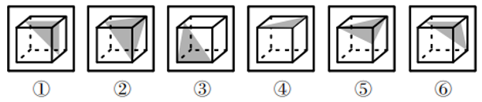

    A. ①②④，③⑤⑥

    B.①③④，②⑤⑥　　　

    C.①③⑥，②④⑤　　　

    D.①④⑤，②③⑥

14. 从所给的四个选项中，选择最合适的一个填入问号处，使之呈现一定的规律性。

    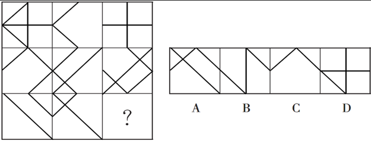

15. 从所给的四个选项中，选择最合适的一个填入问号处，使之呈现一定的规律性。

    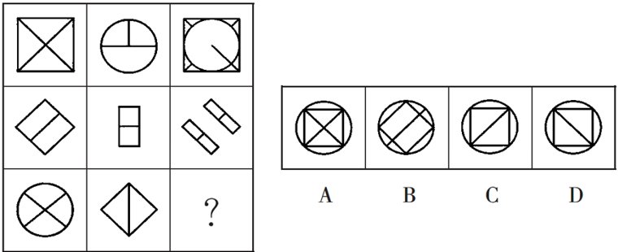

16. 从所给的四个选项中，选择最合适的一个填入问号处，使之呈现一定的规律性。

    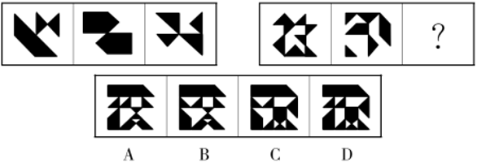

17. 从所给的四个选项中，选择最合适的一个填入问号处，使之呈现一定的规律性。

    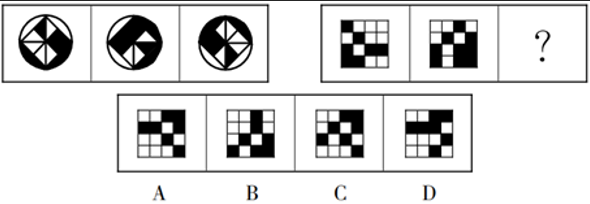

18. 下列选项中，符合所给图形的变化规律的是

    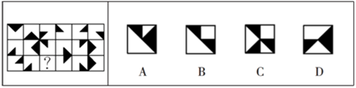

19. 行政机关为了实现行政管理或者公共服务目标，与公民、法人或者其他组织协商订立的具有行政法上权利义务内容的协议，属于行政协议。

    根据上述定义，下列不属于行政协议的是

    A.某县自然资源局与某矿业公司签订矿业权出让协议

    B.某区人民政府与王某签订政府保障性住房租赁协议

    C.某县房屋征收部门与被征收人某县教育局签订国有土地上房屋征收补偿协议

    D.某市公安机关和某市交通管理部门签订关于联合整治超限超载专项行动合作协议

20. 形成权是指依权利人一方的意思而使法律关系发生、内容变更或消灭的权利。

    根据上述定义，下列不属于行使形成权的是

    A.甲追回六岁儿子给网络主播的打赏　　

    B.甲按照合同约定从乙处采购一批手机

    C.甲因乙违约，按照合同约定要求解除合同 

    D.甲因乙婚前未告知其有重大疾病而请求撤销婚姻

21. 转喻是指两个认知对象在空间上或时间上的邻近共存以及其中一个对另一个的凸显可及，从而通过另一种事物来理解和体验当前的事物。

    根据上述定义，下列不属于转喻的是

    A.一间阴暗的小屋里，上面坐着两位老爷，一东一西。东边的一个是马褂，西边的一个是西装

    B.当一个游子想他家乡的时候我猜想它是像菜花一样金黄

    C.灾害是一把尺子，可以测量一个民族蹲下后跳跃的高度

    D.朱门酒肉臭，路有冻死骨

22. 并提是古代汉语中常见的一种修辞方法，为了使句子紧凑，文辞简练，把本来应该用两个短语或者句子表达的内容，合并为一个短语或句子。合并时把相同的成份放在一起，使短语或句子的前后两部分有一种分别相承的关系。

    根据上述定义，下列没有使用并提修辞手法的是

    A.《论衡·明雩》：“尧、汤水旱。”

    B.《长恨歌》：“行宫见月伤心色，夜雨闻铃肠断声。”

    C.《孟子·离娄上》：“继之以规矩准绳，以为方圆平直。”

    D.《颜氏家训·风操篇》：“父之遗书，母之杯圈，感其手口之泽，不忍读用。”

23. 词义泛化：指某个词语本来专指某种特定的事物或现象，后来可以泛指相关的多个事物或现象。
     下列属于词义泛化的是

    A.古代的称谓词语“父”，现在一般用“父亲”表示

    B.“河”在古代专指“黄河”，现在也可以指其他河流

    C.“假”在古代既可以表示痛恨，也可以表示遗憾，现在通常表示痛恨

    D.汉代以前的“涕”，本来专指眼泪，后来一般指鼻涕，有时也可以指泪水

# 答案

## 8月5日

1、【参考答案】B

【解题思路】

本题考查日期问题。

第一步：审阅题干。已知7月1日是周三，那么7月20日是周一，7月28日是周二，7月20日～7月28日之间只有一个周末（两天）不需阅读。

第二步：设小张每天读30页需要x天读完，则每天读20页需要（x+6）天读完。根据题意有30x=20×（x+6），解得x=12。因此小张是在7月3日制定的读书计划。

故本题选B。

2、 【参考答案】D

【解题思路】

本题考查日期问题。

第一步：审阅题干。同一个月连续的日期是公差为1的等差数列，可利用等差数列的特性求解。

第二步：10个日期之和为265，中位数为26.5，则后5个日期分别为27、28、29、30、31，因此老张是8月1日上班。

故本题选D。

3、【参考答案】A

【解题思路】

本题考查日期问题。

第一步：审阅题干。2012年为闰年，2月有29天，但需注意题干涉及的是2013年的2月。

第二步：2012年3月份的最后一天到2013年3月份的最后一天有365天，即52周零1天，则2013年3月份的最后一天是星期日。

故本题选A。

4、【参考答案】D

【解题思路】

本题考查年龄问题。

第一步：审阅题干。已知三人间的年龄关系，可设代数进行求解。

第二步：设2020年小王年龄为x岁，则老张年龄为4x岁，2021年老李年龄为3（x+1）岁。根据题意有3（x+1）+11=4x，解得x=14。2021年三人年龄之和为（14+1）+（4×14+1）+3×（14+1）=117岁，因此再过（140-117）÷3≈8年三人的年龄之和第一次超过140岁，即2029年。

故本题选D。

5、【参考答案】D

本题考查年龄问题。
第一步：审阅题干。年龄问题大多需要用方程法解答。
第二步：设女儿今年x岁，则母亲今年4x岁。根据题意可列方程x+40=（4x+40），解得x=8，则母亲今年32岁。设y年后女儿年龄是母亲的，即8+y=（32+y），解得y=16，当年为2013+16=2029年。
故本题选D。

6、【参考答案】B

本题考查年龄问题。
第一步：审阅题干。本题出现爷爷和孙子的年龄，在时间问题中，即年龄问题。
第二步：假设爷爷现在的年龄是7份，孙子现在的年龄是1份，则二者年龄差为6份，说明年龄差是6的倍数，同理，若干年后，年龄差分别为5，4，3，2，1的倍数，而二者年龄差始终保持不变，故年龄差是1，2，3，4，5，6的公倍数，根据现实实际情况，可知年龄差只能为60岁，所以爷爷现在70岁。
  故本题选B。

7、【参考答案】C

本题考查基础最值问题。
每家先分配7箱，201÷7=28个……5箱，剩余5箱，那么水果店最多可以有28家，一定有水果店至少分到8箱。
故本题选C。

8、【参考答案】D

【解题思路】本题考查基础最值问题。
要使尽可能多的乘客在终点站下车，而只有第7、8、9站上车的人可以在终点站下车，因此最多会有3×5=15名乘客在终点站下车。
故本题选D。

9、【参考答案】B

【解题思路】本题考查基础最值问题。
18年期间每四年产生一位主席则有18÷4=4位……2年，第一年和最后一年可以分别有一位，则最多可能有4+2=6位工会主席。
故本题选B。

10、【参考答案】D

【解题思路】本题考查和定最值问题。
第一步：审阅题干。题干所求为人口最少的地区可能的人数，则需要求出人口最少的地区最多可能有多少人和最少可能有多少人。
第二步：当所有地区人口数相同时，人口最少的地区人数最多，为13.2÷11=1.2万人。
当其他地区人口数相同，均为人口最少地区人数的1.1倍时，人口最少的地区人数最少，为13.2÷（10×1.1+1）=1.1万人。
因此人口最少的地区人数的区级范围为1.1～1.2万人，只有D项符合。
故本题选D。

11、【参考答案】A

本题考查和定最值。
第一步：审阅题干。要求“面积最大的草坪上栽树至少”，则应使其他草坪尽可能栽树多。
第二步：已知每块草坪必须有树且所栽棵数要依据面积大小各不相同，设面积最大的草坪至少要栽x棵，则另外4处草坪应分别栽树（x-1）棵、（x-2）棵、（x-3）棵、（x-4）棵，根据题意有x+x-1+x-2+x-3+x-4=21，解得x=6.2。因此面积最大的草坪上至少要栽7棵。
故本题选A。

12、【参考答案】C

本题考查最不利问题。
第一步：审阅题干。本题出现“至少……保证”，在最值问题中，即最不利问题。
第二步：首先找出最不利情况，即将标号分别为1，2，3，4，9，10，11，12，17，18，19，20（或者5，6，7，8，13，14，15，16，21，22，23，24）的抽取出来，再从剩下的随意抽取一张即可满足题意，故至少要抽取12+1=13张卡片。
故本题选C。

13、【参考答案】C

【解题思路】考虑最不利情况，手机号码后两位不同的组合共有10×10=100种，而问卷中有360×（1-70%）=108份没有填写手机号码。因此，至少需要取出108+100+1=209份问卷，才能保证一定有两个手机号码后两位相同。故本题选C。

14、【参考答案】D

【解题思路】本题考查最不利问题。
第一步：审阅题干。本题出现“至少……保证”，可知为最不利问题，需考虑最不利情况。
第二步：考虑最不利情况，即月季花和牡丹花全部搬出，此时再搬出一盆一定是郁金香。已知郁金香、月季花、牡丹花各20盆，要保证搬出的花中一定有郁金香，则至少要搬出20+20+1=41盆花。
故本题选D。

15、【参考答案】C

【解题思路】本题考查两者容斥。
根据题意可知，参加地理兴趣小组的有300×80%=240人，参加生物兴趣小组的有300×50%=150人。根据两者容斥特性可知，同时参加地理和生物兴趣小组的学生人数是240+150-300=90人。
故本题选C。

16、【参考答案】B

【解题思路】本题考查两者容斥。
第一步：审阅题干。本题较简单，直接用两者容斥公式进行解题。
第二步：设英文和数学都不及格的有x人，根据两者容斥原理可列式15+19-x+21=50，解得x=5。
故本题选B。

17、【参考答案】A

【解题思路】本题考查三者容斥。
第一步：审阅题干。题干涉及三种上网方式，可知为三者容斥问题。
第二步：设三种上网方式都使用的客户有x个，根据容斥原理有1258+1852+932-（352-x）-2x=3542，解得x=148。
故本题选A。

18、【参考答案】D

【解题思路】本题考查火车过桥问题。
第一步：审阅题干。火车过桥问题，借助基本规律解题，即总路程=火车长度+隧道（桥梁）长度。
第二步：根据题意可知，火车通过隧道时速度为（600-480）÷（18-15）=120÷3=40米/秒，则火车的长度为40×18-600=120米。桥梁长800米，火车通过时速度为原来的一半，即20米/秒，则火车通过桥梁所需时间为（800+120）÷20=920÷20=46秒。
故本题选D。

19、【参考答案】B

【解题思路】本题考查火车过桥问题。
第一步：审阅题干。题干涉及列车相向而行，属于火车过桥问题的变形，可将另一辆列车看成运动的桥，注意相对速度。
第二步：一辆动车组列车和一辆快速列车相向而行，则二者的相对速度相同，为两车的速度和。
坐在动车组列车上的人看快速列车驶过，快速列车的相对路程为快速列车的车长455米，则相对速度为455÷7=65米/秒。
同理，坐在快速列车上的人看动车组列车驶过，动车组列车的相对路程为动车组列车的车长260米，则时间为260÷65=4秒。
故本题选B。

20、【参考答案】B

【解题思路】本题考查基础行程问题。
第一步：审阅题干。已知速度与时间的关系，可直接求出路程。
第二步：根据题意可知，A市距省城的距离为80×（9-7）=160公里，B市距省城的距离为80×（15-7-2）=480公里。因此从A市出发，途经省城到达B市，总路程为160+480=640公里。
故本题选B。

21、【参考答案】D

【解题思路】本题考查流水行船问题。
第一步：审阅题干。已知轮船往返甲、乙两地的航行时间，可设特值得出水流速度。
第二步：设甲地与乙地之间的距离为30，则轮船顺水航行的速度为6，逆水航行的速度为5，那么水流速度为（6-5）÷2=0.5。因此无动力竹排从甲地到乙地需要30÷0.5=60小时。
故本题选D。

22、【参考答案】C

【解题思路】【解题思路】本题考查流水行船问题。

第一步：审阅题干。漂流瓶从甲地漂流到乙地，即漂流速度与水流速度一致。已知甲地到乙地为顺水行驶，乙地到甲地为逆水行驶。
第二步：设甲乙两地相距48（6和8的公倍数），则轮船顺流而行的速度为48÷6=8，逆流而行的速度为48÷8=6。那么水流速度为（8-6）÷2=1，因此一个漂流瓶从甲地到乙地需要48÷1=48天。
故本题选C。

23、【参考答案】C

【解题思路】根据题意可知，地铁行驶过程用了2×27=54分钟，停靠站点的时间为26分钟（第一站和终点站不计停靠时间），则地铁10号线从起点出发，到终点站共用了54+26=80分钟。
故本题选C。

24、【参考答案】B

【解题思路】在这1个小时中，丙车最多休息4分钟，那么丙在这一个小时内的行程最少为60×（60-4）÷60=56公里。而甲车持续行驶，则1个小时内甲车行驶的路程为63公里。因此两车最多相距63-56=7公里。
故本题选B。

25、【参考答案】D

【解题思路】本题考查多位数。
第一步：审阅题干。已知这个四位数颠倒次序排列所成的数与原数之和等于11110，那么该数的千位数字+个位数字=10。
第二步：设该数的个位数字为x，则其十位数字为x+1，百位数字为x+3，千位数字为10-x。根据题意有1+（x+3）+（x+1）=11，解得x=3。因此该四位数为7643，7643÷4=1910……3。
故本题选D。

26、【参考答案】B

【解题思路】本题考查多位数。
第一步：审阅题干。该类多位数问题无特殊解题技巧，直接代入选项看是否满足条件即可。
第二步：三位数的百位数与十位数对调前后相差270，则该三位数百位比十位大3，选项全都符合，但车间数为整数，因此零件总数能被35整除，首先排除C、D项。因此该工厂所生产的零件总数最多可能是630个。
故本题选B。

27、【参考答案】C

【解题思路】本题考查多位数。
第一步：审阅题干。本题较为简单，直接将条件代入选项一一验证即可。
第二步：百位数是个位数的2倍，四项均满足。十位数等于百位数和个位数之和，只有C项符合。
故本题选C。

28、【参考答案】B

【解题思路】本题考查倍数。
第一步：审阅题干。所求为“至少”，则应使该企业实际招聘的人数尽可能少且大于240名。
第二步：出现“平均分配”，那么该企业实际招聘的人数为7和9的公倍数，即为7×9=63的公倍数，因此该企业实际招聘的高校毕业生为252名，比计划招聘数多252-240=12人。
故本题选B。

29、【参考答案】D

【解题思路】本题考查溶液问题。
第一步：审阅题干。题干只出现百分数，未出现具体数值，不妨设特殊值方便计算。
第二步：设第一次加入适量水后盐水质量为100，则溶质质量为100×3%=3，则第二次加入水后盐水质量为3÷2%=150，加入水的质量为150-100=50，则第三次加入同样多的水后盐水浓度为3÷（150+50）=1.5%。
故本题选D。

30、【参考答案】C

【解题思路】本题考查矛盾关系。
第一步：分析题干词语间的关系。就地保护与异地保护是保护生物多样性的两种形式，二者为矛盾关系。
第二步：分析选项，确定答案。
A项：汽车爆胎与汽车漏油均为汽车事故形式，二者为反对关系，排除。
B项：防洪堤与绿化带不是矛盾关系，排除。
C项：纯种繁育与杂交繁育是生物繁育的两种方式，二者为矛盾关系，当选。
D项：销售提成与股份分红均为收入获取形式，二者为反对关系，排除。
故本题选C。

31、【参考答案】B

【解题思路】本题考查近义关系。
第一步：分析题干词语间的关系。“恳求”指恳切地要求，二者为近义关系，且恳求比要求的程度深。
第二步：分析选项，确定答案。
A项：“复杂”指多而杂，“嘈杂”指杂乱、喧闹，二者无明显逻辑关系，排除。
B项：“恪守”指严格地遵守，二者为近义关系，且恪守的程度比遵守的程度深，当选。
C项：“动机”指引发人从事某种行为的力量和念头，“动力”指推动工作、事业等前进和发展的力量，二者为近义关系，但在程度上没有明显区别，排除。
D项：“妥协”指用让步的方法避免冲突或争执，“协调”指正确处理组织内外各种关系，二者不是近义关系，排除。
故本题选B。

32、【参考答案】B

【解题思路】本题考查象征关系。
第一步：分析题干词语间的关系。天鹅象征着优雅，二者为象征关系。
第二步：分析选项，确定答案。
A项：塞外有风沙，二者不是象征关系，排除。
B项：梅花象征着高洁，二者为象征关系，当选。
C项：同窗之间关系可以是友好的，二者不是象征关系，排除。
D项：幽默是笑话的或然属性，二者为属性关系，排除。
故本题选B。

33、【参考答案】B

【解题思路】本题考查字符关系。
第一步：分析题干字符间的关系。第一个字符为小写的字母，紧跟三对字符，最后一个是数字。
第二步：分析选项，确定答案。
A项：第一个字符为大写的字母，排除。
B项：第一个字符为小写的字母，紧跟三对字符，最后一个是数字，当选。
C项：第一个小写字母之后没有紧跟三对字符，排除。
D项：第一个小写之母之后没有紧跟三对字符，排除。
  故本题选B。

34、【参考答案】C

【解题思路】本题考查模态推理。
第一步：分析题干，确定题型。提问中出现“可能”等模态词，确定为模态推理类题型。
第二步：利用模态命题的转换规则解题。“不可能所有的人都成为公务员”，“所有”转为“有的”，肯定词“成为”转为否定词“不能成为”，模态词“不可能”转为“必然”，即“必定有些人不能成为公务员”。
故本题选C。

## 8月6日

1、【解题思路】

本题考查溶液问题。

第一步：审阅题干。已知x千克甲盐水和千克乙盐水中的含盐量相同，那么可设二者的浓度为代数进行求解。

第二步：设甲盐水的浓度为a，乙盐水的浓度为b，则根据题意有
$$
\frac{Xa+Xb}{2X-X}=Zb，化简得\frac{b}{a}=\frac{1}{Z-1}
$$
故本题选B。

2、【参考答案】C

【解题思路】本题考查反对关系。
选项逐一代入。
A项：绵羊是哺乳动物，麻雀是鸟类，二者不为反对关系，水稻与高粱均为粮食，二者为反对关系，前后逻辑关系不一致，排除。
B项：绵羊是哺乳动物，老鹰是鸟类，二者不为反对关系，麦子与高粱为反对关系，前后逻辑关系不一致，排除。
C项：绵羊与羚羊为反对关系，玉米与高粱为反对关系，前后逻辑关系一致，当选。
D项：绵羊与山羊为反对关系，玫瑰与高粱不为反对关系，前后逻辑关系不一致，排除。
故本题选C。

3、【参考答案】C

【解题思路】本题考查组成关系。
选项逐一代入。
A项：轮胎是汽车的组成部分，手机与相机为反对关系，前后逻辑关系不一致，排除。
B项：速度是衡量所有汽车性能的指标之一，像素是衡量数码相机性能的指标之一，胶片相机没有像素这一概念，前后逻辑关系不一致，排除。
C项：马达是汽车的组成部分，快门是相机的组成部分，前后逻辑关系一致，当选。
D项：单车与汽车为反对关系，单反与相机为种属关系，前后逻辑关系不一致，排除。
故本题选C。

4、【参考答案】C

解题思路】本题考查反对关系。
第一步：分析题干词语间的关系。洪涝与干旱为反对关系，且二者为相反的状况，防洪与抗旱分别对应洪涝和干旱。
第二步：分析选项，确定答案。
A项：地震可能导致海啸，二者不为相反的状况，排除。
B项：滑坡与雪崩为反对关系，但二者不为相反的状况，排除。
C项：严寒与酷热为反对关系，且二者为相反的状况，防冻与消暑分别对应严寒和酷热，当选。
D项：风沙可能导致雾霾，二者不为相反的状况，排除。
故本题选C。

5、【参考答案】C

【解题思路】本题考查修饰关系。
第一步：分析题干词语间的关系。铭心刻骨形容记忆深刻，刻骨铭心的记忆，为偏正结构。
第二步：分析选项，确定答案。
A项：冥思苦想形容深沉地思索，冥思苦想不能与思想搭配，排除。
B项：繁花似锦形容美好的景色和美好的事物，不能与繁华搭配，排除。
C项：闭月羞花形容容貌十分美丽，闭月羞花的容貌，为偏正结构，当选。
D项：冷若冰霜形容十分冷漠，冷若冰霜与冷漠为近义关系，排除。
故本题选C。

6、【参考答案】D

【解题思路】本题考查载体关系。
选项逐一代入。
A项：密码学应用于区块链，反应堆应用于核电站，前后逻辑关系一致但词语位置相反，排除。
B项：比特币基于区块链技术，核电站会产生放射性物质，前后逻辑关系不一致，排除。
C项：云平台基于区块链技术，常规岛是核电站的组成部分，前后逻辑关系不一致，排除。
D项：物联网利用区块链技术，核电站利用原子能技术，前后逻辑关系一致，当选。
故本题选D。

7、【参考答案】D

【解题思路】本题考查功能关系。
第一步：分析题干词语间的关系。防爆膜具有防刮花和抗撞击的功能。
第二步：分析选项，确定答案。
A项：驱蛇粉、驱动器、驱逐舰三者无明显联系，排除。
B项：荧光棒是模拟萤火虫的发光原理制作而成的产品，荧惑星是火星的别称，与前二者无明显联系，排除。
C项：超轻便是部分防晒伞的特性，而非功能，排除。
D项：净水器具有除杂质和去异味的功能，当选。
故本题选D。

8、【参考答案】B

【解题思路】本题考查反对关系。
选项逐一代入。
A项：发射火箭筒，二者为动宾关系，狼牙棒与三节棍为反对关系，前后逻辑关系不一致，排除。
B项：火箭筒与手榴弹为反对关系，方天戟与三节棍为反对关系，前后逻辑关系一致，当选。
C项：火箭筒发射的火箭弹会爆炸，三节棍是软器械的一种，前后逻辑关系不一致，排除。
D项：火箭筒运用了热动力的工作原理，三节棍是通过锻造术锻造而成的，前后逻辑关系不一致，排除。
故本题选B。

9、【参考答案】C

【解题思路】本题考查反对关系。
第一步：分析题干词语间的关系。巴、蜀、燕、赵四者为反对关系，且四者均为历史上的国家名称。
第二步：分析选项，确定答案。
A项：“京津”指北京和天津地区，“淮海”指以徐州为中心的淮河以北及连云港一带地区，京、津、淮、海四者均不是历史上的国家名称，排除。
B项：“闽越”是先秦时期的部落名称，“荆湘”指位于长江中游地区的江汉—洞庭湖平原，二者无明显联系，且荆与湘不是历史上的国家名称，排除。
C项：齐、鲁、秦、晋四者互为反对关系，且四者均为历史上的国家名称，当选。
D项：“殷商”是我国的历史朝代，“云贵”是云南省、贵州省的简称，二者无明显联系，且云与贵不是历史上的国家名称，排除。
故本题选C。

10、【参考答案】D

【解题思路】本题考查对应关系。
第一步：分析题干词语间的关系。“二氧化碳”会“腐蚀珊瑚骨骼”，二者为因果对应关系，其中腐蚀珊瑚骨骼为动宾关系。
第二步：分析选项，确定答案。
A项：动物生命受到威胁，是物种灭绝中的一个环节，与题干逻辑关系不一致，排除。
B项：天灾人祸会导致物种减少，但天灾与人祸为两方面原因，与题干逻辑关系不一致，排除。
C项：土壤沙化会导致空气质量变差、引发雾霾，雾霾是名词，与题干逻辑关系不一致，排除。
D项：“气候变暖”会“消融冰川”，二者为因果对应关系，其中消融冰川为动宾关系，与题干逻辑关系一致，当选。
故本题选D。

11、【参考答案】C

【解题思路】本题考查生活常识。
第一步：分析题干词语间的关系。钢笔的主要功能是书写文字，钢笔是一种书写工具，二者为工具与功能对应关系。
第二步：分析选项，确定答案。
A项：水瓶的主要功能是盛水，而非保温，排除。
B项：春天是播种的季节，二者为时间对应关系，排除。
C项：手表的主要功能是计时，手表是一种计时工具，二者为工具与功能对应关系，当选。
D项：眼睛是用来阅读的器官，而非工具，排除。
故本题选C。

12、【参考答案】D

【解题思路】本题考查对应关系。
第一步：分析题干词语间的关系。学生是老师教导的对象，知识是老师教导的内容，三者为对应关系。
第二步：分析选项，确定答案。
A项：父母和子女是家庭的组成部分，排除。
B项：害虫是青蛙捕食的对象，但庄稼不是青蛙捕食的内容，排除。
C项：园丁与农田无明显逻辑关系，排除。
D项：病人是医生治疗的对象，疾病是医生治疗的内容，三者为对应关系，当选。
故本题选D。

13、【参考答案】D

【解题思路】本题考查词项关系。
第一步：分析题干词语间的关系。东奔与西走为并列关系，且二者均为偏正结构。
第二步：分析选项，确定答案。
A项：跋山与涉水均为动宾结构，排除。
B项：完整与无缺均不是偏正结构，排除。
C项：顾此与失彼均为动宾结构，排除。
D项：大街与小巷为并列关系，且二者均为偏正结构，当选。
故本题选D。

14、【参考答案】B

【解题思路】本题考查近义关系。
第一步：分析题干词语间的关系。“恳求”指恳切地要求，二者为近义关系，且恳求比要求的程度深。
第二步：分析选项，确定答案。
A项：“复杂”指多而杂，“嘈杂”指杂乱、喧闹，二者无明显逻辑关系，排除。
B项：“恪守”指严格地遵守，二者为近义关系，且恪守的程度比遵守的程度深，当选。
C项：“动机”指引发人从事某种行为的力量和念头，“动力”指推动工作、事业等前进和发展的力量，二者为近义关系，但在程度上没有明显区别，排除。
D项：“妥协”指用让步的方法避免冲突或争执，“协调”指正确处理组织内外各种关系，二者不是近义关系，排除。
故本题选B。

15、【参考答案】A

【解题思路】本题考查反义关系。
第一步：分析题干词语间的关系。“和风细雨”指和煦的风、细细的雨，后比喻耐心地和颜悦色地批评或劝说；“暴风骤雨”指来势急遽而猛烈的风雨，后比喻声势浩大、发展迅猛的群众运动。二者为反义关系，且二者均形容一种客观现象。
第二步：分析选项，确定答案。
A项：“年富力强”形容年纪轻，精力旺盛；“风烛残年”比喻人到了接近死亡的晚年。二者为反义关系，且二者均形容一种客观状态，当选。
B项：“如沐春风”比喻同品德高尚且有学识的人相处并受到熏陶，就好比和高人相处，就像受到春风的吹拂一般；“如履薄冰”比喻存有戒心，行事极为谨慎。二者无明显逻辑关系，排除。
C项：“耀武扬威”指炫耀武力，显示威风；“扬眉吐气”指扬起眉头、吐出怨气，形容摆脱了长期受压状态后高兴痛快的样子。二者无明显逻辑关系，排除。
D项：“雪中送炭”指在下雪天给人送炭取暖，比喻在别人急需时给以物质上或精神上的帮助；“落井下石”指看见人要掉进陷阱里，不伸手救他，反而推他下去，又扔下石头，后比喻乘人有危难时加以陷。二者为反义关系，但二者均为人的主观行为，而非客观现象或状态，排除。
故本题选A。

16、【参考答案】D

【解题思路】本题考查种属关系。
第一步：分析题干词语间的关系。暴雨与冰雹为反对关系，且二者均属于天灾。
第二步：分析选项，确定答案。
A项：汽车不属于玩具，排除。
B项：归纳与总结均为逻辑方法，二者与逻辑为对应关系，排除。
C项：舞蹈不属于戏剧，排除。
D项：没收与罚款为反对关系，且二者均属于处罚，当选。
故本题选D。

17、【参考答案】C

【解题思路】本题考查交叉关系。
第一步：分析题干词语间的关系。蔬菜与绿色食品为交叉关系，二者均属于食品。
第二步：分析选项，确定答案。
A项：历史片与科幻片为反对关系，排除。
B项：海口市是海南省的组成部分，排除。
C项：交通图与单色地图为交叉关系，二者均属于地图，当选。
D项：绿孔雀与蓝孔雀为反对关系，排除。
故本题选C。

18、【参考答案】C

【解题思路】本题考查种属关系。
第一步：分析题干词语间的关系。天然气属于气体，也属于燃料，气体与燃料为交叉关系。
第二步：分析选项，确定答案。
A项：读后感与散文为交叉关系，排除。
B项：量角器与圆规为反对关系，排除。
C项：金银花属于花卉，也属于中药，花卉与中药为交叉关系，当选。
D项：互联网不属于网站，排除。
故本题选C。

19、【参考答案】A

【解题思路】本题考查场所关系。
第一步：分析题干词语间的关系。老鹰在树枝上休息，在天空中飞翔，树枝和天空分别为老鹰休息和活动的场所。
第二步：分析选项，确定答案。
A项：蜜蜂在蜂箱中休息，在花丛中采蜜，蜂箱和花丛分别为蜜蜂休息和活动的场所，当选。
B项：蟒蛇在山涧和森林里均可进行休息和活动，排除。
C项：蚊子在沟渠里和野外均可进行休息和活动，排除。
D项：鲈鱼在江河和海洋中均可进行休息和活动，排除。
故本题选A。

20、【参考答案】B

【解题思路】本题考查对应关系。
选项逐一代入。
A项：滚轮是行李箱的组成部分，勺子是烹饪的工具，前后逻辑关系不一致，排除。
B项：行李箱是旅行用品，砂锅是烹饪用品，前后逻辑关系一致，当选。
C项：行李箱有品牌，厨师进行烹饪，前后逻辑关系不一致，排除。
D项：保险箱与行李箱为反对关系，红烧是一种烹饪方式，前后逻辑关系不一致，排除。
故本题选B。

21、【参考答案】D

【解题思路】本题考查种属关系。
选项逐一代入。
A项：月亮引发潮汐，理发师使用剪刀，前后逻辑关系不一致，排除。
B项：月亮与太阳为反对关系，理发师与学徒为交叉关系，前后逻辑关系不一致，排除。
C项：月亮发出月光，理发师与造型师为交叉关系，前后逻辑关系不一致，排除。
D项：月亮属于天体，二者为种属关系，理发师属于职业，二者为种属关系，前后逻辑关系一致，当选。
故本题选D。

22、【参考答案】C

【解题思路】本题考查因果关系。
第一步：分析题干词语间的关系。缺少睡意导致失眠。
第二步：分析选项，确定答案。
A项：缺少食物导致饥饿，而非食欲，排除。
B项：缺少营养导致干枯，但词语前后位置与题干相反，排除。
C项：缺少氧气导致窒息，当选。
D项：悲伤过度可能导致麻木，排除。
故本题选C。

23、【参考答案】C

【解题思路】本题考查象征关系。
第一步：分析题干词语间的关系。胃口象征兴趣。
第二步：分析选项，确定答案。
A项：心腹属于器官，其象征意义是亲近的人，排除。
B项：黑马象征比赛中实力难测的竞争者或出人意料的优胜者，排除。
C项：桃李象征学生，当选。
D项：骨肉象征亲人，但词语前后位置与题干相反，排除。
故本题选C。

24、【参考答案】A

【解题思路】本题考查对应关系。
第一步：分析题干词语间的关系。调查是为了求真，二者为方式与目的的对应关系。
第二步：分析选项，确定答案。
A项：晨练是为了健身，二者为方式与目的的对应关系，当选。
B项：先施肥，后收割，二者为顺承关系，排除。
C项：记忆可以用来怀念，二者不是方式与目的的对应关系，排除。
D项：复制是备份过程中的一个环节，二者为组成关系，排除。
故本题选A。

25、【参考答案】C

【解题思路】本题考查对应关系。
第一步：分析题干词语间的关系。河长是进行河道巡查的负责人，河道巡查是河长的工作职责，打造水清岸绿的生态环境是其目的，三者为负责人、工作职责、工作目的的对应关系。
第二步：分析选项，确定答案。
A项：污染治理不是为了波平浪静，排除。
B项：道路维修不是路长的工作职责，排除。
C项：机长是客机驾驶的负责人，客机驾驶是机长的工作职责，将旅客安全准点送达是其目的，三者为负责人、工作职责、工作目的的对应关系，当选。
D项：鸟语花香不是带头致富的目的，排除。
故本题选C。

26、【参考答案】B

【解题思路】本题考查反义关系。
选项逐一代入。
A项：“风雨如晦”指白天风雨交加天色昏暗，后比喻局势动荡社会黑暗，“风雨飘摇”指在风雨中飘荡不定，比喻局势动荡不安，二者为近义关系；“告老还乡”指年老辞职回到家乡，“衣锦还乡”指富贵以后穿着华丽的衣服回到故乡，二者不是近义关系，前后逻辑关系不一致，排除。
B项：风雨如晦与风和日丽为反义关系，背井离乡与衣锦还乡为反义关系，前后逻辑关系一致，当选。
C项：“云淡风轻”指微风轻拂、浮云淡薄，形容天气晴好，与风雨如晦为反义关系；“落叶归根”指飘落的枯叶掉在树木根部，比喻事物有一定的归宿，多指客居他乡的人终要回到本乡，与衣锦还乡不是反义关系，前后逻辑关系不一致，排除。
D项：“和风细雨”指和煦的风，细细的雨，比喻耐心地和颜悦色地批评或劝说，与风雨如晦无明显联系，荣归故里与衣锦还乡为近义关系，前后逻辑关系不一致，排除。
故本题选B。

27、【参考答案】A

【解题思路】本题考查材料关系。
选项逐一代入。
A项：大豆是制作豆豉的原材料，原木是制作木炭的原材料，二者均发生化学变化，前后逻辑关系一致，当选。
B项：大豆经过生长变成豆芽，原木与桐木为交叉关系，前后逻辑关系不一致，排除。
C项：大豆与红豆为反对关系，原木与檀木为交叉关系，前后逻辑关系不一致，排除。
D项：大豆是制作豆腐的原材料，原木是制作木桶的原材料，但前者发生了化学变化，后者仅发生物理变化，前后逻辑关系不一致，排除。
故本题选A。

28、【参考答案】D

【解题思路】本题考查种属关系。
第一步：分析题干词语间的关系。小岗村是一个村，二者为种属关系，小岗村位于安徽省，二者为地点对应关系。
第二步：分析选项，确定答案。
A项：石家庄不是一个庄，而是一个市，排除。
B项：景德镇不是一个镇，而是一个市，排除。
C项：驻马店不是一个店，而是一个市，排除。
D项：洪泽湖是一个湖，二者为种属关系，洪泽湖位于江苏省，二者为地点对应关系，当选。
故本题选D。

29、

【解题思路】本题考查反对关系。
第一步：分析题干词语间的关系。江河湖海属于水体，且四者为反对关系。
第二步：分析选项，确定答案。
A项：鳏寡孤独属于身份，老而无妻者谓之鳏，老而无夫者谓之寡，少而无父者谓之孤，老而无子者谓之独，鳏、寡与孤、独为交叉关系，排除。
B项：油盐酱醋属于调味品，功能是调味，排除。
C项：山珍海味属于美食，山珍与海味为反对关系，山与珍不是反对关系，排除。
D项：绫罗绸缎属于面料，且四者为反对关系，当选。
故本题选D。

## 8月9日

1. 【参考答案】D
   【解题思路】
   本题考查基础应用。
   第一步：审阅题干。赋值当年3个村的水果产量分别为30，20，50，要使3个村中某个村的水果产量增幅最大，则另外两村的增幅应尽可能小，且该村的基期值应尽可能小。
   第二步：结合已知条件，可使第2个村的产量增幅最大，则第1和第3两村的增长率均为20%，增长量分别为30× 20%-6、
   50× 20%=10，因此第2个村的增幅为（100 ×50%-6-10）÷ 20-170%
   故本题选D。

2. 【参考答案】C
   【解题思路】
   本题考查基础应用。
   第一步：审阅题干。已知已卖出和未卖出房子间的数量关系，可设代数进行求解。
   第二步：设目前已卖出和未卖出房子分别有x、y套，根据题意有x+50-y-50，x+150=3 / 2×（y-150），解得x=450，y=550

   故本题选C。

3. 本题考查基础应用。
   第一步：审阅题干。已知学生与床位之间的数量关系，可设代数进行求解。
   第二步：设共有x间宿舍，根据题意有6x+7=8x-3，解得x=5，因此这批学生共有6×5+7=37人。
   故本题选D。
   
4. 本题考查基础应用。
   第一步：审阅题干。已知题干中数量关系，可设代数进行求解。
   第二步：设共有x件工艺品，根据题意有20x×(1-6.4%)-30x×6.4%=16800，解得x=1000因此运输途中破损的工艺品有1000 ×6.4%=64件。
   故本题选A

5. 原式=（2-1）×（2+1）×（2^2^+1）×（2^4^+1）×（2^8^+1）=（2^2^-1）×（2^2^+1）×（2^4^+1）×（2^8^+1）=（2^4^-1）
   x（2^4^+1）×（2^8^+1）=（2^8^-1）x（2^8^+1）=2^16^-1
   故本题选C

6. D

7. $\frac{1}{c}+\frac{1}{b}+\frac{1}{a}=1$代入法

   C

8. 位数法+估算，B

   原式=2017^2^ + 2013-2015^2^= 2017^2^-2015^2 ^+2013
   =（2017+2015）x（2017-2015）+ 2013
   =4032x2+2013=10077

9. 本题考查赋值工作效率问题。
   第一步：审阅题干。赋值甲、乙、丙的工作效率分别为5、4.3第二步：设该工程由丁单独实施需要x天完成，根据题意有5（x-4）=4（x+5），解得x=40，那么该工程的总量为5x（40-4）=180，丁的工作效率为180÷ 40-4.5。因此四个队共同实施需要$180÷(5+4+344.5)\approx11$天可以完成。
   故本题选B。

10. 本题考查赋值工作效率问题。
    第一步：审阅题干。已知甲、乙两队单独施工完成天数，则甲、乙两队效率之比为3：2第二步：赋值甲、乙两队工作效率分别为3，2，因此完成该项目共需60+ [200x3-60x（3+2）]/2=210天。
    故本题选D。

11. 本题考查赋值工作量问题。
    第一步：审阅题干。已知B单独进水所需时间，可对工作总量进行赋值，得出B效率，再根据已知条件解题。
    第二步：赋值工作量为100，则B的工作效率为2，设C的工作效率为x，则a的工作效率为2x+4，根据题意有（2+x）
    x10+（2+x+2x+4）×5=100，解得x=2，则A的工作效率为8，A、c同时进水需要100（2+8）=10小时将容器装满。
    故本题选D。

12. 本题考查经济类定义判断。
    第一步：分析定义要点。"硬背书品牌”的定义要点“采取企业总品牌子品牌形式"。
    第二步：分析选项，确定答案。
    A项：别克、欧宝、雪佛莱、凯迪拉克四大子品牌前并未直接冠以通用汽车总品牌，不符合定义要点，排除。
    B页：某药企产品都包含有"999"的品牌，是采取企业总品牌子品牌形式，符合定义要点，当选。
    C项：浏阳河、京酒、金六福等产品包装上都没标明背书品牌五粮液，即子品牌前并未直接冠以背书品牌，不符含定义要点，排除。
    D项：潘婷、汰渍、舒肤佳等子品牌前并未直接冠以宝洁公司总品牌，不符合定义要点，排除。
    故本题选B。

13. 本题考查经济类定义判断。
    第一步：分析定义要点。“人合公司”的定义要点是“以股东的个人信用为公司信用基础"
    第二步：分析选项，确定答案。
    A项：股东的出资以现金及财产为限，根据出资对公司负责，不是以股东的个人信用为公司信用基础，不符合定义要点，排除。
    B页：某公司的全部股份由公司独立创立者百分百持有，没有说明以股东的个人信用为基础还是以出资形成的财产为基础，不符合定义要点，排除。
    c项：以全部注册资金作数，股东个人财产并不受影响，不是以股东的个人信用为公司信用基础，不符合定义要点，排除。
    D项：以股东个人的所有财产为抵押，股东对公司经营负无限责任，并且不能任意地转让股份，是以股东的个人信用为公司信用基础，符合定义要点，当选。
    故本题选D。

14. 本题考查科学类定义判断。
    第一步：分析定义要点。“生物浓缩”的定义要点：0生物有机体或处于同一营养级上的许多生物种群；@从周围环境中蓄积某种元素或难分解化合物；③使生物有机体内该物质的浓度超过环境中该物质浓度。
    第二步：分析选项，确定答案。
    A项：白头鹰符合①，农业上用于杀死昆虫的DT通过食物链传递符合，使得白头鹰生下的蛋皆是软壳无法孵化符合
    ③，符合定义，当选。
    B：鱼类及其他生物大量死亡，是因为藻类及其他浮游生物迅速繁殖导致水体溶解氧含量下降，水质恶化，未体现生物有机体内某种物质浓度超过环境中的物质浓度，不符合3，排除。
    c项：山羊吃多玉米粒易引起胃胀，未体现生物有机体内某种物质浓度超过环境中的物质浓度，不符合3，排除。
    D项：原本干净清洁的海滩受到严重的白色污染，不符合0，排除。
    故本题选A。

15. 本题考查科学类定义判断。
    第一步：分析定义要点。“农业生产周期”的定义要点是“在连续不断的农业再生产过程中，从开始生产到获得产品的整个过程所经过的全部时间”。第二步：分析选项，确定答案。
    A页：耕地、播种、打枝、摘棉花、纺线、织布是在连续不断的农业再生产过程中从开始生产到获得产品的整个过程，符合定义要点，当选。
    B页：乡镇企业原材料购进、生产管理、产品销售，没有涉及农业再生产过程，不符合定义要点，排除。
    c项：仅涉及种植树苗，不是从开始生产到获得产品的整个过程，不符含定义要点，排除。
    D页：仅涉及把猪烹养大，不是从开始生产到获得产品的整个过程，不符合定义要点，排除。
    故本题选A。

16. 本题考查真假破案。
    第一步：整理题干信息。小张：小王是最后一名。小夏：小夏在小王之后过终点。小王：小王在小张和小夏之后过终点。三人中最多一人说假话。
    第二步：根据题干信息解题。小张与小夏的话相互矛盾，必有一真一假，则小王说的是真话，即小王在小张和小夏之后过终点，因此小夏说假话。
    故本题选B。

17. 本题考查真假推理。
    第一步：整理题干信息。0每人只有一种身份，并不重复；@只有会计师的预言是正确的。选项信息完整，可采用代入排除法。
    第二步：分析选项，确定答案。
    A项：假设该项正确，甲是企业家，乙是大学教师，则企业家（甲）的预言“乙不会成为歌手”正确，与@矛盾，排除.
    B：假设该项正确，丙是企业家，丁是会计师，则企业家（丙）的预言“丁不会成为企业家”正确，与@矛盾，排除。
    C项：假设该项正确，乙是歌手，丙是会计师，则歌手（乙）的预言“丙会成为会计师”正确，与@矛盾，排除。
    D项：假设该项正确，符合题干要求，当选。
    故本题选D。

18. 本题考查真假推理。
    第一步：整理题干信息可得：（1）四家企业都没有捐赠，（2）-丁捐赠，（3）-乙或-丁捐赠，（4）有些企业捐赠。其中（1）与（4）为矛盾关系，必有一真一假。根据题干要求，上述四种情况为两真两假，则（2）（3）也必有一真一假。假设（2）为真，丁企业没有捐赠，则（3）也为真，与题干要求矛盾，因此（2）为假，即丁企业进行了捐赠。
    第二步：分析选项，确定答案。
    A项：无法确定甲企业是否进行捐赠，排除。
    B页：根据（2）为假，（3）为真，可以推出乙企业没有进行捐赠，排除。
    C项：无法确定丙企业是否进行捐赠，排除。
    D项：根据题干信息可以推出，丁企业进行了捐赠，当选。
    故本题选D。

19. 本题考查真假推理。
    第一步：翻译题干信息。赵：赵没有迟到；李：王没有迟到V赵没有迟到；王：有人迟到；张：没人迟到。
    第二步，根据题干信息解题。王和张的说法矛盾，必有一真一假。题干给出四人中有两人说法为真两人说法为假，那么赵和李的说法也一真一假。假设赵的说法为真，那么李的说法也为真，因此假设不成立，可以推知赵的说法为假，那么赵迟到了，有人迟到为真，即王的说法为真，张的说法为假。综上，说真话的是李和王。
    故本题选C。

20. 本题考查翻译推理。
    第一步：翻译题干信息。食用富含黄烷醇的食物一促进心血管功能提高脑血管功能一对认知功能产生积极影响。
    本题为结论类题目，仔细阅读材料信息。
    第二步：分析选项，确定答案。
    A项：翻译为改善心血管功能一食用富含黄烷醇的食物，改善心血管功能肯定题干后件，无法推出确定性结论，排除。
    E：翻译为改善脑血管功能一食用富含黄烷醇的食物，改善脑血管功能肯定题干后件，无法推出确定性结论，排除。
    C项：翻译为改善认知功能一食用富含黄烷醇的食物，改善认知功能肯定题干后件，无法推出确定性结论，排除。
    D项：翻译为食用富含黄烷醇的食物一对认知功能产生积极影响，与题干推理逻辑一致，当选。
    故本题选D

21. 本题考查翻译推理。
    第一步：翻译题干信息。0"互联网+"发展一生产制造能力八创新设计能力；②国家实力一生产制造能力八创新设计能力；③国计民生得到保障→生产制造能力八创新设计能力。
    第二步：分析题干信息，确定答案。
    48页：题干仅提及醉心于虚拟经济是靠不住的，并未说明“互联网+"与其存在的关系，无法推出，排除。明：题干仅提及在宏观层面互联网有诸多局限性，并未说明互联网微观层面上的局限性，无法推出，排除。
    C项：翻译为发展“互联网+"→国计民生得到保障，二者之间不存在推出关系，排除。
    D项：翻译为发展“互联网+"→提高生产制造和创新设计能力，与题干推理逻辑相同，当选。
    故本题选D。

## 8月10日

1. 本题考查流水行船问题。
   第一步：审阅题干。已知轮船往返甲、乙两地的航行时间，可设特值得出水流速度。
   第二步：设甲地与乙地之间的距离为30，则轮船顺水航行的速度为6，逆水航行的速度为5，那么水流速度为（6-5）÷ 2-0.5，因此无动力竹排从甲地到乙地需要30÷0.5-60小时。
   故本题选D。

2. 本题考查流水行船问题。
   第一步：审阅题干。从地漂流到时即在水流速度下行驶，已知地到时为顺水行驶，B到地为逆水行驶。
   第二步：设A、B两地距离为35（5和7的最小公倍数），根据题意解得水速=1，则题干所求所需天数为35天。
   故本题选B。

3. C

4. 本题考查钟表问题。
   第一步：审阅题干。已知小张下班路上花费半小时，且上下班路上花费时间相等，那么小张上班路上花费的时间也为半小时。
   第二步：小张出门时的实际时间为7点30分，中午进门的时间为12点半，即经过5时，因此小张中午进门时家里挂钟显示时间为10点25分。
   故本题选C。

5. 第一步：审阅题干。手表和闹钟指示同一时刻，即闹钟经过一段时间正好追上手表。
   第二步：手表每6时比标准时间快3×2/3=2分钟，闹钟每6小时比标准时间慢5分钟，则每6时闹钟比手表慢7分钟。手表指示9点27分钟，闹钟指示9点41分，二者相差14分钟，因此需要14/7x6=12小时。
   故本题选C。

6. 本题考查事件排序。
   观察题干五个句子，（1）农业粗放经营是背景介绍，因此（1）最先发生，排除余A、c项。（3）资源环境约束是（4）农业增长方式转变的原因，（3）在（4）前，只有8符合，验证颐，符合事件逻辑顺序。
   故本题选B。

7. 本题考查事件排序。
   （1）均田制是中国北魏至唐中叶的一种土地制度；（2）班超出使西域发生在东汉时期；（3）巨鹿之战发生在素末时期；（4）蔡伦改进造纸术发生在东汉时期；（5）两税法实行发生在唐朝。按照时间先后顺序排序为3-2-4-1-5。
   故本题选D。

8. 本题考查科学类定义判断。
   第一步：分析定义要点。“生物浓缩”的定义要点：

   1. 生物有机体或处于同一营养级上的许多生物种群；
   2. 从周围环境中蓄积某种元素或难分解化合物；
   3. 使生物有机体内该物质的浓度超过环境中该物质浓度。

   第二步：分析选项，确定答案。
   A项：白头鹰符合1，农业上用于杀死昆虫的DDT通过食物链传递符合2，使得白头鹰生下的蛋皆是软壳无法孵化符合3，符合定义，当选。
   B项：鱼类及其他生物大量死亡，是因为藻类及其他浮游生物迅速繁殖导致水体溶解氧含量下降，水质恶化，未体现生物有机体内某种物质浓度超过环境中的物质浓度，不符合3，排除。
   C项：山羊吃多玉米粒易引起胃胀，未体现生物有机体内某种物质浓度超过环境中的物质浓度，不符合3，排除。
   D项：原本干净清洁的海滩受到严重的白色污染，不符合1，排除。
   故本题选A。

9. 本题考查科学类定义判断。第一步：分析定义要点。
   "色素色”的定义要点是“有机色素通过选择性地吸收、反射和投射特定频率的光线后直观呈现出的颜色”
   第二步：分析选项，确定答案。
   A页：用激光束刻录的光盘上没有有机色素，其彩色花纹是由于光盘的表面结构对光的反射、衍射或干涉产生的，不符合定义要点，排除。
   B：蝴蝶翅膀上没有有机色素，其鳞片呈现出五颜六色是由于鳞片对光的反射、折射所形成的的，不符合定义要点，排除
   C项：肥皂泡泡没有有机色素，其呈现出虹彩色是由于光的干涉产生的，不符含定义要点，排除。
   D：用乌饭树叶捣汁煮出的饭呈现黑色是由于乌颂树叶成熟时为黑紫色，属于有机色素，煮出的米饭呈现黑色是直观呈现出的颜色，符合定义要点，当选。
   故本题选D

10. 本题考查科学类定义判断。
    第一步：分析定义要点。"植物耐逆性”的定义要点：①植物处于不利环境；②通过自身内部代谢反应，迅速阻止、降低或修复由逆境造成的损伤，使其仍保持正常的生理活动。
    第二步：分析选项，确定答案。
    A页：意为长长的原上草是多么茂盛，每年秋冬枯黄春来草色浓；无情的野火只能烧掉干叶，春风吹来大地又是绿茸茸。
    该诗句描述了每年季节更替时野草的变化，未体现植物迅速阻止、降低或修复由逆境造成的损伤，不符合②，排除。
    B：意为那墙角的几枝梅花，冒着严寒独自盛开；为什么远望就知道洁白的梅花不是雪呢？因为梅花隐隐传来阵阵的香气。该诗句说明了可根据香味辨别梅花不是雪，未体现植物迅速阻止、降低或修复由逆境造成的损伤，不符合②，排除。
    C项：戈壁滩的气候异常恶劣，符合①，但胡杨树仍然可以很好地生存下去，说明胡杨树自身生存能力强大，未体现植物迅速阻止、降低或修复由逆境造成的损伤，不符合②，排除。
    D：在高盐环境下，符合①，一些植物通过改善细胞膜的通透性来阻止大量失水，符合②，符合定义，当选。
    故本题选D。

11. 本题考查近义关系。
    第一步：分析题干词语间的关系。"寥寥无几”与“屈指可数”均形容人或物少，二者为近义关系。
    第二步：分析选项，确定答案。
    A页：“巧舌如蕾”形容能说会道，善于狡辩；“左右逢源”比喻做事得心应手，非常顺利，二者不为近义关系，排除。
    B：“九牛一毛”与“微不足道”均形容渺小、轻微，二者为近义关系，当选。
    C页：“五花八门”比喻变化多端或花样繁杂；“斑驳陆高”形容色彩繁杂，二者不为近义关系，排除。
    D顷：“车水马龙”形容热闹繁华的景象；“门可罗雀”形容门庭冷落、车马稀少，二者为反义关系，排除。
    故本题选B。

12. 【解题思路】本题考查主宾关系。
    第一步：分析题干词语间的关系。作家创作作品，二者为主宾关系。
    第二步：分析选项，确定答案。
    A项：蜜蜂酿制蜂蜜，二者为主宾关系，前后逻辑关系一致，当选。
    B页：货币用于购买货物，排除。
    c项：母鸡产鸡蛋，但词语前后顺序不一致，排除。
    D项：园丁在园林工作，排除。
    故本题选A

13. 本题考查全同关系。
    故本题选D。

14. 【解题思路】本题考查全同关系。
    第一步：分析题干词语间的关系。近海指靠近陆地的海域，二者为全同关系，且近海是偏正结构。
    第二步：分析选项，确定答案。
    1A项：充足指多到能满足需要，但充足不是偏正结构，排除。
    1页：三包是对"包修包换和包退”的简称，排除。
    C项：四季是春夏秋冬的合称，但四季不是偏正结构，排除。
    D项：忙月指农事繁忙的月份，二者为全同关系，且忙月是偏正结构，当选。
    故本题选D。

15. 【解题思路】本题考查全同关系。
    选项逐一代入。
    A项：二氧化碳又称碳酸气，氧化氢又称水，属于全同关系，前后逻辑关系一致，当选。
    B：干冰是固态的二氧化碳，冰是固态的水，但前后词语位置相反，排除。
    C项：二氧化碳和氧气为反对关系，氢元素是水的构成元素，前后逻辑关系不一致，排除。
    D顷：二氧化碳过多会加剧温室效应，纯净水和水为种属关系，前后逻辑关系不一致，排除。
    故本题选A

16. 本题考查条件关系。
    第一步：分析题干词语间的关系。侦探通过调查线索得出结论，为条件关系，且线索为名词。
    第二步：分析选项，确定答案。
    A项：医生通过分析病情做出诊断，且病情为名词，当选。
    B：违章是动词，排除。
    C项：针线是具体工具，线索是抽象概念，排除。
    D项：复习不一定是获得成绩的条件，排除，故本题选A

17. 本题考查因果关系。
    第一步：分析题干词语间的关系。少壮不努力与老大徒伤悲为因果关系。
    第二步：分析选项，确定答案。
    A项：不入虎穴与焉得虎子为条件关系，排除。
    B：己所不欲与勿施于人不为因果关系，排除。
    c项：不忘初心与方得始终为因果关系，当选。
    D项：若要人不知与除非己莫为为条件关系，排除。
    故本题选C。

18. 本题考查条件关系。
    第一步：分析题干词语间的关系。成本影响价格。
    第二步：分析选项，确定答案。
    A项：功率影响油耗，词语前后位置与题干相反，排除。
    B：需求影响产量，词语前后位置与题干相反，排除。
    c项：艺影响质量，当选。
    D页：培训影响成绩，词语前后位置与题干相反，排除。
    故本题选c。

19. 本题考查因果关系。
    第一步：分析题干词语间的关系。超速可能导致追尾，追尾可能会被处罚，为或然因果关系，前两者的主体一致，且与第三者的主体不同。
    第二步：分析选项，确定答案。
    A项：高温可能导致自燃，自燃可能会被追责，但前两者的主体不一致，排除。
    顷：购票是乘车的必要条件，乘车是出行的一种方式，排除。
    c页：谨慎可能导致寡言，寡言可能导致被冷落，前两者的主体一致，且与第三者的主体不同。
    D：勤政可能获得声望，有声望可能受到爱戴，但声望是宾语，题干追尾是谓语，对应不严谨，排除。
    故本题选C。

20. 解题思路】本题考查全异关系。
    第一步：分析题干词语间的关系。青蛙不属于哺乳动物。
    第二步：分析选项，确定答案。
    A项：奇数属于自然数，排除。
    B页：软件是计算机的组成部分，排除。
    c项：火星属于太阳系，排除。
    D页：钢琴不属于铜管乐器，当选。
    故本题选D。

21. 本题考查顺承关系。
    第一步：分析题干词语间的关系。先征稿，再审校，最后出版，三者为顺承关系。
    第二步：分析选项，确定答案。
    A项：先组装，再维修，最后报废，三者为顺承关系，当选。
    B页：先开题，再送审，最后毕业，词语前后位置与题干，排除。
    c项：先发射，再分离，最后入轨，词语前后位置与题干，排除。
    D顷：先绘画，再装裱，最后展出，词语前后位置与题干，排除。
    故本题选A。

22. 【解题思路】本题考查顺承关系。
    第一步：分析题干词语间的关系。“物必先腐”与“而后虫生”为因果关系和顺承关系。
    第二步：分析选项，确定答案。
    A项："古木无人径”与“深山何处钟”为并列关系，排除。
    B页：“水落鱼梁浅”与“天寒梦泽深”为并列关系，排除。
    c页："隔水问樵夫”的目的是“欲投人处宿"，排除D项：“少壮不努力”与“老大徒伤悲”为因果关系和顺承关系，当选。
    故本题选D。

23. 本题考查种属关系。
    第一步：分析题干词语间的关系。花与鸟为反对关系，杜鹃既可以指一种花，也可以指一种鸟。
    第二步：分析选项，确定答案。
    A项：戏与剧为反对关系，但昆曲是一种戏曲，排除。
    B：钟与表为反对关系，但秒表只是一种表，排除。
    c项：草与木为反对关系，二者均属于植物，排除。
    D项：人与畜为反对关系，黄牛既可以指一类人，也可以指一种畜，当选。
    故本题选D

24. 本题考查种属关系。
    选项逐一代入。
    A项：滑轮与杠杆为反对关系，二者均属于简单机械，成语属于固定短语，前后逻辑关系不一致，排除。
    B：杠杆不属于力臂，水滴石穿属于成语，前后逻辑关系不一致，排除。
    c项：省力杠杆属于杠杆，春夏秋冬不属于成语，前后逻辑关系不一致，排除。
    D顷：杠杆属于简单机械，四字成语属于成语，前后逻辑关系一致，当选。
    故本题选D。

25. 本题考查属性类规律。
    第一步：观察图形。题干各图形组成不同，对称性明显，优先考虑属性类规律。
    第二步：分析图形的特征。134图形均包含一条坚向和一条横向的对称轴，256图形均仅包含一条竖向的对称轴。
    故本题选D。

26. 本题考查属性类规律。
    第一步：观察图形。题干各图形组成不同，有明显对称性特征，优先考虑属性类规律。题干各图形的对称轴依次顺时针旋转45。且均经过图形的交点，则问号处图形的对称轴应为水平方向且经过图形的交点。
    第二步：分析选项，确定答案。
    A项：对称轴不为水平方向，排除。
    B：对称轴未经过图形交点，排除。
    c项：不是轴对称图形，排除。
    D：对称轴为水平方向且经过图形交点，当选。
    故本题选D。

27. 本题考查对称规律。
    第一步：观察图形。题干图形组成凌乱，有对称性特征，考虑对称规律。题干奇数项图形白色部分均为轴对称图形，偶数项图形白色部分均为中心对称图形，则问号处图形白色部分应为中心对称图形。
    第二步：分析选项，确定答案。
    A：白色部分为中心对称图形，当选。
    B：白色部分不为中心对称图形，排除。
    C项：白色部分不为中心对称图形，排除。
    D：白色部分不为中心对称图形，排除。
    故本题选A。

## 8月11日

1. 本题考查基础概率问题。
   第一步：审阅题干。根据题意可知，正面情况数较多，可考虑反面情况进行求解。
   第二步：两个盲盒均未抽中他想要的那款的概率为$\frac{7}{8}\times\frac{7}{8}=\frac{49}{64}$，因此抽中他想要的那款的概率是$1-\frac{49}{64}=\frac{15}{64}$

   故本题选C。

2. 本题考查基础概率问题。
   第一步：审阅题干。题干所求概率情况数较多，需分类讨论，可先求其对立面"A试验田连续3年种植不同作物的概率”.
   第二步：A试 田连续3年种植不同作物的概率为$\frac{4}{5}\times\frac{3}{5}=\frac{12}{25}$，则题干所求概率为$1-\frac{12}{25}=\frac{13}{25}=52\%$

   故本题选C

3. 本题考查古典概率问题。
   第一步：审问题干，本题可分类讨论解题。
   第二步：根据题意，可知该科室有6名女职工、4名男职工。总情况数可分两类：
   01名女职工、1名男聊工，则情况数为$C_6^1\times C_4^1=24$种。
   @2名女职工，则情况数为$C_6^2=15$种。
   综上，总情况数有24+15=39种。小张和小刘同时被选上的情况只有一种，则所求概率为$\frac{1}{39}\approx\frac{1}{40}=2.5\%$，在2%到3%之间。
   故本题选C。

4. 本题考查古典概率问题。
   第一步：审阅题干。本题为基础古典概率问题，可通过正反两面求解题目。
   第二步：
   方法一：正面求解。
   甲乙至少一人被录用，有以下三种情况：

   1. 录用甲、不录用乙，情况数为$C_3^2$
   2. 不录用甲、录用乙，情况数为$C_3^2$
   3. 甲乙都录用，情况数为$C_3^1$

   综上，甲乙中至少一人檢录用的概率为$\frac{C_3^2+C_3^2+C_3^1}{C_5^3}=\frac{9}{10}$故本题选D。
   方法二：反面求解。
   甲乙中至少一人被录用的反面为甲乙都没被录用，情况数为$C_3^3$，因此甲乙中至少一人被录用的概率为$1-\frac{C_3^3}{C_5^3}=\frac{9}{10}$

   故本题选D。

5. 本题考查条件街率问题。
   第一步：审阅题干。已知四个车间生产效率之比及产品不合格率，可设特殊值进行解题。
   第二步：设丁车间生产100件产品，则甲、乙、丙三个车间分别生产400件、300件，200件。甲车间的不合格产品数为400× 2-8件，乙车间为300x3-9件，丙车间为200× 4-=8件，丁车间为100× 5%-5件。因此质检人员抽到的该不合格产品是乙车间生产的概率为$\frac{9}{8+9+8+5}\times 100\%=30\%$
   故本题选A.

6. 本题考查条件概率问题。
    第一步：审阅题干。根据三个厂家装入集装箱产品数量的比，以及不合格概率，可赋值整百的数值简化计算量。
    第二步：设三个厂家分别取了600只、300只和100只乒乓球混合装入集装箱，则集装箱中不合格的乒乓球共有600×1%+300×2%+100×4%=16只，其中B厂生产的有300×2%=6只。因此取出的不合格乒乓球是B厂生产的概率为6÷16=0.375。
    故本题选B。

7. 本题考查基础概率问题。
   第一步：审阅题干。可知未来4天中仅有1天下雨的情况有$C_4^1=4$种。
   第二步：未来4天中仅有1天下雨的概率p-0.6x（1-0.6）^3^x4=0.1536

   故本题选c。

8. 本题考查容斥极值。

   第一步：审阅题干。本题出现“两种项目、都会、都不会、至多多少人”，可知为容斥极值问题。

   第二步：设两者都不会的人数为x，则都会的人数为5x。根据两者容斥公式，总人数为22+15-5x+x=37-4x，要使总人数最多，则x要尽可能小，根据题意可知，有人两者都不会，所以x最小值为1，则总人数至多为37-4=33人。

   故本题选C。

9. 本题考查容斥极值。

   第一步：审阅题干。题干中出现分数，为方便计算，设未知数时应将分数消去。

   第二步：设阅读人文类书籍的人数为15x，则阅读科学类书籍的人数是12x，阅读艺术类书籍的人数是8x；设阅读2种书籍的人数为y，则阅读1种书籍的人数为1.5y。

   根据阅读总人次可知：1.5y×1+y×2=15x+12x+8x，化简得x:y=1:10，15x、12x、8x若为整数，则x的最小值为1，y最小值为10，因此该单位至少有10+1.5×10=25人。

   故本题选B。

10. 本题考查容斥极值。

    第一步：审阅题干。题干涉及四款软件、每个软件的使用人数情况以及总人数，求至少，可知为容斥极值问题。

    第二步：要使使用过全部四款手机软件的人数最少，则应让没使用过全部四款手机软件的人最多。则使用过全部四款手机软件的占比至少为1-（1-68%）-（1-87%）-（1-75%）-（1-82%）=12%，即至少有1000×12%=120人。

    故本题选A。

11. 本题考查容斥极值。

    第一步：审阅题干。要使三人共同借阅过的杂志数最少，则应使三人未借阅过的杂志尽量多，即三人未借阅过的杂志没有交集。

    第二步：根据题意可知，小赵未借阅过的杂志有100-75=25本，小王未借阅过的杂志有100-70=30本，小刘未借阅过的杂志有100-60=40本，因此三人共同借阅过的杂志最少有100-25-30-40=5本。

    故本题选A。

12. 本题考查属性类规律。

    第一步：观察图形。题干各图形较相似，属性特征明显，考虑属性类规律。题干各图形均含有封闭空间，为封闭图形，则所选图形也应含有封闭空间，为封闭图形。

    第二步：分析选项，确定答案。

    A项：不含封闭空间，为开放图形，排除。

    B项：不含封闭空间，为开放图形，排除。

    C项：含有封闭空间，为封闭图形，当选。

    D项：不含封闭空间，为开放图形，排除。

     故本题选C。

13. 本题考查属性类规律。

    第一步：观察图形。题干各图形构成简单，较为规则，优先考虑属性类规律。

    第二步：分析图形特征，确定答案。①③④图形均不是轴对称图形，②⑤⑥图形均为轴对称图形。

    故本题选C。

14. 本题考查种属关系。

    第一步：分析题干词语间的关系。道教与基督教为并列关系，基督新教属于基督教的一个分支。

    第二步：分析选项，确定答案。

    A项：程序是软件的组成部分，排除。

    B项：怀表与手表为反对关系，电子表与手表为交叉关系，排除。

    C项：淡水湖与咸水湖为并列关系，死海属于咸水湖，当选。

    D项：玫瑰花与茉莉花为并列关系，排除。

    故本题选C。

15. 本题考查种属关系。

    第一步：分析题干词语间的关系。典当和贷款为反对关系，二者均属于融资方式的一种，与融资为种属关系。

    第二步：分析选项，确定答案。

    A项：买入和卖出均为交易的一部分，二者与交易为组成关系，排除。

    B项：水运和空运为反对关系，二者均属于运输方式的一种，与运输为种属关系，当选。

    C项：望诊、闻诊和问诊，三者之间为反对关系，排除。

    D项：起跑和冲刺均为赛跑的一部分，二者与赛跑为组成关系，排除。

    故本题选B。

16. 本题考查种属关系。

    第一步：分析题干词语间的关系。宝石属于岩石，二者为种属关系。

    第二步：分析选项，确定答案。

    A项：民工属于农民，二者为种属关系，当选。

    B项：河水与泉水为反对关系，排除。

    C项：耕地与山地为交叉关系，排除。

    D项：果汁是饮料的一种，二者为种属关系，但词语前后位置与题干相反，排除。

    故本题选A。

17. 本题考查象征关系。

    第一步：分析题干词语间的关系。内核指操作系统最基本的部分；硬核原指朋克摇滚里一种激烈的音乐风格，后来引申为面向核心受众，有一定难度和欣赏门槛的事物。“核”在内核中为本义，在硬核中具有引申义。

    第二步：分析选项，确定答案。

    A项：声波指发声体的振动在空气或其他物质中的传播，光波通常指电磁波谱中的可见光，二者为并列关系，“波”在二者中均为本义，指振动的传播，排除。

    B项：价格是价值的货币表现，价格围绕价值上下波动，“价”在二者中均为本义，排除。

    C项：水波指水的波浪；秋波指秋风中的湖波涟漪，后来秋波也引申为女人的眼睛。“波”在水波中为本意，在秋波中具有引申义，当选。

    D项：症结比喻事情弄坏或不能解决的关键，原因指造成某种结果或引起另一件事情发生的条件，二者不含相同的字且无明显联系，排除。

    故本题选C。

18. 本题考查象征关系。
     第一步：分析题干词语间的关系。春雨和杏花是江南春天的象征景色，且第一个词表示季节气候，第二个词表示植物。
     第二步：分析选项，确定答案。
     A项：烈日不是植物，排除。
     B项：秋风是秋天的景色，腊梅是冬天的景色，排除。
     C项：秋霜和枯草是塞外秋天的象征景色，且第一个词表示季节气候，第二个词表示植物，当选。
     D项：冬雪是冬天的景色，牡丹是春天的景色，排除。
     故本题选C。

19. 本题考查象征关系。
     选项逐一代入。
     A项：巾帼指代妇女，须眉指代男子，囚犯被监禁在监狱之中，前后逻辑关系不一致，排除。
     B项：巾帼英雄形容女英雄，犯罪后可能会被关入监狱，前后逻辑关系不一致，排除。
     C项：巾帼指代女子，铁窗指代监狱，前后逻辑关系一致，当选。
     D项：巾帼是头饰的一种，关入监狱是一种惩罚，前后逻辑关系不一致，排除。
     故本题选C。

20. 本题考查人文地理类。

    第一步：分析题干词语间的关系。太师、太傅、太保合称“三师”，三者均为古代官职名称。

    第二步：分析选项，确定答案。

    A项：状元、榜眼、探花合称“三鼎甲”，为古代科举殿试前三名的称呼，排除。

    B项：司马、司徒、司空合称“三司”，三者均为古代官职名称，当选。

    C项：京剧、中医、国画为中国三大国粹，排除。

    D项：立德、立功、立言合称“三不朽”，是中国伦理思想史上的一个命题，排除。

    故本题选B。

21. 本题考查人文地理类。

    第一步：分析题干词语间的关系。太师、太傅、太保合称“三师”，三者均为古代官职名称。

    第二步：分析选项，确定答案。

    A项：状元、榜眼、探花合称“三鼎甲”，为古代科举殿试前三名的称呼，排除。

    B项：司马、司徒、司空合称“三司”，三者均为古代官职名称，当选。

    C项：京剧、中医、国画为中国三大国粹，排除。

    D项：立德、立功、立言合称“三不朽”，是中国伦理思想史上的一个命题，排除。

    故本题选B。

22. 本题考查人文地理类对应关系。

    第一步：分析题干词语间的关系。宁波是浙江的港口城市。

    第二步：分析选项，确定答案。

    A项：柳州是广西的非港口城市，排除。

    B项：大连是辽宁的港口城市，当选。

    C项：南昌是江西的非港口城市，排除。

    D项：韶山是湖南的非港口城市，排除。

    故本题选B。

23. 本题考查人文地理类对应关系。

    第一步：分析题干词语间的关系。“横看成岭侧成峰”出自苏轼的《题西林壁》。

    第二步：分析选项，确定答案。

    A项：“床前明月光”出自李白的《静夜思》，排除。

    B项：“锄禾日当午”出自李绅的《悯农》，排除。

    C项：“青春作伴好还乡”出自杜甫的《闻官军收河南河北》，当选。

    D项：“清明时节雨纷纷”出自杜牧的《清明》，排除。

    故本题选C。

24. 本题考查自然科学类。
     第一步：分析题干词语间的关系。税前收入-税后收入=税金。
     第二步：分析选项，确定答案。
     A项：法律规定和道德规范都是一种规则，排除。
     B项：测量高度-真实高度=误差，与题干逻辑关系一致，当选。
     C项：高原地区与平原地区是反对关系，它们与纬度无明显逻辑关系，排除。
     D项：生产成本、出厂价格、销售价三者之间无明显逻辑关系，排除。
     故本题选B。

25. 本题考查自然科学类。
     第一步：分析题干词语间的关系。安培是电流的单位，安培是科学家的名字。
     第二步：分析选项，确定答案。
     A项：立方不是体积的单位，体积的国际单位是立方米，排除。
     B项：焦耳是动能的单位，焦耳是科学家的名字，当选。
     C项：千克不是科学家的名字，排除。
     D项：电阻的单位是欧姆，排除。
     故本题选B。

26. 选项逐一代入。
     A项，潮汐现象是一种自然现象，自由电子是导电体的组成部分，前后关系不一致，排除。
     B项，潮汐现象是一种周期性运动，自由电子是导电体的组成部分，前后关系不一致，排除。
     C项，月球和太阳的引力是产生潮汐现象的原因，自由电子是金属导电的原因，前后关系一致。
     D项，潮汐现象是一种周期性运动，自由电子是金属导电的原因，前后关系不一致，排除。
     故本题选C。

## 8月12日

1. 本题考查多位数问题。

   方法一：

   第一步：审阅题干。本题已知该三位数各数位上数字之间的关系，可通过设未知数表示数字位置对调前后的关系。
    第二步：设原三位数十位数字为x，则个位数字为（x-1），百位数字为3x，则原三位数为3x×100+x×10+（x-1）=311x-1；个位与百位数字对调得到新三位数，则新三位数为（x-1）×100+x×10+3x=113x-100。根据题意有311x-1-（113x-100）=693，解得x=3，因此原三位数个位、十位、百位的数字之和为3+2+9=14。
    故本题选B。

   方法二：

   第一步：审阅题干。百位数字是十位数字的3倍，而十位数字最大为9，且个位数字比十位数字小1，则十位数字为2或3，若为1，则原三位数个位为0，个位与百位调换后只能组成二位数，与题意不符。

   第二步：原三位数的十位数字为2，则原三位数为621，原三位数不可能比新三位数大693，排除。因此原三位数的数字为3，该三位数为932，各位数数字之和为9+3+2=14。

   故本题选B。

2. 本题考查多位数。
    第一步：审阅题干。本题表面看是考查行程问题，题干中涉及到两位数、三位数，十位数和个位数交换等情况，因此是多位数问题。
    第二步：设第一个里程碑刻的公里数的十位数字为a，个位数字为b，根据题意可知，X=10a+b，Y=10b+a，Z=100a+b。小孟是匀速运动的，因此在相同的时间内经过的路程一样，则有10b+a-（10a+b）=100a+b-（10b+a），化简得b=6a，a、b为个位数，则a=1，b=6。
    第三步：第一个里程碑刻的公里数为16公里，第二个里程碑刻的公里数为61公里，则小孟的速度为（61-16）÷0.5=90公里/小时，总共行驶了0.5+0.5+1=2小时，行驶的路程为90×2=180公里。
    故本题选C。

3. 本题考查平均数。
    第一步：审阅题干。本题出现多个平均数，可采用方程法帮助理清题干。
    第二步：根据题意有：
    办公室+国库科=90×2=180①
    预算科+政府采购科=84×2=168②
    办公室+政府采购科=86×2=172③
    政府采购科-预算科=10④
    国库科-综合科=5⑤
    ①-⑤得：办公室+综合科=175⑥，（②+④）÷2得：政府采购科=89⑦，将⑦代入③可得：办公室=83，则综合科=175-83=92⑧。因此办公室、预算科、国库科、政府采购科、综合科的平均得分是（①+②+⑧）÷5=（180+168+92）÷5=88分。
    故本题选C。

4. 将1～6这6个数字全排列，共有$A_6^6$个六位数，每个数字在每个数位出现的次数相同，均为$A_5^5$，则每个数位的平均数相同，为$\frac{A_5^5\times (1+2+3+4+5+6)}{ A_6^6}=3.5$。因此所有六位数的平均数是3.5×111111=388888.5。 

   故本题选D。

5. 本题考查倍数。

   第一步：审阅题干。可知第一周走访后剩余未走访的户数占贫困总户数的1-46%=54%。

   第二步：设贫困户总户数为x户，第二周走访后剩余未走访户数为y户，第二周走访的户数为1.2y户。根据题意有y+1.2y=0.54x，化简得110y=27x，户数为整数，那么y一定为27的整数倍，观察选项，只有C项135为27的整数倍。

   故本题选C。

6. 本题考查倍数。

   第一步：审阅题干。从1到11连续自然数之和为66，每边上的三个数的和都相等，则每条边三个数的和减a相等，共有5条边，因此（66-a）需为5的倍数。

   第二步：将选项逐一代入。

   A项代入：66-1=65，是5的倍数，排除。

   B项代入：66-6=60，是5的倍数，排除。

   C项代入：66-7=59，不是5的倍数，当选。

   故本题选C。

7. 本题考查约数。
    第一步：审阅题干。根据题意可知A获奖号码成公差为7的等差数列；B获奖号码成公差为-9的等差数列。所求为最多的人数，可从最大选项依次代入排除。
    第二步：获得纪念品A的号码有1、8、15、22、29、36、43、50、57……
    选项依次代入验证：
    D项代入：获得纪念品B的号码有54、45、36……，号码36同时获得纪念品A、B，排除。
    C项代入：获得纪念品B的号码有52、43……，号码43同时获得纪念品A、B，排除。
    B项代入：获得纪念品B的号码有48、39、30、21、12、3，无人同时获得纪念品A、B，当选。
    故本题选B。

8. 本题考查溶液问题。

   第一步：审阅题干。金属锡的质量与每次加入铁的质量均为未知数，不妨假设第一次加入金属铁后的合金总重量为300。

   第二步：第一次加入金属铁后的总重量为300，则金属锡的质量为300×4%=12，第二次占总重量的3%，则此时的总重量为12÷3%=400，因此每次加入金属铁的质量为100。因此第三次再加入同样多的金属铁后，金属锡的含量占总重量的百分比将为2.4%。

   故本题选A。

9. 特值法 ，C

10. 本题考查经济优化问题。

    第一步：审阅题干。A款文件夹的利润率为×100%=43.75%，B款文件夹的利润率为×100%=50%，要使利润最大，则尽可能生产B款文件夹。

    第二步：设每周生产A款文件夹x个，B款文件夹（9000-x）个，根据题意有1.6x+2×（9000-x）≤15000，解得x≥7500，因此每周应生产A款文件夹7500个，此时利润最大。

    故本题选C。

11. 本题考查基础工程问题。

    第一步：审阅题干。x的取值不影响结果，可将其设为3和5的公倍数方便计算。

    第二步：设x为1800，则原来每台收割机每天的效率为1800÷180=10吨，换新后每台每天的效率为10×（1+40%）=14吨，升级后每台每天的生产效率为10×（1+20%）=12吨。根据题意有 12(180-y)>1200，14y>1080，解得77.1≤y≤80，则y的取值有78台、79台、80台，共三种不同的可能性。

    故本题选B。

12. 本题考查基础工程问题。

    第一步：审阅题干。本题可根据工作总量一定，代入选项依次验证。

    第二步：设甲、乙企业的产能分别为a、b。A项代入，则有（a+b）×6=（1.5a+b）×4=（a+4b）×2，6a+6b≠6a+4b，排除。B项代入，（a+b）×8=（1.5a+b）×6=（a+4b）×4，即8a+8b=9a+6b=4a+16b，解得a=2b，符合。

    故本题选B。

13. 本题考查形状类规律。

    第一步：观察图形。题干各图形均为正方体，其中有一个阴影三角形，考虑阴影三角形的形状类规律。

    第二步：分析题干的形状类规律。①④⑤图形中，阴影三角形均为等腰三角形，②③⑥图形中，阴影三角形均不为等腰三角形。

    故本题选D。

14. 本题考查形状类规律。

    第一步：观察图形。题干各图形组成相似，考虑形状类规律。九宫格前两行每行的第一个图形与第二个图形叠加，去同存异后得到第三个图形，第三行图形遵循此规律。

    第二步：分析选项，确定答案。

    A项：应不含从左上角到右下角的斜对角线，排除。

    B项：应不含竖直的线，排除。

    C项：符合题干叠加规律，当选。

    D项：应不含竖直和水平的线，排除。

    故本题选C。

15. 本题考查形状类规律。

    第一步：观察图形。题干各图形组成相似，考虑形状类规律。九宫格前两行第二个图形逆时针旋转45°后与第一个图形叠加，去同存异得到第三个图形，第三行应符合此规律。

    第二步：分析选项，确定答案。

    A项：应不含从左上角到右下角的斜对角线，排除。

    B项：圆内正方形应为水平方向，排除。

    C项：符合题干叠加规律，当选。

    D项：应不含从左上角到右下角的斜对角线，排除。

    故本题选C。

16. 本题考查叠加规律。

    第一步：观察图形。题干图形组成相似，考虑叠加规律。题干第一组图形中，第一个图形与第二个图形叠加得到第三个图形，叠加规律为：同色相加为白，异色相加为黑。第二组图形遵循此规律。

    第二步：分析选项，确定答案。

    A项：第三行最右侧应为黑色，排除。

    B项：第三行最右侧应为黑色，排除。

    C项：第二行最左侧黑色小三角形的直角应在右下角，排除。

    D项：符合题干叠加规律，当选。

    故本题选D。

17. 本题考查叠加规律。

    第一步：观察图形。题干图形组成相似，可考虑叠加规律。题干第一组图形中，第一个图形与顺时针旋转90°后的第二个图形黑白叠加得到第三个图形，叠加规律为：白+白=黑、白+黑=白、黑+黑=白。第二组图形遵循此规律。

    第二步：分析选项，确定答案。

    A项：符合叠加规律，当选。

    B项：右上角方块应为黑色，排除。

    C项：左下角方块应为白色，排除。

    D项：右下角方块应为黑色，排除。

    故本题选A。

18. 本题考查叠加规律。

    第一步：观察图形。题干类似九宫格题型，优先观察每行每列图形变化特点，各行各列图形均为黑色三角形，位置不同，考虑形状类规律。题干第一行各图形叠加恰好构成一个完整的正方形，验证第二行图形，也符合此规律。则第三行各图形叠加应恰好构成一个完整的正方形。

    第二步：分析选项，确定答案。

    A项：右上角黑色小三角形多余，排除。

    B项：符合叠加规律，当选。

    C项：左下角黑色小三角形多余，排除。

    D项：左下角黑色小三角形多余，排除。

    故本题选B。

19. 本题考查法律类定义判断。

    第一步：分析定义要点。“行政协议”的定义要点是“行政机关与公民、法人或者其他组织协商订立协议”。

    第二步：分析选项，确定答案。

    A项：某县自然资源局与某矿业公司签订协议，符合定义要点，排除。

    B项：某区人民政府与王某签订协议，符合定义要点，排除。

    C项：某县房屋征收部门与被征收人某县教育局签订协议，符合定义要点，排除。

    D项：某市公安机关和某市交通管理部门签订协议，二者均为行政机关，不符合定义要点，当选。

    故本题选D。

20. 本题考查法律类定义判断。

    第一步：分析定义要点。“形成权”的定义要点：①依权利人一方的意思；②使法律关系发生、内容变更或消灭。

    第二步：分析选项，确定答案。

    A项：甲是其六岁儿子的监护人，追回给主播的打赏是法定代理人对限制民事行为能力人超越其行为能力行成的法律关系的消灭，符合定义要点，排除。

    B项：甲、乙签订合同，仅依一方的意思不能使法律关系变更，不符合①，当选。

    C项：乙违约，因此依甲一方的意思权利人可以解除合同，符合定义要点，排除。

    D项：乙婚前未告知其有重大疾病，因此依甲一方的意思可以撤销婚姻，符合定义要点，排除。

    故本题选B。

21. 本题考查人文类定义判断。

    第一步：分析定义要点。“转喻”的定义要点是“通过另一种事物来理解和体验当前的事物”。

    第二步：分析选项，确定答案。

    A项：用“马褂”和“西装”分别指代东、西边的老爷，符合定义要点，排除。

    B项：用“像菜花一样金黄”指代思乡之情，符合定义要点，排除。

    C项：用灾害作为“尺子”测量“民族蹲下后跳跃的高度”，不是用“尺子”指代灾害，不符合定义要点，当选。

    D项：用“朱门”和“冻死骨”分别指代贵族人家和普通百姓，符合定义要点，排除。

    故本题选C。

22. 本题考查人文类定义判断。

    第一步：分析定义要点。“并提”的定义要点是“短语或句子的前后两部分有一种分别相承的关系”。

    第二步：分析选项，确定答案。

    A项：“尧、汤水旱”指尧时洪灾，汤时旱灾，尧、汤与水、旱分别相承，符合定义要点，排除。

    B项：“行宫见月伤心色，夜雨闻铃肠断声”意为在行宫看见月色就伤心，夜里听到铃声就断肠痛苦，前后两部分没有分别相承的关系，不符合定义要点，当选。

    C项：“规矩准绳”与“方圆平直”分别相承，规用于作圆，矩用于作方，准用于作平，绳用于作直，符合定义要点，排除。

    D项：“遗书”“杯圈”与“手口”分别相承，“遗书”对应“手”，“杯圈”对应“口”，符合定义要点，排除。

    故本题选B。

23. 本题考查人文类定义判断。
     第一步：分析定义要点。“词义泛化”的定义要点：①本来专指某种特定的事物或现象；②后来可以泛指相关的多个事物或现象。
     第二步：分析选项，确定答案。
     A项：古代的“父”与现在的“父”均专指特定的事物，不符合②，排除。
     B项：“河”在古代专指“黄河”符合①，现在也可以指其他河流符合②，符合定义，当选。
     C项：“假”在古代既可以表示痛恨，也可以表示遗憾，不符合①，排除。
     D项：“涕”后来一般指鼻涕，有时也可以指泪水，鼻涕和泪水不是相关的多个事物或现象，不符合②，排除。
     故本题选B。

